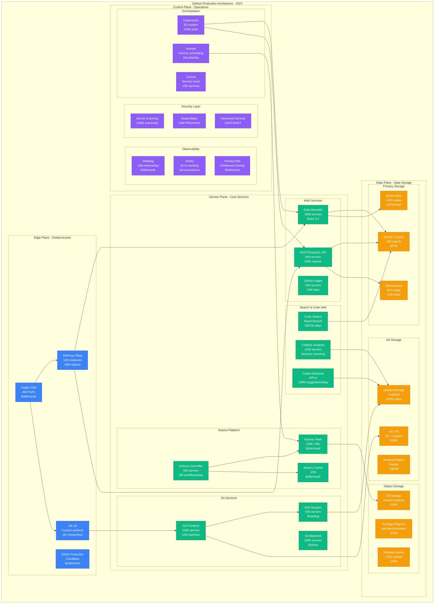
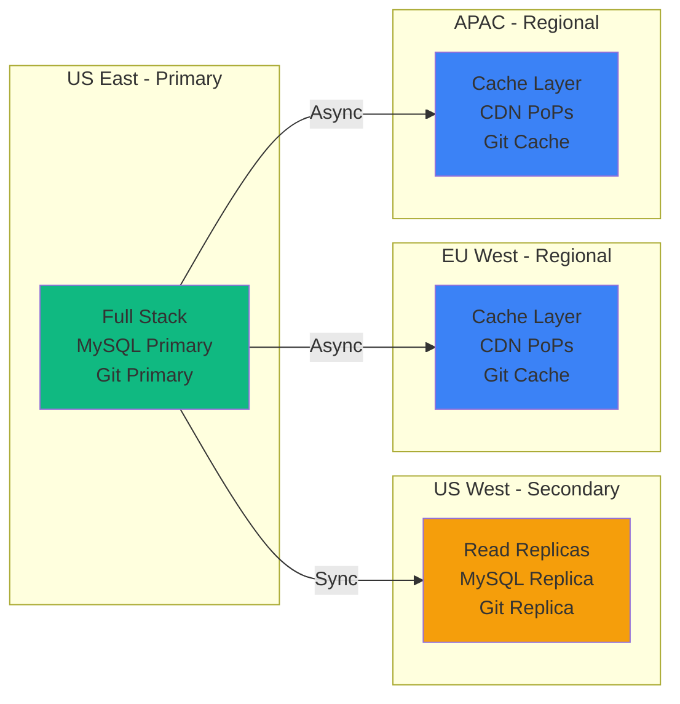

# GitHub Complete Architecture: Git at Scale for 100M Developers

## Executive Summary
GitHub serves 100M+ developers, hosts 330M+ repositories, runs 5M+ Actions workflows daily, with 99.95% availability on $95M/month infrastructure.

## Complete System Architecture



## Infrastructure Scale Metrics

### Request Volume
```yaml
web_traffic:
  page_views: 2B/day
  api_requests: 10B/day
  graphql_queries: 1B/day
  git_operations: 100M/day

git_operations:
  clones: 10M/day
  fetches: 50M/day
  pushes: 20M/day
  pull_requests: 1M/day

actions_scale:
  workflow_runs: 5M/day
  job_executions: 50M/day
  minutes_consumed: 500M/day
  cache_hits: 100M/day

search_volume:
  code_searches: 100M/day
  index_size: 500TB
  repositories_indexed: 200M
  files_indexed: 50B
```

### Hardware Specifications
```python
infrastructure_specs = {
    "web_tier": {
        "server_type": "c6i.8xlarge",
        "cpu": "32 vCPUs",
        "memory": "64GB",
        "count": 3000,
        "monthly_cost": "$1.2M"
    },
    "git_backend": {
        "server_type": "r6i.16xlarge",
        "cpu": "64 vCPUs",
        "memory": "512GB",
        "storage": "8TB NVMe",
        "count": 2000,
        "monthly_cost": "$3M"
    },
    "mysql_cluster": {
        "server_type": "db.r6g.16xlarge",
        "memory": "512GB",
        "storage": "64TB SSD",
        "iops": "100K",
        "shards": 100,
        "monthly_cost": "$2M"
    },
    "actions_runners": {
        "instance_types": ["t3.medium", "c5.2xlarge", "g4dn.xlarge"],
        "ephemeral": True,
        "max_concurrent": 100000,
        "avg_lifetime": "10 minutes",
        "monthly_cost": "$10M"
    }
}
```

## Service Architecture Details

### Git Storage System (Spokes)
```python
class SpokesArchitecture:
    """GitHub's custom Git storage system"""

    def __init__(self):
        self.topology = {
            "routers": 500,  # DGit routers for sharding
            "replicas": 3,   # 3-way replication
            "storage_nodes": 2000,
            "total_capacity": "10PB",
            "repositories": "330M+"
        }

    def route_repository(self, repo_id):
        # Consistent hashing to determine storage location
        shard = hash(repo_id) % self.topology["storage_nodes"]
        replicas = self.get_replicas(shard)

        # Route to least loaded replica
        return min(replicas, key=lambda r: r.load)

    def handle_push(self, repo, objects):
        # Custom Git protocol optimizations
        return {
            "deduplication": self.dedupe_objects(objects),
            "compression": "zstd",  # Better than git's zlib
            "replication": "async to 3 replicas",
            "hooks": self.run_hooks(repo),
            "cache_invalidation": self.invalidate_caches(repo)
        }
```

### GitHub Actions Architecture
```yaml
actions_platform:
  controller:
    language: "Go"
    orchestrator: "Nomad"
    queue: "Kafka"
    database: "MySQL"

  runner_pools:
    linux:
      os: ["ubuntu-20.04", "ubuntu-22.04"]
      sizes: ["2core-7gb", "4core-14gb", "8core-32gb"]
      max_concurrent: 50000

    windows:
      os: ["windows-2019", "windows-2022"]
      sizes: ["2core-7gb", "4core-14gb"]
      max_concurrent: 10000

    macos:
      os: ["macos-11", "macos-12", "macos-13"]
      hardware: "Mac Mini M1/M2"
      max_concurrent: 5000

  security:
    isolation: "Firecracker microVMs"
    network: "No internet by default"
    secrets: "Encrypted at rest, injected at runtime"
    artifacts: "Encrypted in S3"
```

## Performance Characteristics

### Latency Targets
| Operation | p50 | p95 | p99 | SLO |
|-----------|-----|-----|-----|-----|
| Page Load | 200ms | 500ms | 1s | < 1s |
| API Request | 50ms | 200ms | 500ms | < 500ms |
| Git Clone (small) | 500ms | 2s | 5s | < 5s |
| Git Push | 200ms | 1s | 3s | < 3s |
| Actions Start | 5s | 30s | 60s | < 60s |
| Code Search | 100ms | 500ms | 2s | < 2s |
| GraphQL Query | 30ms | 150ms | 400ms | < 500ms |

### Throughput Metrics
```python
throughput_capabilities = {
    "web_requests": "10M/sec peak",
    "git_operations": "100K/sec",
    "webhook_deliveries": "1M/min",
    "actions_jobs": "100K concurrent",
    "package_downloads": "10M/hour",
    "api_rate_limits": {
        "authenticated": "5000/hour",
        "unauthenticated": "60/hour",
        "enterprise": "15000/hour"
    }
}
```

## Reliability Engineering

### Multi-Region Strategy


### Failure Scenarios
```yaml
failure_handling:
  mysql_primary_failure:
    detection: "< 5 seconds"
    failover: "< 30 seconds"
    data_loss: "0 (synchronous replication)"

  git_storage_failure:
    impact: "Affected repos unavailable"
    detection: "< 10 seconds"
    reroute: "Automatic to replicas"
    repair: "Background resync"

  actions_runner_failure:
    impact: "Job rescheduled"
    detection: "Immediate"
    retry: "Automatic, max 3 times"

  region_failure:
    impact: "Degraded performance"
    failover: "DNS-based, < 5 minutes"
    data_loss: "0 (replicated)"
```

## Cost Breakdown

```python
monthly_costs = {
    "compute": {
        "web_servers": "$5M",
        "git_servers": "$8M",
        "actions_runners": "$10M",
        "databases": "$3M"
    },
    "storage": {
        "git_repositories": "$5M",
        "git_lfs": "$3M",
        "packages": "$4M",
        "backups": "$2M"
    },
    "network": {
        "cdn": "$3M",
        "bandwidth": "$8M",
        "ddos_protection": "$1M"
    },
    "services": {
        "monitoring": "$4M",
        "security_scanning": "$2M",
        "copilot_inference": "$10M"
    },
    "total": "$95M/month",
    "cost_per_user": "$0.95/month",
    "revenue_per_user": "$4/month",
    "gross_margin": "76%"
}
```

## Security Architecture

### Defense in Depth
```yaml
security_layers:
  edge:
    - "DDoS protection (Cloudflare/Fastly)"
    - "WAF rules (100K+ patterns)"
    - "Rate limiting (per IP/user/token)"

  application:
    - "CSRF protection"
    - "CSP headers"
    - "Dependency scanning"
    - "Secret scanning (100M+ scans/day)"

  data:
    - "Encryption at rest (AES-256)"
    - "Encryption in transit (TLS 1.3)"
    - "Key rotation (90 days)"

  access:
    - "2FA required for sensitive operations"
    - "SAML/OIDC SSO"
    - "IP allowlisting for enterprise"
    - "Fine-grained PATs"
```

## The 3 AM Playbook

### Critical Incident Response
```python
def incident_response(alert_type):
    if alert_type == "mysql_replication_lag":
        return {
            "check": "SHOW SLAVE STATUS on replicas",
            "common_cause": "Long running query on primary",
            "fix": "Kill query or promote replica",
            "escalation": "Page database on-call"
        }

    elif alert_type == "git_operations_slow":
        return {
            "check": "Spokes cluster health dashboard",
            "common_cause": "Large repository operations",
            "fix": "Identify and rate limit abusive repos",
            "escalation": "Page git-systems on-call"
        }

    elif alert_type == "actions_queue_backup":
        return {
            "check": "Nomad job queue depth",
            "common_cause": "Runner capacity exhausted",
            "fix": "Scale runner pools or throttle workflows",
            "escalation": "Page actions-platform on-call"
        }
```

## Key Innovations

1. **Spokes**: Custom Git storage system with 3-way replication
2. **DGit**: Distributed Git routing for horizontal scaling
3. **Semantic Code Search**: Understanding code, not just text matching
4. **Actions Security**: Firecracker microVMs for isolated execution
5. **MySQL Sharding**: 100-shard horizontal scaling for metadata
6. **Progressive Web App**: Service workers for offline functionality

## Monitoring & Observability

```yaml
monitoring_stack:
  metrics:
    system: "Datadog + Prometheus"
    volume: "10B metrics/day"
    retention: "15 months"

  logging:
    system: "Splunk + ELK"
    volume: "100TB/day"
    retention: "90 days hot, 2 years cold"

  tracing:
    system: "Honeycomb"
    sampling_rate: "0.1% (100% for errors)"

  synthetic:
    provider: "Pingdom + Custom"
    locations: 50
    frequency: "1 minute"

  slo_targets:
    availability: "99.95%"
    api_success_rate: "99.9%"
    git_availability: "99.9%"
    actions_success_rate: "99.5%"
```

*"GitHub's architecture is a testament to the fact that you can scale a Rails monolith to serve 100M users if you're smart about it."* - GitHub Principal Engineer