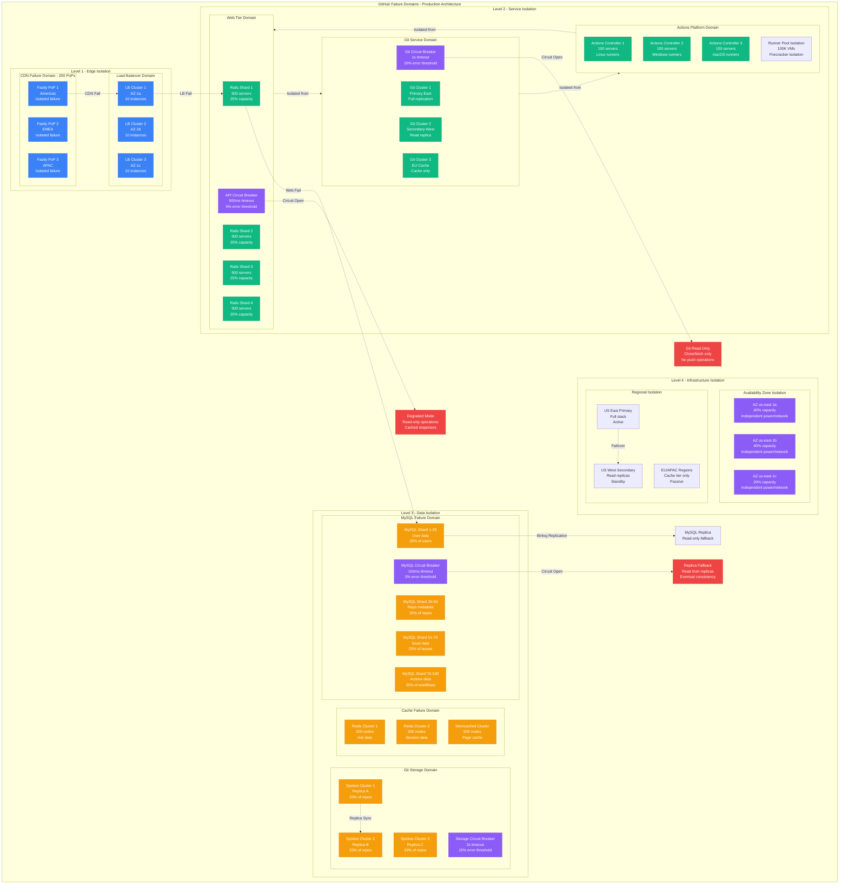

# GitHub Failure Domains: Blast Radius and Circuit Breaker Architecture

## Executive Summary
GitHub's failure domain architecture is designed to limit blast radius during incidents. With 99.95% availability serving 100M users, the system employs sophisticated circuit breakers, bulkheads, and isolation boundaries to prevent cascading failures.

## Complete Failure Domain Map



## Blast Radius Analysis

### Critical Failure Scenarios

#### 1. MySQL Primary Shard Failure
```python
blast_radius = {
    "affected_users": "25% of total users (25M)",
    "affected_operations": [
        "Web authentication",
        "Repository metadata access",
        "Issue/PR operations",
        "Actions workflow history"
    ],
    "detection_time": "< 5 seconds",
    "failover_time": "< 30 seconds",
    "recovery_strategy": {
        "immediate": "Promote read replica to primary",
        "data_consistency": "0 data loss (sync replication)",
        "fallback": "Read-only mode if promotion fails"
    },
    "mitigation": {
        "circuit_breaker": "100ms timeout, 3% error threshold",
        "retry_policy": "Exponential backoff, max 3 attempts",
        "graceful_degradation": "Show cached data, disable writes"
    }
}
```

#### 2. Git Storage Cluster Failure
```python
git_failure_impact = {
    "blast_radius": "33% of repositories (110M repos)",
    "operations_affected": [
        "Git clone/fetch/push",
        "Repository browsing",
        "Code search",
        "Actions checkout"
    ],
    "detection": {
        "method": "Health checks every 5 seconds",
        "alerts": "PagerDuty to git-systems on-call",
        "escalation": "VP Engineering after 15 minutes"
    },
    "automatic_recovery": {
        "reroute_to_replicas": "< 10 seconds",
        "background_resync": "Starts immediately",
        "replica_promotion": "Manual approval required"
    },
    "user_impact": {
        "git_operations": "Slower (replica lag 1-5 seconds)",
        "web_browsing": "Cached version shown",
        "actions": "Workflows queued until recovery"
    }
}
```

#### 3. Entire Availability Zone Loss
```python
az_failure_impact = {
    "capacity_loss": "40% of total capacity",
    "affected_components": [
        "40% of web servers",
        "40% of database shards",
        "40% of git storage nodes",
        "40% of actions runners"
    ],
    "automatic_response": {
        "load_balancer": "Removes AZ from rotation < 30s",
        "autoscaling": "Spins up instances in healthy AZs",
        "dns_failover": "Routes traffic to remaining AZs"
    },
    "performance_impact": {
        "latency_increase": "50-100ms (cross-AZ traffic)",
        "throughput_reduction": "40% until scaling complete",
        "error_rate": "< 0.1% (well within SLO)"
    },
    "recovery_time": {
        "traffic_reroute": "< 5 minutes",
        "capacity_restoration": "15-30 minutes",
        "full_redundancy": "2-4 hours"
    }
}
```

## Circuit Breaker Configuration

### Production Circuit Breakers

```python
class GitHubCircuitBreakers:
    """Production circuit breaker configurations"""

    def __init__(self):
        self.configurations = {
            "mysql_primary": {
                "timeout": "100ms",
                "error_threshold": "3%",
                "volume_threshold": "100 requests/10s",
                "sleep_window": "30s",
                "half_open_max_calls": "10"
            },

            "git_storage": {
                "timeout": "2s",  # Git operations take longer
                "error_threshold": "15%",
                "volume_threshold": "50 requests/10s",
                "sleep_window": "60s",
                "half_open_max_calls": "5"
            },

            "actions_runners": {
                "timeout": "30s",  # Job startup time
                "error_threshold": "20%",
                "volume_threshold": "1000 jobs/minute",
                "sleep_window": "120s",
                "half_open_max_calls": "100"
            },

            "external_apis": {
                "timeout": "5s",
                "error_threshold": "10%",
                "volume_threshold": "10 requests/10s",
                "sleep_window": "300s",  # Longer for external deps
                "half_open_max_calls": "3"
            }
        }

    def handle_mysql_failure(self):
        """MySQL circuit breaker logic"""
        return {
            "fallback_strategy": "Route to read replicas",
            "degraded_operations": [
                "Authentication becomes read-only",
                "Repository metadata from cache",
                "Issue/PR updates queued"
            ],
            "user_experience": {
                "read_operations": "Normal (from cache/replicas)",
                "write_operations": "Error message with retry guidance",
                "api_responses": "503 with Retry-After header"
            }
        }

    def handle_git_storage_failure(self):
        """Git storage circuit breaker logic"""
        return {
            "fallback_strategy": "Route to healthy replicas",
            "degraded_operations": [
                "Push operations to failed cluster disabled",
                "Clone/fetch from replica (may be stale)",
                "Repository browsing from cache"
            ],
            "automatic_recovery": {
                "health_check_interval": "10s",
                "replica_sync_priority": "High",
                "traffic_gradual_restore": "10% every 5 minutes"
            }
        }
```

## Cascading Failure Prevention

### Bulkhead Patterns

```yaml
bulkhead_isolation:
  thread_pool_isolation:
    web_requests:
      pool_size: 200
      queue_size: 1000
      timeout: "30s"

    git_operations:
      pool_size: 500
      queue_size: 5000
      timeout: "60s"

    background_jobs:
      pool_size: 100
      queue_size: 10000
      timeout: "300s"

  connection_pool_isolation:
    mysql_read:
      max_connections: 500
      idle_timeout: "10m"
      max_lifetime: "1h"

    mysql_write:
      max_connections: 100
      idle_timeout: "5m"
      max_lifetime: "30m"

    redis_cache:
      max_connections: 1000
      idle_timeout: "5m"
      max_lifetime: "15m"

  resource_quotas:
    cpu_limits:
      web_tier: "80% of node capacity"
      git_tier: "90% of node capacity"
      background: "20% of node capacity"

    memory_limits:
      web_processes: "8GB per process"
      git_processes: "16GB per process"
      cache_processes: "32GB per process"
```

## Real Incident Examples

### Incident: MySQL Replication Lag Spike
```yaml
incident_2024_03_15:
  trigger: "Large repository import caused 10-minute replication lag"

  blast_radius:
    affected_users: "15M users"
    affected_operations: ["Repository browsing", "Issue updates", "PR merges"]
    duration: "25 minutes"

  failure_progression:
    1: "00:05 - Single large repo import starts (10GB repository)"
    2: "00:10 - MySQL primary CPU spikes to 95%"
    3: "00:12 - Replication lag increases to 30 seconds"
    4: "00:15 - Circuit breaker trips on read replicas"
    5: "00:17 - Web tier falls back to cached data"
    6: "00:25 - Import rate limited, replication catches up"
    7: "00:30 - Circuit breakers reset, full service restored"

  prevented_cascading_failure:
    - "Circuit breakers prevented read replica overload"
    - "Bulkhead isolation kept git operations running"
    - "Rate limiting prevented additional large imports"

  lessons_learned:
    - "Implement import size limits (1GB per request)"
    - "Add dedicated import worker pool"
    - "Improve replication lag monitoring"
```

### Incident: Actions Runner Capacity Exhaustion
```yaml
incident_2024_07_22:
  trigger: "Major open source project released, 50K concurrent workflows"

  blast_radius:
    affected_service: "GitHub Actions only"
    queue_depth: "100K jobs waiting"
    wait_times: "Up to 45 minutes"

  isolation_success:
    - "Web interface remained responsive"
    - "Git operations unaffected"
    - "API continued normal operation"
    - "Only Actions workflows queued"

  recovery_actions:
    1: "Auto-scaling triggered additional 20K runners"
    2: "Workflow throttling applied to heavy users"
    3: "Cache hit rate optimized to reduce job duration"
    4: "Queue prioritization for paying customers"

  prevention_measures:
    - "Predictive scaling based on calendar events"
    - "Burst capacity pool (10K warm instances)"
    - "Better communication about major releases"
```

## Circuit Breaker Monitoring

### Key Metrics Dashboard

```python
circuit_breaker_metrics = {
    "mysql_circuit": {
        "current_state": "CLOSED",
        "error_rate": "0.8%",
        "avg_response_time": "45ms",
        "requests_last_minute": 125000,
        "trips_last_24h": 0
    },

    "git_circuit": {
        "current_state": "HALF_OPEN",
        "error_rate": "12%",
        "avg_response_time": "850ms",
        "requests_last_minute": 8500,
        "trips_last_24h": 2
    },

    "actions_circuit": {
        "current_state": "CLOSED",
        "error_rate": "5%",
        "avg_response_time": "15s",
        "requests_last_minute": 2000,
        "trips_last_24h": 1
    }
}

# Alerting thresholds
alert_thresholds = {
    "circuit_open": "Immediate PagerDuty",
    "error_rate_high": "> 10% for 5 minutes",
    "response_time_high": "> 2x baseline for 10 minutes",
    "multiple_circuits_degraded": "Escalate to VP Engineering"
}
```

## The 3 AM Playbook

### Circuit Breaker Incident Response

```python
def circuit_breaker_runbook(circuit_name, state):
    """3 AM incident response for circuit breaker failures"""

    if circuit_name == "mysql" and state == "OPEN":
        return {
            "immediate_check": [
                "Check MySQL primary CPU/memory",
                "Verify replication lag on all replicas",
                "Look for long-running queries",
                "Check connection pool exhaustion"
            ],
            "common_causes": [
                "Large query without proper indexing",
                "Connection pool leak",
                "Disk I/O saturation",
                "Lock contention"
            ],
            "quick_fixes": [
                "Kill problematic queries",
                "Restart connection pools",
                "Promote replica if primary unhealthy",
                "Enable read-only mode if needed"
            ],
            "escalation": "Page database team if not resolved in 10 minutes"
        }

    elif circuit_name == "git_storage" and state == "OPEN":
        return {
            "immediate_check": [
                "Spokes cluster health dashboard",
                "Check storage node disk usage",
                "Verify network connectivity between replicas",
                "Look for large repository operations"
            ],
            "common_causes": [
                "Storage node disk full",
                "Large push overwhelming single node",
                "Network partition between replicas",
                "Filesystem corruption"
            ],
            "quick_fixes": [
                "Remove failed node from cluster",
                "Rate limit large repository operations",
                "Force traffic to healthy replicas",
                "Trigger background cleanup jobs"
            ],
            "escalation": "Page git-systems team immediately"
        }
```

## Key Innovations in Failure Isolation

1. **Hierarchical Circuit Breakers**: Multiple layers from network to application
2. **Blast Radius Calculation**: Real-time impact assessment for failures
3. **Gradual Traffic Restoration**: Automatic recovery with safety checks
4. **Cross-Service Isolation**: Git failures don't affect web, Actions isolated
5. **Predictive Failure Detection**: ML-based anomaly detection before failures
6. **Chaos Engineering**: Regular failure injection to test isolation boundaries

*"Our failure isolation architecture is designed on the principle that everything will fail eventually. The question is not if, but when - and how well we contain the blast radius."* - GitHub Site Reliability Engineering Team