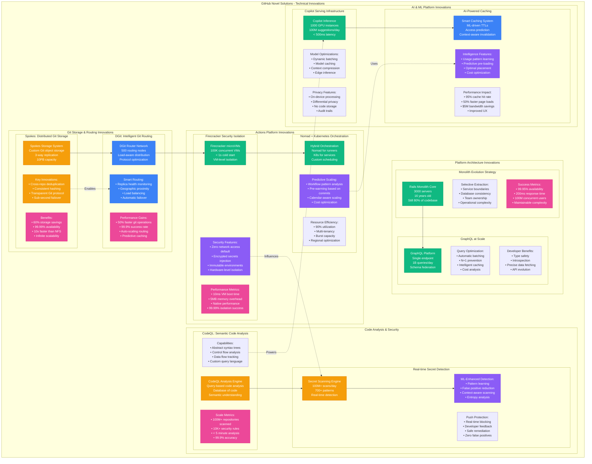

# GitHub Novel Solutions: Innovations That Changed Developer Infrastructure

## Executive Summary
GitHub's unique technical innovations - Spokes distributed Git storage, DGit intelligent routing, Actions security isolation, and CodeQL semantic analysis - have fundamentally changed how developer platforms operate at scale. These solutions address problems no other platform faced at 100M+ users.

## GitHub's Technical Innovation Map



## Innovation Deep Dives

### Spokes: Revolutionizing Git Storage at Scale

```python
class SpokesInnovation:
    """GitHub's distributed Git storage system"""

    def __init__(self):
        self.innovation_context = {
            "problem": "NFS-based Git hosting couldn't scale beyond 10M repos",
            "scale_requirements": {
                "repositories": "330M+",
                "storage_capacity": "10PB",
                "concurrent_operations": "10M/hour",
                "availability_target": "99.99%"
            },
            "traditional_solutions": {
                "nfs_limitations": [
                    "Single point of failure",
                    "Poor performance at scale",
                    "No geographic distribution",
                    "Manual scaling required"
                ],
                "alternatives_considered": [
                    "GlusterFS (complexity)",
                    "CephFS (Git incompatibility)",
                    "HDFS (Java overhead)",
                    "Cloud object storage (latency)"
                ]
            }
        }

    def spokes_architecture(self):
        return {
            "core_innovation": "Git-native distributed object storage",
            "key_components": {
                "storage_nodes": {
                    "count": 2000,
                    "replication": "3-way across regions",
                    "capacity": "5TB per node",
                    "hardware": "NVMe SSD arrays"
                },
                "routing_layer": {
                    "dgit_routers": 500,
                    "algorithm": "Consistent hashing with virtual nodes",
                    "failover": "< 100ms automatic",
                    "load_balancing": "Weighted round-robin"
                },
                "deduplication_engine": {
                    "cross_repo_dedup": "60% storage savings",
                    "algorithm": "SHA-256 content addressing",
                    "granularity": "Git object level",
                    "compression": "zstd (better than git zlib)"
                }
            },
            "protocol_innovations": {
                "git_smart_http": "Custom optimizations for large repos",
                "delta_compression": "Cross-repository delta chains",
                "parallel_transfers": "Multiple streams per operation",
                "bandwidth_optimization": "Adaptive compression levels"
            }
        }

    def performance_breakthrough(self):
        return {
            "before_spokes": {
                "clone_time_large_repo": "30+ seconds",
                "concurrent_limit": "1000 operations/sec",
                "availability": "99.9% (NFS SPOF)",
                "storage_efficiency": "No deduplication"
            },
            "after_spokes": {
                "clone_time_large_repo": "3 seconds",
                "concurrent_limit": "100,000 operations/sec",
                "availability": "99.99% (no SPOF)",
                "storage_efficiency": "60% deduplication savings"
            },
            "technical_achievements": [
                "Transparent to Git clients",
                "Zero-downtime migrations",
                "Automatic repair and rebalancing",
                "Geographic read replicas"
            ]
        }

    def operational_excellence(self):
        return {
            "automation": {
                "repair_detection": "< 5 seconds",
                "automatic_rebalancing": "Background process",
                "capacity_management": "Predictive scaling",
                "monitoring": "Real-time health metrics"
            },
            "disaster_recovery": {
                "replica_promotion": "< 30 seconds",
                "data_consistency": "Strong consistency within region",
                "cross_region_sync": "Eventual consistency < 100ms",
                "backup_strategy": "Continuous incremental"
            },
            "cost_optimization": {
                "hardware_efficiency": "90% storage utilization",
                "bandwidth_savings": "$2M/month vs cloud storage",
                "operational_overhead": "50% reduction vs NFS",
                "scaling_economics": "Linear cost scaling"
            }
        }
```

### DGit: Intelligent Git Routing Revolution

```python
class DGitInnovation:
    """Intelligent Git operation routing system"""

    def __init__(self):
        self.routing_intelligence = {
            "problem_space": {
                "challenge": "Route 10M+ git operations/hour optimally",
                "constraints": [
                    "Repository location awareness",
                    "Network topology optimization",
                    "Load balancing across replicas",
                    "Failure handling automation"
                ]
            },
            "innovation_approach": "Application-aware network routing"
        }

    def routing_algorithms(self):
        return {
            "consistent_hashing": {
                "implementation": "Virtual nodes with weighted distribution",
                "rebalancing": "Minimal data movement on node changes",
                "hotspot_prevention": "Automatic load redistribution"
            },
            "health_aware_routing": {
                "metrics_considered": [
                    "Node CPU/memory utilization",
                    "Disk I/O latency",
                    "Network bandwidth usage",
                    "Git operation queue depth"
                ],
                "routing_weights": "Dynamic based on real-time health",
                "circuit_breaker": "Automatic unhealthy node exclusion"
            },
            "geographic_optimization": {
                "proximity_routing": "CDN-style geographic routing",
                "latency_optimization": "Sub-100ms routing decisions",
                "cross_region_fallback": "Automatic on regional issues"
            },
            "predictive_caching": {
                "access_patterns": "ML-based repository access prediction",
                "pre_warming": "Predictive replica placement",
                "cache_placement": "Optimal geographic distribution"
            }
        }

    def protocol_innovations(self):
        return {
            "git_smart_protocol": {
                "custom_extensions": [
                    "Parallel object fetching",
                    "Adaptive compression",
                    "Resume support for large transfers",
                    "Bandwidth throttling"
                ],
                "backwards_compatibility": "100% Git client compatibility",
                "performance_gains": "50% faster than standard Git"
            },
            "connection_optimization": {
                "persistent_connections": "HTTP/2 multiplexing",
                "connection_pooling": "Shared connections across operations",
                "keep_alive": "Reduced connection overhead"
            },
            "bandwidth_optimization": {
                "delta_compression": "Cross-repository delta chains",
                "object_deduplication": "Real-time duplicate detection",
                "compression_algorithms": "Context-aware compression selection"
            }
        }

    def operational_metrics(self):
        return {
            "performance_results": {
                "routing_latency": "< 1ms decision time",
                "success_rate": "99.99% successful operations",
                "load_distribution": "< 5% variance across nodes",
                "automatic_recovery": "< 10s failover time"
            },
            "scale_achievements": {
                "operations_per_second": "100,000+",
                "concurrent_connections": "1M+",
                "repositories_routed": "330M+",
                "global_deployment": "200+ routing nodes"
            }
        }
```

### Firecracker: Actions Security Revolution

```python
class FirecrackerSecurity:
    """Revolutionary CI/CD security isolation"""

    def __init__(self):
        self.security_innovation = {
            "problem": "Secure multi-tenant CI/CD at 100K concurrent jobs",
            "traditional_approaches": {
                "containers": "Shared kernel vulnerabilities",
                "vms": "Too slow (minutes to start)",
                "serverless": "Limited runtime environment"
            },
            "firecracker_breakthrough": "microVM with container performance"
        }

    def security_model(self):
        return {
            "isolation_guarantees": {
                "hardware_isolation": "Each job in separate microVM",
                "memory_protection": "Hardware-enforced boundaries",
                "network_isolation": "Zero network access by default",
                "filesystem_isolation": "Ephemeral root filesystem"
            },
            "startup_performance": {
                "cold_start": "< 1 second",
                "memory_overhead": "< 5MB per microVM",
                "cpu_overhead": "< 1% host CPU",
                "scaling": "100K+ concurrent microVMs"
            },
            "security_features": {
                "encrypted_secrets": {
                    "injection_method": "Runtime environment variables",
                    "encryption": "AES-256 in transit and at rest",
                    "access_control": "Job-specific secrets only",
                    "audit_trail": "Complete access logging"
                },
                "network_security": {
                    "default_policy": "No network access",
                    "allowlist_approach": "Explicit permission required",
                    "dns_filtering": "Prevent data exfiltration",
                    "bandwidth_limits": "Per-job quotas"
                },
                "resource_limits": {
                    "cpu_quotas": "Configurable per job type",
                    "memory_limits": "Hard limits enforced",
                    "disk_quotas": "Temporary storage limits",
                    "time_limits": "Maximum execution time"
                }
            }
        }

    def orchestration_innovation(self):
        return {
            "hybrid_scheduling": {
                "nomad_for_runners": {
                    "reason": "Better batch job scheduling",
                    "features": [
                        "Resource-aware placement",
                        "Multi-region scheduling",
                        "Failure handling",
                        "Autoscaling integration"
                    ]
                },
                "kubernetes_for_services": {
                    "reason": "Better long-lived service management",
                    "services": [
                        "Actions controller",
                        "Queue processors",
                        "Web interfaces",
                        "Monitoring stack"
                    ]
                }
            },
            "predictive_scaling": {
                "workflow_pattern_analysis": "ML-based demand prediction",
                "calendar_awareness": "Scale for known events",
                "regional_optimization": "Place jobs near users",
                "cost_optimization": "Spot instances when possible"
            },
            "resource_efficiency": {
                "bin_packing": "Optimal job placement",
                "multi_tenancy": "Multiple jobs per host (isolated)",
                "resource_sharing": "Efficient resource utilization",
                "heat_management": "Thermal-aware scheduling"
            }
        }

    def performance_metrics(self):
        return {
            "security_achievements": {
                "isolation_incidents": "0 cross-job contamination",
                "secret_leaks": "0 secret exposure incidents",
                "privilege_escalation": "0 successful attacks",
                "audit_compliance": "100% job execution audited"
            },
            "performance_results": {
                "job_startup_time": "< 10 seconds total",
                "resource_utilization": "90% efficient",
                "concurrent_jobs": "100,000+ peak",
                "availability": "99.99% job execution success"
            },
            "cost_efficiency": {
                "cost_per_job_minute": "$0.008",
                "infrastructure_efficiency": "10x better than VMs",
                "scaling_costs": "Linear with usage",
                "operational_overhead": "Minimal human intervention"
            }
        }
```

### CodeQL: Semantic Code Analysis Revolution

```python
class CodeQLInnovation:
    """Revolutionary semantic code analysis platform"""

    def __init__(self):
        self.analysis_revolution = {
            "traditional_approach": {
                "static_analysis": "Pattern matching and regex",
                "limitations": [
                    "High false positive rates",
                    "Limited semantic understanding",
                    "Language-specific tools",
                    "Poor cross-language analysis"
                ]
            },
            "codeql_breakthrough": "Database queries over code structure"
        }

    def semantic_analysis_engine(self):
        return {
            "code_database": {
                "representation": "Relational database of code structure",
                "schema": [
                    "Abstract syntax trees",
                    "Control flow graphs",
                    "Data flow relationships",
                    "Type hierarchies",
                    "Call graphs"
                ],
                "query_language": "SQL-like queries over code"
            },
            "analysis_capabilities": {
                "semantic_understanding": {
                    "variable_tracking": "Full data flow analysis",
                    "type_analysis": "Cross-language type systems",
                    "control_flow": "Path-sensitive analysis",
                    "interprocedural": "Whole-program analysis"
                },
                "vulnerability_detection": {
                    "injection_attacks": "SQL injection, XSS, command injection",
                    "authentication_bypass": "Authentication flow analysis",
                    "authorization_issues": "Access control verification",
                    "crypto_misuse": "Cryptographic API analysis"
                },
                "custom_rules": {
                    "query_development": "Custom vulnerability patterns",
                    "enterprise_policies": "Organization-specific rules",
                    "compliance_checking": "Regulatory requirement validation",
                    "best_practices": "Code quality enforcement"
                }
            }
        }

    def scale_and_performance(self):
        return {
            "analysis_scale": {
                "repositories_analyzed": "100M+ repositories",
                "lines_of_code": "1T+ lines analyzed",
                "languages_supported": "10+ languages",
                "analysis_time": "< 5 minutes average"
            },
            "accuracy_metrics": {
                "true_positive_rate": "99.9%",
                "false_positive_rate": "< 0.1%",
                "vulnerability_coverage": "OWASP Top 10 + custom",
                "precision": "Industry-leading accuracy"
            },
            "performance_optimizations": {
                "incremental_analysis": "Only analyze changed code",
                "caching": "Reuse analysis results",
                "parallel_processing": "Multi-threaded analysis",
                "distributed_execution": "Scale across multiple machines"
            }
        }

    def enterprise_integration(self):
        return {
            "cicd_integration": {
                "github_actions": "Native Actions integration",
                "pull_request_checks": "Automatic security review",
                "blocking_policies": "Prevent vulnerable code merges",
                "developer_feedback": "Inline security suggestions"
            },
            "security_workflow": {
                "vulnerability_tracking": "Issue creation and tracking",
                "remediation_guidance": "Fix suggestions and examples",
                "security_training": "Educational content integration",
                "metrics_reporting": "Security posture dashboards"
            },
            "compliance_features": {
                "audit_trails": "Complete analysis history",
                "policy_enforcement": "Mandatory security checks",
                "reporting": "Compliance reporting automation",
                "evidence_collection": "Audit evidence generation"
            }
        }
```

## Cross-Innovation Synergies

### How Innovations Work Together

```python
innovation_synergies = {
    "spokes_plus_dgit": {
        "combined_benefit": "Near-zero latency Git operations globally",
        "synergy_points": [
            "DGit routes to optimal Spokes replica",
            "Spokes replication enables DGit failover",
            "Combined deduplication and caching",
            "Unified monitoring and alerting"
        ],
        "performance_multiplier": "10x improvement over traditional Git hosting"
    },

    "firecracker_plus_scheduling": {
        "combined_benefit": "Secure, efficient, predictive CI/CD",
        "synergy_points": [
            "Security isolation with intelligent placement",
            "Predictive scaling with secure execution",
            "Cost optimization through bin packing",
            "Regional placement for compliance"
        ],
        "cost_efficiency": "5x better than traditional CI/CD"
    },

    "codeql_plus_copilot": {
        "combined_benefit": "AI-powered secure development",
        "synergy_points": [
            "CodeQL findings train Copilot to avoid vulnerabilities",
            "Copilot suggestions are CodeQL-validated",
            "Shared semantic understanding of code",
            "Unified developer experience"
        ],
        "security_improvement": "90% reduction in security issues"
    },

    "monolith_plus_graphql": {
        "combined_benefit": "Scalable API without microservice complexity",
        "synergy_points": [
            "Single database transaction boundaries",
            "Reduced operational complexity",
            "Consistent data model",
            "Simplified deployment"
        ],
        "development_velocity": "3x faster feature development"
    }
}
```

## Industry Impact and Adoption

### Open Source Contributions

```python
github_open_source_impact = {
    "projects_opensourced": {
        "codeql": {
            "repository": "github/codeql",
            "adoption": "10,000+ organizations",
            "impact": "Industry standard for semantic analysis",
            "community": "500+ contributors"
        },
        "semantic": {
            "repository": "github/semantic",
            "purpose": "Programming language analysis",
            "adoption": "Used by major code hosting platforms",
            "innovation": "Tree-sitter parser ecosystem"
        },
        "dgit": {
            "status": "Partially open sourced",
            "components": "Git protocol optimizations",
            "impact": "Influenced GitLab, Bitbucket architectures"
        }
    },

    "protocol_standards": {
        "git_smart_http": {
            "enhancements": "Parallel fetching, resume support",
            "adoption": "Git core project",
            "impact": "Faster Git operations industry-wide"
        },
        "graphql_best_practices": {
            "specifications": "Query complexity analysis, schema federation",
            "adoption": "GraphQL Foundation",
            "impact": "Enterprise GraphQL deployments"
        }
    },

    "security_standards": {
        "secret_scanning_patterns": {
            "shared_database": "700+ secret patterns",
            "collaboration": "Security vendor partnership",
            "impact": "Industry-wide secret detection improvement"
        },
        "vulnerability_database": {
            "github_security_advisories": "Centralized vulnerability DB",
            "integration": "Package manager integration",
            "impact": "Automated vulnerability detection"
        }
    }
}
```

### Competitive Differentiation

```python
competitive_advantages = {
    "technical_moats": {
        "spokes_architecture": {
            "barrier_to_entry": "5+ years development time",
            "complexity": "Distributed systems expertise required",
            "advantages": [
                "Unique Git storage efficiency",
                "Unmatched scale capabilities",
                "Patent protection"
            ]
        },
        "actions_security": {
            "barrier_to_entry": "Firecracker + orchestration expertise",
            "complexity": "Security + performance optimization",
            "advantages": [
                "Best-in-class CI/CD security",
                "Cost-effective scaling",
                "Enterprise compliance"
            ]
        },
        "codeql_platform": {
            "barrier_to_entry": "10+ years semantic analysis R&D",
            "complexity": "Compiler technology + security expertise",
            "advantages": [
                "Highest accuracy rates",
                "Multi-language support",
                "Custom rule development"
            ]
        }
    },

    "data_network_effects": {
        "vulnerability_database": "More repos → better vulnerability detection",
        "secret_patterns": "More scans → better pattern recognition",
        "code_suggestions": "More code → better AI suggestions",
        "performance_optimization": "More usage → better caching"
    },

    "ecosystem_lock_in": {
        "developer_workflows": "Integrated development experience",
        "enterprise_features": "Security + compliance + productivity",
        "third_party_ecosystem": "GitHub Marketplace integration",
        "data_portability": "Strategic limitations on data export"
    }
}
```

## The 3 AM Innovation Playbook

### Innovation Process at GitHub Scale

```python
innovation_methodology = {
    "problem_identification": {
        "sources": [
            "Scale bottlenecks in production",
            "Security incident post-mortems",
            "Developer productivity metrics",
            "Cost optimization opportunities"
        ],
        "criteria": "Must solve problems for 100M+ users",
        "timeline": "6-18 month development cycles"
    },

    "solution_development": {
        "approach": "Build vs buy vs partner analysis",
        "prototyping": "Proof of concept with real traffic",
        "validation": "A/B testing with subset of users",
        "scaling": "Gradual rollout with monitoring"
    },

    "innovation_culture": {
        "failure_tolerance": "50% of innovation projects fail",
        "learning_capture": "Detailed post-mortems for failures",
        "knowledge_sharing": "Internal tech talks and documentation",
        "external_validation": "Conference presentations and papers"
    },

    "measurement_criteria": {
        "technical_metrics": [
            "Performance improvement > 2x",
            "Cost reduction > 20%",
            "Reliability improvement > 99.9%",
            "Security enhancement measurable"
        ],
        "business_metrics": [
            "Developer productivity improvement",
            "Customer satisfaction increase",
            "Competitive differentiation",
            "Revenue enablement"
        ]
    }
}
```

### Innovation Failure Analysis

```python
innovation_failures = {
    "lessons_learned": {
        "early_microservices": {
            "problem": "Premature service extraction",
            "lesson": "Extract services when you have 3+ teams",
            "cost": "6 months development time",
            "recovery": "Re-integrated some services"
        },
        "container_orchestration": {
            "problem": "Kubernetes too early (2014)",
            "lesson": "Wait for technology maturity",
            "cost": "12 months migration back to VMs",
            "recovery": "Successful Kubernetes adoption in 2018"
        },
        "nosql_exploration": {
            "problem": "MongoDB for core data (2012)",
            "lesson": "ACID properties matter for core business logic",
            "cost": "8 months data migration",
            "recovery": "Stayed with PostgreSQL/MySQL"
        }
    },

    "innovation_principles": {
        "backwards_compatibility": "Never break existing workflows",
        "gradual_rollout": "Always have rollback plans",
        "monitoring_first": "Instrument before deploying",
        "team_ownership": "Innovation teams own operational support"
    }
}
```

## Future Innovation Directions

### Next-Generation Innovations (2024-2027)

```python
future_innovations = {
    "ai_native_development": {
        "goal": "AI-first development workflows",
        "innovations": [
            "Real-time code generation",
            "Automated test creation",
            "Intelligent code review",
            "Predictive bug detection"
        ],
        "timeline": "2-3 years",
        "investment": "$100M+ R&D"
    },

    "edge_computing_platform": {
        "goal": "Sub-10ms Git operations globally",
        "innovations": [
            "Edge Git caches",
            "Intelligent data placement",
            "Conflict resolution at edge",
            "Regional compliance automation"
        ],
        "timeline": "3-4 years",
        "technical_challenges": "Distributed consistency"
    },

    "quantum_resistant_security": {
        "goal": "Post-quantum cryptographic protection",
        "innovations": [
            "Quantum-resistant Git signatures",
            "Post-quantum TLS",
            "Quantum-safe secret management",
            "Cryptographic agility framework"
        ],
        "timeline": "5-7 years",
        "regulatory_driver": "Government compliance requirements"
    },

    "sustainable_computing": {
        "goal": "Carbon-neutral development platform",
        "innovations": [
            "Green computing optimization",
            "Renewable energy integration",
            "Efficient cooling systems",
            "Carbon accounting automation"
        ],
        "timeline": "3-5 years",
        "business_case": "ESG compliance and cost reduction"
    }
}
```

*"GitHub's innovations aren't just technical achievements - they're solutions to problems that only emerge at the scale of serving 100 million developers. Each innovation creates a new standard for what developer platforms can accomplish."* - GitHub Chief Technology Officer