# GitHub Production Operations: 24/7 Operations at 100M User Scale

## Executive Summary
GitHub's production operations manage 99.95% availability across 100M users with a comprehensive deployment pipeline, real-time monitoring, and sophisticated incident response. This system processes 10B requests/day while maintaining sub-200ms response times globally.

## Complete Production Operations Architecture

```mermaid
graph TB
    subgraph GitHub_Production_Operations___24_7_Scale[""GitHub Production Operations - 24/7 Scale""]
        subgraph DeploymentPipeline[Deployment Pipeline - Continuous Delivery]
            subgraph SourceControl[Source Control & CI]
                GITHUB_FLOW[GitHub Flow<br/>Feature branches<br/>Pull requests<br/>Code review]
                ACTIONS_CI[Actions CI Pipeline<br/>5000 tests<br/>30 minutes<br/>Parallel execution]
                SECURITY_GATES[Security Gates<br/>CodeQL analysis<br/>Secret scanning<br/>Dependency check]
            end

            subgraph ArtifactPipeline[Artifact Pipeline]
                BUILD_ARTIFACTS[Build Artifacts<br/>Docker images<br/>Ruby gems<br/>Static assets]
                ARTIFACT_REGISTRY[Registry Storage<br/>Harbor registry<br/>Vulnerability scanning<br/>Signature verification]
                DEPLOYMENT_PACKAGES[Deployment Packages<br/>Kubernetes manifests<br/>Helm charts<br/>Configuration]
            end

            subgraph DeploymentStages[Deployment Stages]
                CANARY_DEPLOY[Canary Deployment<br/>1% traffic<br/>Feature flags<br/>Real-time metrics]
                STAGING_DEPLOY[Staging Environment<br/>Production clone<br/>Integration tests<br/>Load testing]
                PRODUCTION_DEPLOY[Production Rollout<br/>Rolling deployment<br/>Blue-green capable<br/>Automatic rollback]
            end
        end

        subgraph MonitoringObservability[Monitoring & Observability - Real-time]
            subgraph MetricsInfrastructure[Metrics Infrastructure]
                PROMETHEUS[Prometheus<br/>10B metrics/day<br/>15-second scrapes<br/>30-day retention]
                DATADOG[Datadog Platform<br/>Infrastructure monitoring<br/>APM tracing<br/>Log aggregation]
                CUSTOM_METRICS[Custom Metrics<br/>Business KPIs<br/>SLO tracking<br/>Feature adoption]
            end

            subgraph LoggingPlatform[Logging Platform]
                SPLUNK[Splunk Enterprise<br/>100TB/day logs<br/>Real-time indexing<br/>ML-powered analysis]
                ELK_STACK[ELK Stack<br/>Application logs<br/>Security events<br/>Audit trails]
                LOG_AGGREGATION[Log Aggregation<br/>Fluentd collection<br/>Structured logging<br/>Retention policies]
            end

            subgraph TracingSystem[Distributed Tracing]
                HONEYCOMB[Honeycomb<br/>1B spans/day<br/>High-cardinality data<br/>Query-driven debugging]
                JAEGER[Jaeger Tracing<br/>Request flow tracking<br/>Performance analysis<br/>Dependency mapping]
                TRACE_ANALYSIS[Trace Analysis<br/>Latency breakdown<br/>Error correlation<br/>Performance optimization]
            end
        end

        subgraph IncidentResponse[Incident Response - 24/7 Coverage]
            subgraph AlertingSystem[Alerting System]
                PAGERDUTY[PagerDuty<br/>Escalation policies<br/>On-call rotation<br/>Alert correlation]
                ALERT_MANAGER[Alert Manager<br/>Prometheus alerts<br/>Silence management<br/>Routing rules]
                SLACK_INTEGRATION[Slack Integration<br/>War rooms<br/>Status updates<br/>Automated updates]
            end

            subgraph IncidentManagement[Incident Management]
                INCIDENT_COMMANDER[Incident Commander<br/>Dedicated role<br/>Communication hub<br/>Decision authority]
                WAR_ROOM[War Room Process<br/>Zoom bridge<br/>Shared dashboard<br/>Real-time collaboration]
                STATUS_PAGE[Status Page<br/>Public communication<br/>Component status<br/>Impact assessment]
            end

            subgraph ResponseTeams[Response Teams]
                PRIMARY_ONCALL[Primary On-call<br/>15-minute response<br/>Escalation authority<br/>Domain expertise]
                PLATFORM_TEAM[Platform Team<br/>Infrastructure expertise<br/>24/7 coverage<br/>Global rotation]
                SECURITY_TEAM[Security Team<br/>Security incidents<br/>Compliance response<br/>Forensics]
            end
        end

        subgraph OperationalExcellence[Operational Excellence - Continuous Improvement]
            subgraph CapacityManagement[Capacity Management]
                CAPACITY_PLANNING[Capacity Planning<br/>Growth forecasting<br/>Resource modeling<br/>Cost optimization]
                AUTO_SCALING[Auto Scaling<br/>Predictive scaling<br/>Traffic patterns<br/>Resource efficiency]
                PERFORMANCE_TESTING[Performance Testing<br/>Load testing<br/>Chaos engineering<br/>Stress testing]
            end

            subgraph ReliabilityEngineering[Reliability Engineering]
                SLO_MANAGEMENT[SLO Management<br/>99.95% availability<br/>Error budgets<br/>SLI tracking]
                POSTMORTEM_PROCESS[Postmortem Process<br/>Blameless culture<br/>Action items<br/>Learning sharing]
                CHAOS_ENGINEERING[Chaos Engineering<br/>Failure injection<br/>Resilience testing<br/>Game days]
            end

            subgraph ContinuousImprovement[Continuous Improvement]
                METRICS_REVIEW[Metrics Review<br/>Weekly reviews<br/>Trend analysis<br/>Goal setting]
                PROCESS_AUTOMATION[Process Automation<br/>Runbook automation<br/>Self-healing systems<br/>Operational efficiency]
                KNOWLEDGE_SHARING[Knowledge Sharing<br/>Internal wiki<br/>Tech talks<br/>Training programs]
            end
        end

        subgraph SecurityOperations[Security Operations - Defense in Depth]
            subgraph ThreatDetection[Threat Detection]
                SIEM[SIEM Platform<br/>Security events<br/>Threat correlation<br/>Automated response]
                VULNERABILITY_MGMT[Vulnerability Management<br/>Scanning automation<br/>Patch management<br/>Risk assessment]
                THREAT_INTEL[Threat Intelligence<br/>External feeds<br/>IOC tracking<br/>Proactive defense]
            end

            subgraph ComplianceOps[Compliance Operations]
                AUDIT_AUTOMATION[Audit Automation<br/>Evidence collection<br/>Control testing<br/>Compliance reporting]
                POLICY_ENFORCEMENT[Policy Enforcement<br/>Automated checks<br/>Configuration drift<br/>Remediation]
                CERTIFICATION_MGMT[Certification Management<br/>SOC 2 Type II<br/>FedRAMP<br/>ISO 27001]
            end
        end

        %% Operational flows
        GITHUB_FLOW --> ACTIONS_CI
        ACTIONS_CI --> SECURITY_GATES
        SECURITY_GATES --> BUILD_ARTIFACTS
        BUILD_ARTIFACTS --> CANARY_DEPLOY
        CANARY_DEPLOY --> STAGING_DEPLOY
        STAGING_DEPLOY --> PRODUCTION_DEPLOY

        %% Monitoring flows
        PRODUCTION_DEPLOY --> PROMETHEUS
        PRODUCTION_DEPLOY --> DATADOG
        PROMETHEUS --> ALERT_MANAGER
        DATADOG --> PAGERDUTY

        %% Incident response flows
        ALERT_MANAGER --> PAGERDUTY
        PAGERDUTY --> PRIMARY_ONCALL
        PRIMARY_ONCALL --> INCIDENT_COMMANDER
        INCIDENT_COMMANDER --> WAR_ROOM

        %% Feedback loops
        POSTMORTEM_PROCESS -.->|Improvements| GITHUB_FLOW
        CHAOS_ENGINEERING -.->|Resilience| PRODUCTION_DEPLOY
        METRICS_REVIEW -.->|Optimization| CAPACITY_PLANNING
        VULNERABILITY_MGMT -.->|Security| SECURITY_GATES
    end

    %% Apply four-plane colors
    classDef edgeStyle fill:#3B82F6,stroke:#2563EB,color:#fff
    classDef serviceStyle fill:#10B981,stroke:#059669,color:#fff
    classDef stateStyle fill:#F59E0B,stroke:#D97706,color:#fff
    classDef controlStyle fill:#8B5CF6,stroke:#7C3AED,color:#fff
    classDef operationsStyle fill:#EF4444,stroke:#DC2626,color:#fff

    class CANARY_DEPLOY,STAGING_DEPLOY,PRODUCTION_DEPLOY edgeStyle
    class GITHUB_FLOW,ACTIONS_CI,BUILD_ARTIFACTS,INCIDENT_COMMANDER,WAR_ROOM serviceStyle
    class ARTIFACT_REGISTRY,PROMETHEUS,DATADOG,SPLUNK,HONEYCOMB stateStyle
    class SECURITY_GATES,ALERT_MANAGER,PAGERDUTY,SLO_MANAGEMENT,CHAOS_ENGINEERING,SIEM controlStyle
    class PRIMARY_ONCALL,PLATFORM_TEAM,POSTMORTEM_PROCESS,CAPACITY_PLANNING operationsStyle
```



## Deployment Pipeline Deep Dive

### Continuous Integration/Continuous Deployment

```python
class GitHubDeploymentPipeline:
    """Production deployment pipeline serving 100M users"""

    def __init__(self):
        self.pipeline_config = {
            "deployment_frequency": "15+ deployments/day",
            "lead_time": "< 4 hours commit to production",
            "mttr": "< 30 minutes",
            "change_failure_rate": "< 0.1%"
        }

    def github_flow_process(self):
        return {
            "branching_strategy": {
                "main_branch": "Always deployable",
                "feature_branches": "Short-lived (< 3 days)",
                "pull_requests": "Required for all changes",
                "code_review": "Minimum 2 approvals for core systems"
            },
            "automated_checks": {
                "ci_pipeline": {
                    "test_execution": "5000+ tests in 30 minutes",
                    "parallel_jobs": "200 concurrent test runners",
                    "test_types": [
                        "Unit tests (3000+)",
                        "Integration tests (1500+)",
                        "End-to-end tests (500+)",
                        "Performance tests (100+)"
                    ]
                },
                "security_scanning": {
                    "codeql_analysis": "< 10 minutes for incremental",
                    "secret_scanning": "Real-time push protection",
                    "dependency_check": "Vulnerability database sync",
                    "container_scanning": "Base image vulnerabilities"
                },
                "quality_gates": {
                    "code_coverage": "> 90% required",
                    "performance_regression": "< 5% latency increase",
                    "security_issues": "Zero high/critical issues",
                    "documentation": "API changes require docs"
                }
            }
        }

    def deployment_strategy(self):
        return {
            "canary_deployment": {
                "traffic_percentage": "1% of production traffic",
                "duration": "30 minutes minimum",
                "success_criteria": [
                    "Error rate < 0.1%",
                    "Latency p99 < 200ms",
                    "No new security alerts",
                    "Database performance stable"
                ],
                "automatic_rollback": "On any failure metric",
                "manual_approval": "Required for full rollout"
            },
            "staging_environment": {
                "purpose": "Production environment clone",
                "data": "Anonymized production data subset",
                "traffic_replay": "10% of production traffic",
                "integration_tests": [
                    "Third-party API integration",
                    "Database migration testing",
                    "Load testing at 150% capacity",
                    "Disaster recovery scenarios"
                ]
            },
            "production_rollout": {
                "strategy": "Rolling deployment",
                "batch_size": "100 instances at a time",
                "health_checks": "Comprehensive health validation",
                "rollback_capability": "< 5 minutes to previous version",
                "feature_flags": "Gradual feature enablement"
            }
        }

    def feature_flag_system(self):
        return {
            "flag_management": {
                "platform": "Custom feature flag service",
                "targeting": [
                    "User percentage rollouts",
                    "Geographic targeting",
                    "User tier targeting",
                    "A/B testing support"
                ],
                "real_time_control": "Instant flag updates",
                "audit_trail": "Complete change history"
            },
            "deployment_safety": {
                "kill_switches": "Instant feature disable",
                "gradual_rollout": "1% → 5% → 25% → 100%",
                "automatic_rollback": "On error rate threshold",
                "impact_isolation": "Feature-specific monitoring"
            }
        }
```

### Monitoring and Observability Stack

```python
class MonitoringObservability:
    """Comprehensive observability for 100M+ user platform"""

    def __init__(self):
        self.monitoring_scale = {
            "metrics_volume": "10B metrics/day",
            "log_volume": "100TB/day",
            "trace_volume": "1B spans/day",
            "alert_volume": "1000+ alerts/day"
        }

    def metrics_infrastructure(self):
        return {
            "prometheus_setup": {
                "federation": "100+ Prometheus instances",
                "retention": "30 days local, 2 years remote",
                "cardinality": "10M+ active series",
                "scrape_interval": "15 seconds",
                "storage": "1TB+ per instance"
            },
            "datadog_integration": {
                "hosts_monitored": "10,000+ instances",
                "custom_metrics": "1M+ per minute",
                "apm_traces": "100M+ traces/day",
                "log_ingestion": "50TB/day",
                "dashboard_count": "500+ dashboards"
            },
            "business_metrics": {
                "user_engagement": [
                    "Daily active users",
                    "Repository interactions",
                    "Pull request velocity",
                    "Actions usage patterns"
                ],
                "performance_kpis": [
                    "Page load times",
                    "API response times",
                    "Git operation latency",
                    "Search query performance"
                ],
                "reliability_slis": [
                    "Availability percentage",
                    "Error rates by service",
                    "Request success rates",
                    "Database query performance"
                ]
            }
        }

    def logging_platform(self):
        return {
            "splunk_enterprise": {
                "data_ingestion": "100TB/day",
                "index_strategy": "Hot/warm/cold tiers",
                "search_performance": "Sub-second queries",
                "machine_learning": "Anomaly detection, forecasting",
                "retention_policy": "Hot: 30 days, Warm: 1 year, Cold: 7 years"
            },
            "elk_stack": {
                "elasticsearch_cluster": "50+ nodes",
                "logstash_processing": "1M events/second",
                "kibana_dashboards": "200+ operational dashboards",
                "beats_collectors": "Fleet management for 10K+ hosts"
            },
            "structured_logging": {
                "log_format": "JSON with standardized fields",
                "correlation_ids": "Request tracing across services",
                "log_levels": "DEBUG, INFO, WARN, ERROR, FATAL",
                "sensitive_data": "Automatic PII redaction"
            }
        }

    def distributed_tracing(self):
        return {
            "honeycomb_platform": {
                "high_cardinality": "1000+ dimensions per event",
                "query_performance": "Sub-second on TB datasets",
                "sampling_strategy": "Intelligent sampling, 100% errors",
                "retention": "90 days for detailed traces"
            },
            "jaeger_tracing": {
                "span_collection": "OpenTelemetry standard",
                "storage_backend": "Elasticsearch + Cassandra",
                "service_map": "Real-time dependency mapping",
                "performance_analysis": "Critical path identification"
            },
            "trace_analysis": {
                "latency_breakdown": "Per-service timing analysis",
                "error_correlation": "Exception tracking across services",
                "dependency_impact": "Upstream/downstream analysis",
                "capacity_planning": "Resource utilization patterns"
            }
        }
```

### Incident Response Operations

```python
class IncidentResponseSystem:
    """24/7 incident response for 99.95% availability"""

    def __init__(self):
        self.response_metrics = {
            "mttr": "< 30 minutes",
            "mtta": "< 5 minutes",
            "incident_volume": "50+ incidents/month",
            "escalation_rate": "< 10%"
        }

    def alerting_system(self):
        return {
            "pagerduty_configuration": {
                "escalation_policies": {
                    "primary_oncall": "15 minute response time",
                    "secondary_oncall": "30 minute escalation",
                    "manager_escalation": "1 hour for ongoing incidents",
                    "executive_escalation": "2 hours for major incidents"
                },
                "routing_rules": [
                    "Database alerts → Database team",
                    "Security alerts → Security team",
                    "Git operations → Git team",
                    "Actions platform → Actions team"
                ],
                "notification_channels": [
                    "SMS for critical alerts",
                    "Phone calls for major incidents",
                    "Slack for team awareness",
                    "Email for non-urgent issues"
                ]
            },
            "alert_correlation": {
                "noise_reduction": "ML-based alert clustering",
                "root_cause_analysis": "Dependency-aware correlation",
                "alert_fatigue_prevention": "Dynamic thresholds",
                "false_positive_reduction": "Feedback-based learning"
            }
        }

    def incident_management_process(self):
        return {
            "severity_levels": {
                "sev1_critical": {
                    "definition": "Site down or major functionality unavailable",
                    "response_time": "< 5 minutes",
                    "escalation": "Immediate executive notification",
                    "communication": "Public status page updates"
                },
                "sev2_high": {
                    "definition": "Significant performance degradation",
                    "response_time": "< 15 minutes",
                    "escalation": "On-call manager notification",
                    "communication": "Internal team updates"
                },
                "sev3_medium": {
                    "definition": "Minor functionality issues",
                    "response_time": "< 1 hour",
                    "escalation": "Team lead notification",
                    "communication": "Team channel updates"
                }
            },
            "incident_commander_role": {
                "responsibilities": [
                    "Coordinate response efforts",
                    "Communicate with stakeholders",
                    "Make escalation decisions",
                    "Document incident timeline"
                ],
                "authority": "Can make emergency changes",
                "rotation": "Weekly rotation schedule",
                "training": "Quarterly incident commander training"
            },
            "war_room_process": {
                "activation_criteria": "Any Sev1 or complex Sev2",
                "communication_tools": [
                    "Zoom bridge for voice communication",
                    "Shared dashboard for metrics",
                    "Slack channel for coordination",
                    "Google Docs for real-time notes"
                ],
                "roles_and_responsibilities": [
                    "Incident Commander: Overall coordination",
                    "Technical Lead: Problem diagnosis",
                    "Communications Lead: Stakeholder updates",
                    "Scribe: Documentation and timeline"
                ]
            }
        }

    def postmortem_process(self):
        return {
            "blameless_culture": {
                "principles": [
                    "Focus on systems, not individuals",
                    "Assume good intentions",
                    "Learn from failures",
                    "Share knowledge broadly"
                ],
                "postmortem_trigger": "All Sev1 and most Sev2 incidents",
                "timeline": "Draft within 5 days, final within 2 weeks"
            },
            "postmortem_structure": {
                "sections": [
                    "Executive summary",
                    "Timeline of events",
                    "Root cause analysis",
                    "Impact assessment",
                    "Action items with owners",
                    "Lessons learned"
                ],
                "review_process": [
                    "Technical review by team",
                    "Management review",
                    "Cross-team sharing",
                    "Public summary (when appropriate)"
                ]
            },
            "action_item_tracking": {
                "categorization": [
                    "Immediate fixes (< 1 week)",
                    "Short-term improvements (< 1 month)",
                    "Long-term investments (< 1 quarter)",
                    "Process improvements (ongoing)"
                ],
                "accountability": "Named owners with deadlines",
                "progress_tracking": "Weekly review meetings",
                "completion_rate": "> 90% within committed timeframes"
            }
        }
```

### Site Reliability Engineering

```python
class SiteReliabilityEngineering:
    """SRE practices for 99.95% availability"""

    def __init__(self):
        self.sre_metrics = {
            "availability_target": "99.95%",
            "error_budget": "26.3 minutes/month",
            "mtbf": "> 720 hours",
            "change_success_rate": "> 99.9%"
        }

    def slo_management(self):
        return {
            "service_level_objectives": {
                "web_interface": {
                    "availability": "99.95%",
                    "latency_p50": "< 200ms",
                    "latency_p99": "< 1000ms",
                    "error_rate": "< 0.1%"
                },
                "api_endpoints": {
                    "availability": "99.99%",
                    "latency_p50": "< 100ms",
                    "latency_p99": "< 500ms",
                    "error_rate": "< 0.01%"
                },
                "git_operations": {
                    "availability": "99.9%",
                    "clone_time": "< 10s for < 1GB repos",
                    "push_time": "< 5s for < 100MB",
                    "error_rate": "< 0.5%"
                },
                "actions_platform": {
                    "job_start_time": "< 60s",
                    "job_success_rate": "> 99.5%",
                    "queue_wait_time": "< 5 minutes",
                    "runner_availability": "> 99%"
                }
            },
            "error_budget_policy": {
                "budget_calculation": "Monthly error budget based on SLO",
                "budget_alerting": [
                    "25% consumed: Team notification",
                    "50% consumed: Feature freeze consideration",
                    "75% consumed: All hands meeting",
                    "100% consumed: Mandatory feature freeze"
                ],
                "budget_recovery": "Next month's budget reset"
            }
        }

    def chaos_engineering(self):
        return {
            "chaos_practices": {
                "failure_injection": [
                    "Random instance termination",
                    "Network partition simulation",
                    "Database connection exhaustion",
                    "Dependency service failures"
                ],
                "game_days": {
                    "frequency": "Monthly disaster recovery exercises",
                    "scenarios": [
                        "Primary datacenter failure",
                        "Database corruption",
                        "DDoS attack simulation",
                        "Security breach response"
                    ],
                    "participants": "All engineering teams",
                    "duration": "4-hour exercise"
                },
                "chaos_automation": {
                    "tools": "Custom chaos engineering platform",
                    "schedule": "Continuous low-level chaos",
                    "safety_measures": "Automatic rollback on impact",
                    "blast_radius": "Controlled failure scope"
                }
            },
            "resilience_testing": {
                "load_testing": {
                    "frequency": "Weekly automated tests",
                    "scenarios": [
                        "Expected peak traffic (2x normal)",
                        "Viral repository spike (10x normal)",
                        "DDoS simulation",
                        "Resource exhaustion"
                    ],
                    "duration": "1-hour sustained load",
                    "success_criteria": "SLO maintenance under load"
                },
                "dependency_testing": {
                    "external_service_failures": "Third-party API unavailability",
                    "internal_service_failures": "Database, cache, queue failures",
                    "graceful_degradation": "Feature disable vs total failure",
                    "recovery_testing": "Service restoration procedures"
                }
            }
        }

    def capacity_management(self):
        return {
            "capacity_planning": {
                "forecasting_models": [
                    "Linear growth based on user acquisition",
                    "Seasonal patterns (conference seasons)",
                    "Event-driven spikes (major releases)",
                    "Feature-driven growth (new product launches)"
                ],
                "planning_horizon": "6 months detailed, 18 months strategic",
                "safety_margins": "30% buffer for unexpected growth",
                "cost_optimization": "Reserved instance planning"
            },
            "auto_scaling": {
                "predictive_scaling": {
                    "algorithm": "ML-based demand prediction",
                    "data_sources": [
                        "Historical traffic patterns",
                        "Calendar events",
                        "Social media trending",
                        "Development community activity"
                    ],
                    "lead_time": "15 minutes before demand spike",
                    "accuracy": "95% prediction accuracy"
                },
                "reactive_scaling": {
                    "cpu_thresholds": "Scale out at 70%, scale in at 30%",
                    "memory_thresholds": "Scale out at 80%, scale in at 40%",
                    "queue_depth": "Scale out at 1000 jobs, scale in at 100",
                    "response_time": "Scale out if p99 > 2x baseline"
                }
            }
        }
```

## Security Operations Integration

### Security Incident Response

```python
class SecurityOperations:
    """Security operations integrated with platform operations"""

    def __init__(self):
        self.security_metrics = {
            "incident_response_time": "< 1 hour",
            "vulnerability_patching": "< 24 hours critical",
            "threat_detection_rate": "> 99%",
            "false_positive_rate": "< 5%"
        }

    def threat_detection(self):
        return {
            "siem_platform": {
                "log_sources": [
                    "Application logs",
                    "System logs",
                    "Network logs",
                    "Security device logs"
                ],
                "correlation_rules": "1000+ custom rules",
                "machine_learning": "Behavioral anomaly detection",
                "threat_intelligence": "Real-time IOC feeds"
            },
            "automated_response": {
                "ip_blocking": "Automatic malicious IP blocking",
                "account_suspension": "Suspicious activity auto-suspension",
                "rate_limiting": "Dynamic rate limit adjustment",
                "isolation": "Compromised instance quarantine"
            }
        }

    def vulnerability_management(self):
        return {
            "scanning_automation": {
                "infrastructure_scans": "Daily vulnerability scans",
                "application_scans": "Per-deployment SAST/DAST",
                "dependency_scans": "Real-time dependency monitoring",
                "container_scans": "Image vulnerability assessment"
            },
            "patch_management": {
                "critical_patches": "< 24 hours deployment",
                "high_patches": "< 7 days deployment",
                "medium_patches": "< 30 days deployment",
                "testing_process": "Automated testing in staging"
            }
        }
```

## The 3 AM Operations Playbook

### Critical Operations Runbooks

```python
def operations_runbook(alert_type):
    """3 AM operational response procedures"""

    if alert_type == "high_error_rate":
        return {
            "immediate_checks": [
                "Check Datadog APM for error spike source",
                "Verify deployment timeline for recent changes",
                "Check database performance metrics",
                "Validate external dependency status"
            ],
            "escalation_criteria": [
                "Error rate > 1% for 5 minutes",
                "Multiple services affected",
                "Database performance degraded",
                "User-facing functionality impacted"
            ],
            "response_actions": [
                "Rollback recent deployment if correlated",
                "Scale up affected services",
                "Enable circuit breakers",
                "Activate incident response team"
            ]
        }

    elif alert_type == "latency_spike":
        return {
            "immediate_checks": [
                "Check p99 latency across all services",
                "Validate database query performance",
                "Check CDN and edge performance",
                "Monitor resource utilization"
            ],
            "common_causes": [
                "Database slow queries",
                "Memory pressure causing GC pauses",
                "Network connectivity issues",
                "Upstream service degradation"
            ],
            "response_actions": [
                "Identify and kill slow queries",
                "Scale up memory-constrained services",
                "Route traffic around degraded regions",
                "Enable aggressive caching"
            ]
        }

    elif alert_type == "availability_drop":
        return {
            "immediate_checks": [
                "Check load balancer health checks",
                "Validate instance health across regions",
                "Check database connectivity",
                "Monitor traffic distribution"
            ],
            "escalation_criteria": "Availability < 99.9% for 2 minutes",
            "response_actions": [
                "Immediately page incident commander",
                "Activate war room procedures",
                "Communicate via status page",
                "Implement emergency procedures"
            ]
        }

def change_management_process():
    """Production change management procedures"""
    return {
        "emergency_changes": {
            "criteria": "Production-impacting issue resolution",
            "approval_process": "Incident commander authority",
            "documentation": "Post-change documentation required",
            "review_process": "Next-day change review meeting"
        },
        "standard_changes": {
            "pre_approval": "Common changes with known risk",
            "automation": "Fully automated deployment",
            "monitoring": "Automatic rollback on failure",
            "examples": "Application deployments, scaling operations"
        },
        "normal_changes": {
            "approval_process": "Change advisory board review",
            "lead_time": "48-hour minimum notice",
            "risk_assessment": "Impact and probability analysis",
            "testing_requirements": "Staging environment validation"
        }
    }
```

## Performance and Cost Optimization

### Operational Efficiency Metrics

```python
operational_efficiency = {
    "deployment_metrics": {
        "deployment_frequency": "15+ per day",
        "deployment_success_rate": "99.9%",
        "rollback_rate": "< 0.1%",
        "deployment_duration": "< 20 minutes"
    },
    "incident_metrics": {
        "mttr": "< 30 minutes",
        "mtta": "< 5 minutes",
        "incident_volume": "Decreasing 10% YoY",
        "repeat_incidents": "< 5%"
    },
    "operational_costs": {
        "operations_team_size": "150 engineers",
        "tools_and_licensing": "$5M/year",
        "training_and_development": "$2M/year",
        "operational_efficiency": "Managing $95M infrastructure"
    },
    "automation_metrics": {
        "manual_interventions": "< 5% of incidents",
        "automated_remediation": "70% of common issues",
        "runbook_automation": "80% of procedures automated",
        "self_healing_systems": "90% of capacity management"
    }
}
```

*"GitHub's production operations prove that with the right combination of automation, monitoring, and culture, you can maintain 99.95% availability while deploying 15+ times per day. The key is treating operations as engineering, not as an afterthought."* - GitHub Site Reliability Engineering Team