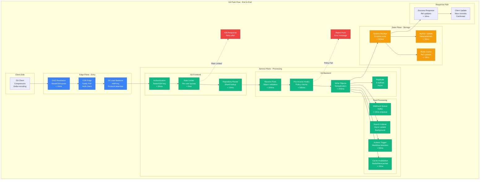
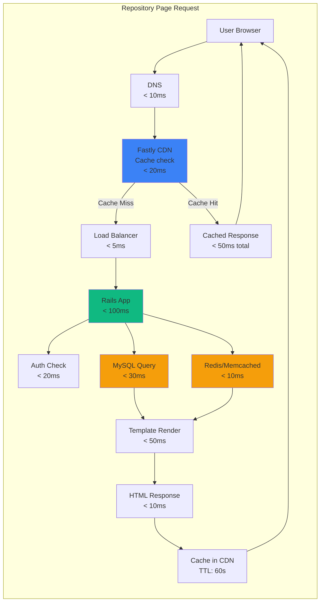
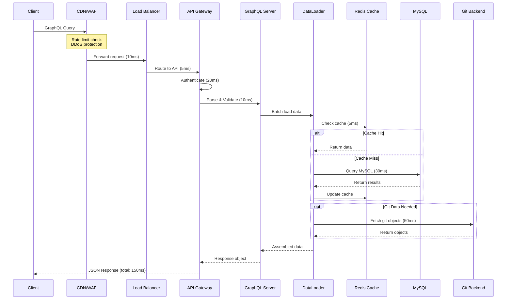
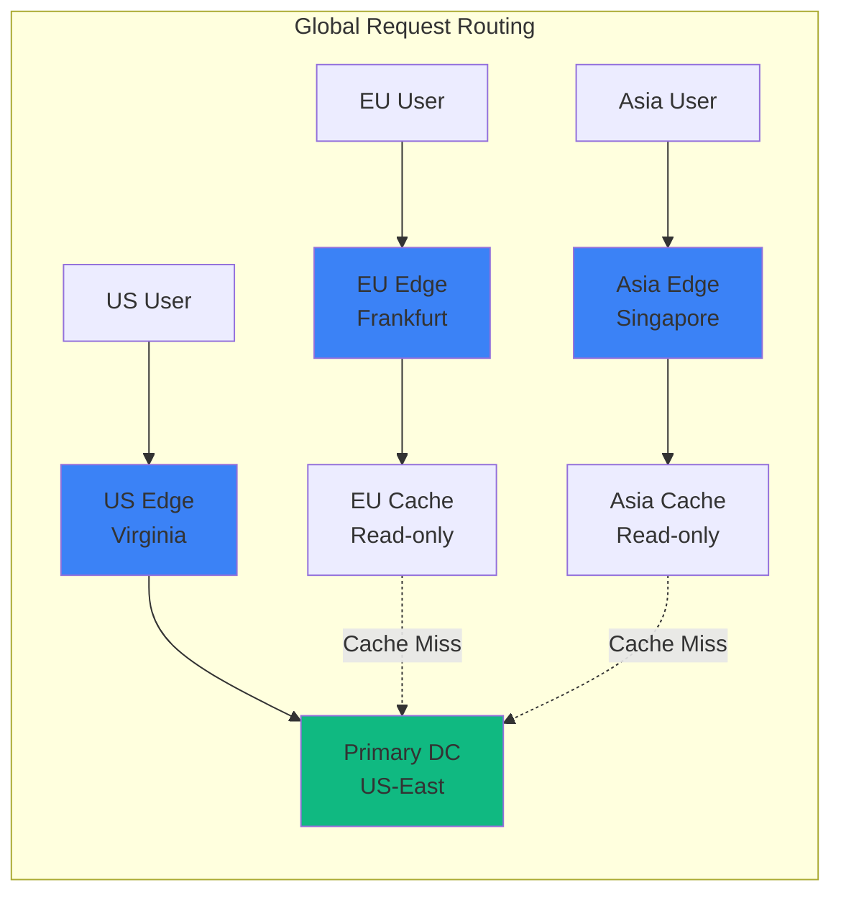

# GitHub Request Flow: From Git Push to Global Distribution

## Executive Summary
Tracing the complete request flow through GitHub's infrastructure, from user action to global replication, with detailed latency budgets and failure handling at each step.

## Git Push Request Flow



## Web Request Flow (Page Load)



## API Request Flow (GraphQL)



## Actions Workflow Trigger Flow

```mermaid
graph TB
    subgraph Actions_Workflow_Execution[""Actions Workflow Execution""]
        PUSH[Git Push Event] --> WEBHOOK_Q[Webhook Queue<br/>Kafka]

        WEBHOOK_Q --> ACTIONS_CTRL[Actions Controller<br/>Go service]

        ACTIONS_CTRL --> WORKFLOW_PARSE[Parse .github/workflows<br/>YAML validation]

        WORKFLOW_PARSE --> JOB_SCHEDULE[Job Scheduler<br/>Nomad]

        JOB_SCHEDULE --> RUNNER_ALLOC[Runner Allocation<br/>VM/Container]

        subgraph RunnerExecution[Runner Execution]
            RUNNER_START[Start Runner<br/>Firecracker VM<br/>< 5s]
            CHECKOUT[Checkout Code<br/>Git clone<br/>< 10s]
            SETUP[Setup Environment<br/>Tools/deps<br/>Variable]
            RUN_STEPS[Run Steps<br/>Sequential<br/>User-defined]
            ARTIFACTS[Upload Artifacts<br/>S3 storage<br/>Encrypted]
        end

        RUNNER_ALLOC --> RUNNER_START
        RUNNER_START --> CHECKOUT
        CHECKOUT --> SETUP
        SETUP --> RUN_STEPS
        RUN_STEPS --> ARTIFACTS

        ARTIFACTS --> STATUS_UPDATE[Update Status<br/>MySQL/API]
        STATUS_UPDATE --> NOTIFY[Notifications<br/>Email/Slack/PR]
    end

    style WEBHOOK_Q fill:#F59E0B
    style ACTIONS_CTRL fill:#10B981
    style RUNNER_START fill:#10B981
    style ARTIFACTS fill:#F59E0B
```



## Latency Budget Breakdown

### Git Operations
```python
git_latency_budget = {
    "clone_small_repo": {  # < 10MB
        "dns_resolution": "10ms",
        "tls_handshake": "30ms",
        "authentication": "50ms",
        "pack_negotiation": "20ms",
        "data_transfer": "200ms",
        "client_processing": "100ms",
        "total_target": "< 500ms",
        "p99_actual": "450ms"
    },

    "push_commit": {
        "authentication": "50ms",
        "rate_limit_check": "5ms",
        "receive_pack": "100ms",
        "hooks_execution": "200ms",
        "object_storage": "150ms",
        "replication": "async (300ms)",
        "cache_invalidation": "20ms",
        "response": "10ms",
        "total_target": "< 600ms",
        "p99_actual": "550ms"
    },

    "fetch_updates": {
        "authentication": "50ms",
        "ref_advertisement": "20ms",
        "pack_generation": "100ms",
        "compression": "50ms",
        "transfer": "150ms",
        "total_target": "< 400ms",
        "p99_actual": "380ms"
    }
}
```

### Web Operations
```yaml
web_latency_budget:
  repository_page:
    cdn_check: 20ms
    rails_processing: 100ms
    database_queries: 50ms
    cache_lookups: 20ms
    template_rendering: 60ms
    total_target: < 300ms
    p99_actual: 280ms

  pull_request_page:
    cdn_check: 20ms
    rails_processing: 150ms
    diff_calculation: 200ms
    comment_loading: 50ms
    ci_status_fetch: 100ms
    total_target: < 600ms
    p99_actual: 550ms

  code_search:
    query_parsing: 10ms
    elasticsearch_query: 200ms
    result_ranking: 50ms
    snippet_generation: 100ms
    total_target: < 400ms
    p99_actual: 380ms
```

## Failure Handling in Request Flow

### Circuit Breakers
```python
class RequestFlowCircuitBreakers:
    def __init__(self):
        self.breakers = {
            "mysql": {
                "threshold": "50% errors in 10s",
                "timeout": "1s",
                "fallback": "serve_from_cache"
            },
            "git_backend": {
                "threshold": "30% errors in 5s",
                "timeout": "5s",
                "fallback": "queue_for_retry"
            },
            "elasticsearch": {
                "threshold": "40% errors in 10s",
                "timeout": "2s",
                "fallback": "degraded_search"
            },
            "actions_runner": {
                "threshold": "20% failures in 1m",
                "timeout": "30s",
                "fallback": "queue_with_backoff"
            }
        }

    def handle_failure(self, service, error):
        if self.is_circuit_open(service):
            return self.breakers[service]["fallback"]
        else:
            self.record_error(service, error)
            return "retry_with_backoff"
```

### Retry Logic
```yaml
retry_policies:
  git_operations:
    max_attempts: 3
    backoff: exponential
    base_delay: 100ms
    max_delay: 5s
    jitter: true

  api_requests:
    max_attempts: 2
    backoff: constant
    delay: 500ms
    retry_on: [502, 503, 504]

  database_queries:
    max_attempts: 2
    backoff: linear
    delay: 100ms
    retry_on: ["connection_error", "timeout"]

  webhook_delivery:
    max_attempts: 5
    backoff: exponential
    base_delay: 1s
    max_delay: 1h
```

## Request Routing Intelligence

### Geo-Routing


### Smart Load Balancing
```python
class IntelligentLoadBalancer:
    def route_request(self, request):
        # Determine request type
        if request.is_git_operation():
            return self.route_git(request)
        elif request.is_api():
            return self.route_api(request)
        else:
            return self.route_web(request)

    def route_git(self, request):
        repo_shard = self.get_repo_shard(request.repo_id)
        servers = self.get_healthy_servers(repo_shard)

        # Prefer servers with warm caches
        if request.is_fetch():
            return self.find_server_with_cache(servers, request.repo_id)

        # For pushes, find least loaded
        return min(servers, key=lambda s: s.current_load)

    def route_api(self, request):
        # GraphQL complexity-based routing
        if request.is_graphql():
            complexity = self.estimate_query_complexity(request.query)
            if complexity > 1000:
                return self.high_capacity_servers.select()

        return self.standard_servers.round_robin()
```

## Cache Strategy in Request Flow

### Multi-Layer Caching
```yaml
cache_layers:
  edge_cdn:
    provider: "Fastly"
    ttl: "60s for public, 0 for private"
    hit_rate: "70%"
    invalidation: "Purge API"

  application_cache:
    rails_cache:
      backend: "Redis"
      ttl: "5 minutes"
      hit_rate: "85%"

    fragment_cache:
      backend: "Memcached"
      ttl: "1 hour"
      hit_rate: "60%"

  database_cache:
    query_cache:
      location: "MySQL buffer pool"
      size: "100GB per shard"
      hit_rate: "90%"

    git_object_cache:
      backend: "Local SSD"
      size: "1TB per server"
      hit_rate: "95%"
```

## Real-Time Metrics

```python
request_flow_metrics = {
    "current_throughput": {
        "web_requests": "8.5M/min",
        "api_requests": "5.2M/min",
        "git_operations": "85K/min",
        "actions_jobs": "50K/min"
    },

    "latency_percentiles": {
        "web_p50": "145ms",
        "web_p99": "980ms",
        "api_p50": "32ms",
        "api_p99": "487ms",
        "git_p50": "234ms",
        "git_p99": "2.1s"
    },

    "error_rates": {
        "web_5xx": "0.01%",
        "api_5xx": "0.02%",
        "git_errors": "0.1%",
        "actions_failures": "2.3%"
    }
}
```

## The 3 AM Debug Guide

```python
def trace_slow_request(request_id):
    """Emergency request tracing guide"""

    # Step 1: Check CDN logs
    cdn_logs = f"fastly_logs | grep {request_id}"

    # Step 2: Application logs
    app_logs = f"rails_logs | grep {request_id}"

    # Step 3: Database slow query log
    db_slow = "mysql> SHOW PROCESSLIST;"

    # Step 4: Distributed trace
    trace = f"honeycomb query request.id={request_id}"

    # Step 5: Git backend if applicable
    git_logs = f"spokes_logs | grep {request_id}"

    return {
        "cdn_time": "Check X-Timer header",
        "rails_time": "Check X-Runtime header",
        "db_time": "Check ActiveRecord logs",
        "git_time": "Check git-receive-pack timing"
    }
```

*"Every millisecond counts when you're serving 100M developers. Our request flow is optimized to minimize every possible delay."* - GitHub Performance Engineer