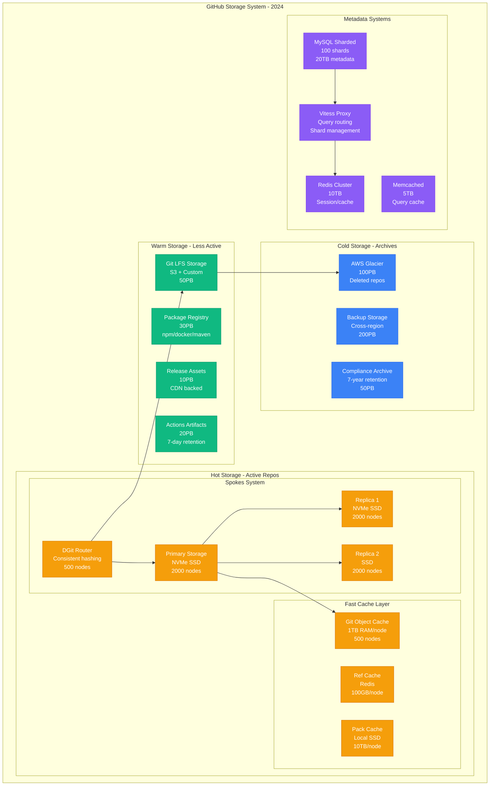
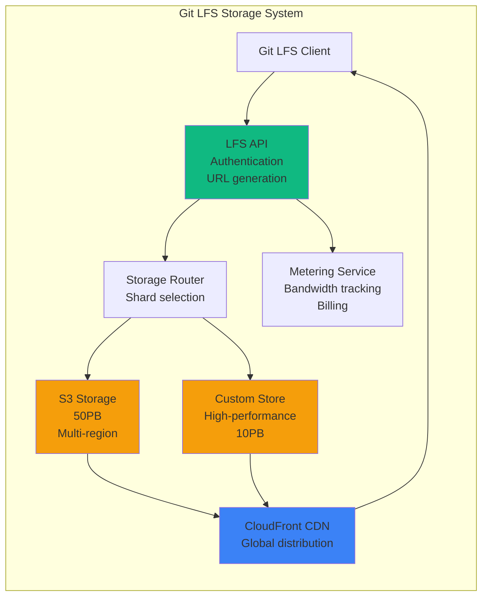
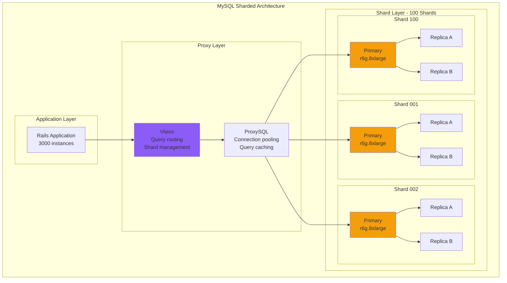
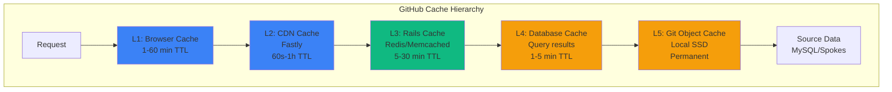

# GitHub Storage Architecture: 330M Repositories at Scale

## Executive Summary
GitHub stores 330M+ repositories (10PB+), 50PB of Git LFS data, and 100PB of archived content using a custom three-tier storage architecture optimized for Git operations.

## Complete Storage Architecture



## Spokes: GitHub's Custom Git Storage

### Architecture Deep Dive
```python
class SpokesStorageSystem:
    """GitHub's distributed Git storage system"""

    def __init__(self):
        self.configuration = {
            "total_nodes": 6000,  # 2000 per replica
            "replication_factor": 3,
            "consistency": "eventual",
            "sharding": "consistent_hashing",
            "node_capacity": "8TB NVMe"
        }

    def storage_layout(self):
        return {
            "repository_distribution": {
                "method": "Consistent hashing by repo_id",
                "virtual_nodes": 150,  # Better distribution
                "rebalancing": "Automatic on node add/remove"
            },
            "object_storage": {
                "format": "Git packfiles + loose objects",
                "compression": "zstd (30% better than zlib)",
                "deduplication": "Content-addressed storage"
            },
            "replication_strategy": {
                "primary_write": "Synchronous to primary",
                "replica_write": "Async to 2 replicas",
                "read_strategy": "Closest replica with fallback",
                "consistency_window": "< 1 second"
            }
        }

    def handle_large_repo(self, repo_size_gb):
        if repo_size_gb > 100:
            return "Store in dedicated shard with extra replicas"
        elif repo_size_gb > 10:
            return "Enable aggressive packfile compression"
        else:
            return "Standard storage with normal replication"
```

### Storage Tiering Logic
```yaml
storage_tiering:
  hot_tier:
    criteria:
      - "Accessed in last 7 days"
      - "Active pull requests"
      - "> 100 clones/day"
    storage: "NVMe SSD"
    replication: 3
    cache: "Full git objects in RAM"

  warm_tier:
    criteria:
      - "Accessed in last 30 days"
      - "< 100 clones/day"
      - "No recent pushes"
    storage: "SATA SSD"
    replication: 2
    cache: "Refs only"

  cold_tier:
    criteria:
      - "Not accessed in 90 days"
      - "Archived/deleted repos"
    storage: "S3 Glacier"
    replication: "Cross-region"
    retrieval_time: "1-12 hours"
```

## Git LFS Storage Architecture



### LFS Performance Optimization
```python
lfs_optimizations = {
    "chunking": {
        "size": "256MB chunks",
        "parallel_upload": 4,
        "parallel_download": 8,
        "resume_capability": True
    },
    "caching": {
        "cdn_cache": "Cloudfront - 200 PoPs",
        "edge_cache": "1PB total capacity",
        "ttl": "7 days for immutable objects"
    },
    "bandwidth_optimization": {
        "compression": "Brotli for transfer",
        "deduplication": "SHA256 content addressing",
        "delta_sync": "Only changed chunks"
    },
    "cost_optimization": {
        "s3_intelligent_tiering": True,
        "glacier_after_days": 90,
        "cdn_only_for_popular": "> 10 downloads/day"
    }
}
```

## Database Storage Architecture

### MySQL Sharding Strategy


### Data Distribution
```python
class GitHubDataSharding:
    def __init__(self):
        self.shard_count = 100
        self.data_distribution = {
            "users": "Sharded by user_id % 100",
            "repositories": "Sharded by repo_id % 100",
            "issues": "Co-located with repository",
            "pull_requests": "Co-located with repository",
            "actions_runs": "Separate cluster, time-based sharding"
        }

    def get_shard(self, entity_type, entity_id):
        if entity_type in ["users", "repositories"]:
            return entity_id % self.shard_count
        elif entity_type in ["issues", "pull_requests"]:
            repo_id = self.get_repo_id(entity_id)
            return repo_id % self.shard_count
        elif entity_type == "actions_runs":
            return self.get_time_based_shard(entity_id)

    def rebalance_shard(self, shard_id):
        """Handle hot shards"""
        return {
            "split_shard": shard_id > 1000000,  # Row count
            "add_replicas": shard_id > 10000,   # QPS
            "cache_layer": "Always for hot shards"
        }
```

## Cache Architecture

### Multi-Level Caching


### Cache Performance Metrics
```yaml
cache_performance:
  cdn_cache:
    hit_rate: 70%
    bandwidth_saved: 500TB/day
    cost_saved: $50K/month

  redis_cache:
    hit_rate: 85%
    operations: 10M/sec
    latency_p99: 2ms
    memory_used: 10TB

  memcached_cache:
    hit_rate: 60%
    operations: 5M/sec
    latency_p99: 1ms
    memory_used: 5TB

  git_object_cache:
    hit_rate: 95%
    size: 500TB total
    objects_cached: 100B
    bandwidth_saved: 1PB/day
```

## Storage Capacity Planning

### Growth Projections
```python
storage_growth_model = {
    "current_2024": {
        "repositories": "330M",
        "total_git_data": "10PB",
        "lfs_data": "50PB",
        "packages": "30PB",
        "backups": "200PB"
    },
    "projected_2025": {
        "repositories": "450M (+36%)",
        "total_git_data": "15PB (+50%)",
        "lfs_data": "75PB (+50%)",
        "packages": "50PB (+67%)",
        "backups": "300PB (+50%)"
    },
    "capacity_planning": {
        "add_nodes_quarterly": 500,
        "storage_cost_increase": "$2M/month",
        "migration_to_cold": "100TB/month",
        "deduplication_savings": "30%"
    }
}
```

### Storage Cost Breakdown
```yaml
monthly_storage_costs:
  hot_tier:
    nvme_ssd: $5M  # 10PB @ $500/TB
    replication: $10M  # 3x replication

  warm_tier:
    s3_standard: $2M  # 50PB @ $40/TB
    cdn_storage: $1M  # Edge caching

  cold_tier:
    glacier: $500K  # 100PB @ $5/TB
    glacier_deep: $200K  # 100PB @ $2/TB

  metadata:
    mysql: $1M  # 20TB with replication
    redis: $500K  # 10TB RAM

  backup:
    cross_region: $1M  # 200PB incremental

  total: $21.7M/month
```

## Data Consistency Model

### Git Operations Consistency
```python
class GitConsistencyModel:
    def __init__(self):
        self.consistency_levels = {
            "read": "Eventual consistency from replicas",
            "write": "Strong consistency to primary",
            "replication_lag": "< 1 second typical",
            "conflict_resolution": "Last write wins"
        }

    def handle_push(self, repo_id, objects):
        # Strong consistency for pushes
        primary = self.get_primary_node(repo_id)
        result = primary.write_objects(objects)

        # Async replication to replicas
        self.async_replicate(repo_id, objects)

        # Invalidate caches
        self.invalidate_caches(repo_id)

        return result

    def handle_clone(self, repo_id):
        # Read from closest replica
        replicas = self.get_replicas(repo_id)
        fastest = self.find_closest_replica(replicas)

        # Fallback chain if replica is behind
        return fastest.read_with_fallback()
```

## Disaster Recovery Storage

### Backup Strategy
```yaml
backup_strategy:
  frequency:
    mysql: "Every 6 hours (incremental)"
    git_repos: "Continuous replication"
    lfs: "Daily snapshots"

  retention:
    mysql: "30 days point-in-time"
    git_repos: "Forever (immutable)"
    deleted_repos: "30 days before Glacier"

  recovery:
    rpo: "< 1 hour"  # Recovery Point Objective
    rto: "< 4 hours"  # Recovery Time Objective

  testing:
    frequency: "Monthly DR drills"
    scope: "Random 1% of repos"
    validation: "Checksum verification"
```

## Storage Performance Metrics

### Real-Time Metrics
```python
storage_metrics = {
    "iops": {
        "spokes_read": "10M IOPS",
        "spokes_write": "2M IOPS",
        "mysql": "500K IOPS",
        "cache": "50M IOPS"
    },
    "throughput": {
        "git_operations": "50GB/s aggregate",
        "lfs_uploads": "10GB/s",
        "cdn_delivery": "100GB/s"
    },
    "latency": {
        "git_object_read_p50": "0.5ms",
        "git_object_read_p99": "5ms",
        "mysql_query_p50": "2ms",
        "mysql_query_p99": "50ms"
    },
    "capacity": {
        "total_storage": "410PB",
        "used_storage": "361PB (88%)",
        "growth_rate": "1PB/month"
    }
}
```

## The 3 AM Storage Playbook

```python
def storage_incident_response(alert):
    if alert == "spokes_node_down":
        return {
            "impact": "1/3 replicas unavailable",
            "action": "Traffic reroutes automatically",
            "repair": "Replace node, resync from replicas",
            "time": "4-6 hours for full resync"
        }

    elif alert == "mysql_shard_slow":
        return {
            "check": "SHOW PROCESSLIST for long queries",
            "common": "Large migration or bad query",
            "fix": "Kill query, add read replica",
            "escalate": "Page DBA if > 10 min"
        }

    elif alert == "storage_90_percent_full":
        return {
            "immediate": "Trigger emergency TTL reduction",
            "medium": "Migrate cold data to Glacier",
            "long": "Order new storage nodes",
            "timeline": "24 hours to critical"
        }
```

*"We store every commit ever made to every repository. That's a responsibility we take seriously - your code is safer with us than on your own laptop."* - GitHub Storage Engineer