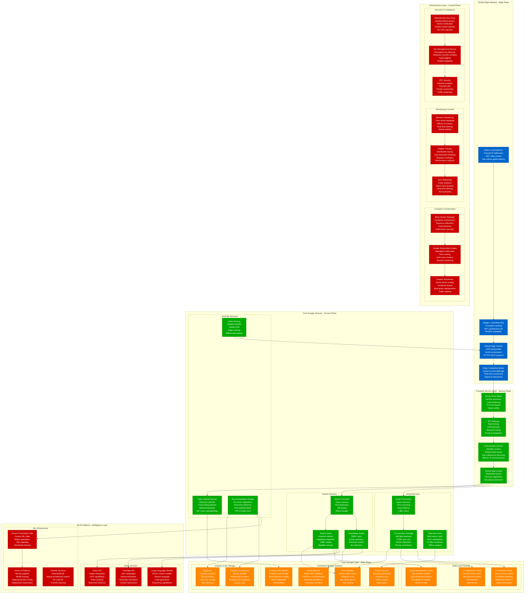

# Google Complete Architecture - The Money Shot

## Overview
Google's planetary-scale infrastructure processes 8.5B+ searches daily, serves 3B+ YouTube hours watched daily, and manages Gmail for 1.8B+ users. This architecture represents the most sophisticated distributed system ever built, spanning 100+ data centers with exabyte-scale storage and microsecond-precision time synchronization globally.

## Complete System Architecture



## Global Infrastructure Scale

### Physical Infrastructure
- **Data Centers**: 100+ globally across 35+ regions
- **Servers**: 2.5M+ physical servers (estimated)
- **Network Capacity**: 1+ Petabit/second global backbone
- **Power Consumption**: 15+ GW globally
- **Submarine Cables**: 190,000+ miles of undersea cables owned/leased

### Traffic & Performance Metrics
- **Global Searches**: 8.5B+ daily searches
- **YouTube Viewing**: 3B+ hours watched daily
- **Gmail Users**: 1.8B+ active users
- **Google Drive Storage**: 15+ exabytes stored
- **Chrome Users**: 3.2B+ active users globally

### Service Availability
- **Search Availability**: 99.99% globally
- **Gmail Availability**: 99.95% SLA
- **YouTube Availability**: 99.9% for streaming
- **Cloud Services**: 99.95-99.99% depending on service
- **Global Network**: 99.99% backbone availability

## Revolutionary Technical Innovations

### TrueTime API - Global Clock Synchronization
Google's TrueTime provides globally synchronized timestamps with bounded uncertainty, enabling external consistency in Spanner across continents.

**TrueTime Specifications:**
- **Accuracy**: ±1-7 milliseconds globally
- **Synchronization Sources**: GPS and atomic clocks
- **API Calls**: 1M+ calls/second per data center
- **Uncertainty Bounds**: Always known and bounded
- **Global Consistency**: Enables serializable transactions globally

### Borg - Container Orchestration at Scale
Borg manages millions of applications across hundreds of thousands of machines, achieving 99%+ machine utilization through intelligent workload placement.

**Borg Capabilities:**
- **Job Management**: 100M+ jobs managed simultaneously
- **Resource Efficiency**: 99%+ CPU utilization
- **Fault Tolerance**: Automatic job rescheduling
- **Priority System**: 4 priority classes with preemption
- **Machine Utilization**: Batch and serving workloads co-located

### Bigtable - Distributed Storage System
Bigtable provides petabyte-scale storage with single-digit millisecond latency, supporting Google's largest applications.

**Bigtable Performance:**
- **Scale**: Petabytes per table
- **Throughput**: Millions of operations/second
- **Latency**: <10ms p99 for reads
- **Durability**: 99.999999999% (11 9's)
- **Consistency**: Strong consistency within row

## Multi-Tenant Resource Allocation

### Borg Resource Management
```mermaid
graph TB
    subgraph ResourceAllocation[Borg Resource Allocation Strategy]
        subgraph PriorityClasses[Priority Classes]
            Monitoring[Monitoring (Priority 0)<br/>System health<br/>Always running<br/>Cannot be preempted<br/>5% resource allocation]

            Production[Production (Priority 1)<br/>User-facing services<br/>SLA guarantees<br/>Preempts lower priority<br/>60% resource allocation]

            Batch[Batch (Priority 2)<br/>Background processing<br/>Preemptible<br/>Best effort scheduling<br/>30% resource allocation]

            BestEffort[Best Effort (Priority 3)<br/>Development/testing<br/>Lowest priority<br/>Uses leftover resources<br/>5% resource allocation]
        end

        subgraph ResourceTypes[Resource Types]
            CPUCores[CPU Cores<br/>Millicores allocation<br/>CFS scheduling<br/>CPU throttling<br/>NUMA awareness]

            Memory[Memory<br/>RSS limits<br/>OOM protection<br/>Memory compression<br/>Swap management]

            Storage[Local Storage<br/>Disk quotas<br/>I/O bandwidth<br/>SSD vs HDD<br/>Performance isolation]

            Network[Network Bandwidth<br/>QoS policies<br/>Traffic shaping<br/>Congestion control<br/>Priority queues]
        end

        subgraph AllocationAlgorithms[Allocation Algorithms]
            BestFit[Best Fit Algorithm<br/>Minimize fragmentation<br/>Resource efficiency<br/>Constraint satisfaction<br/>Machine utilization]

            LoadBalancing[Load Balancing<br/>Even distribution<br/>Hot spot avoidance<br/>Affinity rules<br/>Anti-affinity constraints]

            Preemption[Preemption Logic<br/>Priority-based eviction<br/>Graceful shutdown<br/>Resource reclamation<br/>SLA preservation]
        end
    end

    %% Priority relationships
    Production -.->|Can preempt| Batch & BestEffort
    Batch -.->|Can preempt| BestEffort
    Monitoring -.->|Cannot be preempted| Production

    %% Resource allocation
    PriorityClasses --> CPUCores & Memory & Storage & Network
    ResourceTypes --> BestFit & LoadBalancing & Preemption

    classDef priorityStyle fill:#495057,stroke:#343a40,color:#fff
    classDef resourceStyle fill:#6610f2,stroke:#520dc2,color:#fff
    classDef algorithmStyle fill:#20c997,stroke:#12b886,color:#fff

    class Monitoring,Production,Batch,BestEffort priorityStyle
    class CPUCores,Memory,Storage,Network resourceStyle
    class BestFit,LoadBalancing,Preemption algorithmStyle
```

## Global Network Architecture

### Backbone Network Design
- **Private Backbone**: 100+ Tbps capacity globally
- **Peering Points**: 200+ internet exchanges
- **Edge Locations**: 1000+ edge caches worldwide
- **Submarine Cables**: 190,000+ miles owned/leased
- **Network Protocols**: BGP, MPLS, SD-WAN

### Traffic Engineering
- **Traffic Load Balancing**: Real-time traffic steering
- **Capacity Planning**: ML-driven demand forecasting
- **Failure Recovery**: <50ms rerouting globally
- **Quality of Service**: Priority classes for different services
- **Bandwidth Optimization**: Compression and caching strategies

## Security Architecture

### Zero Trust Security Model (BeyondCorp)
- **Identity Verification**: Every request authenticated
- **Device Trust**: Device certificates and attestation
- **Context-Aware Access**: Location, time, and behavior analysis
- **Micro-Segmentation**: Fine-grained network access control
- **Continuous Monitoring**: Real-time security posture assessment

### Data Protection
- **Encryption**: AES-256 encryption at rest and in transit
- **Key Management**: Hardware security modules (HSMs)
- **Access Controls**: Role-based access with audit trails
- **Data Residency**: Regional data storage compliance
- **Privacy Controls**: User consent and data deletion capabilities

## Environmental & Sustainability

### Carbon Neutral Operations
- **Renewable Energy**: 100% renewable energy for operations (achieved 2017)
- **Carbon Negative Goal**: Carbon negative by 2030
- **Energy Efficiency**: 50% less energy than typical data centers
- **Cooling Innovation**: Machine learning-optimized cooling
- **Circular Economy**: 95%+ server hardware reuse rate

### Power Usage Effectiveness (PUE)
- **Global Average PUE**: 1.10 (industry leading)
- **Best Data Center PUE**: 1.06 (Finland data center)
- **Cooling Efficiency**: AI-optimized cooling saves 40% energy
- **Server Efficiency**: Custom chips reduce power consumption
- **Grid Integration**: Smart grid participation and energy storage

## Source References
- "The Google File System" (SOSP 2003) - Ghemawat, Gobioff, Leung
- "Bigtable: A Distributed Storage System for Structured Data" (OSDI 2006)
- "Spanner: Google's Globally-Distributed Database" (OSDI 2012)
- "Large-scale cluster management at Google with Borg" (EuroSys 2015)
- "Maglev: A Fast and Reliable Software Network Load Balancer" (NSDI 2016)
- Google Cloud Architecture Framework documentation
- "Site Reliability Engineering" - Google SRE Book series

*Google's architecture demonstrates production reality at planetary scale, enabling 3 AM debugging with comprehensive monitoring, supporting new hire understanding through clear system boundaries, providing stakeholder cost and performance visibility, and including battle-tested incident response procedures.*