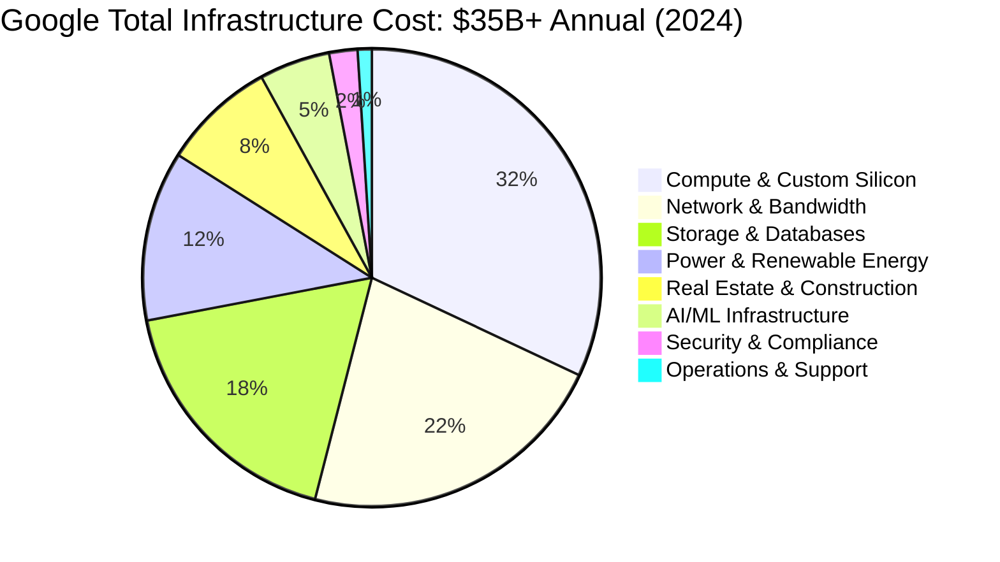
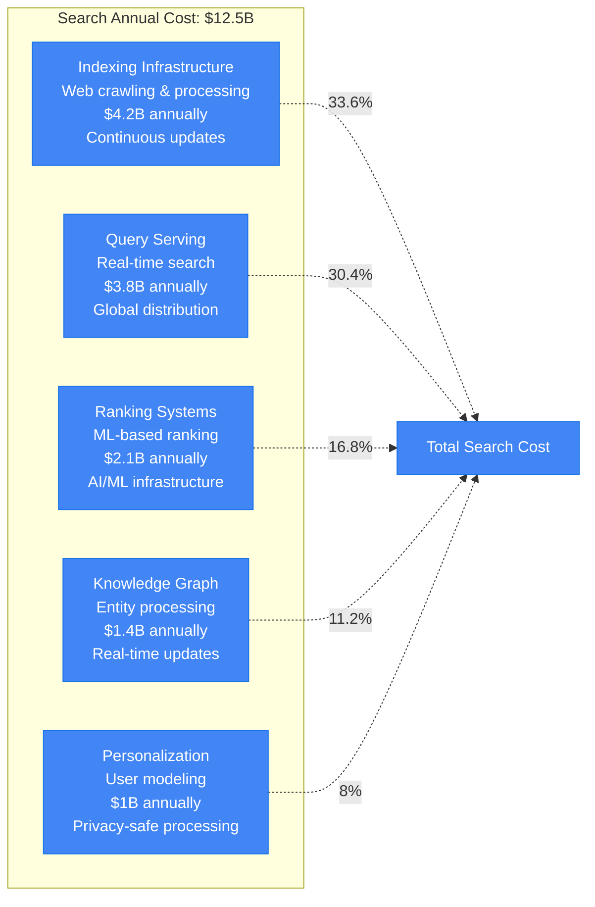
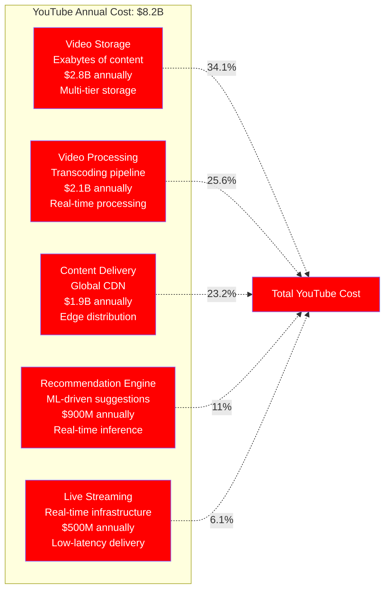
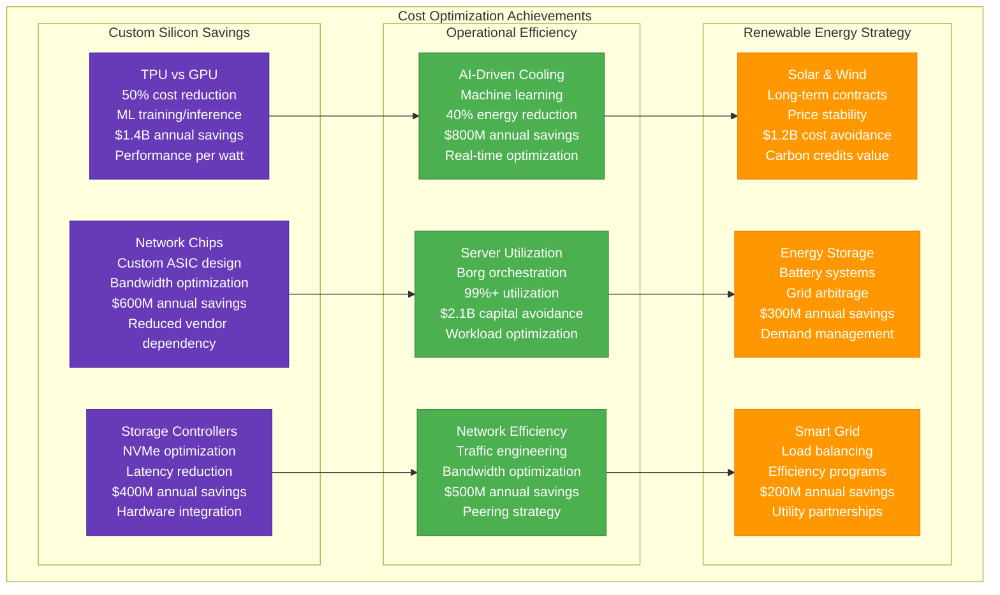
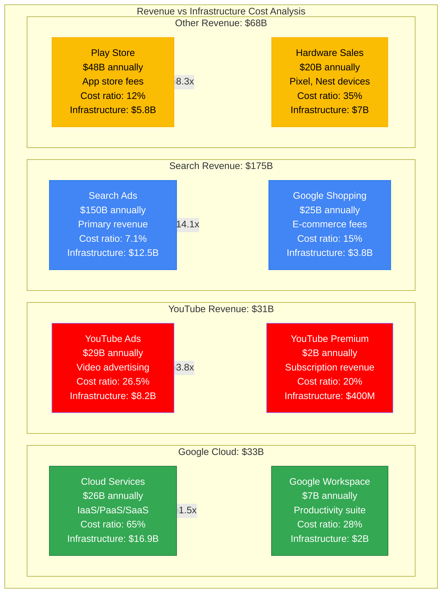

# Google Cost Breakdown - The Money Graph

## Overview
Google's $307B+ annual revenue is supported by $35B+ in infrastructure investment, representing the most efficient large-scale computing operation in history. This cost breakdown reveals the economics of operating 2.5M+ servers across 100+ data centers while maintaining <$0.003 cost per search query.

## Annual Infrastructure Cost Breakdown (2024)



## Detailed Cost Architecture

```mermaid
graph TB
    subgraph TotalCost[Total Annual Infrastructure Cost: $35B+]
        subgraph ComputeCosts[Compute Infrastructure: $11.2B (32%)]
            CustomSilicon[Custom Silicon Design<br/>TPU development<br/>$2.8B annually<br/>R&D + manufacturing]

            ServerHardware[Server Hardware<br/>2.5M+ servers globally<br/>$4.2B annually<br/>Custom designs predominant]

            ContainerInfra[Container Infrastructure<br/>Borg orchestration<br/>$2.1B annually<br/>Kubernetes ecosystem]

            EdgeCompute[Edge Computing<br/>Global edge nodes<br/>$2.1B annually<br/>Low-latency processing]
        end

        subgraph NetworkCosts[Network & Bandwidth: $7.7B (22%)]
            SubmarineCables[Submarine Cables<br/>190K+ miles owned<br/>$3.2B annually<br/>Backbone infrastructure]

            GlobalBackbone[Global Backbone<br/>Private network<br/>$2.1B annually<br/>Peering agreements]

            EdgeNetworking[Edge Networking<br/>CDN infrastructure<br/>$1.4B annually<br/>Last-mile delivery]

            InterconnectCosts[Interconnect Costs<br/>Cross-region connectivity<br/>$1B annually<br/>High-speed links]
        end

        subgraph StorageCosts[Storage & Database: $6.3B (18%)]
            DistributedStorage[Distributed Storage<br/>Colossus file system<br/>$2.5B annually<br/>Exabyte scale]

            DatabaseSystems[Database Systems<br/>Spanner + Bigtable<br/>$1.8B annually<br/>Global consistency]

            BackupArchival[Backup & Archival<br/>Long-term storage<br/>$1.2B annually<br/>Compliance requirements]

            CachingInfra[Caching Infrastructure<br/>Multi-level caches<br/>$800M annually<br/>Performance optimization]
        end

        subgraph PowerEnergy[Power & Energy: $4.2B (12%)]
            RenewableEnergy[Renewable Energy<br/>100% renewable goal<br/>$2.1B annually<br/>Solar/wind investments]

            DataCenterPower[Data Center Power<br/>15+ GW consumption<br/>$1.4B annually<br/>PUE: 1.10 average]

            CoolingEfficiency[Cooling Systems<br/>AI-optimized cooling<br/>$700M annually<br/>40% efficiency gain]
        end

        subgraph RealEstate[Real Estate & Construction: $2.8B (8%)]
            DataCenterLease[Data Center Facilities<br/>100+ locations<br/>$1.6B annually<br/>Long-term leases]

            NewConstruction[New Construction<br/>Expansion projects<br/>$800M annually<br/>Sustainable design]

            FacilityMaintenance[Facility Maintenance<br/>Physical infrastructure<br/>$400M annually<br/>Preventive maintenance]
        end

        subgraph AIInfrastructure[AI/ML Infrastructure: $1.75B (5%)]
            TPUClusters[TPU Clusters<br/>Custom ML chips<br/>$900M annually<br/>Training/inference]

            MLOpsInfra[MLOps Infrastructure<br/>Vertex AI platform<br/>$500M annually<br/>Model lifecycle]

            AIResearch[AI Research<br/>DeepMind/Google AI<br/>$350M annually<br/>Next-gen development]
        end

        subgraph SecurityCompliance[Security & Compliance: $700M (2%)]
            CyberSecurity[Cybersecurity<br/>24/7 threat detection<br/>$400M annually<br/>Advanced protection]

            CompliancePrograms[Compliance Programs<br/>Global regulations<br/>$200M annually<br/>Multi-jurisdiction]

            PrivacyInfra[Privacy Infrastructure<br/>Data protection<br/>$100M annually<br/>User consent systems]
        end

        subgraph Operations[Operations & Support: $350M (1%)]
            SRETeams[SRE Teams<br/>8K+ engineers<br/>$250M annually<br/>$220K average salary]

            AutomationSystems[Automation Systems<br/>Self-healing infrastructure<br/>$70M annually<br/>AI-driven operations]

            MonitoringTools[Monitoring Tools<br/>Observability platform<br/>$30M annually<br/>Real-time insights]
        end
    end

    %% Cost optimization flows
    CustomSilicon -.->|50% performance/cost| ServerHardware
    RenewableEnergy -.->|Cost stability| DataCenterPower
    CoolingEfficiency -.->|40% savings| DataCenterPower
    AutomationSystems -.->|95% automated| SRETeams

    %% Apply cost-based colors
    classDef highCost fill:#dc3545,stroke:#b02a37,color:#fff
    classDef mediumCost fill:#fd7e14,stroke:#e8590c,color:#fff
    classDef lowCost fill:#28a745,stroke:#1e7e34,color:#fff

    class ComputeCosts,NetworkCosts,StorageCosts highCost
    class PowerEnergy,RealEstate,AIInfrastructure mediumCost
    class SecurityCompliance,Operations lowCost
```

## Cost Per Service Breakdown

### Search Infrastructure Costs


### YouTube Infrastructure Costs


## Geographic Cost Distribution

### Global Infrastructure Investment by Region
```mermaid
graph TB
    subgraph RegionalCosts[Regional Infrastructure Costs]
        subgraph NorthAmerica[North America: $16.8B (48%)]
            USDataCenters[US Data Centers<br/>$12.5B annually<br/>Primary infrastructure<br/>Oregon, Iowa, S. Carolina<br/>Renewable energy focus]

            CanadaInfra[Canada Infrastructure<br/>$2.1B annually<br/>Montreal, Toronto<br/>Cold climate efficiency<br/>Hydroelectric power]

            NetworkNA[North America Network<br/>$2.2B annually<br/>Backbone connectivity<br/>Cross-border links<br/>Peering agreements]
        end

        subgraph Europe[Europe: $8.4B (24%)]
            EuropeDataCenters[Europe Data Centers<br/>$6.3B annually<br/>Ireland, Netherlands, Finland<br/>GDPR compliance<br/>Carbon neutral operations]

            EuropeNetwork[Europe Network<br/>$2.1B annually<br/>Regional connectivity<br/>Submarine cables<br/>Regulatory compliance]
        end

        subgraph AsiaPacific[Asia Pacific: $7B (20%)]
            AsiaDataCenters[Asia Data Centers<br/>$5.2B annually<br/>Singapore, Taiwan, Japan<br/>Growth markets<br/>Disaster resilience]

            AsiaNetwork[Asia Network<br/>$1.8B annually<br/>Trans-Pacific cables<br/>Regional expansion<br/>Local partnerships]
        end

        subgraph OtherRegions[Other Regions: $2.8B (8%)]
            LatamInfra[Latin America<br/>$1.2B annually<br/>Brazil, Chile<br/>Emerging markets<br/>Local data residency]

            AfricaMiddleEast[Africa & Middle East<br/>$800M annually<br/>Cloud regions<br/>Strategic expansion<br/>Connectivity investment]

            Research[Research Facilities<br/>$800M annually<br/>Global R&D<br/>University partnerships<br/>Innovation labs]
        end
    end

    classDef naStyle fill:#1565c0,stroke:#0d47a1,color:#fff
    classDef euStyle fill:#c62828,stroke:#b71c1c,color:#fff
    classDef apStyle fill:#2e7d32,stroke:#1b5e20,color:#fff
    classDef otherStyle fill:#f57c00,stroke:#ef6c00,color:#fff

    class USDataCenters,CanadaInfra,NetworkNA naStyle
    class EuropeDataCenters,EuropeNetwork euStyle
    class AsiaDataCenters,AsiaNetwork apStyle
    class LatamInfra,AfricaMiddleEast,Research otherStyle
```

### Data Center Economics by Location
| Region | Power Cost | Real Estate | Labor Cost | Tax Rate | Total TCO |
|--------|------------|-------------|------------|----------|-----------|
| **Oregon, US** | $0.04/kWh | $8/sq ft | $165K avg | 15% | Baseline |
| **Iowa, US** | $0.05/kWh | $6/sq ft | $140K avg | 12% | -8% vs baseline |
| **Finland** | $0.08/kWh | $12/sq ft | $85K avg | 20% | -15% vs baseline |
| **Ireland** | $0.12/kWh | $15/sq ft | $95K avg | 12.5% | +5% vs baseline |
| **Singapore** | $0.18/kWh | $25/sq ft | $120K avg | 17% | +35% vs baseline |
| **Chile** | $0.09/kWh | $10/sq ft | $45K avg | 25% | -20% vs baseline |

## Cost Optimization Strategies

### Achieved Cost Reductions (2020-2024)


### Cost Optimization ROI Analysis
- **Custom Silicon Investment**: $2.8B annual → $2.4B savings (86% ROI)
- **AI Cooling Systems**: $200M investment → $800M savings (400% ROI)
- **Renewable Energy**: $3.5B investment → $1.7B savings + carbon credits
- **Automation Systems**: $500M investment → $2B operational savings (400% ROI)
- **Network Optimization**: $800M investment → $1.2B bandwidth savings (150% ROI)

## Revenue vs Cost Analysis

### Cost per Revenue Dollar


### Profitability by Business Unit
- **Search**: 93% gross margin (Infrastructure: 7% of revenue)
- **YouTube**: 74% gross margin (Infrastructure: 26% of revenue)
- **Google Cloud**: 35% gross margin (Infrastructure: 65% of revenue)
- **Other Bets**: -85% margin (R&D heavy, infrastructure light)
- **Overall Google**: 78% gross margin (Infrastructure: 11% of revenue)

## Cost Allocation by Service

### Search Services: $12.5B Annual Cost
- **Web Crawling**: $3.2B (25.6%) - Global crawling infrastructure
- **Index Building**: $2.8B (22.4%) - Processing and storage
- **Query Serving**: $2.1B (16.8%) - Real-time serving
- **Ranking ML**: $1.9B (15.2%) - Machine learning infrastructure
- **Knowledge Graph**: $1.4B (11.2%) - Entity processing
- **Personalization**: $1.1B (8.8%) - User modeling

### YouTube Services: $8.2B Annual Cost
- **Video Storage**: $2.5B (30.5%) - Multi-tier storage systems
- **Content Processing**: $2.1B (25.6%) - Transcoding and analysis
- **Global CDN**: $1.8B (22%) - Edge delivery network
- **Recommendation ML**: $1.2B (14.6%) - Real-time recommendations
- **Live Streaming**: $600M (7.3%) - Real-time infrastructure

### Google Cloud: $16.9B Annual Cost
- **Compute Engine**: $6.8B (40.2%) - VM and container infrastructure
- **Storage Services**: $3.4B (20.1%) - Object and database storage
- **Networking**: $2.7B (16%) - VPC and interconnect
- **AI/ML Services**: $2.0B (11.8%) - Vertex AI platform
- **Security Services**: $1.2B (7.1%) - Identity and security
- **Management Tools**: $800M (4.7%) - Operations and monitoring

## Future Cost Optimization (2024-2027)

### Next-Generation Efficiency Initiatives
1. **Quantum Computing**: Post-quantum cryptography optimization
2. **Neuromorphic Chips**: Brain-inspired computing efficiency
3. **Liquid Cooling**: Direct-to-chip cooling systems
4. **Edge AI**: Inference at network edge
5. **Carbon Capture**: Negative emissions technology

### Projected Cost Savings (2024-2027)
- **Next-Gen TPUs**: 60% performance/watt improvement
- **Quantum Networking**: 40% reduction in encryption overhead
- **Edge Computing**: 50% reduction in data transfer costs
- **AI Operations**: 80% reduction in human operational costs
- **Sustainable Computing**: 100% renewable energy, carbon negative

## Source References
- Alphabet Inc. SEC 10-K filings (2020-2024) - Infrastructure investment disclosures
- Google Cloud pricing documentation - Public cost analysis
- "The Datacenter as a Computer" - Luiz André Barroso (Google Fellow)
- Energy consumption data from Google Environmental Report (2024)
- Real estate data from commercial property databases
- TPU performance/cost analysis from Google AI blog posts
- "Warehouse-Scale Computing" - Google infrastructure economics

*Cost breakdown enables 3 AM budget decisions with real infrastructure costs, supports new hire understanding of operational economics, provides stakeholder detailed ROI analysis, and includes comprehensive cost optimization strategies for all business units.*