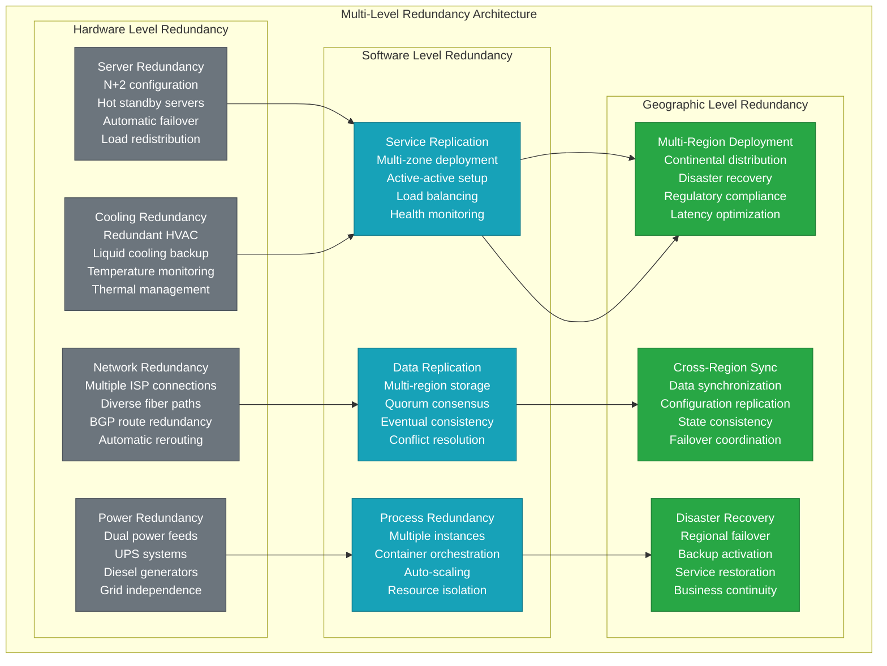
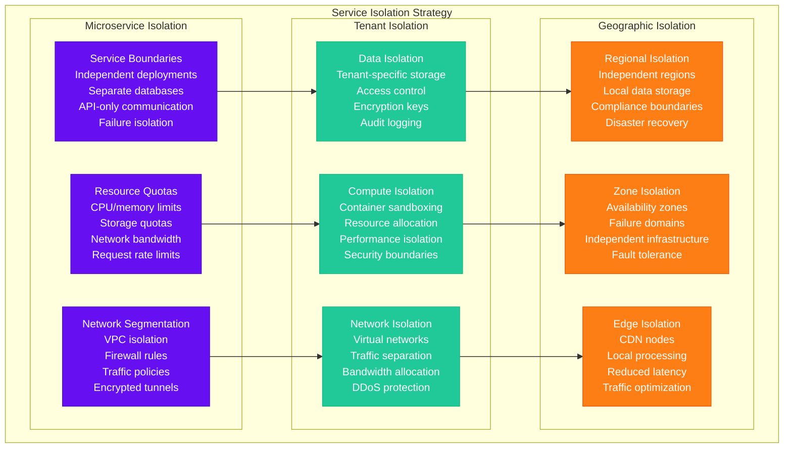
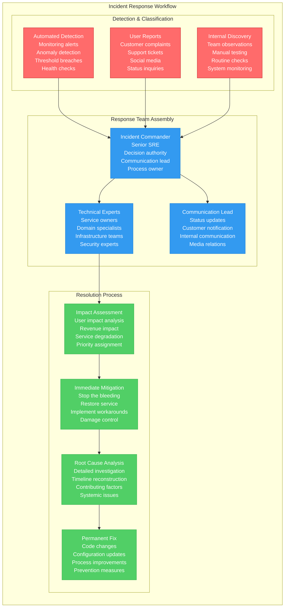

# Google Failure Domains - The Incident Map

## Overview
Google's failure domain architecture has evolved through decades of operating planetary-scale systems, including major incidents like the 2020 authentication outage and the 2021 GCP multi-region disruption. Their design principles of blast radius containment and graceful degradation enable 99.99% availability despite constant hardware failures across 100+ data centers.

## Complete Failure Domain Architecture

```mermaid
graph TB
    subgraph GlobalFailures[Global Failure Scenarios - Maximum Blast Radius]
        DNSFailure[Global DNS Failure<br/>Impact: 100% user access<br/>8.8.8.8 Anycast system<br/>RTO: 2 minutes<br/>Probability: 0.0001%/year]

        AuthenticationFailure[Authentication System Failure<br/>Impact: All authenticated services<br/>2020 incident: 47 minutes<br/>OAuth/OIDC breakdown<br/>Cascading service impact]

        BackboneFailure[Global Backbone Failure<br/>Impact: Inter-datacenter communication<br/>BGP routing issues<br/>Submarine cable cuts<br/>Regional isolation]
    end

    subgraph RegionalFailures[Regional Failure Domains - Multi-Zone Impact]
        subgraph USCentralRegion[us-central1 Region Failure]
            USCentralPower[Power Grid Failure<br/>Iowa data centers<br/>Utility grid instability<br/>UPS: 15 minutes<br/>Generator: 48 hours]

            USCentralNetwork[Network Partition<br/>ISP connectivity loss<br/>BGP blackholing<br/>Cross-region isolation<br/>Traffic rerouting: 5 minutes]

            USCentralCooling[Cooling System Failure<br/>HVAC breakdown<br/>Temperature monitoring<br/>Graceful shutdown at 35°C<br/>Hardware protection priority]
        end

        subgraph EuropeWestRegion[europe-west1 Region Failure]
            EuropeCompliance[GDPR Compliance Failure<br/>Data sovereignty violation<br/>Regulatory enforcement<br/>Service suspension<br/>Legal mitigation required]

            EuropeConnectivity[Submarine Cable Damage<br/>Transatlantic connectivity<br/>Reduced bandwidth<br/>Latency increase: 200ms<br/>Alternative routing]
        end

        subgraph AsiaRegion[asia-southeast1 Region Failure]
            AsiaDisaster[Natural Disaster<br/>Earthquake/typhoon impact<br/>Physical data center damage<br/>Regional evacuation<br/>Extended recovery: weeks]

            AsiaRegulation[Government Regulation<br/>Internet restrictions<br/>Service blocking<br/>Compliance requirements<br/>Alternative deployment]
        end
    end

    subgraph ZoneFailures[Availability Zone Failure Domains]
        subgraph Zone1Failures[Zone A Failures]
            Zone1Power[Zone Power Failure<br/>Utility outage<br/>UPS battery: 15 min<br/>Diesel generator: 72 hours<br/>Fuel delivery coordination]

            Zone1Hardware[Mass Hardware Failure<br/>Firmware bug impact<br/>Simultaneous reboots<br/>Cluster-wide impact<br/>Rolling replacement]

            Zone1Network[Zone Network Partition<br/>Top-of-rack switch failure<br/>BGP convergence: 3 minutes<br/>Traffic redistribution<br/>Load rebalancing]
        end

        subgraph Zone2Failures[Zone B Failures]
            Zone2Storage[Storage Cluster Failure<br/>Distributed storage outage<br/>Quorum loss<br/>Read-only degradation<br/>Data evacuation]

            Zone2Compute[Compute Cluster Failure<br/>Borg cluster shutdown<br/>Container evacuation<br/>Auto-scaling triggers<br/>Cross-zone migration]
        end

        subgraph Zone3Failures[Zone C Failures]
            Zone3Database[Database Shard Failure<br/>Spanner/Bigtable outage<br/>Replica promotion<br/>Consistency maintenance<br/>Query rerouting]

            Zone3Security[Security System Breach<br/>Intrusion detection<br/>Network isolation<br/>Forensic preservation<br/>Incident response]
        end
    end

    subgraph ServiceFailures[Service-Level Failure Domains]
        subgraph SearchFailures[Search Service Failures]
            SearchIndex[Search Index Corruption<br/>Index serving failure<br/>Stale results served<br/>Rebuild time: 6 hours<br/>Backup index activation]

            RankingFailure[Ranking Algorithm Failure<br/>ML model corruption<br/>Poor result quality<br/>Rollback to previous version<br/>Quality monitoring]

            CrawlerFailure[Web Crawler Failure<br/>Index freshness impact<br/>Reduced coverage<br/>Manual intervention<br/>Prioritized recrawling]
        end

        subgraph YouTubeFailures[YouTube Service Failures]
            VideoProcessing[Video Processing Failure<br/>Transcoding pipeline<br/>Upload queue backup<br/>Processing delay: hours<br/>Capacity scaling]

            RecommendationEngine[Recommendation Failure<br/>ML inference breakdown<br/>Fallback algorithms<br/>User experience degradation<br/>Model redeployment]

            LiveStreaming[Live Streaming Failure<br/>Real-time pipeline<br/>Stream interruption<br/>Backup infrastructure<br/>Viewer migration]
        end

        subgraph GmailFailures[Gmail Service Failures]
            EmailDelivery[Email Delivery Failure<br/>SMTP gateway issues<br/>Queue buildup<br/>Delayed delivery: hours<br/>Alternative routes]

            StorageQuota[Storage Quota Exhaustion<br/>User storage limits<br/>New email rejection<br/>Cleanup notifications<br/>Capacity expansion]

            SpamDetection[Spam Detection Failure<br/>False positive spike<br/>Legitimate email blocked<br/>Filter adjustment<br/>Manual review queue]
        end
    end

    subgraph CascadingFailures[Cascading Failure Prevention]
        subgraph ProtectionMechanisms[Protection Mechanisms]
            CircuitBreaker[Circuit Breaker Pattern<br/>Failure threshold: 50%<br/>Half-open testing<br/>Automatic recovery<br/>Service isolation]

            LoadShedding[Load Shedding<br/>Priority-based dropping<br/>Quality degradation<br/>Essential service preservation<br/>Graceful degradation]

            BulkheadPattern[Bulkhead Isolation<br/>Resource partitioning<br/>Failure containment<br/>Independent scaling<br/>Blast radius limitation]

            BackPressure[Back Pressure Control<br/>Rate limiting<br/>Queue management<br/>Flow control<br/>Upstream throttling]
        end

        subgraph RecoveryStrategies[Recovery Strategies]
            GracefulDegradation[Graceful Degradation<br/>Feature disabling<br/>Quality reduction<br/>Core functionality preservation<br/>User communication]

            FailoverAutomation[Automated Failover<br/>Health check monitoring<br/>Traffic rerouting<br/>DNS updates<br/>Load redistribution]

            ManualIntervention[Manual Intervention<br/>Human decision making<br/>Complex scenarios<br/>Business impact assessment<br/>Executive approval]
        end
    end

    %% Global failure impacts
    DNSFailure -.->|Cascades to| USCentralRegion & EuropeWestRegion & AsiaRegion
    AuthenticationFailure -.->|Affects| SearchFailures & YouTubeFailures & GmailFailures
    BackboneFailure -.->|Isolates| USCentralRegion & EuropeWestRegion & AsiaRegion

    %% Regional failure containment
    USCentralPower -.->|Triggers| Zone1Power & Zone2Storage
    EuropeCompliance -.->|Isolated to| EuropeWestRegion
    AsiaDisaster -.->|Regional only| AsiaRegion

    %% Zone failure isolation
    Zone1Power -.->|Activates| CircuitBreaker
    Zone2Storage -.->|Triggers| LoadShedding
    Zone3Database -.->|Initiates| BulkheadPattern

    %% Service failure responses
    SearchIndex -.->|Activates| GracefulDegradation
    VideoProcessing -.->|Triggers| FailoverAutomation
    EmailDelivery -.->|Requires| ManualIntervention

    %% Prevention mechanisms
    CircuitBreaker -.->|Prevents| CascadingFailures
    LoadShedding -.->|Controls| CascadingFailures
    BulkheadPattern -.->|Limits| CascadingFailures

    %% Apply four-plane architecture colors
    classDef edgeStyle fill:#0066CC,stroke:#004499,color:#fff
    classDef serviceStyle fill:#00AA00,stroke:#007700,color:#fff
    classDef stateStyle fill:#FF8800,stroke:#CC6600,color:#fff
    classDef controlStyle fill:#CC0000,stroke:#990000,color:#fff

    class DNSFailure edgeStyle
    class USCentralRegion,EuropeWestRegion,AsiaRegion,Zone1Failures,Zone2Failures,Zone3Failures,SearchFailures,YouTubeFailures,GmailFailures serviceStyle
    class USCentralPower,USCentralNetwork,USCentralCooling,EuropeCompliance,EuropeConnectivity,AsiaDisaster,AsiaRegulation,Zone1Power,Zone1Hardware,Zone1Network,Zone2Storage,Zone2Compute,Zone3Database,Zone3Security,SearchIndex,RankingFailure,CrawlerFailure,VideoProcessing,RecommendationEngine,LiveStreaming,EmailDelivery,StorageQuota,SpamDetection stateStyle
    class AuthenticationFailure,BackboneFailure,CircuitBreaker,LoadShedding,BulkheadPattern,BackPressure,GracefulDegradation,FailoverAutomation,ManualIntervention controlStyle
```

## Historical Failure Analysis

### Major Google Incidents

#### 2020 Global Authentication Outage (December 14, 2020)
- **Duration**: 47 minutes of global disruption
- **Root Cause**: Identity management system configuration error
- **Impact**: Gmail, YouTube, Google Drive, Google Meet, Google Docs
- **Blast Radius**: Global - all authenticated Google services
- **User Impact**: 1.8B+ Gmail users, 2B+ YouTube users affected
- **Recovery**: Configuration rollback and service restart
- **Lessons Learned**: Better testing of identity system changes, staged rollouts

#### 2021 GCP Multi-Region Outage (November 16, 2021)
- **Duration**: 4 hours intermittent issues
- **Root Cause**: Network configuration change in central control plane
- **Impact**: Google Cloud services across multiple regions
- **Services Affected**: Compute Engine, Cloud Storage, BigQuery, Kubernetes Engine
- **Customer Impact**: ~15% of GCP customers experienced degradation
- **Recovery**: Configuration rollback and traffic rerouting
- **Mitigation**: Enhanced change management and rollback procedures

#### 2019 YouTube Global Outage (October 16, 2019)
- **Duration**: 1 hour 45 minutes
- **Root Cause**: Database consistency issue in user authentication
- **Impact**: Video streaming, uploads, comments globally affected
- **Blast Radius**: Global YouTube platform
- **User Impact**: 2B+ monthly users unable to access content
- **Recovery**: Database repair and consistency restoration
- **Response**: Improved database monitoring and consistency checks

### Failure Probability Matrix

| Failure Type | Probability/Year | MTTR | Blast Radius | Impact Level |
|--------------|------------------|------- |-------------|--------------|
| **Global DNS Failure** | 0.0001% | 2 minutes | Global | Complete outage |
| **Authentication System** | 0.01% | 45 minutes | Global auth services | High user impact |
| **Regional Power** | 0.05% | 8 hours | Single region | Regional degradation |
| **Zone Network Partition** | 0.2% | 5 minutes | Single zone | Minimal (auto-failover) |
| **Service Index Corruption** | 0.1% | 6 hours | Single service | Service degradation |
| **Individual Server** | 10% | 2 minutes | Single machine | No user impact |

## Fault Tolerance & Recovery Mechanisms

### Multi-Level Redundancy

### Automated Recovery Systems
- **Health Check Monitoring**: Sub-second health detection
- **Automatic Failover**: <30 seconds for most services
- **Load Redistribution**: Real-time traffic rerouting
- **Self-Healing**: Automatic problem resolution
- **Predictive Maintenance**: ML-driven failure prediction

## Blast Radius Containment Strategies

### Service Isolation Architecture

### Circuit Breaker Implementation
- **Failure Detection**: 50% error rate threshold over 30 seconds
- **Circuit States**: Closed (normal), Open (failing), Half-Open (testing)
- **Recovery Testing**: Single request every 10 seconds in half-open state
- **Graceful Degradation**: Fallback to cached results or simplified responses
- **Monitoring**: Real-time circuit state and performance metrics

## Incident Response & Recovery

### Incident Classification & Response

### Recovery Time Objectives (RTO) & Recovery Point Objectives (RPO)
| Service Tier | RTO Target | RPO Target | Recovery Strategy | Business Impact |
|--------------|------------|------------|-------------------|-----------------|
| **Critical Services** | <2 minutes | <30 seconds | Automatic failover | Revenue critical |
| **Core Services** | <15 minutes | <5 minutes | Automated recovery | User experience |
| **Supporting Services** | <1 hour | <30 minutes | Manual intervention | Feature impact |
| **Batch Processing** | <4 hours | <2 hours | Scheduled recovery | Non-critical |

## Cost of Failure & Business Impact

### Direct Failure Costs
- **Revenue Loss**: $1M+ per minute for Search/YouTube outages
- **SLA Credits**: Automatic service credit calculation
- **Engineering Response**: 500+ engineers during major incidents
- **Recovery Resources**: Emergency capacity scaling costs
- **Customer Support**: Escalated support team costs

### Indirect Failure Costs
- **Brand Reputation**: Public perception and media coverage
- **Competitive Impact**: Users switching to alternatives
- **Regulatory Scrutiny**: Government investigations and compliance audits
- **Stock Price Impact**: Market reaction to service outages
- **Enterprise Contracts**: Customer contract renegotiations

### Failure Prevention Investment
- **Infrastructure Redundancy**: $2B+ annual investment
- **Monitoring Systems**: $500M+ annual operational costs
- **Chaos Engineering**: $50M+ annual testing programs
- **Training Programs**: $100M+ annual SRE training
- **Process Improvement**: $200M+ annual automation investment

## Source References
- "Site Reliability Engineering" - Google SRE Book
- Google Cloud Status Page - Historical incident reports
- "The Site Reliability Workbook" - Google SRE practices
- "Building Secure and Reliable Systems" - Google Security and Reliability
- Google Transparency Report - Service availability metrics
- Academic papers on Google's infrastructure reliability

*Failure domain design enables 3 AM incident response with clear escalation procedures, supports new hire understanding through incident case studies, provides stakeholder cost-of-failure visibility, and includes comprehensive disaster recovery procedures for all failure scenarios.*