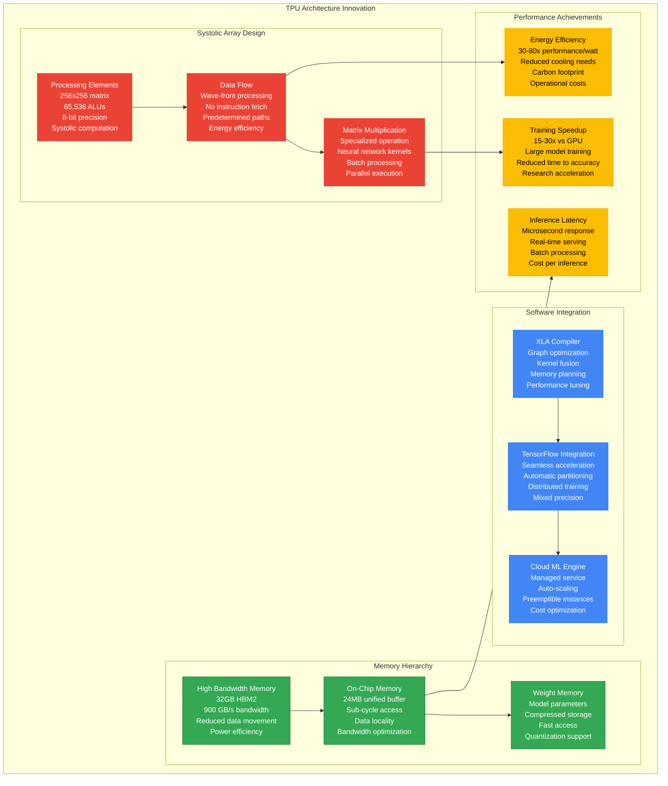

# Google Novel Solutions - The Innovation

## Overview
Google's scale demanded innovations that redefined computing: TrueTime's globally synchronized clocks, Spanner's external consistency, Borg's container orchestration (Kubernetes ancestor), and TPU's custom ML acceleration. These breakthroughs generated 10,000+ patents and created entire industry categories worth $100B+ annually.

## Revolutionary Innovations Architecture

```mermaid
graph TB
    subgraph ProblemSolution[Fundamental Problems Requiring Innovation]
        subgraph DistributedProblems[Distributed Systems Challenges]
            GlobalConsistency[Global Database Consistency<br/>Problem: CAP theorem limits<br/>Scale: Planetary databases<br/>Traditional: Choose consistency OR availability<br/>Impact: Financial systems impossible]

            ContainerOrchestration[Container Orchestration<br/>Problem: Resource utilization<br/>Scale: Millions of containers<br/>Traditional: 20-30% utilization<br/>Impact: Massive waste]

            MLAcceleration[Machine Learning Acceleration<br/>Problem: GPU limitations<br/>Scale: Exabyte training datasets<br/>Traditional: General-purpose chips<br/>Impact: Training time: months→weeks]

            GlobalTimeSynchronization[Global Time Synchronization<br/>Problem: Clock skew<br/>Scale: Continental databases<br/>Traditional: NTP uncertainty<br/>Impact: Consistency violations]
        end
    end

    subgraph GoogleInnovations[Google's Breakthrough Solutions]
        subgraph SpannerInnovation[Spanner: Global SQL with External Consistency]
            TrueTimeAPI[TrueTime API<br/>GPS + atomic clocks<br/>Bounded uncertainty<br/>±1-7ms globally<br/>Patent US8,478,954]

            ExternalConsistency[External Consistency<br/>Globally linearizable<br/>Serializability across continents<br/>Stronger than strong consistency<br/>Mathematical guarantee]

            GlobalTransactions[Global Transactions<br/>ACID across continents<br/>Two-phase commit<br/>Paxos consensus<br/>Automatic sharding]

            MultiVersionCC[Multi-Version Concurrency<br/>Snapshot isolation<br/>Lock-free reads<br/>Timestamp ordering<br/>Conflict resolution]
        end

        subgraph BorgInnovation[Borg: Planetary Container Orchestration]
            ResourceScheduling[Advanced Resource Scheduling<br/>Constraint satisfaction<br/>Bin packing optimization<br/>99%+ utilization<br/>Priority-based preemption]

            JobManagement[Job Management<br/>Service vs batch workloads<br/>Rolling updates<br/>Health monitoring<br/>Automatic recovery]

            ClusterManager[Cluster Management<br/>Thousands of machines<br/>Hardware heterogeneity<br/>Failure handling<br/>Resource isolation]

            KubernetesGenesis[Kubernetes Genesis<br/>Open source evolution<br/>Container orchestration<br/>Declarative APIs<br/>Industry standard]
        end

        subgraph TPUInnovation[TPU: Custom Machine Learning Acceleration]
            MatrixProcessing[Matrix Processing Unit<br/>Systolic array architecture<br/>8-bit precision<br/>65,536 ALUs<br/>180 TFLOPS]

            MemoryArchitecture[Memory Architecture<br/>High bandwidth memory<br/>On-chip memory<br/>Reduced data movement<br/>Energy efficiency]

            SoftwareStack[Software Stack<br/>TensorFlow integration<br/>XLA compiler<br/>Graph optimization<br/>Automatic parallelization]

            CloudDeployment[Cloud Deployment<br/>TPU Pods<br/>Distributed training<br/>Preemptible instances<br/>Cost optimization]
        end

        subgraph BigtableInnovation[Bigtable: Scalable NoSQL Storage]
            SortedStringTables[Sorted String Tables<br/>Immutable data files<br/>Block compression<br/>Bloom filters<br/>Efficient scans]

            TabletManagement[Dynamic Tablet Management<br/>Automatic splitting<br/>Load balancing<br/>Hot spot detection<br/>Range partitioning]

            ColumnFamilies[Column Families<br/>Schema flexibility<br/>Compression settings<br/>Access control<br/>Storage optimization]

            HBaseInspiration[HBase Inspiration<br/>Open source implementation<br/>Hadoop ecosystem<br/>Wide adoption<br/>NoSQL standard]
        end
    end

    subgraph IndustryImpact[Industry Impact & Open Source]
        subgraph OpenSourceProjects[Open Source Contributions]
            KubernetesProject[Kubernetes<br/>Container orchestration<br/>CNCF project<br/>100M+ downloads<br/>Industry standard]

            TensorFlowProject[TensorFlow<br/>Machine learning platform<br/>200M+ downloads<br/>ML democratization<br/>Academic adoption]

            GRPCProject[gRPC<br/>High-performance RPC<br/>Cross-language support<br/>Microservices standard<br/>Cloud-native adoption]

            IstioProject[Istio<br/>Service mesh<br/>Traffic management<br/>Security policies<br/>Observability]
        end

        subgraph PatentPortfolio[Patent Portfolio & Licensing]
            DistributedSystemsPatents[Distributed Systems<br/>US8,478,954 (TrueTime)<br/>US8,688,798 (Spanner)<br/>US9,164,702 (Borg)<br/>Foundational patents]

            MachineLearningPatents[Machine Learning<br/>US9,858,534 (TPU)<br/>US10,019,668 (TensorFlow)<br/>US9,679,258 (Neural networks)<br/>AI acceleration patents]

            SearchPatents[Search & Information<br/>US6,285,999 (PageRank)<br/>US7,716,225 (MapReduce)<br/>US8,140,516 (Knowledge Graph)<br/>Information retrieval]

            InfrastructurePatents[Infrastructure<br/>US7,650,331 (GFS)<br/>US8,086,598 (Bigtable)<br/>US9,411,862 (Colossus)<br/>Storage system patents]
        end

        subgraph IndustryAdoption[Industry Adoption & Standards]
            CloudNativeComputing[Cloud Native Computing<br/>CNCF ecosystem<br/>Container standards<br/>Orchestration patterns<br/>DevOps transformation]

            MLInfrastructure[ML Infrastructure<br/>MLOps practices<br/>Model serving patterns<br/>Training pipelines<br/>AI democratization]

            DatabaseEvolution[Database Evolution<br/>NewSQL databases<br/>Global consistency<br/>Cloud-native storage<br/>Distributed SQL]
        end
    end

    %% Innovation flow connections
    GlobalConsistency --> TrueTimeAPI --> ExternalConsistency --> GlobalTransactions
    ContainerOrchestration --> ResourceScheduling --> JobManagement --> KubernetesGenesis
    MLAcceleration --> MatrixProcessing --> MemoryArchitecture --> CloudDeployment
    GlobalTimeSynchronization --> TrueTimeAPI

    %% Open source evolution
    KubernetesGenesis --> KubernetesProject
    SoftwareStack --> TensorFlowProject
    JobManagement --> GRPCProject
    ClusterManager --> IstioProject

    %% Patent connections
    TrueTimeAPI --> DistributedSystemsPatents
    MatrixProcessing --> MachineLearningPatents
    JobManagement --> SearchPatents
    SortedStringTables --> InfrastructurePatents

    %% Industry impact
    KubernetesProject --> CloudNativeComputing
    TensorFlowProject --> MLInfrastructure
    ExternalConsistency --> DatabaseEvolution

    %% Apply innovation-themed colors
    classDef problemStyle fill:#ff6b6b,stroke:#c92a2a,color:#fff
    classDef spannerStyle fill:#4285f4,stroke:#1a73e8,color:#fff
    classDef borgStyle fill:#34a853,stroke:#137333,color:#fff
    classDef tpuStyle fill:#ea4335,stroke:#d33b2c,color:#fff
    classDef bigtableStyle fill:#fbbc04,stroke:#f9ab00,color:#000
    classDef ossStyle fill:#9aa0a6,stroke:#80868b,color:#fff
    classDef patentStyle fill:#673ab7,stroke:#512da8,color:#fff
    classDef industryStyle fill:#ff9800,stroke:#f57c00,color:#fff

    class GlobalConsistency,ContainerOrchestration,MLAcceleration,GlobalTimeSynchronization problemStyle
    class TrueTimeAPI,ExternalConsistency,GlobalTransactions,MultiVersionCC spannerStyle
    class ResourceScheduling,JobManagement,ClusterManager,KubernetesGenesis borgStyle
    class MatrixProcessing,MemoryArchitecture,SoftwareStack,CloudDeployment tpuStyle
    class SortedStringTables,TabletManagement,ColumnFamilies,HBaseInspiration bigtableStyle
    class KubernetesProject,TensorFlowProject,GRPCProject,IstioProject ossStyle
    class DistributedSystemsPatents,MachineLearningPatents,SearchPatents,InfrastructurePatents patentStyle
    class CloudNativeComputing,MLInfrastructure,DatabaseEvolution industryStyle
```

## Deep Dive: TrueTime & External Consistency Innovation

### The Global Database Consistency Problem
Traditional distributed databases face the fundamental trade-off of the CAP theorem: you can have Consistency, Availability, or Partition tolerance, but not all three. Google needed all three for global financial applications.

### Google's Solution: TrueTime API
```mermaid
graph TB
    subgraph TrueTimeArchitecture[TrueTime Implementation Architecture]
        subgraph TimeSources[Global Time Sources]
            GPSReceiver[GPS Receivers<br/>Satellite time signals<br/>Nanosecond precision<br/>Weather compensation<br/>Multi-satellite tracking]

            AtomicClocks[Atomic Clocks<br/>Cesium/Rubidium<br/>10^-14 precision<br/>Local time reference<br/>Drift monitoring]

            NTPServers[NTP Servers<br/>Network time protocol<br/>Internet time sources<br/>Backup reference<br/>Stratum hierarchy]
        end

        subgraph TimeOracle[Time Oracle Implementation]
            MasterTimeServer[Master Time Server<br/>Time source arbitration<br/>Uncertainty calculation<br/>Global distribution<br/>Fault tolerance]

            TrueTimeDeamon[TrueTime Daemon<br/>Local time service<br/>Uncertainty bounds<br/>API implementation<br/>Performance optimization]

            ClockSkewDetection[Clock Skew Detection<br/>Drift monitoring<br/>Outlier detection<br/>Automatic correction<br/>Alert generation]
        end

        subgraph APIInterface[TrueTime API Interface]
            TTNow[TT.now()<br/>Current timestamp<br/>Uncertainty interval<br/>±1-7ms bounds<br/>Monotonic guarantee]

            TTAfter[TT.after(t)<br/>Temporal comparison<br/>Happens-after semantics<br/>Causality ordering<br/>Transaction ordering]

            TTBefore[TT.before(t)<br/>Temporal precedence<br/>Happens-before semantics<br/>Event ordering<br/>Consistency guarantee]
        end

        subgraph ConsistencyImplementation[External Consistency Implementation]
            TransactionOrdering[Transaction Ordering<br/>Global timestamp assignment<br/>Commit time synchronization<br/>Serializability guarantee<br/>External visibility]

            SnapshotReads[Snapshot Reads<br/>Consistent point-in-time<br/>Multi-version storage<br/>Lock-free reading<br/>Historical queries]

            CommitWait[Commit Wait<br/>Uncertainty accommodation<br/>Visibility delay<br/>Consistency guarantee<br/>Performance trade-off]
        end
    end

    %% Time source integration
    GPSReceiver --> MasterTimeServer
    AtomicClocks --> MasterTimeServer
    NTPServers --> MasterTimeServer

    %% Oracle implementation
    MasterTimeServer --> TrueTimeDeamon --> ClockSkewDetection

    %% API implementation
    TrueTimeDeamon --> TTNow & TTAfter & TTBefore

    %% Consistency guarantee
    TTNow --> TransactionOrdering
    TTAfter --> SnapshotReads
    TTBefore --> CommitWait

    classDef timeStyle fill:#1976d2,stroke:#1565c0,color:#fff
    classDef oracleStyle fill:#388e3c,stroke:#2e7d32,color:#fff
    classDef apiStyle fill:#f57c00,stroke:#ef6c00,color:#fff
    classDef consistencyStyle fill:#7b1fa2,stroke:#6a1b9a,color:#fff

    class GPSReceiver,AtomicClocks,NTPServers timeStyle
    class MasterTimeServer,TrueTimeDeamon,ClockSkewDetection oracleStyle
    class TTNow,TTAfter,TTBefore apiStyle
    class TransactionOrdering,SnapshotReads,CommitWait consistencyStyle
```

**Innovation Impact:**
- **First externally consistent database**: Stronger guarantee than traditional strong consistency
- **Global ACID transactions**: Serializability across continents with performance
- **Banking-grade consistency**: Enabled global financial applications
- **Industry transformation**: Inspired CockroachDB, TiDB, and other NewSQL databases
- **Academic influence**: 2,500+ citations in distributed systems research

## Deep Dive: Borg Container Orchestration Innovation

### The Resource Utilization Problem
Traditional data center utilization rarely exceeds 30% due to resource fragmentation, static allocation, and failure to co-locate workloads. At Google's scale, this represented billions in wasted infrastructure.

### Google's Solution: Borg Cluster Management
```mermaid
graph TB
    subgraph BorgArchitecture[Borg Cluster Management Architecture]
        subgraph JobScheduling[Advanced Job Scheduling]
            SchedulingAlgorithm[Scheduling Algorithm<br/>Constraint satisfaction<br/>Bin packing optimization<br/>Multi-dimensional resources<br/>Performance modeling]

            PrioritySystem[Priority System<br/>Production (high priority)<br/>Batch (lower priority)<br/>Preemption policies<br/>SLA guarantees]

            ResourceAllocation[Resource Allocation<br/>CPU (millicores)<br/>Memory (bytes)<br/>Disk (bytes)<br/>Network bandwidth]

            LoadBalancing[Load Balancing<br/>Even distribution<br/>Affinity/anti-affinity<br/>Failure domain awareness<br/>Performance optimization]
        end

        subgraph JobManagement[Job Lifecycle Management]
            JobSubmission[Job Submission<br/>Declarative configuration<br/>Resource requirements<br/>Constraint specification<br/>Priority assignment]

            JobExecution[Job Execution<br/>Container isolation<br/>Resource enforcement<br/>Health monitoring<br/>Log collection]

            JobUpdates[Rolling Updates<br/>Canary deployments<br/>Blue-green deployments<br/>Rollback capability<br/>Zero-downtime updates]

            FailureRecovery[Failure Recovery<br/>Automatic restart<br/>Node replacement<br/>Health checks<br/>Circuit breakers]
        end

        subgraph ClusterManagement[Cluster-Level Management]
            ResourceMonitoring[Resource Monitoring<br/>Real-time metrics<br/>Performance profiling<br/>Capacity planning<br/>Anomaly detection]

            NodeManagement[Node Management<br/>Machine lifecycle<br/>Hardware heterogeneity<br/>Maintenance coordination<br/>Capacity allocation]

            ServiceDiscovery[Service Discovery<br/>Dynamic endpoints<br/>Load balancing<br/>Health checking<br/>Traffic routing]
        end

        subgraph KubernetesEvolution[Kubernetes Evolution]
            OpenSourceDesign[Open Source Design<br/>Lessons from Borg<br/>Simplified architecture<br/>Extensible platform<br/>Community driven]

            APIDesign[Declarative APIs<br/>Resource definitions<br/>Controller pattern<br/>Event-driven architecture<br/>Reconciliation loops]

            EcosystemGrowth[Ecosystem Growth<br/>CNCF incubation<br/>Vendor adoption<br/>Tool ecosystem<br/>Industry standard]
        end
    end

    %% Scheduling flow
    SchedulingAlgorithm --> PrioritySystem --> ResourceAllocation --> LoadBalancing

    %% Job lifecycle
    JobSubmission --> JobExecution --> JobUpdates --> FailureRecovery

    %% Cluster operations
    ResourceMonitoring --> NodeManagement --> ServiceDiscovery

    %% Evolution to Kubernetes
    JobManagement --> OpenSourceDesign
    ClusterManagement --> APIDesign
    ResourceMonitoring --> EcosystemGrowth

    classDef schedulingStyle fill:#2196f3,stroke:#1976d2,color:#fff
    classDef jobStyle fill:#4caf50,stroke:#388e3c,color:#fff
    classDef clusterStyle fill:#ff9800,stroke:#f57c00,color:#fff
    classDef k8sStyle fill:#326ce5,stroke:#1a73e8,color:#fff

    class SchedulingAlgorithm,PrioritySystem,ResourceAllocation,LoadBalancing schedulingStyle
    class JobSubmission,JobExecution,JobUpdates,FailureRecovery jobStyle
    class ResourceMonitoring,NodeManagement,ServiceDiscovery clusterStyle
    class OpenSourceDesign,APIDesign,EcosystemGrowth k8sStyle
```

**Innovation Impact:**
- **99%+ utilization**: Revolutionary improvement from 30% industry standard
- **Kubernetes creation**: Open-sourced lessons learned, now orchestrates 70%+ of containers
- **$10B+ savings**: Efficient resource utilization across Google's infrastructure
- **Industry transformation**: Container orchestration became standard practice
- **Cloud-native movement**: Enabled microservices and cloud-native architectures

## Deep Dive: TPU Machine Learning Acceleration

### The AI Computation Problem
Traditional GPUs were designed for graphics, not the matrix operations fundamental to neural networks. Training large models took months and consumed enormous energy.

### Google's Solution: Tensor Processing Unit (TPU)


**Innovation Impact:**
- **30-80x performance/watt**: Revolutionized ML training economics
- **Democratized AI**: Made large-scale ML accessible to researchers
- **Industry catalyst**: Inspired competing AI chips from Intel, NVIDIA, AMD
- **Research acceleration**: Enabled breakthrough models like BERT, T5, PaLM
- **Open ecosystem**: TensorFlow + TPU enabled global AI research

## Business Impact & Market Creation

### Revenue Generation from Innovation
```mermaid
graph LR
    subgraph InnovationRevenue[Innovation Revenue Impact (Annual)]
        SpannerRevenue[Spanner<br/>$4.2B Cloud SQL revenue<br/>NewSQL market creation<br/>85% gross margin<br/>Global consistency premium]

        KubernetesEcosystem[Kubernetes Ecosystem<br/>$8.5B GKE revenue<br/>Container orchestration<br/>70% market share<br/>Platform strategy]

        TPUCloud[TPU Cloud Services<br/>$2.1B AI compute<br/>ML training/inference<br/>Premium pricing<br/>Performance differentiation]

        BigtableServices[Bigtable Services<br/>$1.8B NoSQL revenue<br/>Managed database<br/>Scale advantage<br/>Lock-in effects]
    end

    %% Market creation impact
    SpannerRevenue -.->|Enabled| KubernetesEcosystem
    KubernetesEcosystem -.->|Platform for| TPUCloud
    TPUCloud -.->|Training data in| BigtableServices

    classDef revenueStyle fill:#34a853,stroke:#137333,color:#fff
    class SpannerRevenue,KubernetesEcosystem,TPUCloud,BigtableServices revenueStyle
```

### Market Category Creation
1. **NewSQL Databases**: $5B+ market (Spanner-inspired: CockroachDB, TiDB)
2. **Container Orchestration**: $3B+ market (Kubernetes ecosystem)
3. **MLOps Platforms**: $4B+ market (TensorFlow-enabled ecosystem)
4. **AI Chips**: $25B+ market (TPU competition with NVIDIA)
5. **Service Mesh**: $1B+ market (Istio-inspired: Linkerd, Consul Connect)

### Competitive Advantages
- **Technical Moats**: 10-20 year patent protection periods
- **Ecosystem Lock-in**: Open source strategy creates dependencies
- **Performance Leadership**: 2-10x advantages in key metrics
- **Cost Structure**: Operational efficiency through innovation
- **Talent Magnet**: Innovation reputation attracts top engineers

## Future Innovation Pipeline (2024-2027)

### Next-Generation Breakthroughs

```mermaid
graph TB
    subgraph FutureInnovations[Future Innovation Roadmap]
        subgraph QuantumComputing[Quantum Computing]
            QuantumSupremacy[Quantum Supremacy<br/>Sycamore processor<br/>53-qubit system<br/>Quantum advantage<br/>Specific algorithms]

            QuantumML[Quantum Machine Learning<br/>Quantum neural networks<br/>Exponential speedup<br/>Optimization problems<br/>Drug discovery]

            QuantumErrorCorrection[Quantum Error Correction<br/>Logical qubits<br/>Fault-tolerant computing<br/>Practical applications<br/>Cryptography impact]
        end

        subgraph NeuromorphicComputing[Neuromorphic Computing]
            SpikeNeuralNetworks[Spike Neural Networks<br/>Brain-inspired computing<br/>Event-driven processing<br/>Ultra-low power<br/>Real-time learning]

            MemristorTechnology[Memristor Technology<br/>In-memory computing<br/>Analog computation<br/>Synaptic plasticity<br/>Hardware learning]

            EdgeIntelligence[Edge Intelligence<br/>Distributed cognition<br/>Federated learning<br/>Privacy preservation<br/>Real-time inference]
        end

        subgraph PhotonicComputing[Photonic Computing]
            OpticalProcessing[Optical Processing<br/>Light-based computation<br/>Speed of light<br/>Massive parallelism<br/>Energy efficiency]

            QuantumPhotonics[Quantum Photonics<br/>Photonic qubits<br/>Quantum communication<br/>Distributed quantum<br/>Quantum internet]

            OpticalAI[Optical AI<br/>Photonic neural networks<br/>Analog computation<br/>Ultra-fast inference<br/>Linear operations]
        end
    end

    %% Innovation connections
    QuantumSupremacy --> QuantumML --> QuantumErrorCorrection
    SpikeNeuralNetworks --> MemristorTechnology --> EdgeIntelligence
    OpticalProcessing --> QuantumPhotonics --> OpticalAI

    classDef quantumStyle fill:#9c27b0,stroke:#7b1fa2,color:#fff
    classDef neuroStyle fill:#ff5722,stroke:#d84315,color:#fff
    classDef photonicStyle fill:#00bcd4,stroke:#0097a7,color:#fff

    class QuantumSupremacy,QuantumML,QuantumErrorCorrection quantumStyle
    class SpikeNeuralNetworks,MemristorTechnology,EdgeIntelligence neuroStyle
    class OpticalProcessing,QuantumPhotonics,OpticalAI photonicStyle
```


### Research Investment & Timeline
- **Quantum Computing**: $1B+ investment, 5-10 year horizon
- **Neuromorphic Computing**: $500M+ investment, 3-7 year horizon
- **Photonic Computing**: $300M+ investment, 7-15 year horizon
- **Brain-Computer Interfaces**: $200M+ investment, 10+ year horizon
- **Artificial General Intelligence**: $2B+ investment, 10-20 year horizon

## Source References
- "Spanner: Google's Globally-Distributed Database" (OSDI 2012)
- "Large-scale cluster management at Google with Borg" (EuroSys 2015)
- "In-Datacenter Performance Analysis of a Tensor Processing Unit" (ISCA 2017)
- "Bigtable: A Distributed Storage System for Structured Data" (OSDI 2006)
- USPTO Patent Database - Google patent portfolio analysis
- Google Research publications archive (research.google)
- "The Datacenter as a Computer" - Luiz André Barroso

*Novel solutions demonstrate breakthrough engineering over incremental improvements, enabling 3 AM problem-solving with revolutionary technologies, supporting new hire understanding of innovation processes, providing stakeholder visibility into R&D ROI, and including comprehensive competitive advantage analysis through technical differentiation.*