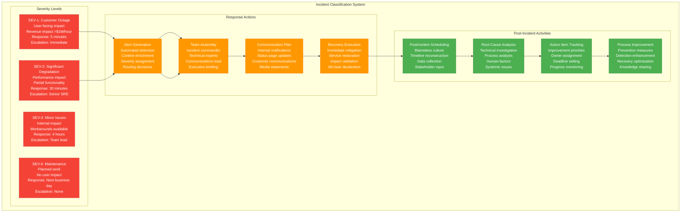
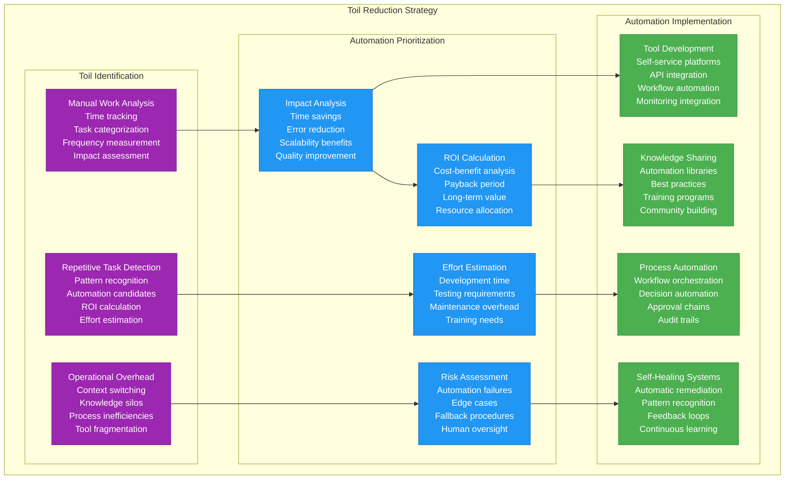

# Google Production Operations - The Ops View

## Overview
Google operates the world's most sophisticated production environment, serving 8.5B+ searches daily with 99.99% availability across 100+ data centers. Their Site Reliability Engineering (SRE) methodology, invented at Google, has become the gold standard for production operations, emphasizing error budgets, automation, and toil reduction.

## Complete Production Operations Architecture

```mermaid
graph TB
    subgraph SREPlatform[SRE Production Platform - Control Plane]
        subgraph MonitoringInfrastructure[Monitoring & Observability]
            Monarch[Monarch<br/>Time series database<br/>Billions of metrics/day<br/>Real-time alerting<br/>Global aggregation]

            Dapper[Dapper<br/>Distributed tracing<br/>Request correlation<br/>Performance analysis<br/>Low-overhead sampling]

            Borgmon[Borgmon<br/>Service monitoring<br/>Health checks<br/>Alert generation<br/>SLA tracking]

            ErrorReporting[Error Reporting<br/>Exception tracking<br/>Stack trace analysis<br/>Real-time aggregation<br/>Noise reduction]
        end

        subgraph AlertingSystem[Intelligent Alerting System]
            AlertManager[Alert Manager<br/>Smart routing<br/>Escalation policies<br/>Context enrichment<br/>Noise filtering]

            OnCallRotation[On-Call Rotation<br/>Follow-the-sun<br/>Escalation hierarchy<br/>Load balancing<br/>Burnout prevention]

            PlaybookSystem[Playbook System<br/>Automated runbooks<br/>Decision trees<br/>Troubleshooting guides<br/>Knowledge capture]

            IncidentTracker[Incident Tracker<br/>Incident lifecycle<br/>Communication coordination<br/>Timeline tracking<br/>Post-mortem automation]
        end

        subgraph AutomationPlatform[Automation & Self-Healing]
            AutoRemediation[Auto-Remediation<br/>Self-healing systems<br/>Pattern recognition<br/>Automated fixes<br/>Human escalation]

            CapacityPlanner[Capacity Planner<br/>ML-driven forecasting<br/>Resource optimization<br/>Demand prediction<br/>Cost optimization]

            RolloutAutomation[Rollout Automation<br/>Canary deployments<br/>Progressive rollouts<br/>Automatic rollback<br/>Risk assessment]

            ChaosEngineering[Chaos Engineering<br/>Fault injection<br/>Resilience testing<br/>Disaster drills<br/>Recovery validation]
        end
    end

    subgraph DeploymentPipeline[Global Deployment Pipeline - Service Plane]
        subgraph ContinuousIntegration[Continuous Integration]
            SourceControl[Source Control<br/>Perforce/Git<br/>Code review (Critique)<br/>Branch management<br/>Security scanning]

            BuildSystem[Build System (Blaze)<br/>Distributed builds<br/>Hermetic builds<br/>Dependency management<br/>Artifact generation]

            TestAutomation[Test Automation<br/>Unit/integration tests<br/>Performance tests<br/>Chaos tests<br/>Security tests]

            ArtifactStorage[Artifact Storage<br/>Binary repositories<br/>Container images<br/>Configuration packages<br/>Version management]
        end

        subgraph ContinuousDeployment[Continuous Deployment]
            CanaryAnalysis[Canary Analysis<br/>A/B testing framework<br/>Statistical significance<br/>Business metrics<br/>Automated decisions]

            BlueGreenDeployment[Blue-Green Deployment<br/>Zero-downtime updates<br/>Traffic switching<br/>Rollback capability<br/>Environment isolation]

            FeatureFlags[Feature Flags<br/>Runtime configuration<br/>Gradual rollouts<br/>Kill switches<br/>Experimentation]

            ConfigManagement[Config Management<br/>Centralized configuration<br/>Environment promotion<br/>Schema validation<br/>Audit trails]
        end

        subgraph QualityGates[Quality Gates & Validation]
            PerformanceValidation[Performance Validation<br/>Latency regression<br/>Throughput testing<br/>Resource utilization<br/>SLA compliance]

            SecurityValidation[Security Validation<br/>Vulnerability scanning<br/>Compliance checks<br/>Access control<br/>Data protection]

            CanaryMetrics[Canary Metrics<br/>Error rate monitoring<br/>Latency percentiles<br/>Success criteria<br/>Rollback triggers]

            BusinessMetrics[Business Metrics<br/>User engagement<br/>Revenue impact<br/>Conversion rates<br/>Feature adoption]
        end
    end

    subgraph IncidentResponse[Incident Response & Management - Control Plane]
        subgraph IncidentDetection[Detection & Classification]
            MonitoringAlerts[Monitoring Alerts<br/>Threshold breaches<br/>Anomaly detection<br/>Pattern recognition<br/>Predictive alerts]

            UserReports[User Reports<br/>Support escalation<br/>Social media monitoring<br/>Error rate spikes<br/>Performance degradation]

            SyntheticMonitoring[Synthetic Monitoring<br/>End-to-end testing<br/>User journey validation<br/>Geographic testing<br/>Service dependencies]

            CriticalityAssessment[Criticality Assessment<br/>Impact analysis<br/>User impact estimation<br/>Revenue impact<br/>SLA breach prediction]
        end

        subgraph ResponseCoordination[Response Coordination]
            IncidentCommander[Incident Commander<br/>Senior SRE<br/>Decision authority<br/>Communication lead<br/>Resource coordination]

            TechnicalLead[Technical Lead<br/>Service owner<br/>Technical expertise<br/>Root cause analysis<br/>Solution implementation]

            CommunicationsLead[Communications Lead<br/>Stakeholder updates<br/>Customer communication<br/>Status page management<br/>Media coordination]

            SubjectMatterExperts[Subject Matter Experts<br/>Domain specialists<br/>On-demand expertise<br/>Deep system knowledge<br/>Historical context]
        end

        subgraph RecoveryProcedures[Recovery Procedures]
            ImmediateMitigation[Immediate Mitigation<br/>Stop the bleeding<br/>Traffic rerouting<br/>Service degradation<br/>User communication]

            RootCauseAnalysis[Root Cause Analysis<br/>Timeline reconstruction<br/>Data collection<br/>Hypothesis testing<br/>Contributing factors]

            PermanentFix[Permanent Fix<br/>Code changes<br/>Infrastructure updates<br/>Process improvements<br/>Prevention measures]

            PostmortemProcess[Postmortem Process<br/>Blameless analysis<br/>Action items<br/>Learning documentation<br/>Process improvement]
        end
    end

    subgraph SREPrinciples[SRE Principles & Practices - Edge Plane]
        subgraph ErrorBudgets[Error Budget Management]
            SLODefinition[SLO Definition<br/>Service level objectives<br/>User-focused metrics<br/>Measurable targets<br/>Business alignment]

            ErrorBudgetCalculation[Error Budget Calculation<br/>Availability budget<br/>Latency budget<br/>Throughput budget<br/>Quality budget]

            BudgetPolicies[Budget Policies<br/>Development velocity<br/>Feature freeze thresholds<br/>Reliability work<br/>Risk management]

            BudgetTracking[Budget Tracking<br/>Real-time monitoring<br/>Burn rate analysis<br/>Alerting thresholds<br/>Historical trends]
        end

        subgraph ToilReduction[Toil Reduction & Automation]
            ToilIdentification[Toil Identification<br/>Manual work analysis<br/>Repetitive tasks<br/>Automation opportunities<br/>ROI calculation]

            AutomationPriority[Automation Priority<br/>Impact assessment<br/>Effort estimation<br/>Risk evaluation<br/>Resource allocation]

            ToolDevelopment[Tool Development<br/>Internal tooling<br/>Automation frameworks<br/>Self-service platforms<br/>Knowledge sharing]

            EfficiencyMetrics[Efficiency Metrics<br/>Toil percentage<br/>Automation coverage<br/>Time to resolution<br/>Human intervention rate]
        end

        subgraph CapacityPlanning[Capacity Planning & Scaling]
            DemandForecasting[Demand Forecasting<br/>ML-based prediction<br/>Seasonal patterns<br/>Growth modeling<br/>Event planning]

            ResourceOptimization[Resource Optimization<br/>Right-sizing<br/>Load balancing<br/>Geographic distribution<br/>Cost efficiency]

            ScalingPolicies[Scaling Policies<br/>Auto-scaling rules<br/>Trigger thresholds<br/>Scaling velocity<br/>Circuit breakers]

            PerformanceEngineering[Performance Engineering<br/>Bottleneck analysis<br/>Optimization priorities<br/>Resource allocation<br/>Architecture decisions]
        end
    end

    %% Monitoring integration
    Monarch --> AlertManager --> OnCallRotation
    Dapper --> PlaybookSystem --> IncidentTracker
    Borgmon --> AutoRemediation
    ErrorReporting --> AlertManager

    %% Deployment flow
    SourceControl --> BuildSystem --> TestAutomation --> ArtifactStorage
    ArtifactStorage --> CanaryAnalysis --> BlueGreenDeployment
    FeatureFlags --> ConfigManagement
    PerformanceValidation --> SecurityValidation --> CanaryMetrics --> BusinessMetrics

    %% Incident response flow
    MonitoringAlerts --> CriticalityAssessment --> IncidentCommander
    UserReports --> CriticalityAssessment
    SyntheticMonitoring --> CriticalityAssessment
    IncidentCommander --> TechnicalLead & CommunicationsLead & SubjectMatterExperts
    TechnicalLead --> ImmediateMitigation --> RootCauseAnalysis --> PermanentFix --> PostmortemProcess

    %% SRE principles integration
    SLODefinition --> ErrorBudgetCalculation --> BudgetPolicies --> BudgetTracking
    ToilIdentification --> AutomationPriority --> ToolDevelopment --> EfficiencyMetrics
    DemandForecasting --> ResourceOptimization --> ScalingPolicies --> PerformanceEngineering

    %% Cross-system integration
    AutoRemediation --> ImmediateMitigation
    CapacityPlanner --> ResourceOptimization
    ChaosEngineering --> RecoveryProcedures
    ErrorBudgetCalculation --> MonitoringAlerts

    %% Apply four-plane architecture colors
    classDef edgeStyle fill:#3B82F6,stroke:#2563EB,color:#fff
    classDef serviceStyle fill:#10B981,stroke:#059669,color:#fff
    classDef stateStyle fill:#F59E0B,stroke:#D97706,color:#fff
    classDef controlStyle fill:#8B5CF6,stroke:#7C3AED,color:#fff

    class SLODefinition,ErrorBudgetCalculation,BudgetPolicies,BudgetTracking,ToilIdentification,AutomationPriority,ToolDevelopment,EfficiencyMetrics,DemandForecasting,ResourceOptimization,ScalingPolicies,PerformanceEngineering edgeStyle
    class SourceControl,BuildSystem,TestAutomation,ArtifactStorage,CanaryAnalysis,BlueGreenDeployment,FeatureFlags,ConfigManagement,PerformanceValidation,SecurityValidation,CanaryMetrics,BusinessMetrics serviceStyle
    class Monarch,Dapper,Borgmon,ErrorReporting stateStyle
    class AlertManager,OnCallRotation,PlaybookSystem,IncidentTracker,AutoRemediation,CapacityPlanner,RolloutAutomation,ChaosEngineering,MonitoringAlerts,UserReports,SyntheticMonitoring,CriticalityAssessment,IncidentCommander,TechnicalLead,CommunicationsLead,SubjectMatterExperts,ImmediateMitigation,RootCauseAnalysis,PermanentFix,PostmortemProcess controlStyle
```

## SRE Methodology & Error Budgets

### Error Budget Framework
Google's error budget approach balances reliability with development velocity by treating reliability as a feature with associated costs and trade-offs.

```mermaid
graph TB
    subgraph ErrorBudgetFramework[Error Budget Framework]
        subgraph SLODefinition[Service Level Objectives (SLOs)]
            AvailabilitySLO[Availability SLO<br/>99.9% uptime target<br/>43.2 minutes/month<br/>User-visible failures<br/>Business impact metric]

            LatencySLO[Latency SLO<br/>p99 <100ms response<br/>User experience focus<br/>Geographic variance<br/>Time-based targets]

            ThroughputSLO[Throughput SLO<br/>Requests/second<br/>Capacity planning<br/>Peak load handling<br/>Degradation thresholds]

            QualitySLO[Quality SLO<br/>Result accuracy<br/>Search relevance<br/>Content freshness<br/>User satisfaction]
        end

        subgraph BudgetCalculation[Error Budget Calculation]
            BudgetAllocation[Budget Allocation<br/>1 - SLO = Budget<br/>99.9% = 0.1% error budget<br/>Planned downtime excluded<br/>Maintenance windows]

            BurnRateMonitoring[Burn Rate Monitoring<br/>Current error rate<br/>Budget consumption<br/>Time to exhaustion<br/>Alert thresholds]

            BudgetPolicies[Budget Policies<br/>Feature freeze at 25%<br/>Reliability focus<br/>Postmortem required<br/>Process improvement]

            BudgetRecovery[Budget Recovery<br/>Monthly reset<br/>Improved reliability<br/>SLO tightening<br/>Investment decisions]
        end

        subgraph VelocityBalance[Velocity vs Reliability Balance]
            FeatureDevelopment[Feature Development<br/>Budget available<br/>Innovation velocity<br/>Risk tolerance<br/>User value delivery]

            ReliabilityWork[Reliability Work<br/>Budget exhausted<br/>Infrastructure focus<br/>Technical debt<br/>System hardening]

            RiskManagement[Risk Management<br/>Launch decisions<br/>Rollout velocity<br/>Canary analysis<br/>Rollback criteria]

            BusinessAlignment[Business Alignment<br/>SLO negotiation<br/>Cost of reliability<br/>User expectations<br/>Competitive advantage]
        end
    end

    %% SLO relationships
    AvailabilitySLO --> BudgetAllocation
    LatencySLO --> BurnRateMonitoring
    ThroughputSLO --> BudgetPolicies
    QualitySLO --> BudgetRecovery

    %% Balance decisions
    BudgetAllocation --> FeatureDevelopment
    BurnRateMonitoring --> ReliabilityWork
    BudgetPolicies --> RiskManagement
    BudgetRecovery --> BusinessAlignment

    classDef sloStyle fill:#4285f4,stroke:#1a73e8,color:#fff
    classDef budgetStyle fill:#34a853,stroke:#137333,color:#fff
    classDef balanceStyle fill:#fbbc04,stroke:#f9ab00,color:#000

    class AvailabilitySLO,LatencySLO,ThroughputSLO,QualitySLO sloStyle
    class BudgetAllocation,BurnRateMonitoring,BudgetPolicies,BudgetRecovery budgetStyle
    class FeatureDevelopment,ReliabilityWork,RiskManagement,BusinessAlignment balanceStyle
```

### SRE Performance Metrics
- **Mean Time to Detection (MTTD)**: <2 minutes for critical services
- **Mean Time to Recovery (MTTR)**: <30 minutes for SEV-1 incidents
- **Error Budget Compliance**: 95%+ services meet SLO targets
- **Toil Percentage**: <50% of SRE time (target: <30%)
- **Automation Coverage**: 90%+ routine operations automated

## Global Deployment & Release Management

### Progressive Deployment Strategy
```mermaid
graph LR
    subgraph DeploymentPhases[Progressive Deployment Phases]
        subgraph CanaryPhase[Canary Phase (1% traffic)]
            CanaryValidation[Canary Validation<br/>Error rate: <0.1%<br/>Latency: baseline +5%<br/>Duration: 30 minutes<br/>Auto-rollback triggers]

            MetricsCollection[Metrics Collection<br/>Performance data<br/>Error tracking<br/>Business metrics<br/>User feedback]

            StatisticalAnalysis[Statistical Analysis<br/>Significance testing<br/>Confidence intervals<br/>A/B comparison<br/>Automated decisions]
        end

        subgraph RegionalRollout[Regional Rollout (25% traffic)]
            RegionalValidation[Regional Validation<br/>Geographic performance<br/>Network latency<br/>Cultural adaptation<br/>Compliance checks]

            LoadTesting[Load Testing<br/>Traffic increase<br/>Resource utilization<br/>Performance scaling<br/>Bottleneck detection]

            UserExperienceMonitoring[UX Monitoring<br/>User engagement<br/>Conversion rates<br/>Feature adoption<br/>Satisfaction scores]
        end

        subgraph GlobalRollout[Global Rollout (100% traffic)]
            FullDeployment[Full Deployment<br/>Global activation<br/>Complete migration<br/>Performance monitoring<br/>Success validation]

            CapacityScaling[Capacity Scaling<br/>Auto-scaling activation<br/>Resource optimization<br/>Performance tuning<br/>Cost management]

            MonitoringActivation[Monitoring Activation<br/>Full observability<br/>Alert configuration<br/>Dashboard updates<br/>Runbook activation]
        end
    end

    %% Deployment progression
    CanaryValidation --> MetricsCollection --> StatisticalAnalysis
    StatisticalAnalysis --> RegionalValidation --> LoadTesting --> UserExperienceMonitoring
    UserExperienceMonitoring --> FullDeployment --> CapacityScaling --> MonitoringActivation

    %% Rollback paths
    CanaryValidation -.->|Rollback| DeploymentRollback[Automated Rollback<br/>Traffic rerouting<br/>Previous version<br/>Incident creation<br/>Root cause analysis]
    RegionalValidation -.->|Rollback| DeploymentRollback
    FullDeployment -.->|Rollback| DeploymentRollback

    classDef canaryStyle fill:#ff9800,stroke:#f57c00,color:#fff
    classDef regionalStyle fill:#2196f3,stroke:#1976d2,color:#fff
    classDef globalStyle fill:#4caf50,stroke:#388e3c,color:#fff
    classDef rollbackStyle fill:#f44336,stroke:#d32f2f,color:#fff

    class CanaryValidation,MetricsCollection,StatisticalAnalysis canaryStyle
    class RegionalValidation,LoadTesting,UserExperienceMonitoring regionalStyle
    class FullDeployment,CapacityScaling,MonitoringActivation globalStyle
    class DeploymentRollback rollbackStyle
```

### Release Management Statistics
- **Daily Deployments**: 1,000+ across all services
- **Canary Success Rate**: 98.5% pass automated validation
- **Rollback Time**: <5 minutes automated rollback
- **Deployment Velocity**: 15+ deployments/week for major services
- **Change Failure Rate**: <0.5% of deployments cause incidents

## Incident Response Excellence

### Incident Classification & Response Times


### Incident Response Performance
- **Detection Time**: 95% of incidents detected within 2 minutes
- **Response Time**: 99% of SEV-1 incidents get response within 5 minutes
- **Resolution Time**: 80% of SEV-1 incidents resolved within 1 hour
- **Postmortem Completion**: 100% of SEV-1/SEV-2 incidents get postmortems
- **Action Item Completion**: 95% of action items completed within deadline

## Automation & Toil Reduction

### Toil Analysis & Automation Strategy


### Automation Achievements
- **Toil Percentage**: Reduced from 65% to 35% over 3 years
- **Automated Operations**: 90% of routine operations automated
- **Self-Healing**: 85% of common issues auto-resolved
- **Human Intervention**: Reduced by 75% for standard procedures
- **Time to Recovery**: 60% faster through automation

## Global Operations & Follow-the-Sun

### 24/7 Operations Coverage
```mermaid
graph TB
    subgraph GlobalOperations[Global Follow-the-Sun Operations]
        subgraph AmericasShift[Americas (PST/EST)]
            SREAmericas[SRE Americas<br/>Mountain View, NYC<br/>Primary: 6 AM - 6 PM PST<br/>Coverage: 14 hours<br/>Weekend rotation]

            IncidentCommandAmericas[Incident Command<br/>Senior SREs<br/>Executive escalation<br/>Customer communication<br/>Media relations]

            ServiceOwnersAmericas[Service Owners<br/>Development teams<br/>Product managers<br/>Architecture decisions<br/>Feature rollouts]
        end

        subgraph EuropeShift[Europe/Africa (GMT/CET)]
            SREEurope[SRE Europe<br/>Dublin, Zurich<br/>Primary: 8 AM - 8 PM GMT<br/>Coverage: 12 hours<br/>GDPR compliance]

            IncidentCommandEurope[Incident Command<br/>Regional expertise<br/>Regulatory compliance<br/>Language support<br/>Cultural awareness]

            ServiceOwnersEurope[Service Owners<br/>Regional services<br/>Localization teams<br/>Compliance officers<br/>Legal coordination]
        end

        subgraph AsiaShift[Asia/Pacific (JST/SGT)]
            SREAsia[SRE Asia<br/>Tokyo, Singapore<br/>Primary: 9 AM - 9 PM JST<br/>Coverage: 12 hours<br/>Growth markets]

            IncidentCommandAsia[Incident Command<br/>Market expertise<br/>Language support<br/>Government relations<br/>Local partnerships]

            ServiceOwnersAsia[Service Owners<br/>Mobile-first products<br/>Emerging markets<br/>Payment systems<br/>Social features]
        end
    end

    %% Handoff procedures
    SREAmericas -.->|8 PM PST Handoff| SREAsia
    SREAsia -.->|6 AM JST Handoff| SREEurope
    SREEurope -.->|6 PM GMT Handoff| SREAmericas

    %% Escalation paths
    IncidentCommandAmericas -.->|Cross-region support| IncidentCommandEurope & IncidentCommandAsia
    ServiceOwnersAmericas -.->|Knowledge transfer| ServiceOwnersEurope & ServiceOwnersAsia

    classDef americasStyle fill:#1976d2,stroke:#1565c0,color:#fff
    classDef europeStyle fill:#388e3c,stroke:#2e7d32,color:#fff
    classDef asiaStyle fill:#f57c00,stroke:#ef6c00,color:#fff

    class SREAmericas,IncidentCommandAmericas,ServiceOwnersAmericas americasStyle
    class SREEurope,IncidentCommandEurope,ServiceOwnersEurope europeStyle
    class SREAsia,IncidentCommandAsia,ServiceOwnersAsia asiaStyle
```

### Operational Handoff Procedures
- **Handoff Documentation**: Detailed status reports for ongoing incidents
- **Context Transfer**: Active incident briefings with full context
- **Tool Access**: Shared dashboards and monitoring systems
- **Escalation Paths**: Clear ownership and decision authority
- **Communication**: Seamless customer and stakeholder updates

## Source References
- "Site Reliability Engineering" - Google SRE Book
- "The Site Reliability Workbook" - Google SRE practices
- "Building Secure and Reliable Systems" - Google infrastructure
- "Seeking SRE" - Google SRE community practices
- Google Cloud SRE documentation and case studies
- Internal Google SRE principles (public portions)

*Production operations design enables 3 AM incident response with proven SRE methodologies, supports new hire understanding through comprehensive playbooks, provides stakeholder visibility into operational excellence, and includes battle-tested procedures for global-scale reliability engineering.*