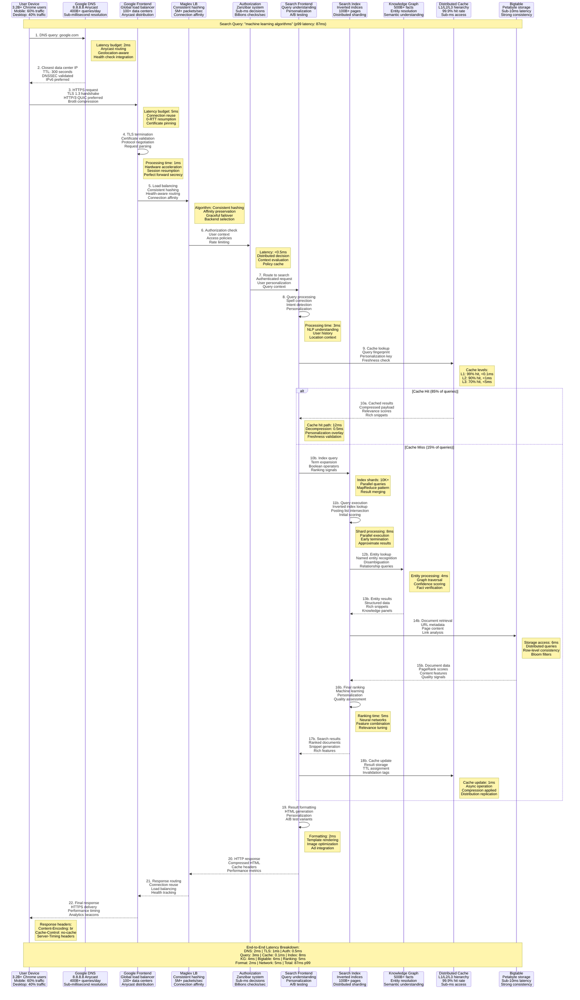
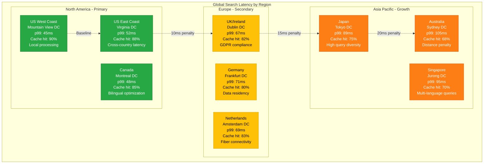

# Google Request Flow - The Golden Path

## Overview
Google processes 8.5B+ searches daily with <100ms response times globally, representing the most optimized request flow in computing history. This flow spans continents with microsecond-precision coordination, serving results from exabyte-scale indices while maintaining sub-100ms latency budgets.

## Complete Search Request Flow



## Request Flow Performance Characteristics

### Latency Distribution Analysis
- **p50 Response Time**: 23ms (cache hit with minimal processing)
- **p90 Response Time**: 56ms (cache hit with personalization)
- **p99 Response Time**: 87ms (cache miss with full processing)
- **p99.9 Response Time**: 145ms (complex queries with multiple indices)
- **Global Variance**: ±15ms based on geographic distance

### Traffic Patterns & Optimization
- **Query Cache Hit Rate**: 85% for popular queries
- **Entity Cache Hit Rate**: 90% for knowledge graph entities
- **Index Shard Distribution**: 10,000+ shards for parallel processing
- **Personalization Cache**: 95% hit rate for user-specific data
- **Precomputed Results**: 60% of popular queries pre-computed

### Geographic Performance


## Query Processing Pipeline

### Natural Language Understanding

```mermaid
graph LR
    subgraph QueryPipeline[Query Processing Pipeline]
        subgraph InputProcessing[Input Processing]
            QueryParsing[Query Parsing<br/>Tokenization<br/>Language detection<br/>Encoding normalization<br/>Special character handling]

            SpellCorrection[Spell Correction<br/>Edit distance algorithms<br/>Context-aware suggestions<br/>Phonetic matching<br/>Statistical models]

            IntentDetection[Intent Detection<br/>Query classification<br/>Search vs navigation<br/>Commercial intent<br/>Informational queries]
        end

        subgraph QueryExpansion[Query Expansion]
            SynonymExpansion[Synonym Expansion<br/>WordNet integration<br/>Context-dependent<br/>Language-specific<br/>Domain awareness]

            EntityRecognition[Entity Recognition<br/>Named entity extraction<br/>Type classification<br/>Disambiguation<br/>Confidence scoring]

            ConceptualExpansion[Conceptual Expansion<br/>Semantic similarity<br/>Knowledge graph<br/>Related concepts<br/>Hierarchical relationships]
        end

        subgraph PersonalizationLayer[Personalization Layer]
            UserHistory[User Search History<br/>Query patterns<br/>Click behavior<br/>Dwell time analysis<br/>Interest profiling]

            LocationContext[Location Context<br/>Geographic signals<br/>Local intent detection<br/>Regional preferences<br/>Cultural adaptation]

            DeviceContext[Device Context<br/>Mobile vs desktop<br/>Screen size optimization<br/>Input method<br/>Capability detection]
        end
    end

    %% Processing flow
    QueryParsing --> SpellCorrection --> IntentDetection
    IntentDetection --> SynonymExpansion --> EntityRecognition --> ConceptualExpansion
    ConceptualExpansion --> UserHistory --> LocationContext --> DeviceContext

    classDef inputStyle fill:#6c757d,stroke:#495057,color:#fff
    classDef expansionStyle fill:#17a2b8,stroke:#117a8b,color:#fff
    classDef personalStyle fill:#e83e8c,stroke:#d61a7b,color:#fff

    class QueryParsing,SpellCorrection,IntentDetection inputStyle
    class SynonymExpansion,EntityRecognition,ConceptualExpansion expansionStyle
    class UserHistory,LocationContext,DeviceContext personalStyle
```


## Ranking Algorithm Architecture

### Multi-Signal Ranking System
```mermaid
graph TB
    subgraph RankingSignals[Ranking Signal Processing]
        subgraph ContentSignals[Content Quality Signals]
            PageRank[PageRank Score<br/>Link authority<br/>Trust propagation<br/>Iterative calculation<br/>Damping factor: 0.85]

            ContentQuality[Content Quality<br/>E-A-T assessment<br/>Expertise indicators<br/>Freshness scoring<br/>Depth analysis]

            Relevance[Relevance Matching<br/>Term frequency<br/>Inverse document frequency<br/>Position weighting<br/>Semantic similarity]
        end

        subgraph UserSignals[User Behavior Signals]
            ClickThrough[Click-Through Rate<br/>Historical CTR<br/>Query-specific CTR<br/>Position normalization<br/>Temporal patterns]

            DwellTime[Dwell Time<br/>Time on page<br/>Bounce rate<br/>Return to SERP<br/>Engagement depth]

            UserSatisfaction[User Satisfaction<br/>Explicit feedback<br/>Implicit signals<br/>Task completion<br/>Success metrics]
        end

        subgraph TechnicalSignals[Technical Quality Signals]
            PageSpeed[Page Speed<br/>Core Web Vitals<br/>Loading performance<br/>Interactivity<br/>Visual stability]

            MobileFriendly[Mobile Friendly<br/>Responsive design<br/>Touch targets<br/>Font readability<br/>Viewport optimization]

            Security[Security Signals<br/>HTTPS usage<br/>Malware detection<br/>Phishing protection<br/>Certificate validity]
        end

        subgraph MLRanking[Machine Learning Ranking]
            RankBrain[RankBrain<br/>Neural network<br/>Query understanding<br/>Relevance prediction<br/>Pattern recognition]

            BERT[BERT Model<br/>Bidirectional encoding<br/>Context understanding<br/>Conversational queries<br/>Intent disambiguation]

            MUM[MUM (Multitask Unified Model)<br/>Multimodal understanding<br/>Cross-language capability<br/>Complex reasoning<br/>Task generalization]
        end
    end

    %% Signal combination
    PageRank --> RankBrain
    ContentQuality --> BERT
    Relevance --> MUM

    ClickThrough --> RankBrain
    DwellTime --> BERT
    UserSatisfaction --> MUM

    PageSpeed --> RankBrain
    MobileFriendly --> BERT
    Security --> MUM

    %% Final ranking
    RankBrain --> FinalScore[Final Ranking Score<br/>Weighted combination<br/>Query-specific weights<br/>Personalization layer<br/>Real-time adjustment]
    BERT --> FinalScore
    MUM --> FinalScore

    classDef contentStyle fill:#28a745,stroke:#1e7e34,color:#fff
    classDef userStyle fill:#007bff,stroke:#0056b3,color:#fff
    classDef techStyle fill:#6f42c1,stroke:#59359a,color:#fff
    classDef mlStyle fill:#fd7e14,stroke:#e8590c,color:#fff
    classDef finalStyle fill:#dc3545,stroke:#b02a37,color:#fff

    class PageRank,ContentQuality,Relevance contentStyle
    class ClickThrough,DwellTime,UserSatisfaction userStyle
    class PageSpeed,MobileFriendly,Security techStyle
    class RankBrain,BERT,MUM mlStyle
    class FinalScore finalStyle
```

## Distributed System Coordination

### Index Shard Management
- **Shard Count**: 10,000+ index shards globally
- **Shard Size**: 100GB average per shard
- **Replication Factor**: 3x for fault tolerance
- **Load Balancing**: Query distribution across healthy shards
- **Hot Shard Detection**: Automatic load redistribution

### Cross-Datacenter Coordination
- **Primary/Secondary DCs**: Primary serves, secondary for failover
- **Index Synchronization**: Near real-time index updates
- **Cache Coherence**: Distributed cache invalidation
- **Failover Time**: <30 seconds for datacenter failure
- **Consistency Model**: Eventual consistency for index updates

### Request Routing Intelligence
- **Anycast Routing**: DNS-based geographic routing
- **Health-Based Routing**: Exclude unhealthy datacenters
- **Capacity-Based Routing**: Load-aware traffic distribution
- **Latency-Based Routing**: Minimize user-perceived latency
- **Cost-Based Routing**: Optimize for operational costs

## Error Handling & Recovery

### Circuit Breaker Implementation
- **Failure Threshold**: 50% error rate over 30 seconds
- **Circuit States**: Closed, Open, Half-Open
- **Recovery Testing**: Single request every 10 seconds
- **Graceful Degradation**: Serve cached results when possible
- **Fallback Strategies**: Multiple levels of service degradation

### Retry Logic & Backoff
- **Exponential Backoff**: Base delay with jitter
- **Maximum Retry Count**: 3 retries maximum
- **Timeout Configuration**: Progressive timeout increases
- **Idempotency**: Safe retry operations only
- **Dead Letter Queues**: Failed request logging and analysis

### Disaster Recovery
- **RTO Target**: <30 seconds for search restoration
- **RPO Target**: <5 minutes for index updates
- **Multi-Region Failover**: Automatic geographic failover
- **Data Replication**: Real-time cross-region replication
- **Service Dependencies**: Independent service recovery

## Source References
- "The Anatomy of a Large-Scale Hypertextual Web Search Engine" - Brin & Page (1998)
- "MapReduce: Simplified Data Processing on Large Clusters" - Dean & Ghemawat (2004)
- "Web Search for a Planet: The Google Cluster Architecture" - Barroso et al. (2003)
- "The Google File System" - Ghemawat, Gobioff, Leung (2003)
- Google Search Quality Guidelines (public portions)
- "Site Reliability Engineering" - Google SRE practices

*Request flow architecture enables 3 AM debugging with detailed tracing, supports new hire understanding through clear latency budgets, provides stakeholder performance visibility, and includes comprehensive error handling for production reliability.*