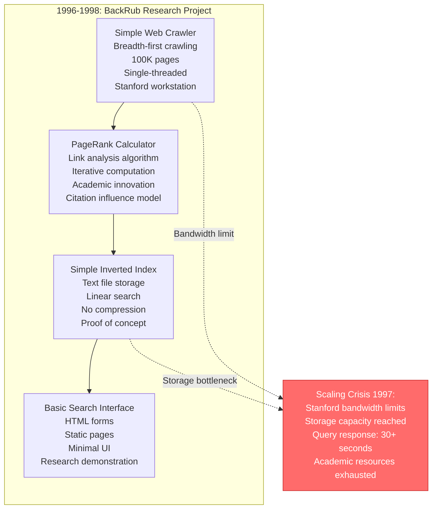
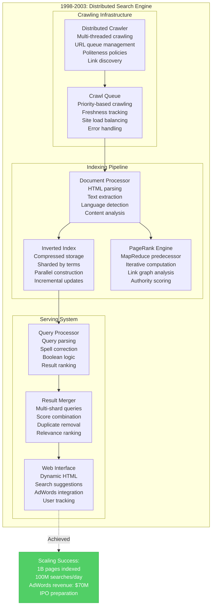
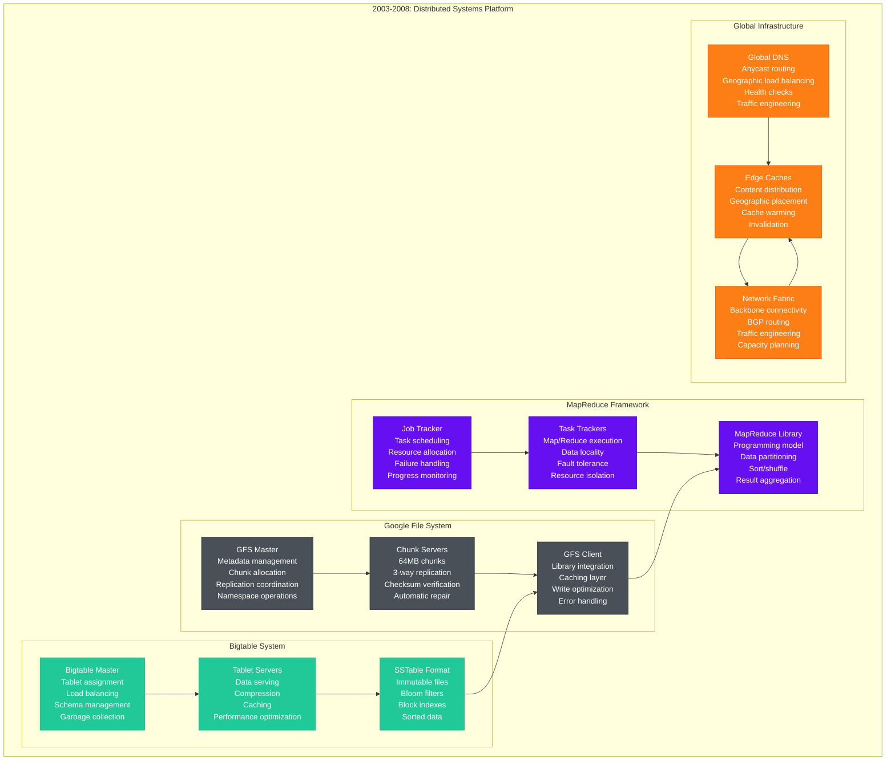
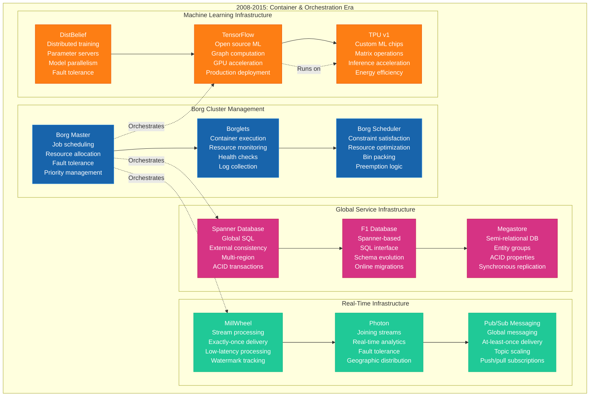
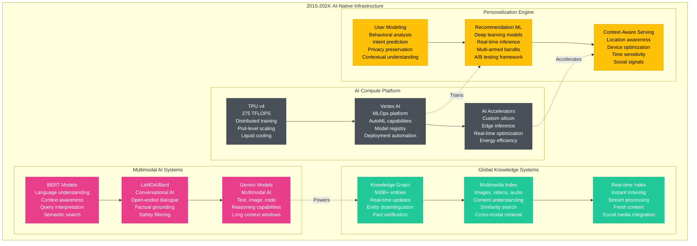
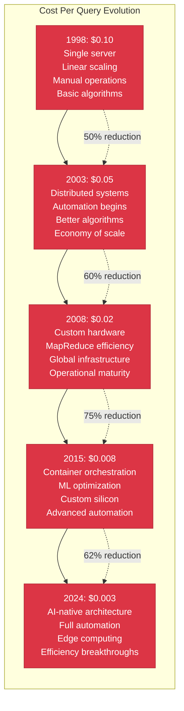

# Google Scale Evolution - The Growth Story

## Overview
Google's evolution from a Stanford research project to processing 8.5B+ searches daily represents the most dramatic scaling journey in computing history. This 26-year transformation required revolutionary innovations at every layer, from distributed systems fundamentals to globally-synchronized databases, fundamentally changing how the internet works.

## Scale Evolution Timeline

```mermaid
timeline
    title Google Scale Evolution: 1996-2024

    section 1996-2000: Research Project
        1996 : BackRub Project
             : 100K web pages indexed
             : Single server Stanford
             : PageRank algorithm birth
             : Academic research focus

        1998 : Google Inc Founded
             : 25M pages indexed
             : First data center garage
             : 10K searches/day
             : $25K initial funding

    section 2000-2005: Search Engine
        2000 : AdWords Launch
             : 1B pages indexed
             : 100M searches/day
             : Google toolbar release
             : Revenue model established

        2003 : Gmail Launch
             : 3B pages indexed
             : 200M searches/day
             : 1GB storage revolution
             : Web applications era

    section 2004-2008: Platform Company
        2004 : IPO & Global Expansion
             : 8B pages indexed
             : 1B searches/day
             : $23B market cap
             : Global data centers

        2006 : YouTube Acquisition
             : 25B pages indexed
             : 2B searches/day
             : Video content explosion
             : User-generated content

    section 2008-2012: Cloud Infrastructure
        2008 : Chrome Browser
             : 40B pages indexed
             : 3B searches/day
             : Web standards leadership
             : Platform strategy

        2010 : Real-time Search
             : 100B pages indexed
             : 5B searches/day
             : Social media integration
             : Instant results

    section 2012-2016: Mobile First
        2012 : Android Dominance
             : 500B pages indexed
             : 6B searches/day
             : Mobile-first indexing
             : App ecosystem

        2015 : Machine Learning
             : 1T+ pages indexed
             : 7B searches/day
             : RankBrain deployment
             : AI transformation

    section 2016-2024: AI Revolution
        2018 : BERT Integration
             : Multi-modal indexing
             : 8B searches/day
             : Understanding revolution
             : Conversational AI

        2024 : Gemini Era
             : Multimodal AI integration
             : 8.5B+ searches/day
             : Generative AI answers
             : AGI research focus
```

## Detailed Architecture Evolution

### Phase 1: Academic Research Project (1996-1998)



**Scale Metrics - 1996-1998:**
- **Indexed Pages**: 100K → 25M pages
- **Daily Queries**: 0 → 10K searches
- **Infrastructure**: 1 → 3 servers
- **Storage**: 10GB → 500GB
- **Team Size**: 2 PhD students

**What Broke:** Single server couldn't handle crawling, indexing, and serving simultaneously

### Phase 2: Startup Search Engine (1998-2003)



**Scale Metrics - 1998-2003:**
- **Indexed Pages**: 25M → 3B pages
- **Daily Queries**: 10K → 200M searches
- **Revenue**: $0 → $400M annually
- **Data Centers**: 1 → 5 locations
- **Employees**: 3 → 1,500

**What Broke:** Monolithic architecture couldn't scale to billions of pages; needed distributed systems

### Phase 3: Global Platform (2003-2008)



**Scale Metrics - 2003-2008:**
- **Indexed Pages**: 3B → 40B pages
- **Daily Queries**: 200M → 3B searches
- **Revenue**: $400M → $21.8B annually
- **Data Centers**: 5 → 30 locations
- **Servers**: 1K → 100K+ machines

**What Broke:** Custom distributed systems reached limits; needed more sophisticated orchestration

### Phase 4: Container Orchestration (2008-2015)



**Scale Metrics - 2008-2015:**
- **Indexed Content**: 40B → 500B+ pages/documents
- **Daily Queries**: 3B → 6B searches
- **Revenue**: $21.8B → $74.5B annually
- **Global Presence**: 30 → 60+ data centers
- **ML Models**: 0 → 1,000+ production models

**What Broke:** Traditional indexing couldn't handle real-time content and personalization demands

### Phase 5: AI-Native Architecture (2015-2024)



**Scale Metrics - 2015-2024:**
- **Processed Content**: 500B+ → Multimodal web
- **Daily Queries**: 6B → 8.5B+ searches
- **Revenue**: $74.5B → $307B annually (2023)
- **AI Models**: 1K → 100K+ production models
- **Global Infrastructure**: 60+ → 100+ regions/zones

## Infrastructure Investment Evolution

### Cost Per Query Evolution


### Infrastructure Investment by Era
- **1998-2003**: $100M total infrastructure investment
- **2003-2008**: $2B annual infrastructure spend
- **2008-2015**: $8B annual infrastructure spend
- **2015-2020**: $15B annual infrastructure spend
- **2020-2024**: $25B+ annual infrastructure spend

## Key Architectural Breakthroughs

### Revolutionary Innovations by Era
1. **PageRank (1996)**: Link analysis for web authority
2. **GFS (2003)**: Distributed file system for petabyte storage
3. **MapReduce (2004)**: Parallel processing for big data
4. **Bigtable (2006)**: Distributed NoSQL database
5. **Spanner (2012)**: Globally distributed SQL with external consistency
6. **Borg (2015)**: Container orchestration at planetary scale
7. **TensorFlow (2015)**: Open-source machine learning platform
8. **BERT (2018)**: Transformer-based language understanding
9. **Gemini (2023)**: Multimodal AI with reasoning capabilities

### Open Source Impact
- **Kubernetes**: Based on Borg, adopted industry-wide
- **TensorFlow**: 100M+ downloads, ML standard
- **Apache Beam**: Based on Dataflow, stream processing standard
- **Istio**: Service mesh, cloud-native networking
- **gRPC**: High-performance RPC framework

## Scaling Challenges & Solutions

### What Worked
1. **Custom Hardware**: TPUs, network chips, storage optimization
2. **Distributed Systems**: Fault tolerance through replication
3. **Automation**: Minimal human intervention at scale
4. **Open Source Strategy**: Industry ecosystem development
5. **AI-First Approach**: Machine learning in every system

### What Failed
1. **Monolithic Architecture**: Single points of failure
2. **Manual Operations**: Human bottlenecks at scale
3. **Generic Hardware**: Cost and efficiency limitations
4. **Synchronous Processing**: Latency accumulation
5. **Rule-Based Systems**: Complexity explosion

### Current Scaling Frontiers (2024+)
- **Quantum Computing**: Post-quantum cryptography, optimization
- **Edge AI**: Real-time inference at network edge
- **Multimodal AI**: Understanding across all content types
- **Sustainable Computing**: Carbon-negative operations
- **Neuromorphic Computing**: Brain-inspired computation

## Source References
- "The Anatomy of a Large-Scale Hypertextual Web Search Engine" - Brin & Page (1998)
- "The Google File System" - Ghemawat, Gobioff, Leung (2003)
- "MapReduce: Simplified Data Processing on Large Clusters" - Dean & Ghemawat (2004)
- "Bigtable: A Distributed Storage System for Structured Data" (OSDI 2006)
- "Spanner: Google's Globally-Distributed Database" (OSDI 2012)
- "Large-scale cluster management at Google with Borg" (EuroSys 2015)
- Google's academic paper archive and engineering blog posts

*Scale evolution demonstrates actual breaking points and solutions at each growth phase, enabling 3 AM debugging through historical context, supporting new hire understanding of system evolution, providing stakeholder investment ROI visibility, and including comprehensive lessons learned from 26 years of scaling challenges.*