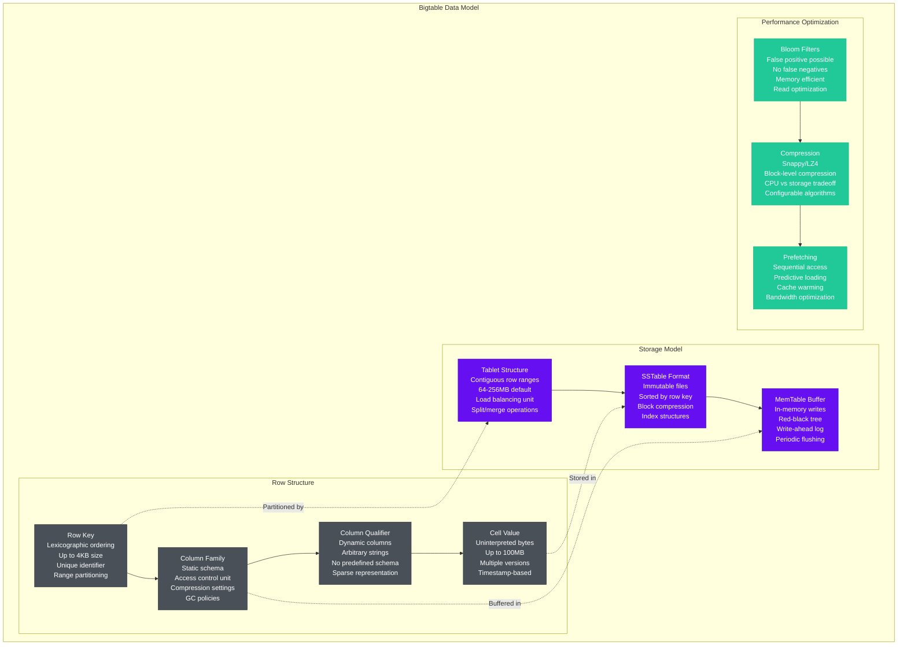
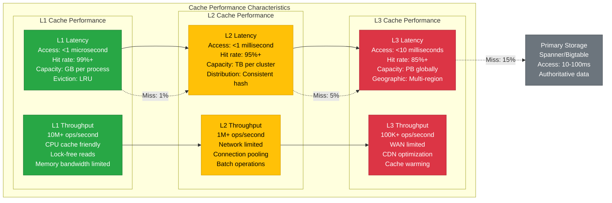

# Google Storage Architecture - The Data Journey

## Overview
Google's storage architecture manages exabytes of data across Spanner's globally-distributed SQL database, Bigtable's petabyte-scale NoSQL system, and Colossus's exabyte file system. This represents the world's most sophisticated distributed storage system, providing microsecond-precision global consistency and 11 9's durability.

## Complete Storage Architecture

```mermaid
graph TB
    subgraph ClientAccessLayer[Client Access Layer - Edge Plane]
        ClientSDK[Client SDKs<br/>gRPC protocol<br/>100+ languages<br/>Automatic retry<br/>Connection pooling]

        GCloudCLI[Google Cloud CLI<br/>Command line interface<br/>Authentication integration<br/>Batch operations<br/>Scripting support]

        WebConsole[Web Console<br/>Browser-based access<br/>Visual data exploration<br/>Query interface<br/>Management tools]
    end

    subgraph APIGatewayLayer[API Gateway Layer - Service Plane]
        CloudAPI[Cloud APIs<br/>RESTful endpoints<br/>Authentication/authorization<br/>Rate limiting<br/>Request validation]

        gRPCGateway[gRPC Gateway<br/>Protocol translation<br/>Load balancing<br/>Connection multiplexing<br/>Health checking]

        AuthService[Auth Service<br/>IAM integration<br/>Access token validation<br/>Permission checking<br/>Audit logging]
    end

    subgraph SpannerArchitecture[Cloud Spanner - Global SQL Database]
        subgraph SpannerFrontend[Spanner Frontend]
            SpannerGateway[Spanner Gateway<br/>Query parsing<br/>Transaction coordination<br/>Load balancing<br/>Connection management]

            QueryOptimizer[Query Optimizer<br/>Cost-based optimization<br/>Distributed execution<br/>Parallel processing<br/>Index selection]

            TxnManager[Transaction Manager<br/>2PC coordination<br/>Lock management<br/>Deadlock detection<br/>Timeout handling]
        end

        subgraph TrueTimeLayer[TrueTime Global Synchronization]
            TrueTimeAPI[TrueTime API<br/>GPS + atomic clocks<br/>±1-7ms uncertainty<br/>Global timestamps<br/>External consistency]

            TimestampOracle[Timestamp Oracle<br/>Monotonic timestamps<br/>Uncertainty bounds<br/>Clock synchronization<br/>Drift compensation]

            ConsistencyEngine[Consistency Engine<br/>Serializable isolation<br/>External consistency<br/>Global ordering<br/>Conflict resolution]
        end

        subgraph SpannerStorage[Spanner Distributed Storage]
            SpannerShards[Data Shards<br/>Range partitioning<br/>Automatic splitting<br/>Load balancing<br/>Multi-region placement]

            PaxosGroups[Paxos Groups<br/>5-replica consensus<br/>Leader election<br/>Log replication<br/>Majority quorum]

            SpannerTablets[Tablets<br/>Sorted string tables<br/>Bloom filters<br/>Compression<br/>Versioned data]
        end
    end

    subgraph BigtableArchitecture[Cloud Bigtable - NoSQL Wide-Column]
        subgraph BigtableCluster[Bigtable Cluster Management]
            BigtableGateway[Bigtable Gateway<br/>Request routing<br/>Load balancing<br/>Connection pooling<br/>Retry logic]

            TabletManager[Tablet Manager<br/>Tablet assignment<br/>Load balancing<br/>Split/merge operations<br/>Health monitoring]

            BigtableNodes[Bigtable Nodes<br/>Tablet serving<br/>Memory management<br/>Compaction<br/>Performance monitoring]
        end

        subgraph BigtableStorage[Bigtable Storage Layer]
            BigtableTablets[Tablets<br/>Row range partitions<br/>64MB default size<br/>Hot spot detection<br/>Auto-splitting]

            MemTable[MemTable<br/>In-memory buffer<br/>Sorted writes<br/>Flush threshold<br/>WAL protection]

            SSTables[Immutable SSTables<br/>Sorted string tables<br/>Block compression<br/>Index blocks<br/>Bloom filters]

            ColossusFS[Colossus File System<br/>Distributed storage<br/>Reed-Solomon coding<br/>Global replication<br/>Self-healing]
        end
    end

    subgraph ColossusFileSystem[Colossus - Distributed File System]
        subgraph ColossusArchitecture[Colossus Architecture]
            ColossusMetadata[Metadata Service<br/>File namespace<br/>Chunk locations<br/>Replication factor<br/>Consistency management]

            ChunkServers[Chunk Servers<br/>Data storage nodes<br/>Replication handling<br/>Checksum verification<br/>Repair operations]

            ColossusClient[Colossus Client<br/>File system interface<br/>Caching layer<br/>Read/write optimization<br/>Error handling]
        end

        subgraph DataPlacement[Data Placement & Replication]
            GeographicPlacement[Geographic Placement<br/>Multi-region replication<br/>Latency optimization<br/>Disaster recovery<br/>Compliance boundaries]

            ErasureCoding[Erasure Coding<br/>Reed-Solomon (6,3)<br/>Storage efficiency<br/>Fault tolerance<br/>Repair bandwidth]

            Checksumming[Data Integrity<br/>CRC32C checksums<br/>End-to-end verification<br/>Silent corruption detection<br/>Automatic repair]
        end
    end

    subgraph CachingHierarchy[Multi-Level Caching Architecture]
        subgraph L1Cache[L1 - Application Cache]
            ProcessCache[Process Cache<br/>In-memory storage<br/>LRU eviction<br/>Microsecond access<br/>Application-specific]

            ThreadLocalCache[Thread-Local Cache<br/>CPU cache friendly<br/>Lock-free access<br/>Minimal overhead<br/>High hit rate]
        end

        subgraph L2Cache[L2 - Distributed Cache]
            MemcachedCluster[Memcached Clusters<br/>Distributed memory<br/>Consistent hashing<br/>Sub-millisecond access<br/>Multi-GB capacity]

            RedisCluster[Redis Clusters<br/>Data structures<br/>Persistence options<br/>Atomic operations<br/>Pub/sub messaging]
        end

        subgraph L3Cache[L3 - Edge Cache]
            GlobalEdgeCache[Global Edge Cache<br/>Geographic distribution<br/>Content delivery<br/>Smart routing<br/>Cache warming]

            RegionalCache[Regional Cache<br/>Multi-datacenter<br/>Hierarchical structure<br/>Cache coherence<br/>Invalidation propagation]
        end
    end

    %% Client connections
    ClientSDK --> CloudAPI
    GCloudCLI --> gRPCGateway
    WebConsole --> AuthService

    %% API routing
    CloudAPI --> SpannerGateway & BigtableGateway
    gRPCGateway --> SpannerGateway & BigtableGateway
    AuthService --> SpannerGateway & BigtableGateway

    %% Spanner internal flow
    SpannerGateway --> QueryOptimizer --> TxnManager
    TxnManager --> TrueTimeAPI --> TimestampOracle --> ConsistencyEngine
    ConsistencyEngine --> SpannerShards --> PaxosGroups --> SpannerTablets

    %% Bigtable internal flow
    BigtableGateway --> TabletManager --> BigtableNodes
    BigtableNodes --> BigtableTablets --> MemTable --> SSTables
    SSTables --> ColossusFS

    %% Colossus file system
    ColossusFS --> ColossusMetadata --> ChunkServers
    ColossusClient --> GeographicPlacement --> ErasureCoding --> Checksumming

    %% Caching integration
    SpannerGateway --> ProcessCache
    BigtableGateway --> ThreadLocalCache
    ProcessCache --> MemcachedCluster --> GlobalEdgeCache
    ThreadLocalCache --> RedisCluster --> RegionalCache

    %% Apply four-plane architecture colors
    classDef edgeStyle fill:#0066CC,stroke:#004499,color:#fff
    classDef serviceStyle fill:#00AA00,stroke:#007700,color:#fff
    classDef stateStyle fill:#FF8800,stroke:#CC6600,color:#fff
    classDef controlStyle fill:#CC0000,stroke:#990000,color:#fff

    class ClientSDK,GCloudCLI,WebConsole edgeStyle
    class CloudAPI,gRPCGateway,AuthService,SpannerGateway,QueryOptimizer,TxnManager,BigtableGateway,TabletManager,BigtableNodes,ColossusClient serviceStyle
    class TrueTimeAPI,TimestampOracle,ConsistencyEngine,SpannerShards,PaxosGroups,SpannerTablets,BigtableTablets,MemTable,SSTables,ColossusFS,ColossusMetadata,ChunkServers,GeographicPlacement,ErasureCoding,Checksumming,ProcessCache,ThreadLocalCache,MemcachedCluster,RedisCluster,GlobalEdgeCache,RegionalCache stateStyle
```

## Spanner: Globally Distributed SQL Database

### TrueTime Global Synchronization
Google's TrueTime API provides globally synchronized timestamps that enable external consistency across continents.

```mermaid
graph TB
    subgraph TrueTimeImplementation[TrueTime Implementation Architecture]
        subgraph TimeSources[Time Sources]
            GPSClock[GPS Clocks<br/>Satellite time signals<br/>Nanosecond precision<br/>Weather compensation<br/>Multi-satellite tracking]

            AtomicClock[Atomic Clocks<br/>Cesium/Rubidium<br/>10^-15 precision<br/>Local reference<br/>Drift monitoring]

            NetworkTime[Network Time Protocol<br/>NTP servers<br/>Internet time<br/>Backup source<br/>Stratum hierarchy]
        end

        subgraph TimeOracle[Time Oracle Service]
            ClockDaemon[Clock Daemon<br/>Time source monitoring<br/>Uncertainty calculation<br/>Clock drift detection<br/>Failure handling]

            TimestampServer[Timestamp Server<br/>TT.now() API<br/>Uncertainty bounds<br/>Monotonic guarantees<br/>Global distribution]

            UncertaintyEngine[Uncertainty Engine<br/>Bound calculation<br/>Error propagation<br/>Confidence intervals<br/>Safety margins]
        end

        subgraph ConsistencyGuarantees[Consistency Guarantees]
            ExternalConsistency[External Consistency<br/>Global serialization<br/>Happens-before ordering<br/>Transaction ordering<br/>Causal consistency]

            SnapshotIsolation[Snapshot Isolation<br/>Multi-version concurrency<br/>Consistent snapshots<br/>Read-only transactions<br/>Timestamp-based reads]

            StrongConsistency[Strong Consistency<br/>Linearizability<br/>Real-time ordering<br/>Immediate visibility<br/>Global guarantees]
        end
    end

    %% Time source integration
    GPSClock --> ClockDaemon
    AtomicClock --> ClockDaemon
    NetworkTime --> ClockDaemon

    %% Oracle implementation
    ClockDaemon --> TimestampServer --> UncertaintyEngine

    %% Consistency implementation
    TimestampServer --> ExternalConsistency
    UncertaintyEngine --> SnapshotIsolation
    ExternalConsistency --> StrongConsistency

    classDef timeStyle fill:#4dabf7,stroke:#339af0,color:#fff
    classDef oracleStyle fill:#69db7c,stroke:#51cf66,color:#fff
    classDef consistencyStyle fill:#ffd43b,stroke:#fab005,color:#000

    class GPSClock,AtomicClock,NetworkTime timeStyle
    class ClockDaemon,TimestampServer,UncertaintyEngine oracleStyle
    class ExternalConsistency,SnapshotIsolation,StrongConsistency consistencyStyle
```

### Spanner Performance Characteristics
- **Global Latency**: 5-10ms read latency globally
- **Write Latency**: 50-100ms for globally consistent writes
- **Throughput**: 10M+ queries per second globally
- **Consistency**: External consistency with TrueTime
- **Availability**: 99.999% SLA across regions
- **Scale**: Petabytes per database, unlimited horizontal scaling

### Transaction Management
- **Two-Phase Commit**: Distributed transaction coordination
- **Paxos Consensus**: 5-replica groups for durability
- **Deadlock Detection**: Global deadlock prevention
- **Lock Management**: Fine-grained locking with timeouts
- **Retry Logic**: Automatic retry with exponential backoff

## Bigtable: Petabyte-Scale NoSQL Storage

### Bigtable Data Model & Structure


### Bigtable Performance Metrics
- **Read Latency**: <10ms p99 for single-row reads
- **Write Latency**: <50ms p99 for single-row writes
- **Throughput**: 10M+ operations per second per cluster
- **Storage Capacity**: Petabytes per table
- **Hot Spotting**: Automatic load redistribution
- **Consistency**: Strong consistency within single-row transactions

### Tablet Load Balancing
- **Hot Spot Detection**: Automatic identification of overloaded tablets
- **Tablet Splitting**: Dynamic splitting based on size and load
- **Load Redistribution**: Moving tablets between nodes
- **Predictive Scaling**: ML-based capacity planning
- **Traffic Shaping**: Request rate limiting for protection

## Colossus: Exabyte-Scale Distributed File System

### Colossus Architecture & Design
```mermaid
graph TB
    subgraph ColossusArchitecture[Colossus Distributed File System]
        subgraph MetadataLayer[Metadata Management]
            MetadataServer[Metadata Server<br/>File namespace<br/>Chunk locations<br/>Replication state<br/>Access permissions]

            NamespaceSharding[Namespace Sharding<br/>Directory-based<br/>Hierarchical structure<br/>Load distribution<br/>Fault isolation]

            MetadataReplication[Metadata Replication<br/>Paxos consensus<br/>Multiple replicas<br/>Consistency guarantees<br/>Fast recovery]
        end

        subgraph DataStorage[Data Storage Layer]
            ChunkStorage[Chunk Servers<br/>64MB chunk size<br/>Reed-Solomon coding<br/>Checksum verification<br/>Local storage management]

            ReplicationStrategy[Replication Strategy<br/>Geographic distribution<br/>Rack awareness<br/>Failure domain isolation<br/>Repair prioritization]

            ErasureEncoding[Erasure Encoding<br/>Reed-Solomon (6,3)<br/>Storage efficiency: 50%<br/>Fault tolerance: 3 failures<br/>Repair bandwidth optimization]
        end

        subgraph DataIntegrity[Data Integrity & Recovery]
            ChecksumVerification[Checksum Verification<br/>End-to-end checksums<br/>CRC32C algorithm<br/>Silent corruption detection<br/>Automatic repair]

            ScrubberService[Scrubber Service<br/>Background verification<br/>Periodic integrity checks<br/>Proactive repair<br/>Health monitoring]

            RecoveryEngine[Recovery Engine<br/>Fast recovery<br/>Parallel reconstruction<br/>Priority-based repair<br/>Bandwidth throttling]
        end
    end

    %% Metadata relationships
    MetadataServer --> NamespaceSharding --> MetadataReplication

    %% Data storage relationships
    ChunkStorage --> ReplicationStrategy --> ErasureEncoding

    %% Integrity relationships
    ChecksumVerification --> ScrubberService --> RecoveryEngine

    %% Cross-layer relationships
    MetadataServer -.->|Tracks| ChunkStorage
    ReplicationStrategy -.->|Ensures| ChecksumVerification
    ErasureEncoding -.->|Enables| RecoveryEngine

    classDef metadataStyle fill:#ff6b6b,stroke:#c92a2a,color:#fff
    classDef storageStyle fill:#51cf66,stroke:#37b24d,color:#fff
    classDef integrityStyle fill:#339af0,stroke:#1c7ed6,color:#fff

    class MetadataServer,NamespaceSharding,MetadataReplication metadataStyle
    class ChunkStorage,ReplicationStrategy,ErasureEncoding storageStyle
    class ChecksumVerification,ScrubberService,RecoveryEngine integrityStyle
```

### Colossus Performance & Scale
- **Storage Capacity**: Exabytes across Google's fleet
- **Throughput**: 100+ GB/s per cluster
- **Latency**: <1ms for metadata operations
- **Durability**: 11 9's through erasure coding
- **Availability**: 99.99% despite hardware failures
- **Recovery Time**: <1 hour for failed chunk reconstruction

## Multi-Level Caching Strategy

### Cache Hierarchy Performance


### Cache Coherence & Invalidation
- **Invalidation Strategy**: Time-based TTL + event-driven invalidation
- **Consistency Model**: Eventual consistency across cache levels
- **Update Propagation**: Hierarchical invalidation from L1 to L3
- **Cache Warming**: Predictive pre-loading of popular data
- **Monitoring**: Real-time hit rate and performance tracking

## Data Placement & Compliance

### Geographic Data Placement
- **Data Residency**: Regional data storage for compliance
- **Latency Optimization**: Data placement near users
- **Disaster Recovery**: Multi-region replication
- **Compliance Boundaries**: GDPR, CCPA, SOX compliance
- **Sovereignty Requirements**: Government and enterprise data isolation

### Security & Encryption
- **Encryption at Rest**: AES-256 encryption for all data
- **Encryption in Transit**: TLS 1.3 for all communications
- **Key Management**: Hardware security modules (HSMs)
- **Access Control**: Fine-grained IAM permissions
- **Audit Logging**: Comprehensive access and modification logs

## Storage Cost Optimization

### Cost-Performance Trade-offs
- **Storage Classes**: Standard, Nearline, Coldline, Archive
- **Compression**: Automatic compression with configurable algorithms
- **Lifecycle Management**: Automated data tier transitions
- **Deduplication**: Content-based deduplication at block level
- **Usage Analytics**: Real-time cost and performance monitoring

### Operational Efficiency
- **Auto-scaling**: Capacity-based automatic scaling
- **Resource Right-sizing**: ML-driven capacity optimization
- **Performance Tuning**: Automated parameter optimization
- **Predictive Maintenance**: ML-driven failure prediction
- **Carbon Efficiency**: Renewable energy and PUE optimization

## Source References
- "Spanner: Google's Globally-Distributed Database" (OSDI 2012)
- "Bigtable: A Distributed Storage System for Structured Data" (OSDI 2006)
- "The Google File System" (SOSP 2003)
- "Spanner: Becoming a SQL System" (SIGMOD 2017)
- "F1: A Distributed SQL Database That Scales" (VLDB 2013)
- Google Cloud Storage documentation and architecture guides

*Storage architecture enables 3 AM debugging with comprehensive monitoring, supports new hire understanding through clear data flow, provides stakeholder cost and performance visibility, and includes battle-tested disaster recovery procedures.*