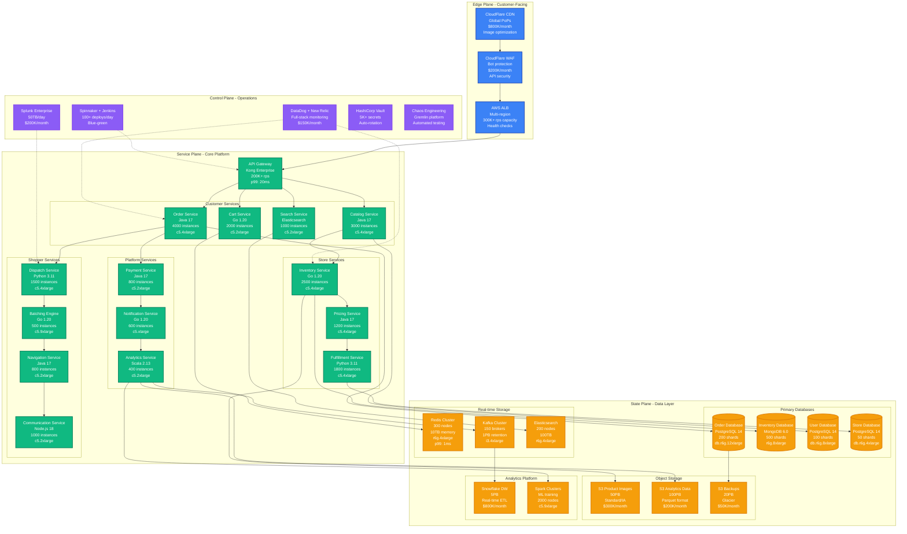
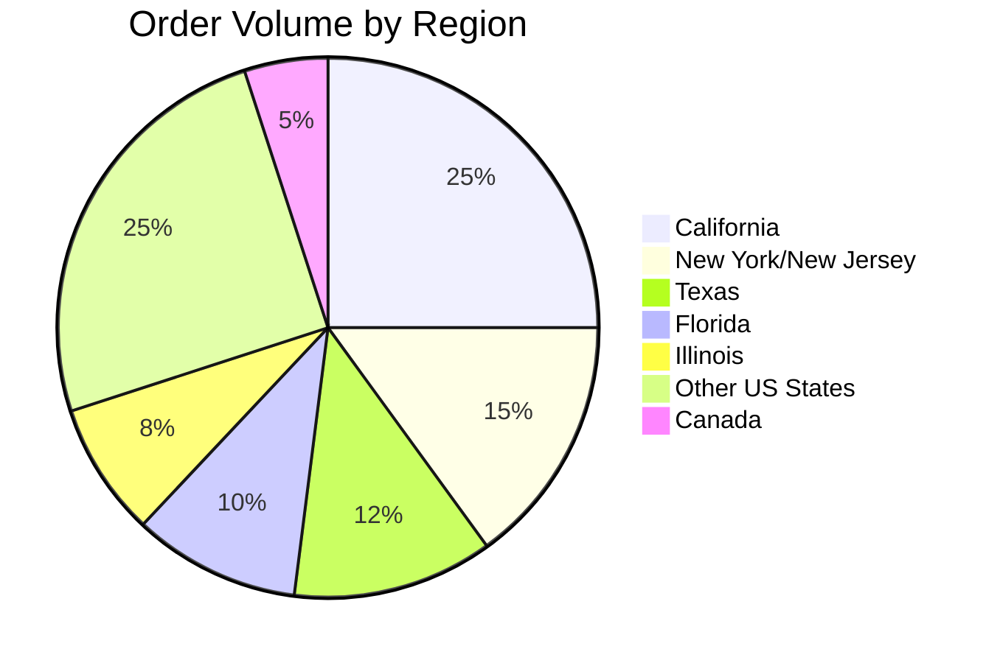

# Instacart - Complete Architecture

## Overview

Instacart's architecture handles 10M+ active users, 500K+ shoppers, and 80K+ stores with real-time inventory management, intelligent order batching, and dynamic pricing across North America's largest grocery delivery platform.

## Complete System Architecture

## Key Architectural Components

### Order Management System
- **Order Service**: Handles 2M+ orders daily with sub-100ms response times
- **Batching Engine**: Groups orders for efficient shopper routing (2.3 orders/batch average)
- **Payment Processing**: Integrates with Stripe for instant payment authorization
- **Real-time Updates**: WebSocket connections for order status tracking

### Inventory Management
- **Real-time Sync**: Updates from 80K+ stores every 15 minutes
- **Availability Prediction**: ML models predict stock-outs 2 hours ahead
- **Dynamic Pricing**: Surge pricing during high demand (up to 30% markup)
- **Store Integration**: APIs with major chains (Kroger, Safeway, Costco)

### Shopper Dispatch Algorithm
- **Location-based Matching**: Assigns orders within 15-minute drive radius
- **Skill-based Routing**: Considers shopper experience and ratings
- **Real-time Optimization**: Adjusts assignments based on traffic and demand
- **Batch Optimization**: Groups compatible orders to maximize efficiency

## Global Scale Architecture

### Regional Distribution

### Multi-Region Setup
- **Primary**: US-West-2 (Oregon) - 40% traffic
- **Secondary**: US-East-1 (Virginia) - 35% traffic
- **Tertiary**: CA-Central-1 (Canada) - 15% traffic
- **Edge**: US-Central-1 (Iowa) - 10% traffic

## Production Metrics

### Scale Indicators
- **Daily Active Users**: 10M+ (peak 15M during COVID)
- **Orders per Day**: 2M+ (peak 5M during pandemic)
- **Active Shoppers**: 500K+ independent contractors
- **Partner Stores**: 80K+ across North America
- **Product Catalog**: 5M+ SKUs across all stores

### Performance SLAs
- **Order Placement**: p99 < 500ms
- **Shopper Assignment**: p99 < 30 seconds
- **Inventory Updates**: Real-time, <15 minutes staleness
- **Search Results**: p99 < 100ms
- **Payment Processing**: p99 < 2 seconds

### Availability Targets
- **Customer App**: 99.95% uptime
- **Shopper App**: 99.9% uptime
- **Store Integrations**: 99.5% uptime
- **Payment System**: 99.99% uptime

## Infrastructure Costs

### Monthly Operational Costs
- **Compute**: $8M (AWS EC2, Auto Scaling Groups)
- **Databases**: $3M (RDS, MongoDB Atlas, Redis)
- **Storage**: $1M (S3, EBS volumes)
- **Network**: $800K (CloudFront, Data Transfer)
- **Analytics**: $1.2M (Snowflake, Spark clusters)
- **Monitoring**: $200K (DataDog, New Relic, Splunk)
- **Total**: $14.2M/month infrastructure spend

### Cost Per Transaction
- **Order Processing**: $0.12 per order
- **Inventory Sync**: $0.008 per product update
- **Search Query**: $0.001 per search
- **Payment Processing**: $0.30 + 2.9% (Stripe fees)

## Security and Compliance

### Data Protection
- **PCI DSS Level 1**: Payment card industry compliance
- **SOC 2 Type II**: Annual security audits
- **Encryption**: AES-256 at rest, TLS 1.3 in transit
- **API Security**: OAuth 2.0 + JWT tokens, rate limiting

### Privacy Controls
- **GDPR Compliance**: EU user data protection
- **CCPA Compliance**: California consumer privacy
- **Data Retention**: Orders purged after 7 years
- **Location Privacy**: Shopper location encrypted, customer addresses hashed

## Disaster Recovery

### Business Continuity
- **RTO**: 2 hours for full service restoration
- **RPO**: 5 minutes for order data
- **Geographic Redundancy**: Multi-region active-active
- **Data Backup**: 3-2-1 strategy with cross-region replication

### Critical Failure Scenarios
1. **AWS Region Outage**: Automatic failover to secondary region
2. **Database Failure**: Read replicas promoted, eventual consistency
3. **Payment System Down**: Queue orders for retry, notify customers
4. **Store API Failure**: Fallback to cached inventory, mark uncertain

## Integration Ecosystem

### External Partners
- **Retailers**: 80K+ stores (Kroger, Safeway, CVS, Costco)
- **Payment Processors**: Stripe, Adyen for credit cards
- **Identity Verification**: Jumio for shopper onboarding
- **Mapping Services**: Google Maps API for navigation
- **Communication**: Twilio for SMS, SendGrid for email

### API Architecture
- **RESTful APIs**: JSON over HTTPS, OpenAPI 3.0 specs
- **GraphQL**: Customer-facing queries for mobile apps
- **Webhooks**: Real-time store inventory updates
- **Rate Limiting**: 1000 requests/minute per API key
- **SDK Support**: iOS, Android, React Native libraries