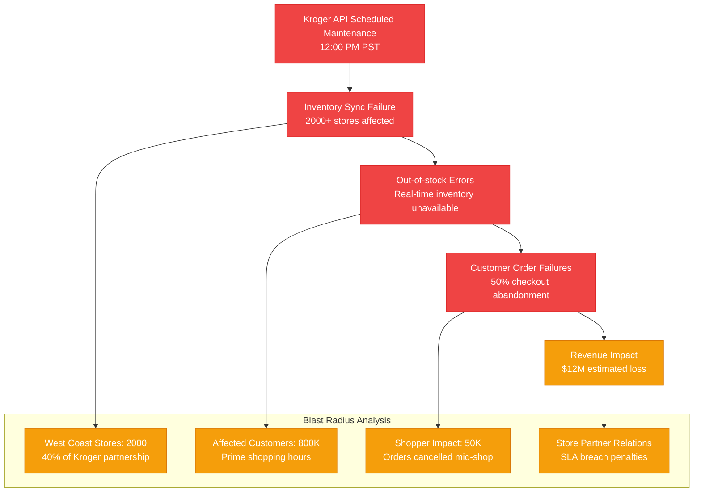
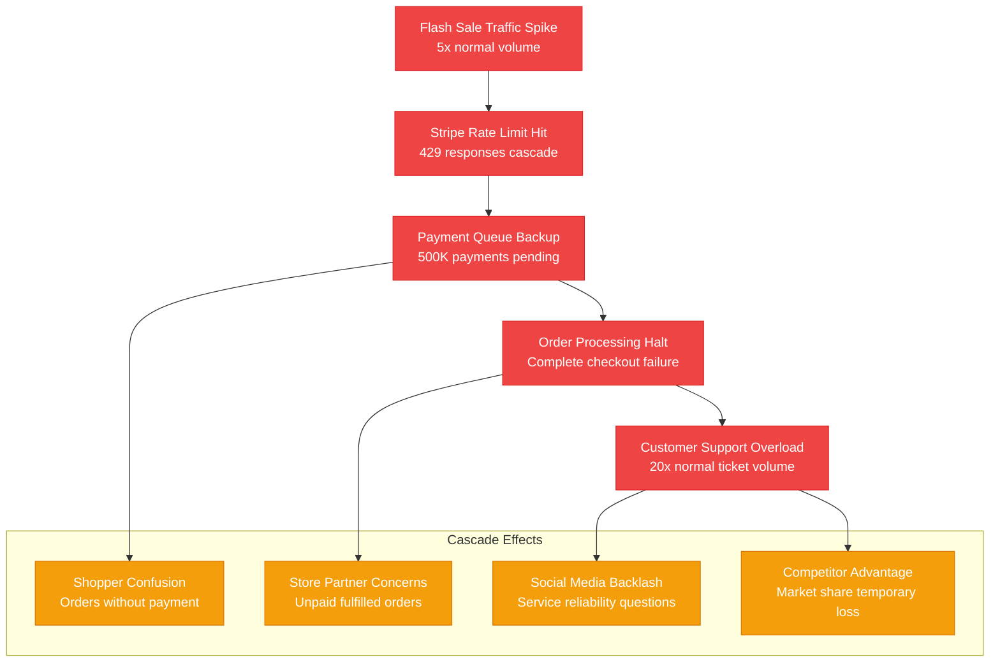
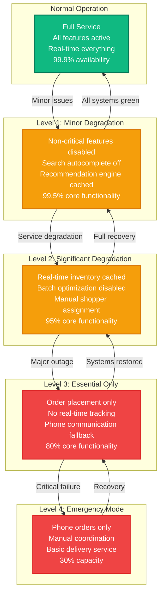

# Instacart - Failure Domains

## Overview

Instacart's failure domain strategy manages risks across 80K+ stores, 500K+ shoppers, and 2M+ daily orders with critical dependencies on store APIs, payment systems, and real-time inventory, designing for graceful degradation during partner outages.

## Complete Failure Domain Map

```mermaid
graph TB
    subgraph "Geographic Failure Domains"
        subgraph "US West Region (Primary)"
            USWEST1[US-West-2 AZ-A<br/>Primary production<br/>45% total traffic]
            USWEST2[US-West-2 AZ-B<br/>Hot standby<br/>Auto-failover ready]
            USWEST3[US-West-2 AZ-C<br/>Database replicas<br/>Read-only traffic]
        end

        subgraph "US East Region (Secondary)"
            USEAST1[US-East-1 AZ-A<br/>Secondary production<br/>35% total traffic]
            USEAST2[US-East-1 AZ-B<br/>Disaster recovery<br/>Cold standby]
        end

        subgraph "Canada Region (Isolated)"
            CANADA1[CA-Central-1 AZ-A<br/>Canadian operations<br/>15% total traffic]
            CANADA2[CA-Central-1 AZ-B<br/>Local compliance<br/>Data residency]
        end
    end

    subgraph "Service Failure Domains"
        subgraph "Critical Path Services"
            ORDER[Order Service<br/>4K instances<br/>Circuit Breaker: 30 errors/min]
            INVENTORY[Inventory Service<br/>2.5K instances<br/>Circuit Breaker: 50 errors/min]
            PAYMENT[Payment Service<br/>800 instances<br/>Circuit Breaker: 5 errors/min]
        end

        subgraph "Shopper Operations"
            DISPATCH[Dispatch Service<br/>1.5K instances<br/>Graceful degradation<br/>Manual assignment fallback]
            BATCH[Batching Engine<br/>500 instances<br/>Single order fallback<br/>Efficiency optimization]
            NAVIGATION[Navigation Service<br/>800 instances<br/>Google Maps dependency<br/>Offline map cache]
        end

        subgraph "Platform Services"
            CATALOG[Catalog Service<br/>3K instances<br/>Read-heavy workload<br/>Cache-first architecture]
            SEARCH[Search Service<br/>1K instances<br/>Elasticsearch dependency<br/>Fallback to SQL search]
            COMMUNICATION[Communication Service<br/>1K instances<br/>Multi-channel delivery<br/>Queue-based resilience]
        end
    end

    subgraph "External Dependencies"
        subgraph "Store Integrations"
            STOREAPI[Store APIs<br/>80K+ endpoints<br/>Kroger, Safeway, CVS<br/>15-minute sync cycles]
            STOREPOS[Store POS Systems<br/>Real-time inventory<br/>High failure rates<br/>Graceful degradation]
        end

        subgraph "Payment Partners"
            STRIPE[Stripe Payment API<br/>Primary processor<br/>99.9% SLA<br/>$100M+ monthly volume]
            ADYEN[Adyen Backup<br/>Secondary processor<br/>Automatic failover<br/>EU compliance]
        end

        subgraph "Infrastructure Partners"
            GOOGLEMAPS[Google Maps API<br/>Navigation service<br/>Route optimization<br/>10M+ requests/day]
            TWILIO[Twilio Communications<br/>SMS/Voice service<br/>Multi-region setup<br/>Delivery notifications]
        end
    end

    subgraph "Data Failure Domains"
        subgraph "Primary Databases"
            ORDERDB[(Order Database<br/>PostgreSQL<br/>200 shards<br/>Master-slave replication)]
            INVENTORYDB[(Inventory Database<br/>MongoDB<br/>500 shards<br/>Replica sets)]
            USERDB[(User Database<br/>PostgreSQL<br/>100 shards<br/>Cross-region sync)]
        end

        subgraph "Cache and Streaming"
            REDIS[Redis Cluster<br/>300 nodes<br/>Auto-failover<br/>Data persistence off]
            KAFKA[Kafka Cluster<br/>150 brokers<br/>Multi-AZ setup<br/>3x replication]
            ELASTICSEARCH[Elasticsearch<br/>200 nodes<br/>Index replication<br/>Auto-recovery]
        end
    end

    %% Failure relationships
    USWEST1 -.->|AZ Failure| USWEST2
    USWEST2 -.->|Region Failure| USEAST1
    USEAST1 -.->|Multi-region Failure| CANADA1

    ORDER -.->|Service Failure| INVENTORY
    PAYMENT -.->|Payment Failure| ADYEN
    DISPATCH -.->|Dispatch Failure| BATCH

    STOREAPI -.->|Store API Failure| INVENTORY
    GOOGLEMAPS -.->|Maps Failure| NAVIGATION
    STRIPE -.->|Payment Failure| ADYEN

    ORDERDB -.->|DB Failure| REDIS
    INVENTORYDB -.->|Inventory DB Failure| REDIS
    REDIS -.->|Cache Failure| ORDERDB

    %% Apply 4-plane colors
    classDef edgeStyle fill:#3B82F6,stroke:#1E40AF,color:#fff,stroke-width:2px
    classDef serviceStyle fill:#10B981,stroke:#047857,color:#fff,stroke-width:2px
    classDef stateStyle fill:#F59E0B,stroke:#D97706,color:#fff,stroke-width:2px
    classDef controlStyle fill:#8B5CF6,stroke:#7C3AED,color:#fff,stroke-width:2px

    class STOREAPI,STOREPOS,GOOGLEMAPS,TWILIO edgeStyle
    class ORDER,INVENTORY,PAYMENT,DISPATCH,BATCH,NAVIGATION,CATALOG,SEARCH,COMMUNICATION serviceStyle
    class ORDERDB,INVENTORYDB,USERDB,REDIS,KAFKA,ELASTICSEARCH stateStyle
    class USWEST1,USWEST2,USWEST3,USEAST1,USEAST2,CANADA1,CANADA2,STRIPE,ADYEN controlStyle
```



## Historical Incidents and Impact Analysis

### Major Outage Analysis

#### December 2023: Store API Partner Outage
**Duration**: 4 hours
**Impact**: 35% order volume drop (700K orders affected)
**Root Cause**: Kroger API maintenance window communication failure



**Recovery Timeline**:
1. **T+15min**: Alert triggered, on-call engineer paged
2. **T+30min**: Incident commander assigned, war room activated
3. **T+45min**: Kroger technical team contacted, maintenance confirmed
4. **T+1hr**: Fallback to cached inventory enabled
5. **T+2hr**: Manual store calls initiated for critical items
6. **T+4hr**: Kroger maintenance completed, full sync restored

#### August 2023: Payment Processing Cascade Failure
**Duration**: 2.5 hours
**Impact**: 100% payment failures, $8M in delayed transactions
**Root Cause**: Stripe rate limiting triggered by traffic spike



## Circuit Breaker Implementation

### Service-Level Circuit Breakers

```yaml
# Instacart circuit breaker configuration
circuit_breakers:
  store_api_integration:
    failure_threshold: 50        # failures per minute
    timeout: 15000              # 15 seconds
    reset_timeout: 300000       # 5 minutes
    fallback: "cached_inventory"

    # Store-specific overrides
    kroger_api:
      failure_threshold: 30     # Lower tolerance for major partner
      fallback: "phone_verification"

    local_stores:
      failure_threshold: 100    # Higher tolerance for small stores
      fallback: "manual_inventory"

  payment_processing:
    failure_threshold: 5         # Very low tolerance
    timeout: 5000               # 5 seconds
    reset_timeout: 60000        # 1 minute
    fallback: "queue_for_retry"

    stripe_primary:
      failure_threshold: 3
      fallback: "adyen_backup"

    adyen_backup:
      failure_threshold: 10
      fallback: "manual_processing"

  shopper_dispatch:
    failure_threshold: 100       # Higher tolerance
    timeout: 30000              # 30 seconds for complex matching
    reset_timeout: 120000       # 2 minutes
    fallback: "expand_radius"

    batching_engine:
      failure_threshold: 50
      fallback: "single_orders"

    navigation_service:
      failure_threshold: 75
      fallback: "basic_directions"

  inventory_service:
    failure_threshold: 25        # Moderate tolerance
    timeout: 3000               # 3 seconds
    reset_timeout: 180000       # 3 minutes
    fallback: "last_known_state"
```

### Database Circuit Breaker Logic

```python
# Database connection circuit breaker
class InstacartDBCircuitBreaker:
    def __init__(self, db_type):
        self.config = {
            'order_database': {
                'failure_threshold': 10,    # Low tolerance for orders
                'timeout_ms': 3000,
                'fallback': 'read_replica'
            },
            'inventory_database': {
                'failure_threshold': 20,    # Higher tolerance
                'timeout_ms': 5000,
                'fallback': 'cache_only'
            },
            'user_database': {
                'failure_threshold': 15,
                'timeout_ms': 4000,
                'fallback': 'session_cache'
            },
            'analytics_database': {
                'failure_threshold': 50,    # Non-critical
                'timeout_ms': 10000,
                'fallback': 'skip_analytics'
            }
        }

    def execute_with_fallback(self, operation, db_type):
        try:
            return self.execute_with_circuit_breaker(operation, db_type)
        except CircuitBreakerOpen:
            return self.execute_fallback(db_type)
        except DatabaseTimeout:
            self.record_failure(db_type)
            return self.execute_fallback(db_type)

    def execute_fallback(self, db_type):
        fallback_type = self.config[db_type]['fallback']

        if fallback_type == 'read_replica':
            return self.read_from_replica()
        elif fallback_type == 'cache_only':
            return self.read_from_cache()
        elif fallback_type == 'session_cache':
            return self.read_from_session()
        elif fallback_type == 'skip_analytics':
            return {'status': 'analytics_disabled'}
```

## Graceful Degradation Strategies

### Service Degradation Levels



### Feature Priority Matrix

| Feature | Business Impact | Degradation Strategy | Max Downtime |
|---------|----------------|---------------------|--------------|
| **Order Placement** | Critical | Queue orders offline | 0 minutes |
| **Payment Processing** | Critical | Fallback to backup processor | 2 minutes |
| **Inventory Lookup** | Critical | Serve cached data (15min stale) | 5 minutes |
| **Shopper Assignment** | High | Manual assignment | 15 minutes |
| **Real-time Tracking** | High | Batch updates every 5 minutes | 30 minutes |
| **Search & Browse** | Medium | Basic SQL search | 2 hours |
| **Recommendations** | Low | Disable personalization | 24 hours |
| **Analytics Tracking** | Low | Queue events for later | 24 hours |

### Partner Failure Handling

```python
# Partner integration failure handling
class PartnerFailureManager:
    def __init__(self):
        self.partner_configs = {
            'kroger': {
                'criticality': 'high',           # 25% of volume
                'fallback_stores': ['safeway', 'albertsons'],
                'customer_notification': True,
                'max_downtime_minutes': 30
            },
            'safeway': {
                'criticality': 'high',           # 20% of volume
                'fallback_stores': ['kroger', 'whole_foods'],
                'customer_notification': True,
                'max_downtime_minutes': 30
            },
            'cvs': {
                'criticality': 'medium',         # Pharmacy items
                'fallback_stores': ['walgreens', 'rite_aid'],
                'customer_notification': True,
                'max_downtime_minutes': 60
            },
            'local_store_123': {
                'criticality': 'low',           # Single location
                'fallback_stores': [],
                'customer_notification': False,
                'max_downtime_minutes': 240     # 4 hours
            }
        }

    def handle_store_failure(self, store_partner, failure_type):
        config = self.partner_configs.get(store_partner)

        if failure_type == 'api_timeout':
            return self.handle_api_timeout(store_partner, config)
        elif failure_type == 'inventory_stale':
            return self.handle_stale_inventory(store_partner, config)
        elif failure_type == 'complete_outage':
            return self.handle_complete_outage(store_partner, config)

    def handle_complete_outage(self, store_partner, config):
        # Immediate actions
        actions = []

        # 1. Disable new orders to affected stores
        actions.append(self.disable_store_ordering(store_partner))

        # 2. Notify customers with pending orders
        if config['customer_notification']:
            actions.append(self.notify_affected_customers(store_partner))

        # 3. Redirect traffic to fallback stores
        if config['fallback_stores']:
            actions.append(self.redirect_to_fallback_stores(
                store_partner,
                config['fallback_stores']
            ))

        # 4. Alert partner relationship team
        if config['criticality'] in ['high', 'medium']:
            actions.append(self.alert_partner_team(store_partner))

        return actions

    def estimate_business_impact(self, failed_partners):
        """Calculate estimated revenue impact of partner failures"""
        total_impact = 0

        for partner in failed_partners:
            config = self.partner_configs.get(partner, {})

            # Estimate based on historical data
            if config.get('criticality') == 'high':
                daily_revenue = 2_000_000  # $2M daily revenue
                impact_percentage = 0.25   # 25% of business
            elif config.get('criticality') == 'medium':
                daily_revenue = 2_000_000
                impact_percentage = 0.10   # 10% of business
            else:
                daily_revenue = 2_000_000
                impact_percentage = 0.01   # 1% of business

            partner_impact = daily_revenue * impact_percentage
            total_impact += partner_impact

        return total_impact
```

## Recovery and Incident Response

### Automated Recovery Procedures

```yaml
# Automated recovery workflows
recovery_workflows:
  database_failover:
    trigger: "primary_db_unhealthy"
    detection_time: "30 seconds"
    actions:
      - promote_read_replica_to_primary
      - update_connection_strings
      - verify_write_operations
      - notify_dba_team
    max_attempts: 2
    escalation_time: "3 minutes"

  store_api_recovery:
    trigger: "store_api_circuit_breaker_open"
    detection_time: "1 minute"
    actions:
      - switch_to_cached_inventory
      - enable_phone_verification_workflow
      - notify_store_partnership_team
      - create_incident_ticket
    max_attempts: 3
    escalation_time: "10 minutes"

  payment_processor_failover:
    trigger: "stripe_payment_failures_high"
    detection_time: "10 seconds"
    actions:
      - route_traffic_to_adyen
      - notify_finance_team
      - monitor_adyen_capacity
      - create_critical_incident
    max_attempts: 1
    escalation_time: "immediate"

  regional_datacenter_failover:
    trigger: "datacenter_connectivity_lost"
    detection_time: "2 minutes"
    actions:
      - activate_disaster_recovery_region
      - update_dns_routing
      - sync_critical_data
      - notify_executive_team
    max_attempts: 1
    escalation_time: "immediate"
```

### Manual Recovery Playbooks

#### Store API Integration Recovery

```markdown
# Store API Integration Recovery Playbook

## Priority: HIGH (impacts 25%+ of orders)

### Immediate Actions (0-5 minutes)
1. **Verify scope of impact**
   ```bash
   # Check affected stores
   kubectl logs -l app=inventory-service | grep "store_api_error" | tail -100

   # Check error rates by partner
   curl -H "Authorization: Bearer $DATADOG_TOKEN" \
     "https://api.datadoghq.com/api/v1/query?query=sum:instacart.store_api.error_rate{*}by{partner}"
   ```

2. **Enable fallback mechanisms**
   ```bash
   # Enable cached inventory mode
   kubectl patch configmap inventory-config \
     -p '{"data":{"fallback_mode":"cached_inventory"}}'

   # Restart inventory service to pick up config
   kubectl rollout restart deployment/inventory-service
   ```

3. **Customer communication**
   - Update status page with known issue
   - Send notification to affected customers
   - Enable "limited inventory" banner on app

### Investigation (5-15 minutes)
1. **Partner API health check**
   ```bash
   # Test store API endpoints directly
   for store in kroger safeway cvs; do
     curl -f "https://api.$store.com/health" || echo "$store API DOWN"
   done
   ```

2. **Review recent changes**
   ```bash
   # Check recent deployments
   kubectl rollout history deployment/inventory-service

   # Check store API integration logs
   kubectl logs -l app=store-integration-service --since=30m | grep ERROR
   ```

### Recovery Actions
1. **If store API issue:**
   - Contact store partner technical team
   - Escalate through business relationship channels
   - Estimate recovery time and communicate to customers

2. **If Instacart integration issue:**
   - Rollback recent deployments if applicable
   - Increase API retry timeouts
   - Scale up integration service instances

3. **If widespread partner issues:**
   - Activate multi-partner fallback strategy
   - Redirect customers to alternative stores
   - Manual inventory verification for critical items

### Success Criteria
- Store API error rate < 1%
- Inventory sync lag < 15 minutes
- Customer order success rate > 95%
- No increase in customer support tickets
```

## Monitoring and Alerting

### Failure Detection Metrics

```yaml
# Critical failure detection alerts
alerts:
  - name: "store_api_partner_down"
    metric: "instacart.store_api.success_rate"
    condition: "< 90% for 2 minutes"
    by: ["partner", "region"]
    notification: "pagerduty-critical"

  - name: "payment_processing_failure_spike"
    metric: "instacart.payment.failure_rate"
    condition: "> 5% for 1 minute"
    notification: "pagerduty-critical"

  - name: "inventory_sync_lag_high"
    metric: "instacart.inventory.sync_lag_minutes"
    condition: "> 30 minutes"
    by: ["store_id"]
    notification: "slack-engineering"

  - name: "shopper_dispatch_failure"
    metric: "instacart.dispatch.assignment_failure_rate"
    condition: "> 20% for 5 minutes"
    notification: "pagerduty-high"

  - name: "database_connection_pool_exhausted"
    metric: "postgresql.connections.used_percentage"
    condition: "> 90%"
    by: ["database", "shard"]
    notification: "pagerduty-critical"
```

### Business Impact Tracking

| Metric | Normal Range | Warning Threshold | Critical Threshold |
|--------|--------------|-------------------|-------------------|
| Order success rate | 98-99% | < 95% | < 90% |
| Payment success rate | 99.5%+ | < 99% | < 95% |
| Shopper assignment time | < 30s | > 60s | > 120s |
| Inventory accuracy | 95%+ | < 90% | < 80% |
| Customer app availability | 99.9%+ | < 99.5% | < 99% |

This failure domain architecture demonstrates Instacart's comprehensive approach to managing complex dependencies across stores, payments, and logistics while maintaining service availability during various failure scenarios through automated recovery and graceful degradation strategies.