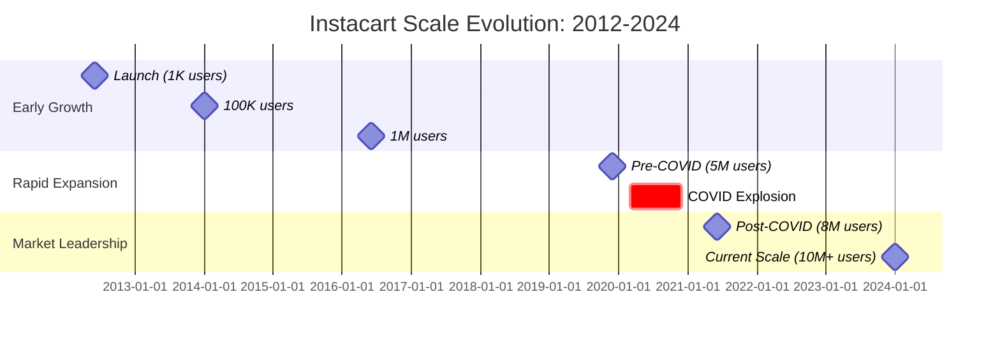
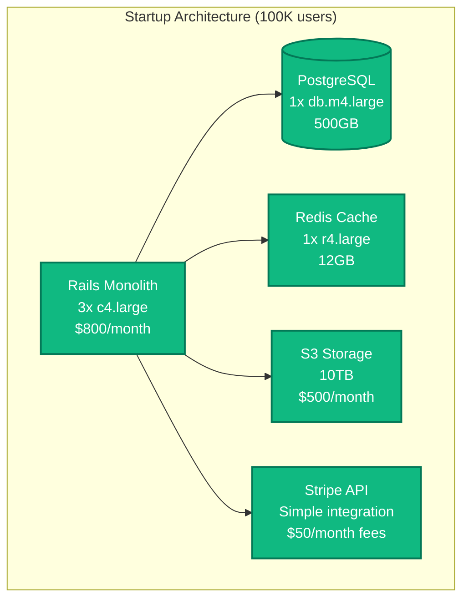
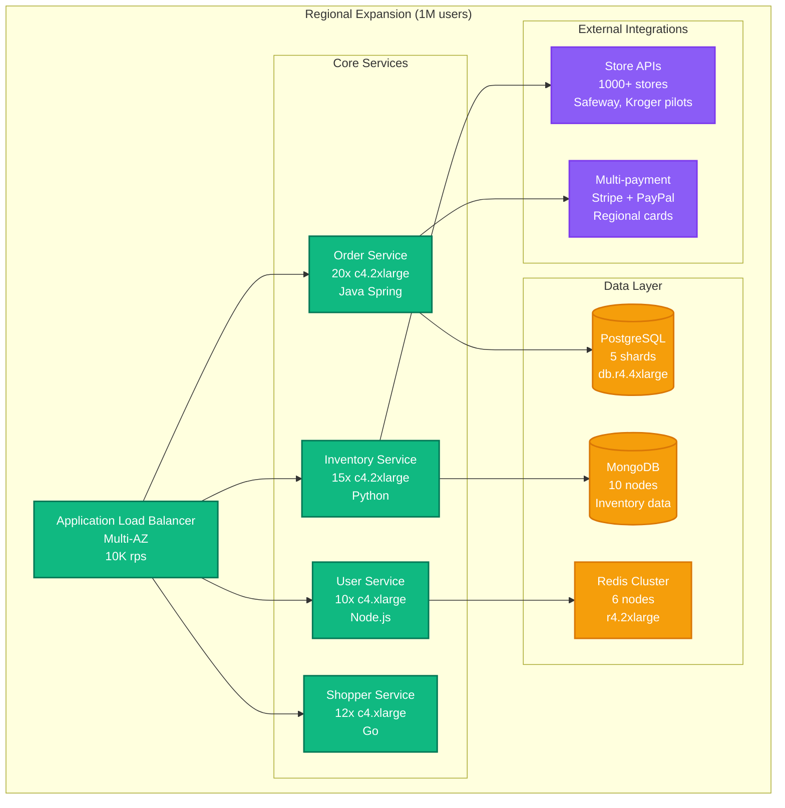
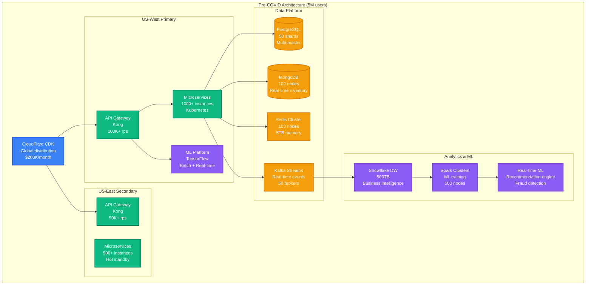
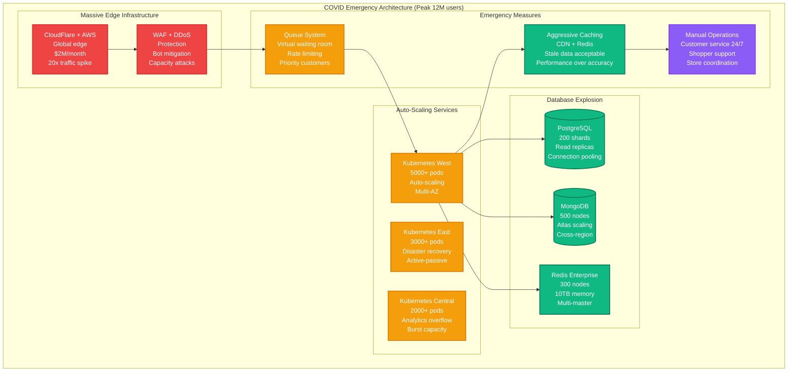
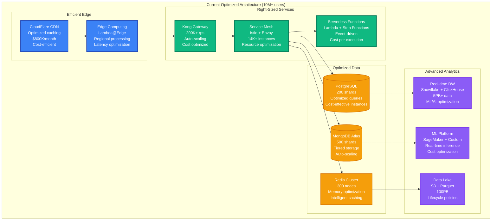
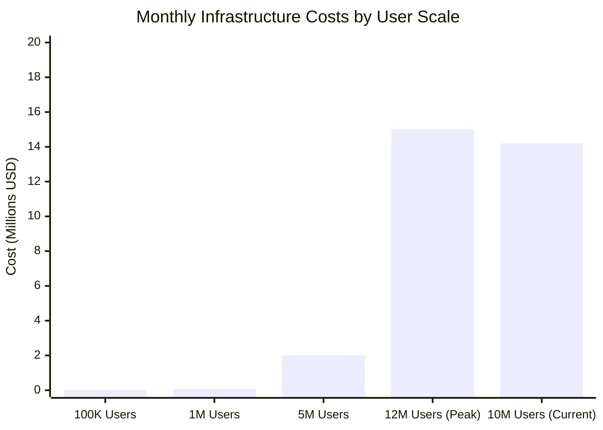
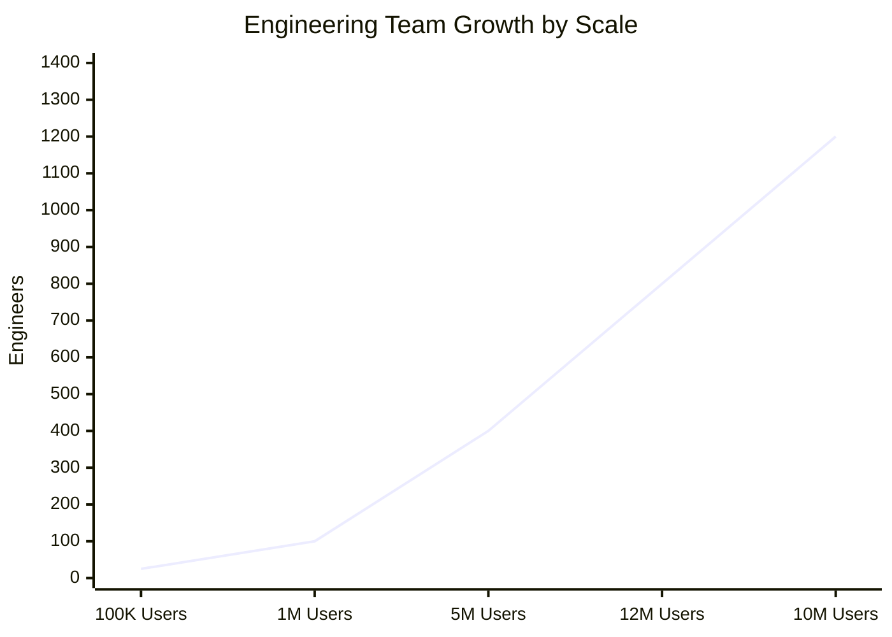

# Instacart - Scale Evolution

## Overview

Instacart's scale evolution from 1K to 10M+ users, driven by COVID-19 explosive growth (40x order volume in 2020), strategic partnerships with 80K+ stores, and technological innovations in real-time logistics coordination.

## Scale Evolution Timeline



## Architecture Evolution by Scale

### Phase 1: Startup Foundation (2012-2014)
**Users**: 1K → 100K
**Infrastructure**: Single region, monolithic application



**Key Metrics**:
- **Orders/day**: 500-1K
- **Active shoppers**: 100-500
- **Partner stores**: 10-50 local stores
- **Infrastructure cost**: $2K/month
- **Team size**: 8 engineers

**Major Challenges**:
- Manual shopper onboarding and training
- Basic store integrations (phone calls, fax)
- Single PostgreSQL database scaling limits
- Simple location matching without optimization

### Phase 2: Regional Expansion (2014-2017)
**Users**: 100K → 1M
**Infrastructure**: Multi-region, microservices adoption



**Key Metrics**:
- **Orders/day**: 10K-50K
- **Active shoppers**: 5K-20K
- **Partner stores**: 1K-5K stores
- **Infrastructure cost**: $50K/month
- **Team size**: 100 engineers

**Scaling Innovations**:
1. **Database Sharding**: User-based PostgreSQL sharding
2. **Inventory Management**: MongoDB for flexible product catalogs
3. **API-First Store Integration**: Partnership with major chains
4. **Basic ML**: Simple shopper-order matching algorithms

**Breaking Points Hit**:
- Monolithic deployment bottlenecks at 50K orders/day
- Database write contention during peak hours
- Manual inventory sync becoming unmanageable
- Customer support overwhelmed during outages

### Phase 3: Pre-COVID Scale (2017-2020)
**Users**: 1M → 5M
**Infrastructure**: Cloud-native, ML-driven optimization



**Key Metrics**:
- **Orders/day**: 500K-1M
- **Active shoppers**: 100K-200K
- **Partner stores**: 25K stores
- **Infrastructure cost**: $2M/month
- **Team size**: 400 engineers

**Strategic Investments**:
1. **ML-Driven Matching**: Advanced shopper-order optimization
2. **Real-time Inventory**: API partnerships with major retailers
3. **Demand Prediction**: Forecasting for capacity planning
4. **Mobile-First**: Native iOS/Android apps with offline capability

### Phase 4: COVID-19 Explosion (2020-2021)
**Users**: 5M → 8M (Peak: 12M during lockdowns)
**Infrastructure**: Emergency scaling, 40x growth handling



**COVID Crisis Timeline**:
- **March 2020**: 400% order increase in one week
- **April 2020**: Infrastructure emergency, 2-day SLA for orders
- **May 2020**: 600K new shoppers onboarded in one month
- **June 2020**: Virtual queue system deployed
- **December 2020**: New infrastructure stabilized

**Emergency Responses**:
1. **Virtual Queue**: Waiting room for high demand periods
2. **Shopper Surge**: Emergency recruitment, 500K → 1M shoppers
3. **Store Partnerships**: Rapid integration with additional 20K stores
4. **Infrastructure Scaling**: 10x server capacity in 3 months

**Key Metrics During Peak**:
- **Peak orders/day**: 5M+ (vs 1M pre-COVID)
- **Peak shoppers**: 1M+ active
- **Partner stores**: 45K stores
- **Infrastructure cost**: $15M/month
- **Engineering team**: 800 engineers (emergency hiring)

### Phase 5: Post-COVID Stabilization (2021-2024)
**Users**: 8M → 10M+ (Stabilized growth)
**Infrastructure**: Optimized for efficiency, sustainable scale



**Current Scale Metrics**:
- **Daily orders**: 2M+ (sustainable growth)
- **Active shoppers**: 500K (optimized utilization)
- **Partner stores**: 80K+ stores
- **Infrastructure cost**: $14.2M/month (optimized)
- **Engineering team**: 1,200+ engineers

## Scale-Specific Technical Challenges

### 100K → 1M Users: Database Scaling Crisis

**Challenge**: Single PostgreSQL database hitting limits
```sql
-- Problem: Single monolithic schema
-- 50K+ orders/day overwhelming single instance
-- Write bottleneck at peak shopping hours

-- Solution: Geographic sharding strategy
-- Shard by delivery zip code for data locality
CREATE TABLE orders_shard_001 (
    LIKE orders INCLUDING ALL
) INHERITS (orders);

-- Shard routing logic
SELECT shard_id FROM zip_code_shards
WHERE zip_code = customer_delivery_zip;

-- Result: 10x write capacity, regional optimization
```

### 1M → 5M Users: Inventory Synchronization

**Challenge**: Real-time inventory across 25K stores
- **Problem**: 15-minute batch updates causing overselling
- **Solution**: Event-driven inventory architecture

```python
# Event-driven inventory system
class InventoryEventProcessor:
    def __init__(self):
        self.kafka_consumer = KafkaConsumer('inventory-updates')
        self.redis_cluster = RedisCluster(nodes=redis_nodes)

    def process_inventory_update(self, event):
        """
        Process real-time inventory updates from store APIs
        Challenge: 25K stores × 5K products = 125M inventory records
        """
        store_id = event['store_id']
        product_id = event['product_id']
        quantity_change = event['quantity_change']

        # Update Redis cache (sub-second)
        cache_key = f"inventory:{store_id}:{product_id}"
        self.redis_cluster.hincrby(cache_key, 'quantity', quantity_change)

        # Update MongoDB (eventually consistent)
        self.inventory_db.update_one(
            {'store_id': store_id, 'product_id': product_id},
            {'$inc': {'quantity': quantity_change}},
            upsert=True
        )

        # Trigger availability notifications
        if self.check_low_stock(store_id, product_id):
            self.notify_customers_of_scarcity(store_id, product_id)
```

### 5M → 12M Users: COVID-19 Traffic Surge

**Challenge**: 40x order volume increase in 4 weeks
- **Problem**: Infrastructure not designed for this scale
- **Solution**: Emergency horizontal scaling + queue system

```python
# Virtual queue system for demand management
class VirtualQueueManager:
    def __init__(self):
        self.queue_capacity = 100000  # 100K concurrent users
        self.current_users = 0
        self.waiting_queue = deque()

    def handle_user_request(self, user_id, request_type):
        """
        COVID Challenge: 12M users trying to order simultaneously
        Normal capacity: 100K concurrent, Peak demand: 2M concurrent
        """
        if self.current_users < self.queue_capacity:
            return self.process_immediately(user_id, request_type)
        else:
            estimated_wait = self.calculate_wait_time()
            self.add_to_queue(user_id, estimated_wait)
            return {
                'status': 'queued',
                'estimated_wait_minutes': estimated_wait,
                'position': len(self.waiting_queue)
            }

    def calculate_wait_time(self):
        # Based on current queue length and average processing time
        avg_session_duration = 15  # minutes
        processing_rate = self.queue_capacity / avg_session_duration
        return len(self.waiting_queue) / processing_rate

    def process_queue(self):
        """Process waiting queue as capacity becomes available"""
        while self.waiting_queue and self.current_users < self.queue_capacity:
            user_id = self.waiting_queue.popleft()
            self.notify_user_ready(user_id)
            self.current_users += 1
```

## Infrastructure Cost Evolution

### Cost Scaling Analysis



### Cost Optimization Through Scale

| Scale Milestone | Major Cost Driver | Optimization Strategy | Savings Achieved |
|----------------|------------------|----------------------|------------------|
| **100K → 1M** | Database scaling | Sharding + read replicas | 60% per transaction |
| **1M → 5M** | Storage explosion | S3 lifecycle + compression | 40% storage costs |
| **5M → 12M** | Emergency scaling | Auto-scaling + spot instances | 30% compute costs |
| **12M → 10M** | Over-provisioning | Right-sizing + reserved instances | 45% total costs |

## Team and Organization Evolution

### Engineering Team Structure



### Organizational Transformation

#### 100K Users: Single Team
- **Structure**: Everyone does everything
- **Decision making**: Founder-led
- **Deployment**: Manual, weekly releases

#### 1M Users: Feature Teams
- **Structure**: iOS, Android, Backend, Data teams
- **Decision making**: Engineering manager led
- **Deployment**: Automated, daily releases

#### 5M Users: Platform + Product
- **Structure**: Platform teams + product verticals
- **Decision making**: Data-driven, A/B testing
- **Deployment**: Continuous deployment

#### 12M Users: Emergency Response
- **Structure**: War room organization, all-hands scaling
- **Decision making**: Crisis management protocols
- **Deployment**: Emergency patches, multiple daily

#### 10M Users: Sustainable Scale
- **Structure**: Autonomous teams with clear ownership
- **Decision making**: Distributed, metrics-driven
- **Deployment**: Continuous deployment with canary releases

### Key Hiring Waves

| Scale Trigger | Critical Roles | Business Impact | Timeline |
|---------------|----------------|-----------------|----------|
| 1M users | Senior Backend Engineers | Database scaling expertise | 6 months |
| 5M users | ML Engineers | Recommendation algorithms | 12 months |
| COVID surge | SRE + DevOps | Emergency scaling capability | 3 months |
| Post-COVID | Product Managers | Feature prioritization | 6 months |

## Future Scale Projections

### 15M Users Target (2025-2026)

**Projected Requirements**:
- **Daily orders**: 4M+ (2x current)
- **Infrastructure cost**: $25M/month
- **Engineering team**: 1,800 engineers
- **New challenges**: International expansion, regulatory compliance

### Technology Investments for Next Scale

```yaml
# Next-generation architecture investments
future_investments:
  edge_computing:
    investment: "$100M"
    timeline: "2024-2025"
    impact: "50% latency reduction"

  ai_automation:
    investment: "$200M"
    timeline: "2024-2026"
    impact: "80% operational efficiency"

  international_infrastructure:
    investment: "$150M"
    timeline: "2025-2027"
    impact: "Global market expansion"

  sustainability_initiatives:
    investment: "$50M"
    timeline: "2024-2025"
    impact: "Carbon neutral operations"
```

### Lessons Learned

1. **Plan for 10x, Build for 3x**: COVID taught the importance of elastic architecture
2. **Data Locality Matters**: Geographic sharding reduced latency and costs
3. **Partner Dependencies are Critical**: Store API reliability directly impacts customer experience
4. **Operational Excellence**: Monitoring and alerting systems saved millions during crises
5. **Team Scaling**: Hiring ahead of scale prevents bottlenecks

This scale evolution demonstrates Instacart's journey through hypergrowth, crisis management, and sustainable scaling while maintaining service quality across complex logistics and partnership networks.