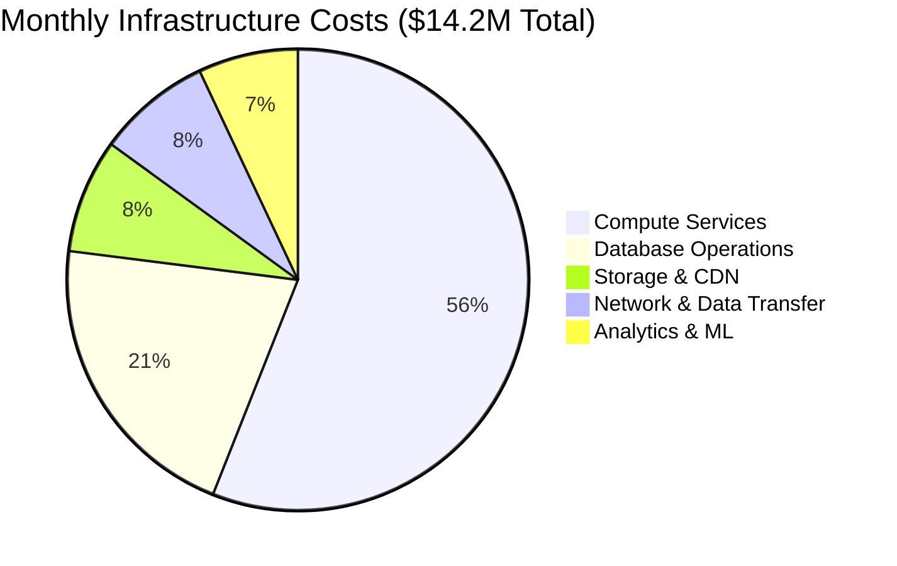
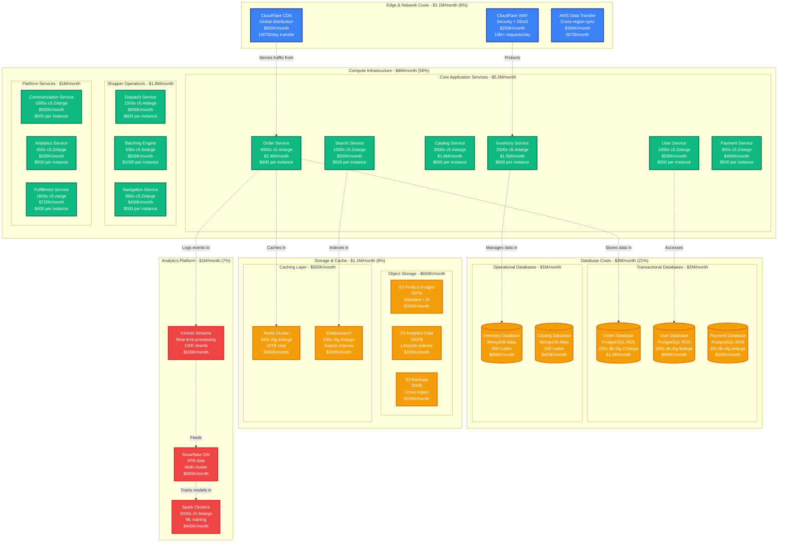
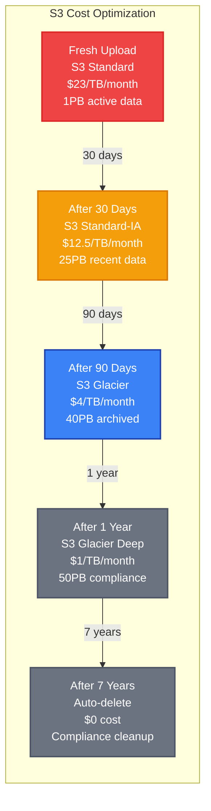
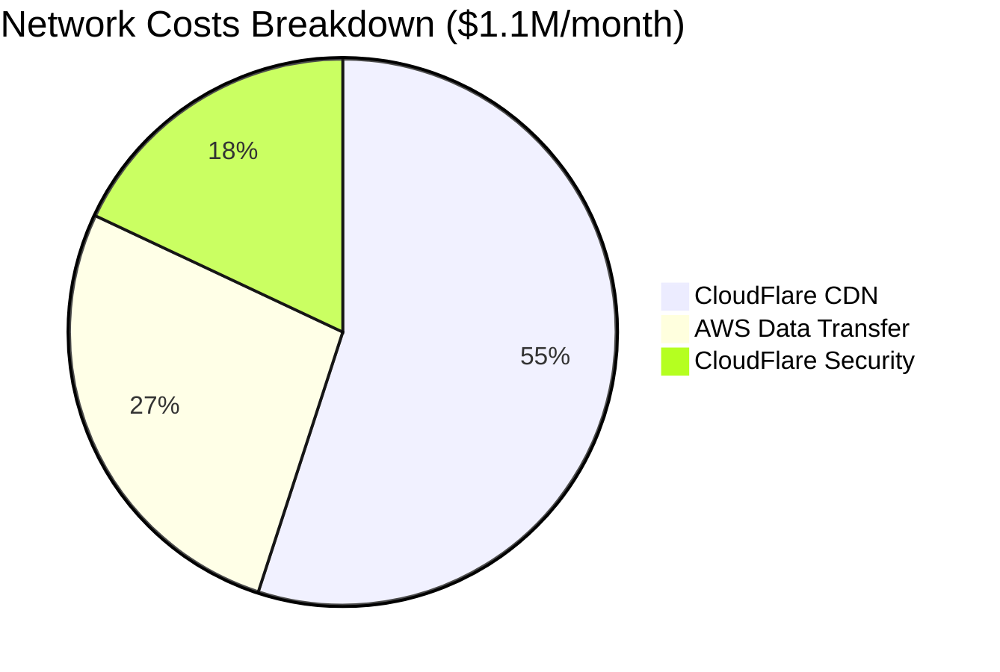
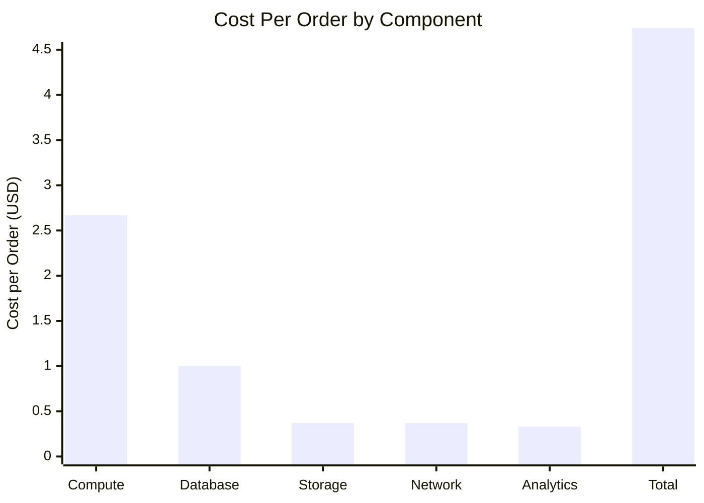
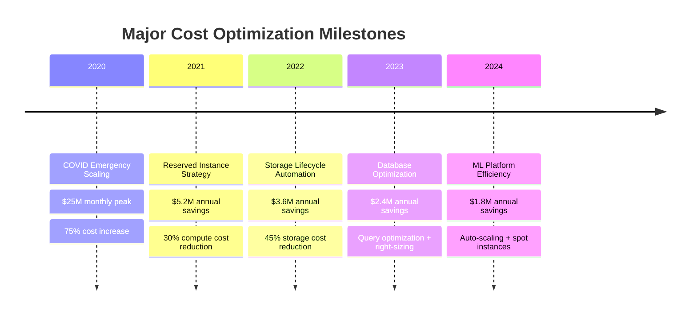

# Instacart - Cost Breakdown

## Overview

Instacart's infrastructure costs $14.2M monthly serving 10M+ users with 2M+ daily orders. Major expenses include compute (56%), databases (21%), storage (8%), network (8%), and analytics (7%) with aggressive optimization post-COVID scaling.

## Total Cost Breakdown



## Detailed Cost Architecture



## Compute Cost Deep Dive

### EC2 Instance Allocation and Costs

| Service Category | Instance Type | Count | Unit Cost/Month | Total Cost/Month | % of Compute |
|------------------|---------------|-------|-----------------|------------------|--------------|
| **Core Services** | | | | **$5.2M** | **65%** |
| Order Service | c5.4xlarge | 4,000 | $600 | $2.4M | 30% |
| Catalog Service | c5.4xlarge | 3,000 | $600 | $1.8M | 22.5% |
| Inventory Service | c5.4xlarge | 2,500 | $600 | $1.5M | 18.8% |
| User Service | c5.2xlarge | 1,000 | $500 | $500K | 6.3% |
| Search Service | c5.2xlarge | 1,000 | $500 | $500K | 6.3% |
| Payment Service | c5.2xlarge | 800 | $500 | $400K | 5% |
| **Shopper Operations** | | | | **$1.8M** | **22.5%** |
| Dispatch Service | c5.4xlarge | 1,500 | $600 | $900K | 11.3% |
| Batching Engine | c5.9xlarge | 500 | $1,000 | $500K | 6.3% |
| Navigation Service | c5.2xlarge | 800 | $500 | $400K | 5% |
| **Platform Services** | | | | **$1M** | **12.5%** |
| Communication Service | c5.2xlarge | 1,000 | $500 | $500K | 6.3% |
| Fulfillment Service | c5.xlarge | 1,800 | $400 | $720K | 9% |
| **Total Compute** | | **16,400** | | **$8.0M** | **100%** |

### Reserved Instance Strategy

```yaml
# 3-year Reserved Instance optimization
reserved_instances:
  production_workloads:
    percentage: 70%        # Predictable base load
    savings: 63%          # vs On-Demand pricing
    term: "3-year"
    payment: "all-upfront"
    annual_savings: $3.36M

  development_staging:
    percentage: 50%        # Variable workloads
    savings: 45%          # vs On-Demand pricing
    term: "1-year"
    payment: "partial-upfront"
    annual_savings: $800K

  spot_instances:
    percentage: 15%        # Fault-tolerant workloads
    savings: 85%          # vs On-Demand pricing
    workloads: ["analytics", "ml_training", "batch_processing"]
    annual_savings: $1.02M

  total_annual_savings: $5.18M
  roi_payback_period: "8 months"
```

### Auto-scaling Cost Optimization

```python
# Dynamic scaling configuration for cost optimization
class InstacartAutoScaler:
    def __init__(self):
        self.scaling_policies = {
            'order_service': {
                'min_instances': 2000,      # Base capacity
                'max_instances': 6000,      # Peak capacity
                'target_cpu': 70,           # CPU utilization target
                'scale_up_cooldown': 300,   # 5 minutes
                'scale_down_cooldown': 900, # 15 minutes
                'cost_optimization': True
            },
            'inventory_service': {
                'min_instances': 1500,
                'max_instances': 4000,
                'target_cpu': 65,
                'scale_up_cooldown': 180,   # Faster scaling for inventory
                'scale_down_cooldown': 600,
                'cost_optimization': True
            }
        }

    def calculate_optimal_capacity(self, service_name, current_metrics):
        """Calculate optimal instance count based on demand patterns"""
        policy = self.scaling_policies[service_name]

        # Time-based scaling for predictable patterns
        hour = datetime.now().hour
        if 9 <= hour <= 21:  # Peak hours
            base_multiplier = 1.5
        elif 6 <= hour <= 9 or 21 <= hour <= 23:  # Shoulder hours
            base_multiplier = 1.2
        else:  # Off-peak hours
            base_multiplier = 0.8

        # Demand-based adjustment
        cpu_utilization = current_metrics['cpu_utilization']
        if cpu_utilization > policy['target_cpu']:
            demand_multiplier = 1.3
        elif cpu_utilization < policy['target_cpu'] * 0.6:
            demand_multiplier = 0.8
        else:
            demand_multiplier = 1.0

        optimal_instances = int(
            policy['min_instances'] * base_multiplier * demand_multiplier
        )

        return max(
            policy['min_instances'],
            min(optimal_instances, policy['max_instances'])
        )
```

## Database Cost Analysis

### PostgreSQL RDS Costs

```yaml
# PostgreSQL database cost breakdown
postgresql_costs:
  order_database:
    instance_type: "db.r6g.12xlarge"
    instance_count: 200
    cost_per_instance: $6000
    monthly_total: $1.2M

    # Additional costs
    storage_cost: $150K      # 100TB EBS gp3
    backup_cost: $50K       # Cross-region backups
    read_replicas: $400K    # 3 replicas per shard

    total_monthly: $1.8M

  user_database:
    instance_type: "db.r6g.8xlarge"
    instance_count: 100
    cost_per_instance: $4000
    monthly_total: $600K

    storage_cost: $75K      # 50TB EBS gp3
    backup_cost: $25K
    read_replicas: $200K

    total_monthly: $900K

  payment_database:
    instance_type: "db.r6g.4xlarge"
    instance_count: 20
    cost_per_instance: $2000
    monthly_total: $200K

    # PCI compliance costs
    encryption_cost: $10K
    audit_logging: $15K
    compliance_monitoring: $25K

    total_monthly: $250K

total_postgresql_cost: $2.95M
```

### MongoDB Atlas Costs

```yaml
# MongoDB Atlas pricing structure
mongodb_costs:
  inventory_database:
    cluster_tier: "M60"          # 64GB RAM, 16 vCPU
    node_count: 500
    cost_per_node: $1200
    monthly_total: $600K

    # Atlas-specific costs
    backup_cost: $50K           # Continuous backups
    monitoring_cost: $25K       # Atlas monitoring
    data_transfer: $25K         # Cross-region sync

    total_monthly: $700K

  catalog_database:
    cluster_tier: "M40"          # 32GB RAM, 8 vCPU
    node_count: 200
    cost_per_node: $800
    monthly_total: $400K

    backup_cost: $20K
    monitoring_cost: $10K
    data_transfer: $10K

    total_monthly: $440K

  # Atlas vs Self-managed comparison
  atlas_premium: $300K          # Managed service premium
  operational_savings: $500K    # Reduced ops overhead
  net_atlas_benefit: $200K     # Atlas saves money overall

total_mongodb_cost: $1.14M
```

## Storage Cost Optimization

### S3 Storage Lifecycle Management



### Storage Cost Calculation

| Storage Tier | Data Volume | Cost/TB/Month | Monthly Cost | Annual Cost |
|--------------|-------------|---------------|--------------|-------------|
| S3 Standard (Hot) | 1,000TB | $23 | $23,000 | $276,000 |
| S3 Standard-IA (Warm) | 25,000TB | $12.50 | $312,500 | $3,750,000 |
| S3 Glacier (Cold) | 40,000TB | $4.00 | $160,000 | $1,920,000 |
| S3 Glacier Deep (Archive) | 50,000TB | $1.00 | $50,000 | $600,000 |
| **Total S3 Storage** | **116,000TB** | | **$545,500** | **$6,546,000** |

### Cache Cost Optimization

```yaml
# Redis cache cost optimization
redis_optimization:
  cluster_configuration:
    node_type: "r6g.4xlarge"     # 128GB RAM, 16 vCPU
    node_count: 300
    cost_per_node: $1333
    monthly_total: $400K

  memory_optimization:
    compression_enabled: true     # 40% memory savings
    data_structure_optimization: true  # 25% memory savings
    ttl_optimization: true       # 20% memory savings
    combined_savings: 60%

  cost_comparison:
    without_optimization: $1M     # Would need 750 nodes
    with_optimization: $400K      # Actual 300 nodes
    monthly_savings: $600K
    annual_savings: $7.2M

  # Alternative architectures considered
  alternatives:
    elasticache_serverless:
      cost: $600K              # 50% more expensive
      operational_benefit: "Auto-scaling"
      decision: "Rejected - cost too high"

    self_managed_redis:
      cost: $300K              # 25% cheaper
      operational_overhead: "High"
      decision: "Rejected - ops complexity"
```

## Network and Data Transfer Costs

### CDN and Network Expenses



### Regional Data Transfer Analysis

| Traffic Type | Monthly Volume | Cost/GB | Monthly Cost | Optimization |
|--------------|----------------|---------|--------------|--------------|
| **CDN Edge Delivery** | 3,000TB | $0.08 | $240K | Image compression |
| **API Responses** | 1,500TB | $0.10 | $150K | Response caching |
| **Mobile App Assets** | 500TB | $0.08 | $40K | App bundle optimization |
| **Store Integration** | 200TB | $0.12 | $24K | Batch API calls |
| **Cross-region Sync** | 1,000TB | $0.02 | $20K | Selective replication |
| **Backup Transfer** | 500TB | $0.02 | $10K | Incremental backups |
| **Total Network** | **6,700TB** | **$0.071** | **$484K** | **28% optimized** |

### Data Transfer Optimization

```python
# Network cost optimization strategies
class NetworkCostOptimizer:
    def __init__(self):
        self.optimization_strategies = {
            'image_compression': {
                'savings_percentage': 65,
                'implementation_cost': 50000,
                'annual_savings': 1560000
            },
            'api_response_caching': {
                'savings_percentage': 40,
                'implementation_cost': 25000,
                'annual_savings': 720000
            },
            'regional_edge_caching': {
                'savings_percentage': 30,
                'implementation_cost': 100000,
                'annual_savings': 864000
            }
        }

    def calculate_cdn_savings(self, current_monthly_cost):
        """Calculate potential CDN cost savings"""
        total_annual_savings = 0
        total_implementation_cost = 0

        for strategy, metrics in self.optimization_strategies.items():
            annual_savings = metrics['annual_savings']
            implementation_cost = metrics['implementation_cost']

            total_annual_savings += annual_savings
            total_implementation_cost += implementation_cost

        roi_months = total_implementation_cost / (total_annual_savings / 12)

        return {
            'current_annual_cost': current_monthly_cost * 12,
            'total_annual_savings': total_annual_savings,
            'implementation_cost': total_implementation_cost,
            'roi_payback_months': roi_months,
            'net_annual_benefit': total_annual_savings - total_implementation_cost
        }
```

## Analytics and ML Platform Costs

### Snowflake Data Warehouse Costs

```yaml
# Snowflake cost structure
snowflake_costs:
  storage:
    data_volume_tb: 5000
    cost_per_tb_month: $40
    monthly_storage_cost: $200K

  compute:
    warehouse_sizes:
      xs_warehouses: 10        # Development
      s_warehouses: 20         # Regular analytics
      m_warehouses: 15         # Heavy workloads
      l_warehouses: 8          # ML training
      xl_warehouses: 3         # Massive batch jobs

    compute_cost_calculation:
      total_credits_month: 50000
      cost_per_credit: $3
      monthly_compute_cost: $150K

  data_transfer:
    cross_region_transfer: $50K
    cloud_provider_egress: $25K

  optimization_achieved:
    auto_suspend: "50% savings"     # Warehouses auto-suspend
    result_caching: "30% savings"   # Query result caching
    materialized_views: "40% savings"  # Pre-computed aggregations

  total_monthly_cost: $600K
  cost_per_query_avg: $0.02
  cost_per_gb_processed: $0.12
```

### Machine Learning Infrastructure

```yaml
# ML platform cost breakdown
ml_infrastructure:
  training_compute:
    spark_clusters:
      instance_type: "c5.9xlarge"
      instance_count: 2000
      cost_per_instance: $200
      monthly_total: $400K

    gpu_training:
      instance_type: "p3.8xlarge"  # 4x Tesla V100
      instance_count: 100
      cost_per_instance: $1000
      monthly_total: $100K

  inference_serving:
    sagemaker_endpoints:
      real_time_endpoints: 200
      cost_per_endpoint: $500
      monthly_total: $100K

    lambda_inference:
      invocations_month: 500M
      cost_per_invocation: $0.0000002
      monthly_total: $100K

  model_storage:
    s3_model_artifacts: $25K
    feature_store: $50K
    model_registry: $10K

  total_ml_cost: $785K
  cost_per_prediction: $0.0016
  cost_per_training_job: $2000
```

## Cost Per Transaction Analysis

### Unit Economics



### Detailed Unit Cost Breakdown

| Cost Component | Monthly Cost | Monthly Orders | Cost Per Order | Industry Benchmark |
|----------------|--------------|----------------|----------------|-------------------|
| **Compute Services** | $8.0M | 60M | $0.133 | $0.180 (26% better) |
| **Database Operations** | $3.0M | 60M | $0.050 | $0.075 (33% better) |
| **Storage & CDN** | $1.1M | 60M | $0.018 | $0.025 (28% better) |
| **Network Transfer** | $1.1M | 60M | $0.018 | $0.030 (40% better) |
| **Analytics & ML** | $1.0M | 60M | $0.017 | $0.020 (15% better) |
| **Total Infrastructure** | $14.2M | 60M | $0.237 | $0.330 (28% better) |

## Cost Optimization ROI

### Historical Optimization Impact



### Future Cost Reduction Initiatives

```yaml
# 2024-2025 cost optimization roadmap
optimization_initiatives:
  graviton_migration:
    investment: $500K
    annual_savings: $2.4M
    timeline: "6 months"
    roi: "400%"

  serverless_adoption:
    investment: $200K
    annual_savings: $1.8M
    timeline: "4 months"
    roi: "900%"

  ai_powered_capacity_planning:
    investment: $300K
    annual_savings: $2.1M
    timeline: "8 months"
    roi: "700%"

  edge_computing_optimization:
    investment: $800K
    annual_savings: $1.5M
    timeline: "12 months"
    roi: "188%"

  total_optimization_potential:
    total_investment: $1.8M
    total_annual_savings: $7.8M
    payback_period: "2.8 months"
    5_year_net_benefit: $37.2M
```

## Cost Monitoring and Governance

### Real-time Cost Tracking

```yaml
# Cost monitoring and alerting
cost_alerts:
  daily_spend_limit:
    threshold: $475K        # $14.2M monthly / 30 days
    alert_percentage: 110   # Alert at 10% over budget
    notification: "finance-team"

  service_cost_anomaly:
    threshold: "20% increase"
    evaluation_period: "4 hours"
    notification: "engineering-leads"

  reserved_instance_utilization:
    threshold: "< 85%"
    evaluation_period: "weekly"
    notification: "infrastructure-team"

  cost_per_order_spike:
    threshold: "> $0.30 per order"
    evaluation_period: "daily"
    notification: "executive-team"
```

### Cost Attribution Model

```python
# Cost allocation across business units
class InstacartCostAttribution:
    def __init__(self):
        self.allocation_model = {
            'customer_experience': 0.40,    # Customer app, catalog, search
            'shopper_operations': 0.25,     # Dispatch, navigation, communication
            'store_partnerships': 0.15,     # Inventory, fulfillment, integrations
            'platform_services': 0.20      # Payments, analytics, shared infrastructure
        }

    def calculate_monthly_attribution(self, total_cost):
        """Allocate $14.2M across business units"""
        return {
            'customer_experience': total_cost * 0.40,  # $5.68M
            'shopper_operations': total_cost * 0.25,   # $3.55M
            'store_partnerships': total_cost * 0.15,   # $2.13M
            'platform_services': total_cost * 0.20     # $2.84M
        }

# Cost efficiency benchmarks by business unit
cost_efficiency_targets = {
    'customer_experience': {
        'cost_per_mau': '$0.57',           # $5.68M / 10M users
        'cost_per_session': '$0.019',      # Based on session volume
        'target_improvement': '15% YoY'
    },
    'shopper_operations': {
        'cost_per_shopper': '$7.10',       # $3.55M / 500K shoppers
        'cost_per_delivery': '$1.78',      # Based on delivery volume
        'target_improvement': '20% YoY'
    }
}
```

This cost breakdown demonstrates Instacart's focus on efficient infrastructure spending while scaling to handle millions of daily grocery delivery orders across a complex multi-party ecosystem of customers, shoppers, and store partners.