# Instacart - Production Operations

## Overview

Instacart operates 10M+ user infrastructure with 99.95% uptime across 80K+ stores, deploying 200+ times daily through automated pipelines, with 24/7 SRE coverage handling 2M+ daily orders across complex multi-party logistics coordination.

## Production Operations Architecture

```mermaid
graph TB
    subgraph "Development Pipeline - Code to Production"
        DEV[Developer Workstation<br/>IntelliJ + VS Code<br/>Local dev environment<br/>Docker compose setup]
        GIT[Git Version Control<br/>GitHub Enterprise<br/>Feature branch workflow<br/>Automated testing triggers]
        CICD[CI/CD Pipeline<br/>Jenkins + Spinnaker<br/>200+ deploys/day<br/>Canary deployments]
    end

    subgraph "Build and Test Infrastructure"
        BUILD[Build System<br/>Maven + Gradle<br/>Docker containerization<br/>Multi-language support]
        TEST[Testing Framework<br/>Unit + Integration<br/>End-to-end automation<br/>Load testing]
        SECURITY[Security Pipeline<br/>Veracode SAST<br/>Snyk dependency scan<br/>Container security]
        QUALITY[Quality Gates<br/>SonarQube analysis<br/>Code coverage >80%<br/>Performance benchmarks]
    end

    subgraph "Deployment Infrastructure"
        STAGING[Staging Environment<br/>Production mirror<br/>Full integration testing<br/>Partner API simulation]
        CANARY[Canary Deployment<br/>1% → 10% → 50% → 100%<br/>Automated rollback<br/>Real-time monitoring]
        PROD[Production Deployment<br/>Kubernetes clusters<br/>Multi-region rollout<br/>Zero-downtime updates]
    end

    subgraph "Observability Platform"
        METRICS[Metrics Collection<br/>DataDog + New Relic<br/>Business KPIs<br/>Custom dashboards]
        LOGGING[Centralized Logging<br/>Splunk Enterprise<br/>50TB/day ingestion<br/>Real-time analysis]
        TRACING[Distributed Tracing<br/>Jaeger + Zipkin<br/>Request flow tracking<br/>Performance analysis]
        ALERTING[Intelligent Alerting<br/>PagerDuty integration<br/>ML-powered anomaly detection<br/>Escalation policies]
    end

    subgraph "Incident Management"
        ONCALL[Follow-the-Sun On-call<br/>24/7 SRE coverage<br/>Global team rotation<br/>Escalation matrix]
        WARROOM[War Room Coordination<br/>Slack + Zoom integration<br/>Real-time collaboration<br/>Decision tracking]
        COMMUNICATION[Customer Communication<br/>Status page updates<br/>Proactive notifications<br/>Stakeholder updates]
        POSTMORTEM[Blameless Postmortems<br/>Root cause analysis<br/>Action item tracking<br/>Learning culture]
    end

    %% Pipeline Flow
    DEV --> GIT --> CICD
    CICD --> BUILD --> TEST --> SECURITY --> QUALITY
    QUALITY --> STAGING --> CANARY --> PROD

    %% Observability Integration
    PROD --> METRICS
    PROD --> LOGGING
    PROD --> TRACING
    METRICS --> ALERTING

    %% Incident Response Flow
    ALERTING --> ONCALL
    ONCALL --> WARROOM
    WARROOM --> COMMUNICATION
    COMMUNICATION --> POSTMORTEM

    %% Apply 4-plane colors
    classDef edgeStyle fill:#3B82F6,stroke:#1E40AF,color:#fff,stroke-width:2px
    classDef serviceStyle fill:#10B981,stroke:#047857,color:#fff,stroke-width:2px
    classDef stateStyle fill:#F59E0B,stroke:#D97706,color:#fff,stroke-width:2px
    classDef controlStyle fill:#8B5CF6,stroke:#7C3AED,color:#fff,stroke-width:2px

    class DEV,GIT edgeStyle
    class CICD,BUILD,TEST,SECURITY,QUALITY,STAGING,CANARY,PROD serviceStyle
    class METRICS,LOGGING,TRACING stateStyle
    class ALERTING,ONCALL,WARROOM,COMMUNICATION,POSTMORTEM controlStyle
```



## Continuous Integration and Deployment

### Jenkins Pipeline Configuration

```yaml
# Jenkinsfile for Instacart microservices
pipeline {
    agent {
        kubernetes {
            yaml """
                apiVersion: v1
                kind: Pod
                spec:
                  containers:
                  - name: maven
                    image: maven:3.8-openjdk-17
                    command: ['cat']
                    tty: true
                  - name: docker
                    image: docker:20.10
                    command: ['cat']
                    tty: true
                    volumeMounts:
                    - mountPath: /var/run/docker.sock
                      name: docker-sock
                  volumes:
                  - name: docker-sock
                    hostPath:
                      path: /var/run/docker.sock
            """
        }
    }

    environment {
        REGISTRY = "gcr.io/instacart-production"
        SERVICE_NAME = "${env.JOB_NAME.split('/')[0]}"
        BUILD_NUMBER = "${env.BUILD_NUMBER}"
        GIT_COMMIT = "${env.GIT_COMMIT.take(7)}"
    }

    stages {
        stage('Build and Test') {
            parallel {
                stage('Unit Tests') {
                    steps {
                        container('maven') {
                            sh 'mvn clean test -Dspring.profiles.active=test'
                            publishTestResults testResultsPattern: 'target/surefire-reports/*.xml'
                            publishCoverage adapters: [jacocoAdapter('target/site/jacoco/jacoco.xml')]
                        }
                    }
                }

                stage('Integration Tests') {
                    steps {
                        container('maven') {
                            sh 'mvn verify -Pintegration-tests -Dspring.profiles.active=integration'
                        }
                    }
                }

                stage('Security Scan') {
                    steps {
                        container('maven') {
                            sh 'mvn dependency-check:check'
                            sh 'mvn sonar:sonar -Dsonar.projectKey=${SERVICE_NAME}'
                        }
                    }
                }
            }
        }

        stage('Build Container') {
            when {
                anyOf {
                    branch 'main'
                    branch 'release/*'
                }
            }
            steps {
                container('docker') {
                    script {
                        def image = docker.build("${REGISTRY}/${SERVICE_NAME}:${BUILD_NUMBER}")
                        docker.withRegistry('https://gcr.io', 'gcr:instacart-production') {
                            image.push()
                            image.push("latest")
                            image.push("${GIT_COMMIT}")
                        }
                    }
                }
            }
        }

        stage('Deploy to Staging') {
            when { branch 'main' }
            steps {
                script {
                    build job: 'deploy-to-staging',
                          parameters: [
                              string(name: 'SERVICE_NAME', value: SERVICE_NAME),
                              string(name: 'IMAGE_TAG', value: BUILD_NUMBER)
                          ]
                }
            }
        }

        stage('Automated Testing') {
            when { branch 'main' }
            steps {
                script {
                    // Run end-to-end tests against staging
                    build job: 'e2e-test-suite',
                          parameters: [
                              string(name: 'TARGET_ENV', value: 'staging'),
                              string(name: 'SERVICE_VERSION', value: BUILD_NUMBER)
                          ]

                    // Performance baseline testing
                    build job: 'performance-tests',
                          parameters: [
                              string(name: 'TARGET_ENV', value: 'staging'),
                              string(name: 'BASELINE_VERSION', value: 'production')
                          ]
                }
            }
        }

        stage('Production Deployment Approval') {
            when { branch 'main' }
            steps {
                script {
                    def deployApproval = input(
                        message: 'Deploy to Production?',
                        parameters: [
                            choice(
                                name: 'DEPLOYMENT_STRATEGY',
                                choices: ['canary', 'blue-green', 'rolling'],
                                description: 'Choose deployment strategy'
                            )
                        ]
                    )
                }
            }
        }

        stage('Deploy to Production') {
            when { branch 'main' }
            steps {
                script {
                    build job: 'deploy-to-production',
                          parameters: [
                              string(name: 'SERVICE_NAME', value: SERVICE_NAME),
                              string(name: 'IMAGE_TAG', value: BUILD_NUMBER),
                              string(name: 'STRATEGY', value: deployApproval)
                          ]
                }
            }
        }
    }

    post {
        always {
            cleanWs()
        }
        success {
            slackSend(
                channel: '#deployments',
                color: 'good',
                message: "✅ ${SERVICE_NAME} v${BUILD_NUMBER} deployed successfully"
            )
        }
        failure {
            slackSend(
                channel: '#deployments',
                color: 'danger',
                message: "❌ ${SERVICE_NAME} deployment failed. Build: ${BUILD_URL}"
            )
        }
    }
}
```

### Spinnaker Deployment Pipeline

```yaml
# Spinnaker pipeline for production deployments
name: "instacart-service-deployment"
application: "instacart"
description: "Production deployment with canary analysis"

stages:
  - name: "Deploy Canary"
    type: "deployManifest"
    account: "kubernetes-production"
    cloudProvider: "kubernetes"
    source: "text"
    manifests:
      - |
        apiVersion: apps/v1
        kind: Deployment
        metadata:
          name: ${parameters.serviceName}-canary
          namespace: production
          annotations:
            deployment.kubernetes.io/revision: "${trigger.buildInfo.number}"
        spec:
          replicas: ${ parameters.serviceName == 'order-service' ? 100 : 50 }
          selector:
            matchLabels:
              app: ${parameters.serviceName}
              version: canary
          template:
            metadata:
              labels:
                app: ${parameters.serviceName}
                version: canary
            spec:
              containers:
              - name: ${parameters.serviceName}
                image: gcr.io/instacart-production/${parameters.serviceName}:${trigger.buildInfo.number}
                ports:
                - containerPort: 8080
                env:
                - name: SPRING_PROFILES_ACTIVE
                  value: "production,canary"
                resources:
                  requests:
                    memory: "1Gi"
                    cpu: "500m"
                  limits:
                    memory: "2Gi"
                    cpu: "1000m"

  - name: "Canary Analysis"
    type: "kayentaCanary"
    canaryConfig:
      scopes:
        - scope: "default"
          location: "us-west-2"
          start: "${#stage('Deploy Canary')['startTime']}"
          end: "${#stage('Deploy Canary')['endTime'] + 600000}"  # 10 minutes
      scoreThresholds:
        pass: 75
        marginal: 50
      canaryAnalysisInterval: "PT5M"  # 5 minutes
      metrics:
        - name: "error_rate"
          query: "sum(rate(http_requests_total{job='${parameters.serviceName}',status=~'5..'}[5m])) / sum(rate(http_requests_total{job='${parameters.serviceName}'}[5m]))"
          threshold: 0.01  # 1% error rate threshold
        - name: "response_time_p99"
          query: "histogram_quantile(0.99, rate(http_request_duration_seconds_bucket{job='${parameters.serviceName}'}[5m]))"
          threshold: 0.5   # 500ms P99 threshold
        - name: "throughput"
          query: "sum(rate(http_requests_total{job='${parameters.serviceName}'}[5m]))"
          threshold: -0.1  # Allow 10% throughput decrease

  - name: "Manual Judgment"
    type: "manualJudgment"
    instructions: "Review canary metrics and approve/reject production rollout"
    judgmentInputs:
      - "Approve - Continue with full deployment"
      - "Reject - Rollback canary"
    dependsOn: ["Canary Analysis"]

  - name: "Deploy Production"
    type: "deployManifest"
    account: "kubernetes-production"
    dependsOn: ["Manual Judgment"]
    stageEnabled:
      expression: "${ #judgment('Manual Judgment') == 'Approve - Continue with full deployment' }"
    trafficManagement:
      enabled: true
      options:
        enableTraffic: true
        strategy: "redblack"  # Blue-green deployment

  - name: "Verify Deployment"
    type: "script"
    command: |
      #!/bin/bash
      # Health check verification
      for i in {1..30}; do
        response=$(curl -s -o /dev/null -w "%{http_code}" \
          http://${parameters.serviceName}.production.svc.cluster.local:8080/health)
        if [ $response -eq 200 ]; then
          echo "Health check passed"
          exit 0
        fi
        echo "Attempt $i: Health check failed (HTTP $response), retrying..."
        sleep 10
      done
      echo "Health check failed after 5 minutes"
      exit 1

  - name: "Cleanup Canary"
    type: "deleteManifest"
    account: "kubernetes-production"
    kinds: ["deployment"]
    labelSelectors:
      - "app=${parameters.serviceName},version=canary"
    dependsOn: ["Verify Deployment"]
```

## Monitoring and Observability

### DataDog Dashboard Configuration

```yaml
# DataDog dashboard for Instacart production monitoring
dashboard:
  title: "Instacart Production Overview"
  description: "High-level production metrics and business KPIs"

  widgets:
    # Business Metrics
    - title: "Orders per Minute"
      type: "timeseries"
      query: "sum:instacart.orders.placed.count{*}.as_rate()"
      display_type: "line"
      time_window: "1h"
      alert_threshold: 1000  # Alert if < 1000 orders/minute during peak

    - title: "Active Shoppers"
      type: "query_value"
      query: "sum:instacart.shoppers.active{*}"
      alert_threshold: 20000  # Alert if < 20K active shoppers

    - title: "Order Success Rate"
      type: "query_value"
      query: "sum:instacart.orders.completed{*} / sum:instacart.orders.placed{*} * 100"
      alert_threshold: 95  # Alert if success rate < 95%

    # Infrastructure Metrics
    - title: "Service Response Times"
      type: "timeseries"
      queries:
        - "avg:instacart.service.response_time{service:order-service}.as_rate()"
        - "avg:instacart.service.response_time{service:inventory-service}.as_rate()"
        - "avg:instacart.service.response_time{service:dispatch-service}.as_rate()"
      display_type: "line"

    - title: "Database Performance"
      type: "timeseries"
      queries:
        - "avg:postgresql.connections.used{*}"
        - "avg:postgresql.queries.duration{*}"
        - "avg:mongodb.operations.query.avg_time{*}"

    - title: "Error Rates by Service"
      type: "toplist"
      query: "top(sum:instacart.service.errors{*} by {service}, 10, 'mean', 'desc')"

    # Customer Experience
    - title: "Customer App Performance"
      type: "timeseries"
      queries:
        - "avg:instacart.mobile.app.launch_time{*}"
        - "avg:instacart.mobile.app.crash_rate{*}"
        - "avg:instacart.mobile.checkout.completion_time{*}"

    - title: "Shopper App Performance"
      type: "timeseries"
      queries:
        - "avg:instacart.shopper.assignment_time{*}"
        - "avg:instacart.shopper.navigation_accuracy{*}"
        - "avg:instacart.shopper.communication_latency{*}"

  alerts:
    - name: "High Order Failure Rate"
      query: "sum:instacart.orders.failed{*}.as_rate() > 50"
      message: "Order failure rate is above 50/minute. Check order service and payment systems."

    - name: "Database Connection Pool Exhaustion"
      query: "avg:postgresql.connections.used_pct{*} > 90"
      message: "Database connection pool usage > 90%. Scale up connection pool or investigate connection leaks."

    - name: "Store API Integration Failure"
      query: "sum:instacart.store_api.errors{*}.as_rate() > 100"
      message: "Store API integration errors > 100/minute. Check store partner API status."
```

### Custom Metrics Collection

```python
# Production metrics collection system
from datadog import initialize, statsd
import time
import functools

# Initialize DataDog client
initialize(
    api_key=os.getenv('DATADOG_API_KEY'),
    app_key=os.getenv('DATADOG_APP_KEY'),
    host_name=os.getenv('HOSTNAME')
)

class InstacartMetrics:
    def __init__(self):
        self.statsd_client = statsd

    def order_placed(self, customer_id, store_id, order_value, item_count):
        """Track order placement metrics"""
        tags = [
            f'store_id:{store_id}',
            f'customer_segment:{self.get_customer_segment(customer_id)}',
            f'order_size:{self.categorize_order_size(item_count)}'
        ]

        # Order count
        self.statsd_client.increment('instacart.orders.placed', tags=tags)

        # Order value
        self.statsd_client.histogram('instacart.orders.value', order_value, tags=tags)

        # Item count
        self.statsd_client.histogram('instacart.orders.item_count', item_count, tags=tags)

    def shopper_assignment(self, assignment_time_ms, shopper_id, order_id):
        """Track shopper assignment performance"""
        tags = [
            f'shopper_tier:{self.get_shopper_tier(shopper_id)}',
            f'region:{self.get_region_from_order(order_id)}'
        ]

        # Assignment time
        self.statsd_client.histogram(
            'instacart.shopper.assignment_time',
            assignment_time_ms,
            tags=tags
        )

        # Active shoppers count
        self.statsd_client.gauge(
            'instacart.shoppers.active',
            self.get_active_shopper_count(),
            tags=[f'region:{self.get_region_from_order(order_id)}']
        )

    def inventory_sync_performance(self, store_id, sync_duration_ms, items_updated):
        """Track inventory synchronization metrics"""
        tags = [f'store_id:{store_id}', f'store_chain:{self.get_store_chain(store_id)}']

        # Sync duration
        self.statsd_client.histogram(
            'instacart.inventory.sync_duration',
            sync_duration_ms,
            tags=tags
        )

        # Items updated
        self.statsd_client.histogram(
            'instacart.inventory.items_updated',
            items_updated,
            tags=tags
        )

        # Inventory staleness
        staleness_minutes = self.calculate_inventory_staleness(store_id)
        self.statsd_client.gauge(
            'instacart.inventory.staleness_minutes',
            staleness_minutes,
            tags=tags
        )

    def track_api_performance(self, endpoint, method, status_code, duration_ms):
        """Track API endpoint performance"""
        tags = [
            f'endpoint:{endpoint}',
            f'method:{method}',
            f'status_code:{status_code}',
            f'status_class:{status_code // 100}xx'
        ]

        # Request count
        self.statsd_client.increment('instacart.api.requests', tags=tags)

        # Response time
        self.statsd_client.histogram('instacart.api.response_time', duration_ms, tags=tags)

        # Error rate
        if status_code >= 400:
            self.statsd_client.increment('instacart.api.errors', tags=tags)

# Decorator for automatic API monitoring
def monitor_api_performance(metrics_client):
    def decorator(func):
        @functools.wraps(func)
        def wrapper(*args, **kwargs):
            start_time = time.time()
            status_code = 200

            try:
                result = func(*args, **kwargs)
                return result
            except Exception as e:
                status_code = getattr(e, 'status_code', 500)
                raise
            finally:
                duration_ms = (time.time() - start_time) * 1000
                endpoint = getattr(func, '__name__', 'unknown')

                metrics_client.track_api_performance(
                    endpoint=endpoint,
                    method='POST',  # Could be extracted from request
                    status_code=status_code,
                    duration_ms=duration_ms
                )

        return wrapper
    return decorator

# Usage example
metrics = InstacartMetrics()

@monitor_api_performance(metrics)
def place_order(customer_id, store_id, items):
    # Order placement logic
    order_value = sum(item['price'] for item in items)
    item_count = len(items)

    # Track metrics
    metrics.order_placed(customer_id, store_id, order_value, item_count)

    return create_order_in_database(customer_id, store_id, items)
```

## Incident Response and On-Call

### PagerDuty Integration and Escalation

```yaml
# PagerDuty escalation policies for Instacart
escalation_policies:
  critical_business_impact:
    name: "Critical Business Impact"
    description: "Order processing, payment, or core customer experience down"
    escalation_rules:
      - delay_minutes: 0
        targets:
          - type: "user"
            id: "primary_sre_oncall"
      - delay_minutes: 5
        targets:
          - type: "user"
            id: "secondary_sre_oncall"
          - type: "user"
            id: "engineering_manager_orders"
      - delay_minutes: 15
        targets:
          - type: "user"
            id: "director_engineering"
          - type: "user"
            id: "vp_engineering"
      - delay_minutes: 30
        targets:
          - type: "user"
            id: "cto"

  high_priority:
    name: "High Priority Systems"
    description: "Shopper operations, store integrations, inventory sync"
    escalation_rules:
      - delay_minutes: 0
        targets:
          - type: "user"
            id: "platform_sre_oncall"
      - delay_minutes: 10
        targets:
          - type: "user"
            id: "senior_sre"
      - delay_minutes: 30
        targets:
          - type: "user"
            id: "sre_manager"

services:
  order_processing:
    name: "Order Processing Service"
    escalation_policy: "critical_business_impact"
    auto_resolve_timeout: 14400  # 4 hours
    acknowledgement_timeout: 300  # 5 minutes

  payment_system:
    name: "Payment System"
    escalation_policy: "critical_business_impact"
    auto_resolve_timeout: 7200   # 2 hours
    acknowledgement_timeout: 180  # 3 minutes

  shopper_dispatch:
    name: "Shopper Dispatch"
    escalation_policy: "high_priority"
    auto_resolve_timeout: 10800  # 3 hours
    acknowledgement_timeout: 600  # 10 minutes

  store_integrations:
    name: "Store API Integrations"
    escalation_policy: "high_priority"
    auto_resolve_timeout: 21600  # 6 hours
    acknowledgement_timeout: 900  # 15 minutes

alert_rules:
  - name: "Order Processing Failure Rate High"
    condition: "order_failure_rate > 5% for 2 minutes"
    severity: "critical"
    service: "order_processing"

  - name: "Payment Authorization Failures"
    condition: "payment_authorization_failure_rate > 2% for 1 minute"
    severity: "critical"
    service: "payment_system"

  - name: "Shopper Assignment Delays"
    condition: "avg_shopper_assignment_time > 120 seconds for 5 minutes"
    severity: "high"
    service: "shopper_dispatch"

  - name: "Store API Errors Elevated"
    condition: "store_api_error_rate > 10% for 5 minutes"
    severity: "high"
    service: "store_integrations"
```

### Incident Response Runbooks

#### Order Processing Service Failure

```markdown
# Order Processing Service Failure Response

## Severity: CRITICAL (Customer orders cannot be placed)

### Immediate Actions (0-5 minutes)
1. **Assess impact scope**
   ```bash
   # Check error rates across regions
   kubectl logs -l app=order-service --since=10m | grep ERROR | wc -l

   # Check database connectivity
   kubectl exec -it order-service-0 -- \
     psql -h order-db-master -U instacart -c "SELECT 1"

   # Check payment service dependency
   curl -f http://payment-service.production.svc.cluster.local:8080/health
   ```

2. **Enable emergency fallbacks**
   ```bash
   # Enable order queuing mode
   kubectl patch configmap order-service-config \
     -p '{"data":{"emergency_mode":"queue_orders"}}'

   # Scale up order service instances
   kubectl scale deployment order-service --replicas=6000

   # Enable customer notification banner
   kubectl patch configmap frontend-config \
     -p '{"data":{"maintenance_banner":"Orders experiencing delays"}}'
   ```

3. **Communication**
   - Update status.instacart.com with known issue
   - Notify customer service team
   - Alert business stakeholders

### Investigation (5-15 minutes)
1. **Check recent deployments**
   ```bash
   # Review recent deployments
   kubectl rollout history deployment/order-service

   # Check if related services were deployed
   kubectl get events --sort-by=.metadata.creationTimestamp
   ```

2. **Database health check**
   ```bash
   # Check connection pool usage
   kubectl exec -it order-db-0 -- \
     psql -c "SELECT count(*) FROM pg_stat_activity"

   # Check for long-running queries
   kubectl exec -it order-db-0 -- \
     psql -c "SELECT query, query_start FROM pg_stat_activity WHERE state = 'active'"

   # Check database locks
   kubectl exec -it order-db-0 -- \
     psql -c "SELECT * FROM pg_locks WHERE NOT granted"
   ```

3. **External dependencies**
   ```bash
   # Check payment service status
   curl -H "Authorization: Bearer $API_TOKEN" \
     https://api.stripe.com/v1/charges/recent

   # Check store API integrations
   for store in kroger safeway cvs; do
     curl -f "https://api.$store.com/health" || echo "$store API DOWN"
   done
   ```

### Recovery Actions
1. **If database issue:**
   - Failover to read replica if master is down
   - Kill long-running queries if blocking
   - Scale up connection pool if exhausted

2. **If application issue:**
   - Rollback to previous version if recent deployment
   - Increase memory/CPU if resource constrained
   - Clear cache if corrupted state

3. **If external dependency issue:**
   - Switch to backup payment processor if Stripe down
   - Enable store API circuit breakers
   - Use cached inventory if store APIs unavailable

### Success Criteria
- Order placement success rate > 98%
- Order processing latency p99 < 2 seconds
- No increase in customer support tickets
- Payment authorization success rate > 99%
- All health checks passing
```

## Chaos Engineering and Resilience Testing

### Automated Chaos Testing

```python
# Instacart chaos engineering framework
import random
import time
from kubernetes import client, config

class InstacartChaosEngineer:
    def __init__(self):
        config.load_incluster_config()
        self.k8s_apps_v1 = client.AppsV1Api()
        self.k8s_core_v1 = client.CoreV1Api()

    def simulate_store_api_outage(self, store_chain, duration_minutes=10):
        """
        Simulate store API outage to test fallback mechanisms
        """
        print(f"Simulating {store_chain} API outage for {duration_minutes} minutes")

        # Block traffic to store API
        chaos_config = {
            "apiVersion": "chaos-mesh.org/v1alpha1",
            "kind": "NetworkChaos",
            "metadata": {
                "name": f"store-api-outage-{store_chain}",
                "namespace": "production"
            },
            "spec": {
                "action": "partition",
                "mode": "all",
                "selector": {
                    "labelSelectors": {
                        "app": "store-integration-service"
                    }
                },
                "direction": "to",
                "target": {
                    "mode": "all",
                    "selector": {
                        "labelSelectors": {
                            "app": f"{store_chain}-api"
                        }
                    }
                },
                "duration": f"{duration_minutes}m"
            }
        }

        return self.apply_chaos_experiment(chaos_config)

    def test_payment_processor_failover(self):
        """
        Test automatic failover from Stripe to Adyen
        """
        print("Testing payment processor failover")

        # Inject high latency to Stripe API calls
        chaos_config = {
            "apiVersion": "chaos-mesh.org/v1alpha1",
            "kind": "NetworkChaos",
            "metadata": {
                "name": "payment-processor-latency",
                "namespace": "production"
            },
            "spec": {
                "action": "delay",
                "mode": "all",
                "selector": {
                    "labelSelectors": {
                        "app": "payment-service"
                    }
                },
                "delay": {
                    "latency": "10s",    # Simulate 10s delay to Stripe
                    "correlation": "100",
                    "jitter": "0ms"
                },
                "target": {
                    "mode": "all",
                    "selector": {
                        "labelSelectors": {
                            "app": "stripe-api"
                        }
                    }
                },
                "duration": "5m"
            }
        }

        self.apply_chaos_experiment(chaos_config)

        # Monitor failover metrics
        return self.monitor_payment_failover()

    def simulate_database_connection_exhaustion(self, database_type="postgresql"):
        """
        Simulate database connection pool exhaustion
        """
        print(f"Simulating {database_type} connection exhaustion")

        if database_type == "postgresql":
            # Create many idle connections to exhaust pool
            for i in range(100):
                self.create_idle_db_connection("order-database")

        elif database_type == "mongodb":
            # Simulate MongoDB connection exhaustion
            for i in range(200):
                self.create_idle_mongo_connection("inventory-database")

        # Monitor connection pool metrics
        return self.monitor_database_health()

    def test_regional_failover(self, primary_region="us-west-2"):
        """
        Test complete regional failover
        """
        print(f"Testing failover from {primary_region}")

        # Simulate region-wide network partition
        chaos_config = {
            "apiVersion": "chaos-mesh.org/v1alpha1",
            "kind": "NetworkChaos",
            "metadata": {
                "name": f"region-partition-{primary_region}",
                "namespace": "production"
            },
            "spec": {
                "action": "partition",
                "mode": "all",
                "selector": {
                    "labelSelectors": {
                        "region": primary_region
                    }
                },
                "direction": "both",
                "duration": "10m"
            }
        }

        self.apply_chaos_experiment(chaos_config)

        # Monitor traffic routing to secondary region
        return self.monitor_regional_failover()

# Scheduled chaos experiments
def weekly_chaos_schedule():
    """
    Run weekly chaos experiments during low-traffic periods
    """
    chaos = InstacartChaosEngineer()

    experiments = [
        {
            'name': 'store_api_outage',
            'function': chaos.simulate_store_api_outage,
            'args': ['kroger', 5],  # 5 minute Kroger API outage
            'frequency': 'weekly',
            'day': 'tuesday',
            'hour': 3  # 3 AM PST
        },
        {
            'name': 'payment_failover_test',
            'function': chaos.test_payment_processor_failover,
            'args': [],
            'frequency': 'weekly',
            'day': 'wednesday',
            'hour': 2
        },
        {
            'name': 'database_connection_exhaustion',
            'function': chaos.simulate_database_connection_exhaustion,
            'args': ['postgresql'],
            'frequency': 'monthly',
            'day': 'first_tuesday',
            'hour': 4
        },
        {
            'name': 'regional_failover_test',
            'function': chaos.test_regional_failover,
            'args': ['us-west-2'],
            'frequency': 'monthly',
            'day': 'second_tuesday',
            'hour': 5
        }
    ]

    return experiments
```

## Capacity Planning and Performance Testing

### Load Testing Framework

```python
# Instacart load testing framework
import asyncio
import aiohttp
import time
import random
from dataclasses import dataclass
from typing import List

@dataclass
class LoadTestConfig:
    target_env: str
    concurrent_users: int
    test_duration_seconds: int
    ramp_up_seconds: int
    test_scenarios: List[str]

class InstacartLoadTester:
    def __init__(self, config: LoadTestConfig):
        self.config = config
        self.results = {
            'total_requests': 0,
            'successful_requests': 0,
            'failed_requests': 0,
            'response_times': [],
            'errors': []
        }

    async def simulate_customer_journey(self, session, user_id):
        """
        Simulate realistic customer shopping journey
        """
        try:
            # 1. Browse catalog
            await self.browse_products(session, user_id)
            await asyncio.sleep(random.uniform(2, 8))  # Browse time

            # 2. Search for specific items
            await self.search_products(session, "organic milk")
            await asyncio.sleep(random.uniform(1, 3))

            # 3. Add items to cart
            items_to_add = random.randint(5, 25)
            for _ in range(items_to_add):
                await self.add_to_cart(session, user_id, random.randint(1000, 9999))
                await asyncio.sleep(random.uniform(0.5, 2))

            # 4. Place order (main business transaction)
            order_result = await self.place_order(session, user_id)

            # 5. Track order (simulate checking order status)
            if order_result['success']:
                for _ in range(3):  # Check status 3 times
                    await self.check_order_status(session, order_result['order_id'])
                    await asyncio.sleep(random.uniform(30, 120))

        except Exception as e:
            self.results['errors'].append({
                'user_id': user_id,
                'error': str(e),
                'timestamp': time.time()
            })

    async def place_order(self, session, user_id):
        """
        Primary business transaction - order placement
        """
        order_payload = {
            'customer_id': user_id,
            'store_id': random.choice([1001, 1002, 1003, 1004]),  # Random store
            'delivery_address': {
                'street': '123 Test St',
                'city': 'San Francisco',
                'zip': '94105'
            },
            'requested_delivery_time': 'ASAP',
            'payment_method_id': f'pm_{user_id}_test'
        }

        start_time = time.time()
        try:
            async with session.post(
                f"{self.config.target_env}/api/v1/orders",
                json=order_payload,
                timeout=aiohttp.ClientTimeout(total=30)
            ) as response:
                end_time = time.time()
                response_time = (end_time - start_time) * 1000

                self.results['total_requests'] += 1
                self.results['response_times'].append(response_time)

                if response.status == 200:
                    self.results['successful_requests'] += 1
                    order_data = await response.json()
                    return {
                        'success': True,
                        'order_id': order_data.get('order_id'),
                        'response_time': response_time
                    }
                else:
                    self.results['failed_requests'] += 1
                    return {'success': False, 'response_time': response_time}

        except Exception as e:
            end_time = time.time()
            response_time = (end_time - start_time) * 1000
            self.results['total_requests'] += 1
            self.results['failed_requests'] += 1
            self.results['errors'].append({
                'error': str(e),
                'response_time': response_time
            })
            return {'success': False, 'response_time': response_time}

    async def run_load_test(self):
        """
        Execute load test with realistic user simulation
        """
        connector = aiohttp.TCPConnector(limit=2000)
        timeout = aiohttp.ClientTimeout(total=60)

        async with aiohttp.ClientSession(
            connector=connector,
            timeout=timeout
        ) as session:

            # Gradual ramp-up of users
            users_per_second = self.config.concurrent_users / self.config.ramp_up_seconds
            tasks = []

            for second in range(self.config.test_duration_seconds):
                if second < self.config.ramp_up_seconds:
                    # Ramp up phase
                    users_this_second = int(users_per_second * (second + 1))
                else:
                    # Steady state
                    users_this_second = self.config.concurrent_users

                # Launch user sessions
                for user_offset in range(users_this_second):
                    user_id = second * 10000 + user_offset
                    task = asyncio.create_task(
                        self.simulate_customer_journey(session, user_id)
                    )
                    tasks.append(task)

                await asyncio.sleep(1)

            # Wait for all tasks to complete
            await asyncio.gather(*tasks, return_exceptions=True)

    def generate_performance_report(self):
        """
        Generate comprehensive performance analysis report
        """
        if not self.results['response_times']:
            return "No data collected"

        response_times = sorted(self.results['response_times'])
        total_requests = self.results['total_requests']
        successful_requests = self.results['successful_requests']

        # Calculate percentiles
        p50 = response_times[int(len(response_times) * 0.5)]
        p90 = response_times[int(len(response_times) * 0.9)]
        p95 = response_times[int(len(response_times) * 0.95)]
        p99 = response_times[int(len(response_times) * 0.99)]

        success_rate = (successful_requests / total_requests) * 100
        rps = total_requests / self.config.test_duration_seconds

        # Error analysis
        error_categories = {}
        for error in self.results['errors']:
            error_type = error['error'].__class__.__name__
            error_categories[error_type] = error_categories.get(error_type, 0) + 1

        return {
            'summary': {
                'total_requests': total_requests,
                'successful_requests': successful_requests,
                'failed_requests': self.results['failed_requests'],
                'success_rate_percentage': f"{success_rate:.2f}%",
                'requests_per_second': f"{rps:.2f}",
                'test_duration_seconds': self.config.test_duration_seconds
            },
            'latency_metrics': {
                'p50_ms': f"{p50:.2f}",
                'p90_ms': f"{p90:.2f}",
                'p95_ms': f"{p95:.2f}",
                'p99_ms': f"{p99:.2f}",
                'min_ms': f"{min(response_times):.2f}",
                'max_ms': f"{max(response_times):.2f}",
                'avg_ms': f"{sum(response_times) / len(response_times):.2f}"
            },
            'error_analysis': {
                'total_errors': len(self.results['errors']),
                'error_categories': error_categories,
                'error_rate_percentage': f"{(len(self.results['errors']) / total_requests) * 100:.2f}%"
            },
            'sla_compliance': {
                'order_placement_p99_target': '2000ms',
                'order_placement_p99_actual': f"{p99:.2f}ms",
                'order_placement_p99_met': p99 < 2000,
                'success_rate_target': '99%',
                'success_rate_actual': f"{success_rate:.2f}%",
                'success_rate_met': success_rate >= 99.0
            }
        }

# Production load test configuration
production_load_test = LoadTestConfig(
    target_env="https://api.instacart.com",
    concurrent_users=25000,      # Simulate 25K concurrent shoppers
    test_duration_seconds=3600,  # 1 hour test
    ramp_up_seconds: 600,        # 10 minute ramp-up
    test_scenarios=[
        "customer_shopping_journey",
        "order_placement",
        "shopper_workflow",
        "store_integration"
    ]
)
```

This production operations framework demonstrates Instacart's comprehensive approach to maintaining high availability and performance while managing complex multi-party logistics operations, with robust monitoring, incident response, and continuous testing ensuring reliable service for millions of daily users.