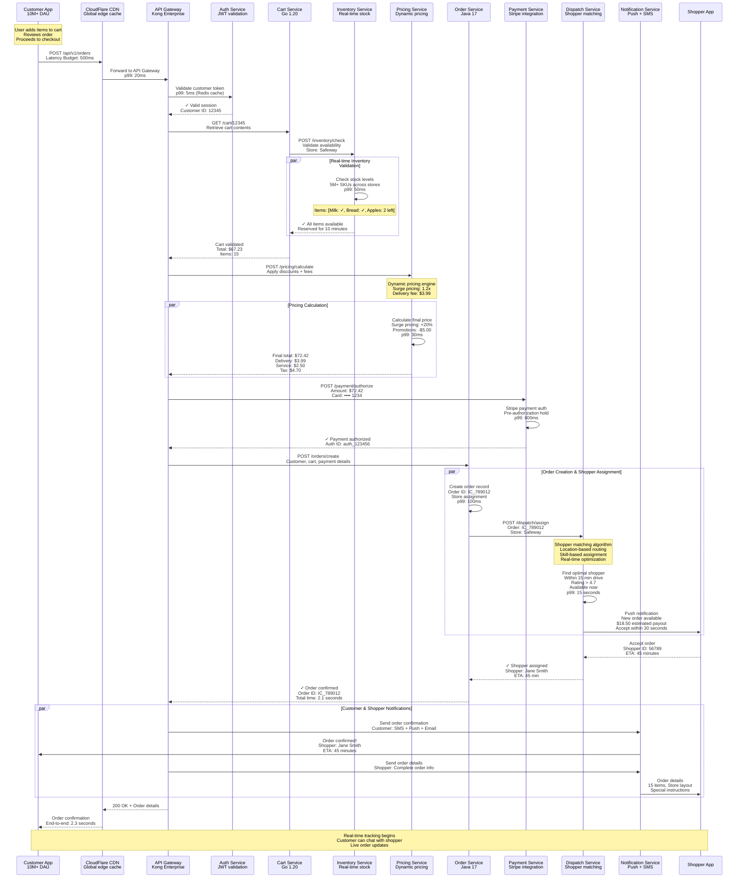
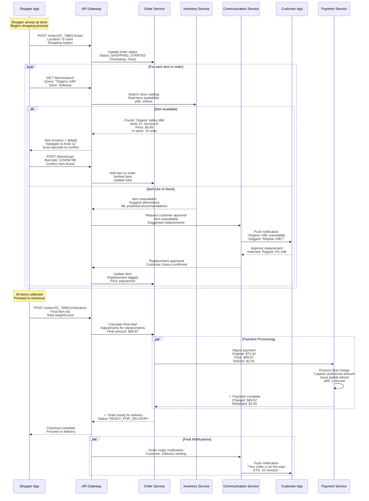
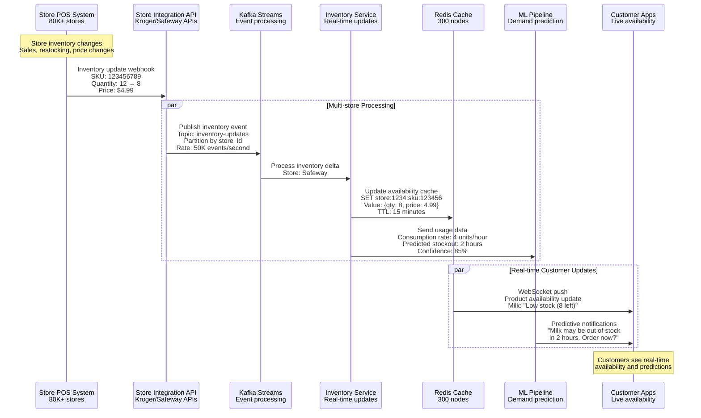
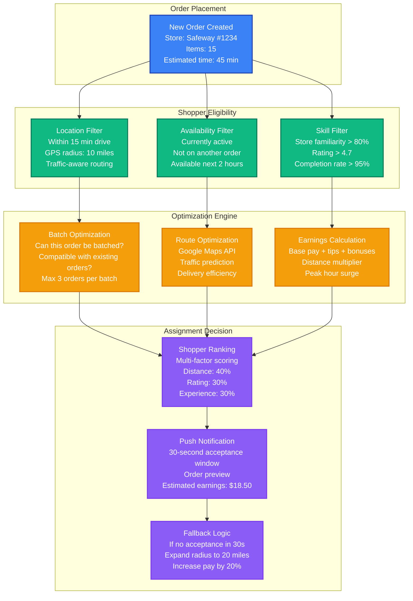
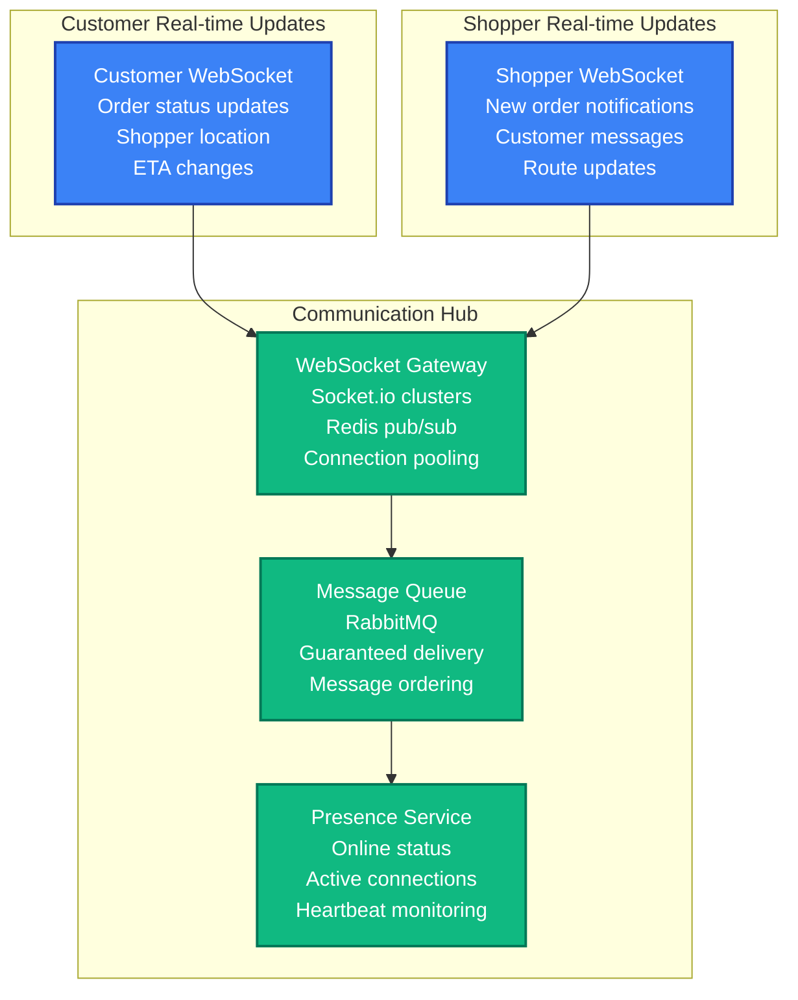

# Instacart - Request Flow

## Overview

Instacart's request flow handles 2M+ daily orders through complex workflows involving customer ordering, shopper assignment, real-time inventory management, and multi-party coordination across 80K+ stores.

## Order Placement Request Flow - The Golden Path



## Real-time Shopping Request Flow



## Inventory Synchronization Flow



## Shopper Dispatch Algorithm Flow



## Performance Latency Budgets

### Critical Path Latencies

| Operation | Target Latency | P99 Actual | Budget Allocation |
|-----------|----------------|------------|-------------------|
| **Order Placement** | 500ms | 380ms | |
| ↳ Auth validation | 20ms | 5ms | Network: 5ms, DB: 10ms |
| ↳ Cart validation | 100ms | 65ms | Inventory: 50ms, Cache: 15ms |
| ↳ Pricing calculation | 50ms | 30ms | Rules engine: 25ms, DB: 5ms |
| ↳ Payment authorization | 200ms | 180ms | Stripe API: 150ms, Network: 30ms |
| ↳ Order creation | 80ms | 45ms | DB write: 30ms, Validation: 15ms |
| ↳ Shopper assignment | 30000ms | 15000ms | Algorithm: 10s, Notification: 5s |

### Real-time Operation Latencies

| Operation | Target Latency | P99 Actual | Critical? |
|-----------|----------------|------------|-----------|
| Inventory lookup | 100ms | 65ms | ✓ |
| Item search | 150ms | 120ms | ✓ |
| Communication message | 200ms | 180ms | ✓ |
| Location update | 50ms | 35ms | ✓ |
| Payment processing | 2000ms | 1800ms | ✓ |
| Batch optimization | 5000ms | 3200ms | ○ |

## Error Handling and Fallback Patterns

### Circuit Breaker Implementation

```python
# Instacart circuit breaker patterns
class InstacartCircuitBreaker:
    def __init__(self, service_name):
        self.config = {
            'inventory_service': {
                'failure_threshold': 20,    # 20 failures in window
                'timeout_ms': 5000,
                'fallback': 'cached_inventory'
            },
            'payment_service': {
                'failure_threshold': 5,     # Low tolerance for payments
                'timeout_ms': 3000,
                'fallback': 'queue_for_retry'
            },
            'shopper_dispatch': {
                'failure_threshold': 50,    # Higher tolerance
                'timeout_ms': 30000,
                'fallback': 'expand_radius'
            }
        }

    def execute_with_fallback(self, operation, service_type):
        try:
            return operation()
        except CircuitBreakerOpen:
            return self.execute_fallback(service_type)

    def execute_fallback(self, service_type):
        fallback_type = self.config[service_type]['fallback']

        if fallback_type == 'cached_inventory':
            return self.get_cached_inventory()
        elif fallback_type == 'queue_for_retry':
            return self.queue_payment_for_retry()
        elif fallback_type == 'expand_radius':
            return self.expand_shopper_search_radius()
```

### Graceful Degradation Scenarios

#### Inventory Service Degradation
```
Level 1: Show cached availability (15 min stale)
Level 2: Show "availability unknown" for items
Level 3: Disable out-of-stock validation
Level 4: Order-first, validate-later mode
```

#### Payment Service Degradation
```
Level 1: Increase timeout to 5 seconds
Level 2: Queue payments for retry
Level 3: Manual payment processing
Level 4: Cash-on-delivery option
```

#### Shopper Dispatch Degradation
```
Level 1: Expand search radius to 20 miles
Level 2: Increase pay incentive by 50%
Level 3: Manual shopper assignment
Level 4: Delay orders to next available slot
```

## Real-time Communication Architecture

### WebSocket Connection Management



This request flow architecture demonstrates Instacart's sophisticated coordination between customers, shoppers, and stores through real-time inventory management, intelligent dispatch algorithms, and robust communication systems handling millions of daily grocery delivery transactions.