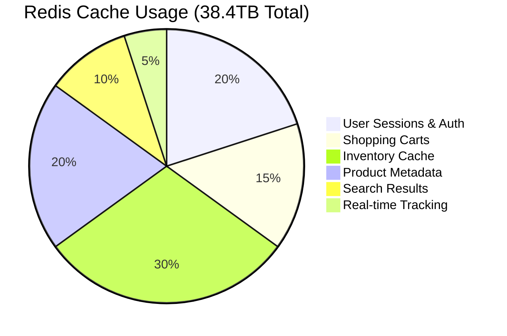

# Instacart - Storage Architecture

## Overview

Instacart's storage architecture manages 5M+ product SKUs across 80K+ stores with real-time inventory synchronization, handling 2M+ daily orders, 500K+ active shoppers, and complex pricing/promotional data with sub-100ms query performance.

## Complete Storage Architecture

```mermaid
graph TB
    subgraph "Edge Storage - CDN Layer"
        CDN[CloudFlare CDN<br/>Global edge caching<br/>Product images<br/>API responses]
    end

    subgraph "Service Layer - Data Access"
        API[API Gateway<br/>Kong Enterprise<br/>Request routing<br/>Data aggregation]

        subgraph "Core Services"
            CATALOG[Catalog Service<br/>Product data access<br/>Search integration]
            ORDER[Order Service<br/>Order management<br/>Transaction handling]
            INVENTORY[Inventory Service<br/>Real-time stock levels<br/>Store synchronization]
            USER[User Service<br/>Customer/shopper data<br/>Profile management]
        end
    end

    subgraph "Transactional Storage - ACID Compliance"
        subgraph "Order Management"
            ORDERDB[(Order Database<br/>PostgreSQL 14<br/>200 shards by region<br/>db.r6g.12xlarge)]
            ORDERREPLICA[(Order Read Replicas<br/>3 per shard<br/>Cross-AZ distribution<br/>db.r6g.8xlarge)]
        end

        subgraph "User Management"
            USERDB[(User Database<br/>PostgreSQL 14<br/>100 shards by user_id<br/>db.r6g.8xlarge)]
            USERREPLICA[(User Read Replicas<br/>2 per shard<br/>Read scaling<br/>db.r6g.4xlarge)]
        end

        subgraph "Financial Data"
            PAYMENTDB[(Payment Database<br/>PostgreSQL 14<br/>PCI compliant<br/>Encrypted at rest)]
            FINANCIALDB[(Financial Database<br/>PostgreSQL 14<br/>Audit trail<br/>7-year retention)]
        end
    end

    subgraph "Operational Storage - High Throughput"
        subgraph "Inventory Management"
            INVENTORYDB[(Inventory Database<br/>MongoDB 6.0<br/>500 shards by store<br/>r6g.8xlarge)]
            CATALOGDB[(Catalog Database<br/>MongoDB 6.0<br/>Product metadata<br/>5M+ SKUs)]
        end

        subgraph "Real-time Data"
            REDIS[Redis Cluster<br/>300 nodes<br/>10TB total memory<br/>r6g.4xlarge<br/>Sub-ms latency]
            KAFKA[Kafka Cluster<br/>150 brokers<br/>1PB retention<br/>i3.4xlarge<br/>High throughput]
        end

        subgraph "Search & Analytics"
            ELASTICSEARCH[Elasticsearch<br/>200 nodes<br/>100TB index size<br/>r6g.4xlarge<br/>Product search]
            CLICKHOUSE[ClickHouse<br/>50 nodes<br/>Real-time analytics<br/>c5.9xlarge<br/>OLAP queries]
        end
    end

    subgraph "Object Storage - Media & Archives"
        subgraph "Media Storage"
            S3IMAGES[S3 Product Images<br/>50PB total<br/>Standard + IA tiers<br/>$300K/month]
            S3DOCS[S3 Documents<br/>Receipts, invoices<br/>10PB<br/>Long-term retention]
        end

        subgraph "Data Lake"
            S3DATALAKE[S3 Data Lake<br/>Raw event data<br/>100PB<br/>Parquet format]
            S3BACKUP[S3 Backups<br/>Database backups<br/>20PB<br/>Cross-region]
        end

        subgraph "ML Storage"
            S3MODELS[S3 ML Models<br/>Trained models<br/>5PB<br/>Versioning enabled]
            S3FEATURES[S3 Feature Store<br/>ML features<br/>15PB<br/>Real-time access]
        end
    end

    subgraph "Analytics Platform - Data Warehouse"
        subgraph "Data Warehouse"
            SNOWFLAKE[Snowflake DW<br/>5PB total<br/>Multi-cluster<br/>$800K/month]
            SPARK[Spark Clusters<br/>Data processing<br/>2000 nodes<br/>c5.9xlarge]
        end

        subgraph "Streaming Analytics"
            KINESIS[Kinesis Streams<br/>Real-time events<br/>1000 shards<br/>24hr retention]
            FLINK[Apache Flink<br/>Stream processing<br/>Complex event processing]
        end
    end

    %% Service to Storage Connections
    API --> CATALOG
    API --> ORDER
    API --> INVENTORY
    API --> USER

    %% Transactional Storage Connections
    ORDER --> ORDERDB
    ORDER --> ORDERREPLICA
    USER --> USERDB
    USER --> USERREPLICA
    ORDER --> PAYMENTDB
    ORDER --> FINANCIALDB

    %% Operational Storage Connections
    INVENTORY --> INVENTORYDB
    CATALOG --> CATALOGDB
    CATALOG --> REDIS
    ORDER --> REDIS
    INVENTORY --> KAFKA

    %% Search and Analytics
    CATALOG --> ELASTICSEARCH
    ORDER --> CLICKHOUSE

    %% Object Storage
    CATALOG --> S3IMAGES
    ORDER --> S3DOCS
    ORDER --> S3DATALAKE

    %% Analytics Pipeline
    KAFKA --> KINESIS
    KINESIS --> FLINK
    FLINK --> SNOWFLAKE
    S3DATALAKE --> SPARK
    SPARK --> SNOWFLAKE

    %% ML Pipeline
    SNOWFLAKE --> S3MODELS
    SPARK --> S3FEATURES

    %% Backup Relationships
    ORDERDB -.-> S3BACKUP
    USERDB -.-> S3BACKUP
    INVENTORYDB -.-> S3BACKUP

    %% Edge Caching
    CDN -.-> S3IMAGES
    CDN -.-> REDIS

    %% Apply 4-plane colors
    classDef edgeStyle fill:#3B82F6,stroke:#1E40AF,color:#fff,stroke-width:2px
    classDef serviceStyle fill:#10B981,stroke:#047857,color:#fff,stroke-width:2px
    classDef stateStyle fill:#F59E0B,stroke:#D97706,color:#fff,stroke-width:2px
    classDef controlStyle fill:#8B5CF6,stroke:#7C3AED,color:#fff,stroke-width:2px

    class CDN edgeStyle
    class API,CATALOG,ORDER,INVENTORY,USER serviceStyle
    class ORDERDB,ORDERREPLICA,USERDB,USERREPLICA,PAYMENTDB,FINANCIALDB,INVENTORYDB,CATALOGDB,REDIS,KAFKA,ELASTICSEARCH,CLICKHOUSE,S3IMAGES,S3DOCS,S3DATALAKE,S3BACKUP,S3MODELS,S3FEATURES,SNOWFLAKE,SPARK,KINESIS,FLINK stateStyle
```



## Database Schema Design

### Order Database Schema (PostgreSQL)

```sql
-- Sharded by geographic region and order date
-- Shard calculation: hash(region_id, order_date) % 200
-- Each shard: db.r6g.12xlarge (384GB RAM, 48 vCPU)

CREATE TABLE orders (
    order_id UUID PRIMARY KEY,
    customer_id BIGINT NOT NULL,
    shopper_id BIGINT,
    store_id BIGINT NOT NULL,
    region_id INT NOT NULL,

    order_status VARCHAR(20) NOT NULL,
    created_at TIMESTAMP WITH TIME ZONE DEFAULT NOW(),
    scheduled_delivery_time TIMESTAMP WITH TIME ZONE,
    completed_at TIMESTAMP WITH TIME ZONE,

    subtotal_cents BIGINT NOT NULL,
    delivery_fee_cents BIGINT NOT NULL,
    service_fee_cents BIGINT NOT NULL,
    tip_cents BIGINT,
    tax_cents BIGINT NOT NULL,
    total_cents BIGINT NOT NULL,

    payment_method_id UUID,
    payment_status VARCHAR(20),

    -- Delivery information
    delivery_address_id BIGINT,
    delivery_instructions TEXT,
    special_instructions TEXT,

    -- Optimization fields
    estimated_shopping_time_minutes INT,
    actual_shopping_time_minutes INT,
    batch_id UUID,  -- For batched orders

    -- Audit fields
    created_by VARCHAR(50),
    updated_at TIMESTAMP WITH TIME ZONE DEFAULT NOW(),

    INDEX idx_customer_created (customer_id, created_at DESC),
    INDEX idx_shopper_status (shopper_id, order_status),
    INDEX idx_store_created (store_id, created_at DESC),
    INDEX idx_status_created (order_status, created_at),
    INDEX idx_batch_id (batch_id) WHERE batch_id IS NOT NULL

) PARTITION BY RANGE (created_at);

-- Weekly partitions for efficient querying and maintenance
CREATE TABLE orders_2024_w01 PARTITION OF orders
    FOR VALUES FROM ('2024-01-01') TO ('2024-01-08');

-- Order items table (child table)
CREATE TABLE order_items (
    order_item_id UUID PRIMARY KEY,
    order_id UUID NOT NULL REFERENCES orders(order_id),
    product_id BIGINT NOT NULL,
    store_product_id BIGINT,  -- Store-specific product mapping

    requested_quantity DECIMAL(10,3) NOT NULL,
    fulfilled_quantity DECIMAL(10,3),
    unit_price_cents BIGINT NOT NULL,
    total_price_cents BIGINT NOT NULL,

    product_name VARCHAR(255) NOT NULL,
    brand_name VARCHAR(100),
    size_description VARCHAR(50),

    -- Replacement tracking
    is_replacement BOOLEAN DEFAULT FALSE,
    original_product_id BIGINT,
    replacement_reason VARCHAR(100),
    customer_approved BOOLEAN,

    -- Shopper notes
    shopper_notes TEXT,
    out_of_stock BOOLEAN DEFAULT FALSE,

    INDEX idx_order_id (order_id),
    INDEX idx_product_id (product_id),
    INDEX idx_store_product_id (store_product_id)
);

-- 2M orders/day × 20 items/order = 40M order_items/day
-- 365 days retention = 14.6B rows
-- Average row size: 500 bytes = 7.3TB total
```

### Inventory Database Schema (MongoDB)

```javascript
// MongoDB collections for real-time inventory management
// Sharded by store_id for horizontal scaling

// Store inventory collection
db.store_inventory.createIndex({ "store_id": 1, "product_id": 1 }, { unique: true })
db.store_inventory.createIndex({ "store_id": 1, "last_updated": -1 })
db.store_inventory.createIndex({ "product_id": 1, "availability": 1 })

{
  "_id": ObjectId("..."),
  "store_id": 12345,
  "product_id": 67890,
  "store_product_id": "SFWY_67890_12345",

  "availability": {
    "in_stock": true,
    "quantity_available": 24,
    "quantity_reserved": 3,      // Reserved for active orders
    "last_count_date": ISODate("2024-01-15"),
    "restock_frequency_days": 2
  },

  "pricing": {
    "regular_price_cents": 499,
    "current_price_cents": 449,   // Sale price
    "promotion_id": "SALE_2024_01",
    "price_last_updated": ISODate("2024-01-15T08:00:00Z")
  },

  "location": {
    "aisle": "12",
    "section": "B",
    "shelf": "3",
    "coordinates": {
      "x": 145.2,
      "y": 67.8
    }
  },

  "sync_info": {
    "last_updated": ISODate("2024-01-15T10:30:00Z"),
    "sync_source": "store_pos",
    "sync_status": "success",
    "staleness_seconds": 420      // 7 minutes old
  },

  "predictions": {
    "estimated_stockout_time": ISODate("2024-01-16T14:00:00Z"),
    "demand_forecast_24h": 12,
    "confidence_score": 0.85
  }
}

// Product catalog collection (global)
db.product_catalog.createIndex({ "product_id": 1 }, { unique: true })
db.product_catalog.createIndex({ "brand": 1, "category": 1 })
db.product_catalog.createIndex({ "search_keywords": "text" })

{
  "_id": ObjectId("..."),
  "product_id": 67890,
  "upc": "012345678901",
  "name": "Organic Valley Whole Milk",
  "brand": "Organic Valley",
  "category": "Dairy",
  "subcategory": "Milk",

  "description": "Organic whole milk from grass-fed cows",
  "size": "64 fl oz",
  "unit_type": "container",
  "weight_oz": 68.0,

  "images": [
    "https://cdn.instacart.com/products/67890/main.jpg",
    "https://cdn.instacart.com/products/67890/nutrition.jpg"
  ],

  "nutrition": {
    "calories_per_serving": 150,
    "servings_per_container": 8,
    "protein_g": 8,
    "fat_g": 8,
    "carbohydrates_g": 12
  },

  "search_keywords": ["organic", "milk", "whole", "dairy", "grass-fed"],
  "allergens": ["milk"],
  "dietary_flags": ["organic", "kosher"],

  "created_at": ISODate("2020-03-15T00:00:00Z"),
  "updated_at": ISODate("2024-01-10T12:00:00Z")
}

// 5M products × 80K stores = 400B potential inventory records
// Active inventory (products actually carried): ~50M records
// Average document size: 2KB = 100GB collection
```

## Caching Strategy

### Redis Cluster Configuration

```yaml
# Redis Cluster: 300 nodes across 3 AZs
# Node type: r6g.4xlarge (128GB RAM, 16 vCPU)
# Total capacity: 38.4TB memory, 4800 vCPU

cluster:
  nodes: 300
  shards: 100        # 3 nodes per shard (primary + 2 replicas)
  replicas: 2

  memory_policy: allkeys-lru
  maxmemory: 120GB   # Per node, 8GB reserved for overhead

  persistence:
    rdb_enabled: true
    rdb_save_seconds: 1800    # Every 30 minutes
    aof_enabled: false        # Performance over durability

  network:
    timeout: 3000ms
    keepalive: 300s

  # Sharding strategy
  key_patterns:
    user_sessions: "session:{user_id}"           # Shard 0-19
    cart_data: "cart:{user_id}"                  # Shard 20-39
    inventory_cache: "inventory:{store_id}"      # Shard 40-69
    product_cache: "product:{product_id}"        # Shard 70-89
    search_results: "search:{query_hash}"        # Shard 90-99

  # TTL policies
  ttl_policies:
    user_sessions: 86400        # 24 hours
    cart_data: 2592000         # 30 days
    inventory_cache: 900       # 15 minutes
    product_cache: 3600        # 1 hour
    search_results: 300        # 5 minutes
```

### Cache Distribution and Hit Rates



### Cache Performance Metrics

| Data Type | Cache Hit Rate | p99 Latency | TTL | Refresh Strategy |
|-----------|----------------|-------------|-----|------------------|
| User sessions | 98% | 0.8ms | 24 hours | Sliding window |
| Shopping carts | 95% | 1.2ms | 30 days | Write-through |
| Inventory data | 85% | 1.5ms | 15 minutes | Write-behind |
| Product info | 92% | 1.0ms | 1 hour | Cache-aside |
| Search results | 75% | 2.0ms | 5 minutes | Write-through |
| Pricing data | 88% | 1.1ms | 30 minutes | Write-behind |

## Data Lifecycle Management

### S3 Storage Lifecycle Policies

```yaml
# S3 Lifecycle Configuration
lifecycle_rules:
  product_images:
    bucket: "instacart-product-images"
    transitions:
      - days: 30
        storage_class: "STANDARD_IA"      # Accessed less frequently
      - days: 90
        storage_class: "GLACIER"          # Archive old product images
    expiration:
      days: 2555  # 7 years for compliance

  order_receipts:
    bucket: "instacart-order-receipts"
    transitions:
      - days: 1
        storage_class: "STANDARD_IA"      # Immediate archival
      - days: 90
        storage_class: "GLACIER"
      - days: 365
        storage_class: "DEEP_ARCHIVE"     # Long-term tax compliance
    expiration:
      days: 2555  # 7 years

  analytics_data:
    bucket: "instacart-analytics-raw"
    transitions:
      - days: 7
        storage_class: "STANDARD_IA"
      - days: 30
        storage_class: "GLACIER"
    expiration:
      days: 1095  # 3 years retention

  ml_models:
    bucket: "instacart-ml-models"
    versioning: enabled
    transitions:
      - days: 1
        storage_class: "STANDARD_IA"      # Old versions rarely accessed
    expiration:
      days: 365   # Keep model versions for 1 year
```

### Database Retention Policies

```sql
-- Automated data retention procedures
-- Orders: 7 year retention for legal compliance
CREATE EVENT order_retention_cleanup
ON SCHEDULE EVERY 1 DAY
DO
  BEGIN
    -- Archive orders older than 7 years
    INSERT INTO orders_archive
    SELECT * FROM orders
    WHERE created_at < NOW() - INTERVAL 7 YEAR;

    -- Delete archived orders from active tables
    DELETE FROM orders
    WHERE created_at < NOW() - INTERVAL 7 YEAR;

    -- Clean up related order_items
    DELETE oi FROM order_items oi
    LEFT JOIN orders o ON oi.order_id = o.order_id
    WHERE o.order_id IS NULL;
  END;

-- Inventory: 90 day retention for historical data
CREATE EVENT inventory_retention_cleanup
ON SCHEDULE EVERY 1 DAY
DO
  BEGIN
    -- Keep only last 90 days of inventory history
    DELETE FROM inventory_history
    WHERE recorded_at < NOW() - INTERVAL 90 DAY;
  END;

-- User activity logs: 2 year retention
CREATE EVENT user_activity_cleanup
ON SCHEDULE EVERY 1 WEEK
DO
  BEGIN
    DELETE FROM user_activity_logs
    WHERE activity_date < NOW() - INTERVAL 2 YEAR;
  END;
```

## Backup and Disaster Recovery

### Multi-Region Backup Strategy

```yaml
# Cross-region backup configuration
backup_strategy:
  databases:
    postgresql:
      method: "continuous_archiving"
      frequency: "5_minutes"
      retention: "30_days"
      destinations:
        - region: "us-west-2"
          storage: "s3://instacart-backups-west"
        - region: "us-east-1"
          storage: "s3://instacart-backups-east"

    mongodb:
      method: "replica_set_backup"
      frequency: "15_minutes"
      retention: "7_days"
      compression: "gzip"

  object_storage:
    cross_region_replication:
      source: "us-west-2"
      destinations: ["us-east-1", "eu-west-1"]
      storage_class: "STANDARD_IA"

  redis:
    method: "rdb_snapshots"
    frequency: "1_hour"
    retention: "7_days"
    # Redis data is ephemeral, focus on quick rebuild

recovery_targets:
  order_database:
    rto: "2_hours"           # Business critical
    rpo: "5_minutes"         # Minimal data loss
    automation: "full"

  inventory_database:
    rto: "1_hour"            # High priority
    rpo: "15_minutes"        # Acceptable staleness
    automation: "full"

  user_database:
    rto: "4_hours"           # Important but not critical
    rpo: "30_minutes"
    automation: "semi"

  analytics_warehouse:
    rto: "24_hours"          # Low priority
    rpo: "1_day"
    automation: "manual"
```

## Data Privacy and Compliance

### PCI DSS Data Isolation

```sql
-- Separate encrypted database for payment data
-- PCI DSS Level 1 compliance requirements

CREATE TABLE payment_methods (
    payment_method_id UUID PRIMARY KEY,
    customer_id BIGINT NOT NULL,

    -- Encrypted card data (AES-256)
    encrypted_card_number BYTEA NOT NULL,
    encrypted_expiry_date BYTEA NOT NULL,
    encrypted_cvv BYTEA NOT NULL,

    -- Tokenized for daily operations
    payment_token VARCHAR(255) UNIQUE NOT NULL,

    -- Non-sensitive metadata
    card_brand VARCHAR(20),
    last_four_digits CHAR(4),
    cardholder_name_hash CHAR(64),  -- SHA-256 hash

    is_active BOOLEAN DEFAULT TRUE,
    created_at TIMESTAMP WITH TIME ZONE DEFAULT NOW(),

    -- Audit trail
    encrypted_by VARCHAR(100),
    encryption_key_version INT,

    INDEX idx_customer_id (customer_id),
    INDEX idx_payment_token (payment_token)
);

-- Automatic PCI data purging
CREATE EVENT pci_data_cleanup
ON SCHEDULE EVERY 1 DAY
DO
  BEGIN
    -- Remove expired payment methods after 1 year of inactivity
    DELETE FROM payment_methods
    WHERE is_active = FALSE
    AND updated_at < NOW() - INTERVAL 1 YEAR;
  END;
```

### GDPR Compliance Implementation

```python
# Data Subject Rights Implementation
class GDPRDataManager:
    def __init__(self):
        self.data_sources = [
            'user_database',
            'order_database',
            'analytics_warehouse',
            'search_logs',
            'redis_cache'
        ]

    def export_user_data(self, user_id):
        """Right to Data Portability (Article 20)"""
        export_data = {}

        # Personal information
        export_data['profile'] = self.get_user_profile(user_id)

        # Order history
        export_data['orders'] = self.get_order_history(user_id)

        # Shopping preferences
        export_data['preferences'] = self.get_shopping_preferences(user_id)

        # Search history (last 90 days only)
        export_data['searches'] = self.get_search_history(user_id, days=90)

        return self.anonymize_export_data(export_data)

    def delete_user_data(self, user_id, deletion_type='full'):
        """Right to Erasure (Article 17)"""
        deletion_log = []

        if deletion_type == 'full':
            # Hard delete from all systems
            for source in self.data_sources:
                result = self.delete_from_source(source, user_id)
                deletion_log.append(result)

        elif deletion_type == 'anonymize':
            # Replace PII with anonymized tokens
            for source in self.data_sources:
                result = self.anonymize_in_source(source, user_id)
                deletion_log.append(result)

        # Log deletion for audit trail
        self.log_gdpr_deletion(user_id, deletion_type, deletion_log)

        return deletion_log

    def anonymize_in_source(self, source, user_id):
        """Replace PII with anonymous tokens"""
        anonymous_id = f"anon_{hash(user_id)}_{int(time.time())}"

        if source == 'user_database':
            # Replace name, email, phone with anonymous values
            query = """
                UPDATE users SET
                    first_name = 'Anonymous',
                    last_name = 'User',
                    email = %s,
                    phone_number = NULL,
                    date_of_birth = NULL
                WHERE user_id = %s
            """
            self.execute_query(query, [f"{anonymous_id}@anon.local", user_id])

        elif source == 'order_database':
            # Keep order data for business records, anonymize delivery info
            query = """
                UPDATE orders SET
                    delivery_address_id = NULL,
                    delivery_instructions = 'Anonymous delivery',
                    special_instructions = NULL
                WHERE customer_id = %s
            """
            self.execute_query(query, [user_id])

        return f"Anonymized {source} for user {user_id}"
```

## Performance Optimization

### Query Optimization Strategies

```sql
-- Optimized queries for high-traffic patterns

-- Hot query: Get user's recent orders (called 1000x/second)
EXPLAIN (ANALYZE, BUFFERS)
SELECT o.order_id, o.created_at, o.total_cents, o.order_status,
       COUNT(oi.order_item_id) as item_count
FROM orders o
LEFT JOIN order_items oi ON o.order_id = oi.order_id
WHERE o.customer_id = 12345
  AND o.created_at >= NOW() - INTERVAL 90 DAY
GROUP BY o.order_id, o.created_at, o.total_cents, o.order_status
ORDER BY o.created_at DESC
LIMIT 20;

-- Index strategy for this query:
CREATE INDEX CONCURRENTLY idx_orders_customer_recent
ON orders (customer_id, created_at DESC)
WHERE created_at >= NOW() - INTERVAL 1 YEAR;

-- Hot query: Store inventory lookup (called 10000x/second)
-- MongoDB aggregation pipeline optimized for real-time inventory
db.store_inventory.aggregate([
  {
    $match: {
      store_id: 12345,
      "availability.in_stock": true,
      "sync_info.staleness_seconds": { $lt: 900 }  // Less than 15 minutes old
    }
  },
  {
    $lookup: {
      from: "product_catalog",
      localField: "product_id",
      foreignField: "product_id",
      as: "product_info"
    }
  },
  {
    $project: {
      product_id: 1,
      quantity_available: "$availability.quantity_available",
      current_price_cents: "$pricing.current_price_cents",
      name: { $arrayElemAt: ["$product_info.name", 0] },
      aisle: "$location.aisle"
    }
  }
]);

-- Compound index for this aggregation:
db.store_inventory.createIndex({
  "store_id": 1,
  "availability.in_stock": 1,
  "sync_info.staleness_seconds": 1,
  "product_id": 1
});
```

### Monitoring and Metrics

```yaml
# Database performance monitoring
performance_metrics:
  postgresql:
    connection_pool_utilization:
      warning_threshold: 70
      critical_threshold: 85

    query_performance:
      slow_query_threshold: "1000ms"
      log_queries_slower_than: "500ms"

    replication_lag:
      warning_threshold: "30s"
      critical_threshold: "60s"

  mongodb:
    operation_latency:
      read_p99_threshold: "50ms"
      write_p99_threshold: "100ms"

    index_efficiency:
      index_hit_ratio_threshold: 95
      collection_scan_threshold: 10

  redis:
    memory_usage:
      warning_threshold: 80
      critical_threshold: 90

    cache_hit_rate:
      warning_threshold: 85
      critical_threshold: 80

    connection_count:
      max_connections: 10000
      warning_threshold: 8000
```

This storage architecture demonstrates Instacart's approach to managing complex, multi-faceted data requirements while maintaining high performance, regulatory compliance, and operational efficiency across their grocery delivery platform.