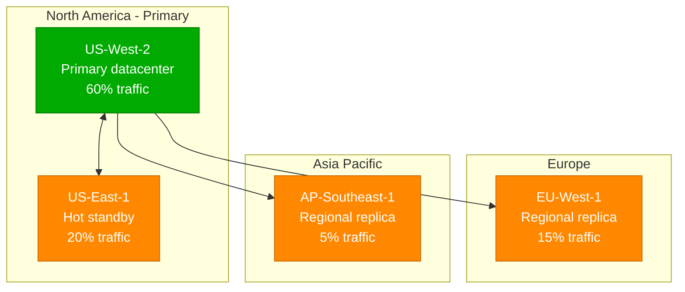

# LinkedIn Complete Architecture

## Overview
LinkedIn's architecture serves 1B+ members globally with massive scale professional networking infrastructure. As the creator of Apache Kafka, LinkedIn processes 7 trillion messages per day through their event-driven architecture.

## Complete System Architecture

```mermaid
graph TB
    subgraph EdgePlane[Edge Plane - CDN & Load Balancing]
        CDN[Akamai CDN<br/>Global: 240+ locations<br/>Static content: 85% hit ratio]
        LB[F5 Load Balancers<br/>AWS ALB + NLB<br/>Peak: 2M RPS]
        WAF[AWS WAF<br/>DDoS protection<br/>Rate limiting: 1000/min/user]
    end

    subgraph ServicePlane[Service Plane - Business Logic]
        GW[API Gateway<br/>Kong Enterprise<br/>30K+ endpoints<br/>Auth: OAuth 2.0/JWT]

        subgraph CoreServices[Core Services - 2000+ microservices]
            MEMBER[Member Service<br/>Java 17, Spring Boot<br/>1B+ member profiles]
            CONNECT[Connection Service<br/>Scala 2.13<br/>30B+ connections]
            FEED[Feed Service<br/>Kafka Streams<br/>Following + Interest feeds]
            SEARCH[Search Service<br/>Galene (Lucene)<br/>50M+ searches/day]
            JOB[Job Service<br/>Java 17<br/>20M+ active jobs]
            MESSAGING[InMail Service<br/>Akka actors<br/>500M+ messages/month]
        end

        subgraph StreamProcessing[Stream Processing - Real-time]
            KAFKA[Apache Kafka<br/>7 trillion msgs/day<br/>10K+ partitions<br/>3-day retention]
            SAMZA[Apache Samza<br/>Stream processing<br/>Real-time ML scoring]
            PINOT[Apache Pinot<br/>Real-time analytics<br/>Sub-second queries]
        end
    end

    subgraph StatePlane[State Plane - Data Storage]
        subgraph PrimaryStorage[Primary Storage]
            ESPRESSO[Espresso<br/>Document DB<br/>Timeline-consistent<br/>1000+ TB]
            VOLDEMORT[Voldemort<br/>Distributed KV store<br/>DHT-based<br/>500+ TB]
            VENICE[Venice<br/>Derived data platform<br/>Read-only views<br/>300+ TB]
        end

        subgraph SpecializedStorage[Specialized Storage]
            GRAPH[Neo4j Clusters<br/>Social graph<br/>30B+ connections<br/>100+ TB]
            AMBRY[Ambry<br/>Media storage<br/>Photos/videos<br/>2+ PB]
            COUCHBASE[Couchbase<br/>Session storage<br/>Hot data cache<br/>50+ TB]
        end

        subgraph CacheLayers[Cache Layers]
            REDIS[Redis Clusters<br/>Session + hot data<br/>99.9% hit ratio<br/>200+ GB]
            MEMCACHED[Memcached<br/>Query results<br/>15-min TTL<br/>500+ GB]
        end
    end

    subgraph ControlPlane[Control Plane - Operations]
        subgraph Monitoring[Monitoring & Observability]
            EKG[EKG<br/>Real-time monitoring<br/>Custom LinkedIn system]
            DATADOG[DataDog<br/>Infrastructure metrics<br/>APM tracing]
            GRAFANA[Grafana<br/>Custom dashboards<br/>500+ charts]
        end

        subgraph DataPlatform[Data Platform]
            HDFS[HDFS<br/>Data lake<br/>100+ PB historical]
            PRESTO[Presto<br/>Interactive queries<br/>Federation layer]
            AIRFLOW[Airflow<br/>Workflow orchestration<br/>10K+ DAGs]
        end

        subgraph MLPlatform[ML Platform]
            FEATHR[Feathr<br/>Feature store<br/>Real-time + batch]
            TENSORFLOW[TensorFlow Serving<br/>ML model serving<br/>Job recommendations]
        end
    end

    %% Edge Plane Connections
    CDN --> LB
    LB --> WAF
    WAF --> GW

    %% Service Plane Connections
    GW --> MEMBER
    GW --> CONNECT
    GW --> FEED
    GW --> SEARCH
    GW --> JOB
    GW --> MESSAGING

    %% Core Services to Storage
    MEMBER --> ESPRESSO
    MEMBER --> REDIS
    CONNECT --> GRAPH
    CONNECT --> VOLDEMORT
    FEED --> KAFKA
    FEED --> VENICE
    SEARCH --> PINOT
    JOB --> ESPRESSO
    MESSAGING --> COUCHBASE

    %% Stream Processing
    KAFKA --> SAMZA
    SAMZA --> PINOT
    KAFKA --> VENICE

    %% Data Platform
    ESPRESSO --> HDFS
    VOLDEMORT --> HDFS
    HDFS --> PRESTO
    PRESTO --> AIRFLOW

    %% ML Platform
    HDFS --> FEATHR
    FEATHR --> TENSORFLOW
    TENSORFLOW --> JOB

    %% Monitoring
    EKG -.-> MEMBER
    EKG -.-> KAFKA
    EKG -.-> ESPRESSO
    DATADOG -.-> GW
    GRAFANA -.-> PINOT

    %% Apply four-plane colors
    classDef edgeStyle fill:#0066CC,stroke:#004499,color:#fff,stroke-width:2px
    classDef serviceStyle fill:#00AA00,stroke:#007700,color:#fff,stroke-width:2px
    classDef stateStyle fill:#FF8800,stroke:#CC6600,color:#fff,stroke-width:2px
    classDef controlStyle fill:#CC0000,stroke:#990000,color:#fff,stroke-width:2px

    class CDN,LB,WAF edgeStyle
    class GW,MEMBER,CONNECT,FEED,SEARCH,JOB,MESSAGING,KAFKA,SAMZA,PINOT serviceStyle
    class ESPRESSO,VOLDEMORT,VENICE,GRAPH,AMBRY,COUCHBASE,REDIS,MEMCACHED stateStyle
    class EKG,DATADOG,GRAFANA,HDFS,PRESTO,AIRFLOW,FEATHR,TENSORFLOW controlStyle
```

## Production Scale Metrics

| Component | Scale | Technology | Instance Type |
|-----------|-------|------------|---------------|
| **API Gateway** | 2M RPS peak | Kong Enterprise | AWS c6i.8xlarge (32 vCPU) |
| **Kafka Clusters** | 7 trillion msgs/day | Apache Kafka 3.5 | AWS i4i.8xlarge (SSD optimized) |
| **Espresso Database** | 1000+ TB | LinkedIn Espresso | AWS r6i.8xlarge (256GB RAM) |
| **Voldemort KV** | 500+ TB | LinkedIn Voldemort | AWS m6i.4xlarge |
| **Social Graph** | 30B+ connections | Neo4j Enterprise | AWS r6i.16xlarge (512GB RAM) |
| **Media Storage** | 2+ PB | LinkedIn Ambry | AWS s3 + local cache |

## Regional Distribution



## Cost Structure (Annual)

| Category | Cost | Percentage | Details |
|----------|------|------------|---------|
| **Compute** | $800M | 40% | EC2 instances, containers |
| **Storage** | $400M | 20% | S3, EBS, specialized storage |
| **Network** | $300M | 15% | Data transfer, CDN |
| **Kafka Infrastructure** | $200M | 10% | Dedicated Kafka clusters |
| **ML/Analytics** | $150M | 7.5% | GPU instances, Spark clusters |
| **Monitoring/Tools** | $150M | 7.5% | DataDog, custom tooling |
| **Total** | **$2B** | **100%** | **Cost per member: $0.17/month** |

## Key Innovations

1. **Apache Kafka** - Created at LinkedIn, now industry standard
2. **Espresso** - Timeline-consistent NoSQL database
3. **Voldemort** - Distributed key-value store
4. **Venice** - Derived data serving platform
5. **Samza** - Stream processing framework
6. **Rest.li** - REST framework for Java

## SLA Guarantees

- **Feed Generation**: p99 < 200ms
- **Search Queries**: p95 < 100ms
- **Profile Updates**: p99 < 500ms
- **Message Delivery**: p99 < 1s
- **Overall Availability**: 99.9% (8.76 hours downtime/year)

*Last updated: September 2024*
*Source: LinkedIn Engineering Blog, Microsoft SEC filings*