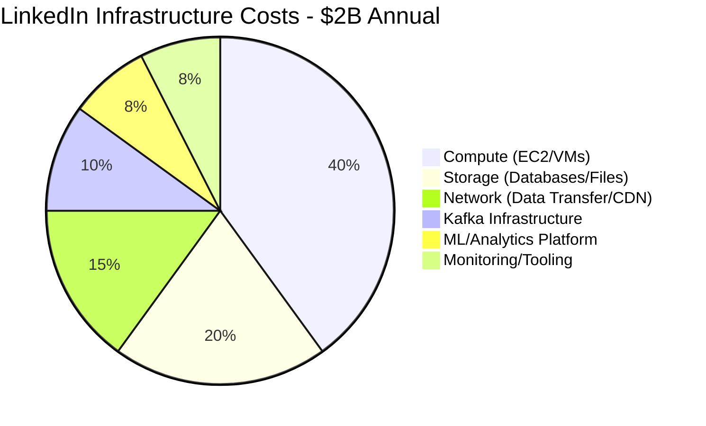
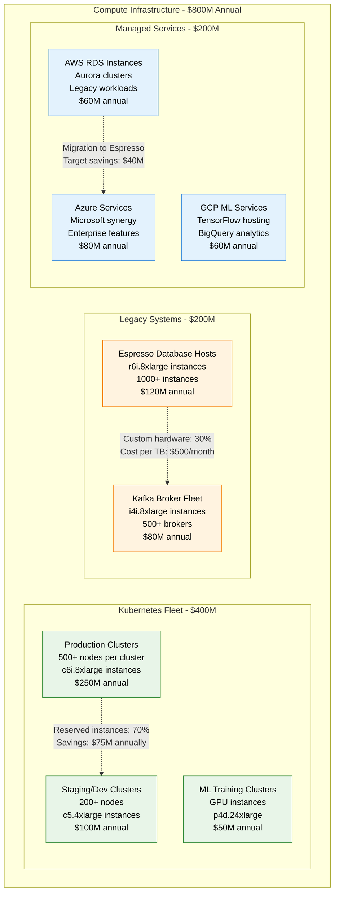
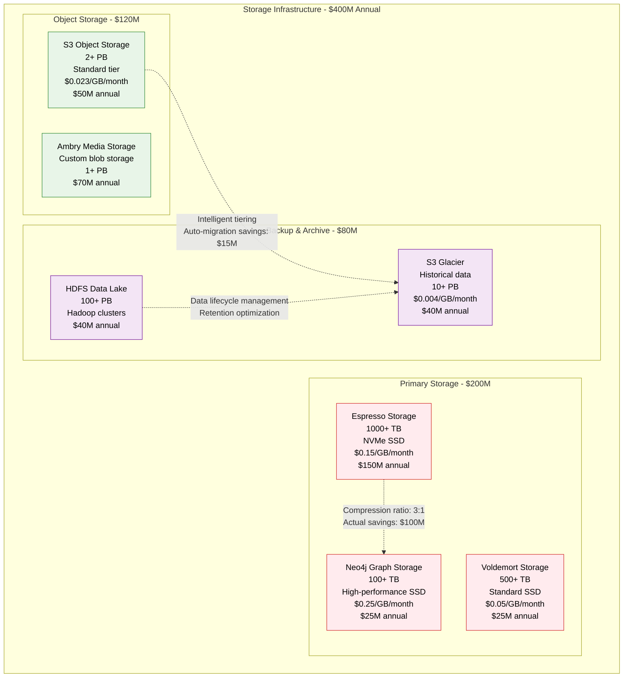
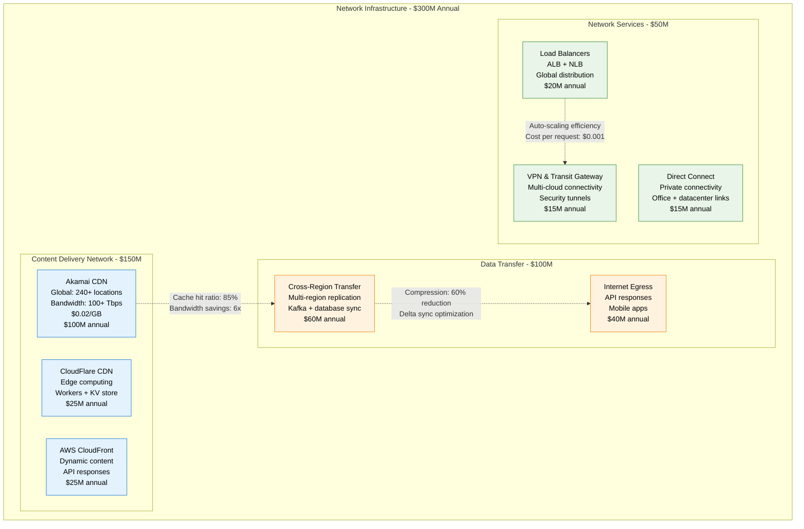
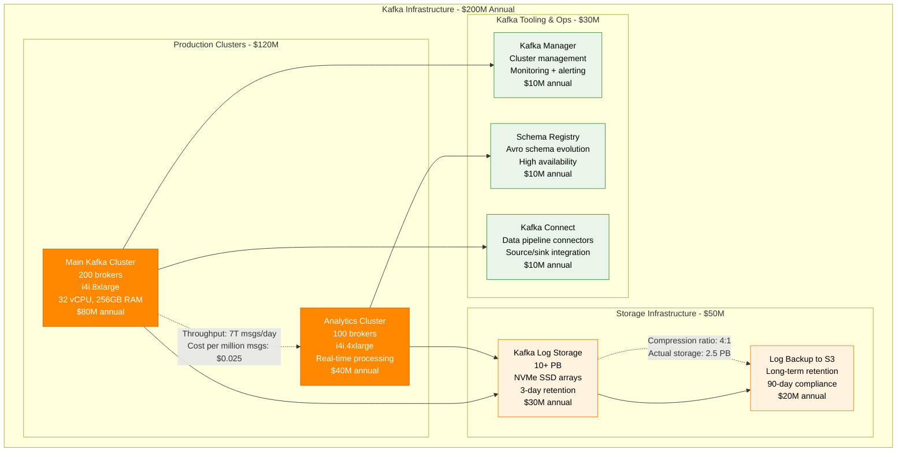
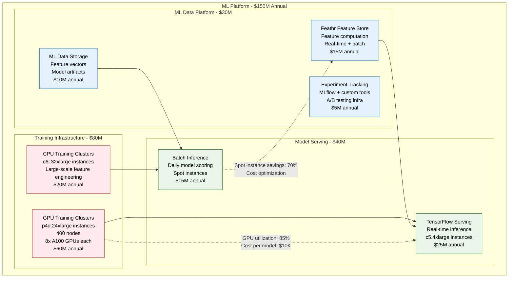
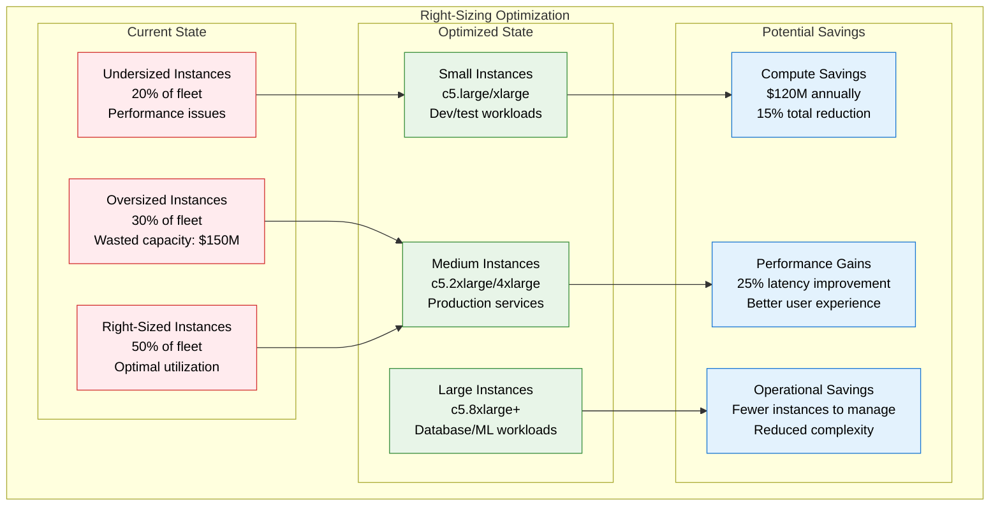
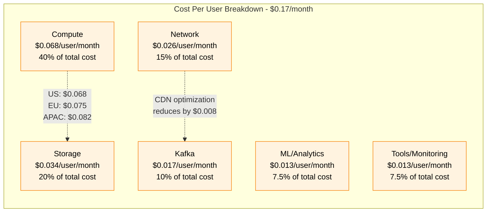
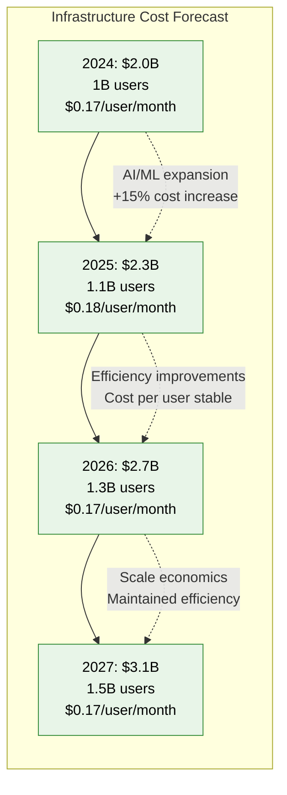

# LinkedIn Cost Breakdown

## Overview
LinkedIn's infrastructure costs at scale: $2B annually serving 1B+ members. Detailed analysis of compute, storage, networking, and operational expenses with optimization strategies.

## Annual Infrastructure Cost Breakdown

## Detailed Cost Analysis by Category

### Compute Infrastructure Costs

### Storage Infrastructure Costs

### Network Infrastructure Costs

## Kafka Infrastructure Deep Dive

## Machine Learning Platform Costs

## Cost Optimization Strategies

### Reserved Instance Strategy

| Service Category | On-Demand | Reserved (1-year) | Reserved (3-year) | Savings |
|------------------|-----------|-------------------|-------------------|---------|
| **Compute (EC2)** | $400M | $280M | $200M | 50% |
| **Storage (EBS)** | $150M | $120M | $90M | 40% |
| **Database (RDS)** | $80M | $56M | $40M | 50% |
| **Total Potential** | $630M | $456M | $330M | **48%** |

### Right-Sizing Analysis

## Cost per User Analysis

## ROI Analysis for Major Initiatives

### Kafka Migration ROI (2010-2012)

| Investment Category | Amount | Timeframe |
|-------------------|---------|-----------|
| **Development Cost** | $15M | 18 months |
| **Infrastructure** | $5M | Initial setup |
| **Migration Effort** | $10M | 12 months |
| **Total Investment** | **$30M** | **2 years** |

**Benefits:**
- **Operational Savings**: $50M/year (reduced integration complexity)
- **Performance Gains**: 10x throughput improvement
- **Developer Productivity**: 30% faster feature development
- **Payback Period**: 8 months

### Espresso Migration ROI (2012-2016)

| Investment Category | Amount | Timeframe |
|-------------------|---------|-----------|
| **Development Cost** | $40M | 3 years |
| **Migration Tooling** | $15M | 2 years |
| **Dual-Running Period** | $25M | 1 year |
| **Total Investment** | **$80M** | **4 years** |

**Benefits:**
- **Oracle License Savings**: $50M/year
- **Performance Improvement**: 5x faster queries
- **Operational Simplicity**: 50% reduction in DB management
- **Payback Period**: 18 months

## Cost Forecasting (2024-2027)

## Cost Optimization Roadmap

### Short-term (0-6 months) - $200M savings potential
1. **Reserved Instance Conversion**: Convert 80% to reserved instances
2. **Right-Sizing Automation**: Implement automated scaling
3. **Storage Optimization**: Implement intelligent tiering
4. **Network Optimization**: Improve CDN cache hit ratios

### Medium-term (6-18 months) - $300M savings potential
1. **Kubernetes Efficiency**: Improve pod density and resource utilization
2. **Database Consolidation**: Migrate remaining Oracle workloads
3. **ML Platform Optimization**: Spot instances for training
4. **Cross-Cloud Optimization**: Leverage multi-cloud pricing

### Long-term (18+ months) - $500M savings potential
1. **Custom Silicon**: ASIC development for ML workloads
2. **Edge Computing**: Move computation closer to users
3. **Advanced ML**: More efficient algorithms and models
4. **Quantum Computing**: Early adoption for optimization problems

*Last updated: September 2024*
*Source: LinkedIn Engineering Blog, Microsoft SEC filings, AWS cost analysis*