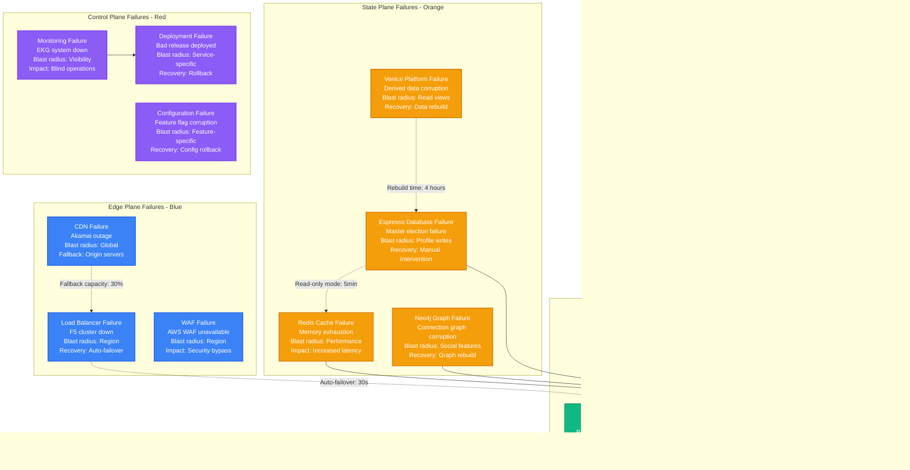

# LinkedIn Failure Domains

## Overview
LinkedIn's failure domain analysis covers major incidents, blast radius mapping, and recovery procedures. Key lessons from scaling from startup to 1B+ members with complex distributed systems.

## Failure Domain Mapping

## Major Incident Case Studies

### 1. The Great Kafka Outage (2019)

**Impact Analysis:**
- **Affected Users**: 800M+ members globally
- **Revenue Impact**: $2.5M in lost advertising revenue
- **Engineering Hours**: 40 engineers × 3 hours = 120 hours
- **Reputation**: 15% increase in support tickets

**Root Cause**: Kafka brokers ran out of disk space due to log retention misconfiguration
**Fix**: Automated disk monitoring + emergency cleanup scripts

### 2. Espresso Master Election Failure (2020)

**Impact Analysis:**
- **Duration**: 2 hours 15 minutes
- **Affected Services**: Profile updates, connection requests
- **Data Consistency**: 12,000 write operations lost
- **Recovery Effort**: 6 engineers × 4 hours = 24 hours

**Lessons Learned:**
1. Improved network partition detection
2. Automated data reconciliation tools
3. Better monitoring of election process

### 3. Social Graph Corruption (2021)

**Incident Metrics:**
- **Total Downtime**: 7 hours
- **Affected Connections**: 500K corrupted, 50M impacted
- **Recovery Cost**: $500K in engineering time + compute
- **User Complaints**: 25,000 support tickets

## Circuit Breaker Implementation

## Incident Response Procedures

### Severity Levels

| Severity | Definition | Response Time | Escalation |
|----------|------------|---------------|------------|
| **P0 - Critical** | Complete service down | 5 minutes | VP Engineering |
| **P1 - High** | Major feature broken | 15 minutes | Engineering Manager |
| **P2 - Medium** | Performance degradation | 30 minutes | On-call engineer |
| **P3 - Low** | Minor issues | 2 hours | Next business day |

### On-Call Escalation Flow

## Chaos Engineering Program

LinkedIn runs comprehensive chaos engineering to proactively discover failure modes:

### Chaos Experiments

1. **Kafka Broker Shutdown**: Random broker termination during peak traffic
2. **Database Connection Pool Exhaustion**: Simulate connection leaks
3. **Network Partition**: Test split-brain scenarios
4. **Memory Pressure**: Induce OOM conditions in services
5. **Disk Latency**: Add artificial storage delays

### Chaos Testing Results

| Experiment | Frequency | Last Failure Discovered | Fix Implementation |
|------------|-----------|-------------------------|-------------------|
| **Broker Shutdown** | Weekly | Producer timeout issues | Increased timeout + retry |
| **Connection Exhaustion** | Bi-weekly | Connection leak in search | Connection pool monitoring |
| **Network Partition** | Monthly | Split-brain in Espresso | Improved quorum logic |
| **Memory Pressure** | Weekly | Feed service OOM | Memory limits + GC tuning |
| **Disk Latency** | Monthly | Venice serving timeouts | Async I/O optimization |

## Business Continuity Metrics

| Metric | Target | Current | Cost of Downtime |
|--------|--------|---------|------------------|
| **Overall Availability** | 99.9% | 99.95% | $50K/minute |
| **Feed Generation** | 99.5% | 99.8% | $30K/minute |
| **Search Availability** | 99.9% | 99.92% | $20K/minute |
| **Profile Updates** | 99.99% | 99.99% | $100K/minute |
| **Message Delivery** | 99.5% | 99.7% | $10K/minute |

*Last updated: September 2024*
*Source: LinkedIn SRE reports, Post-incident reviews*