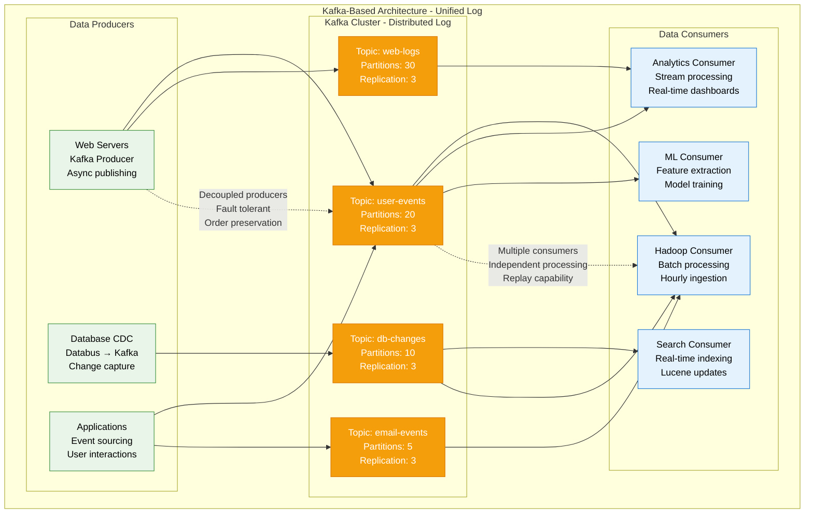
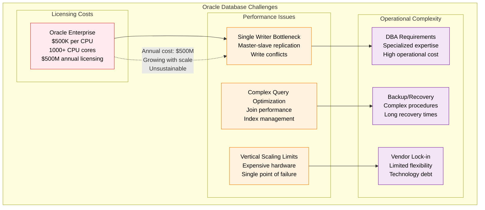
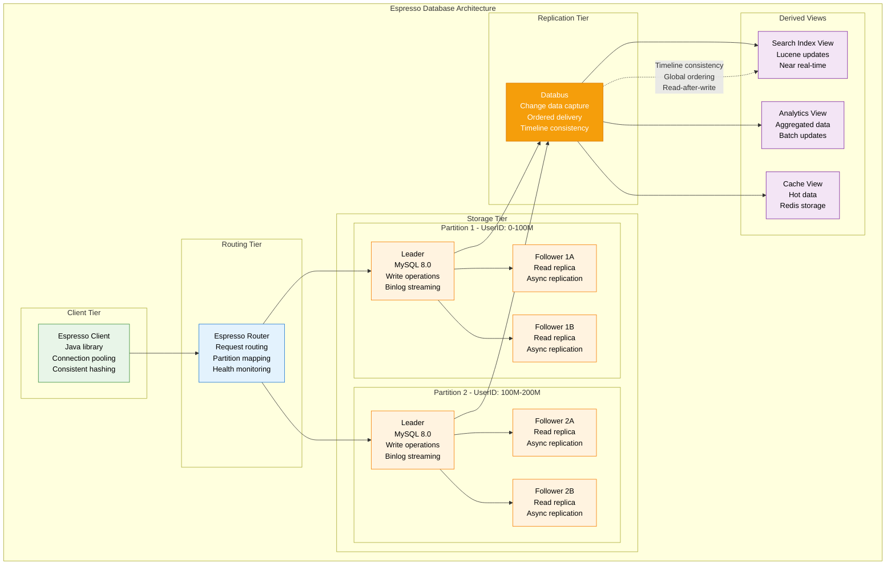
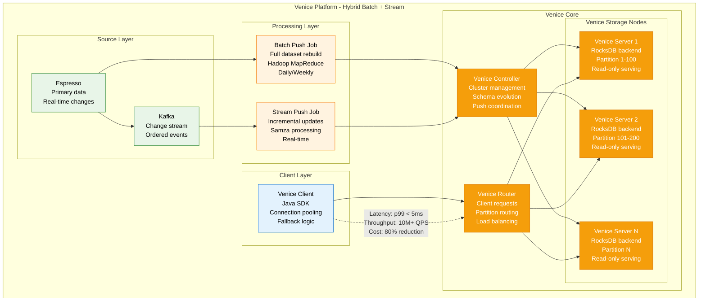
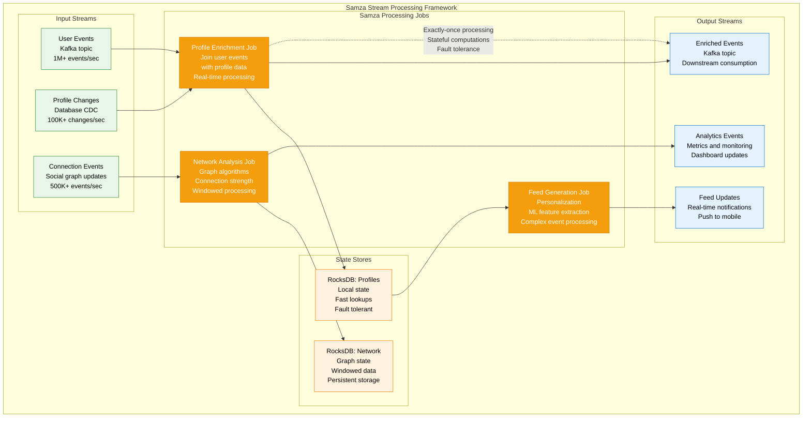
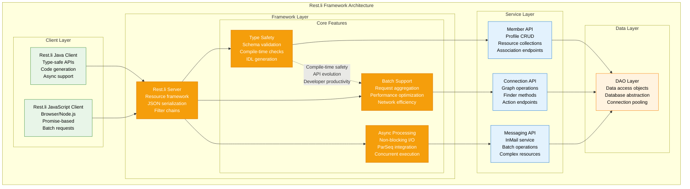
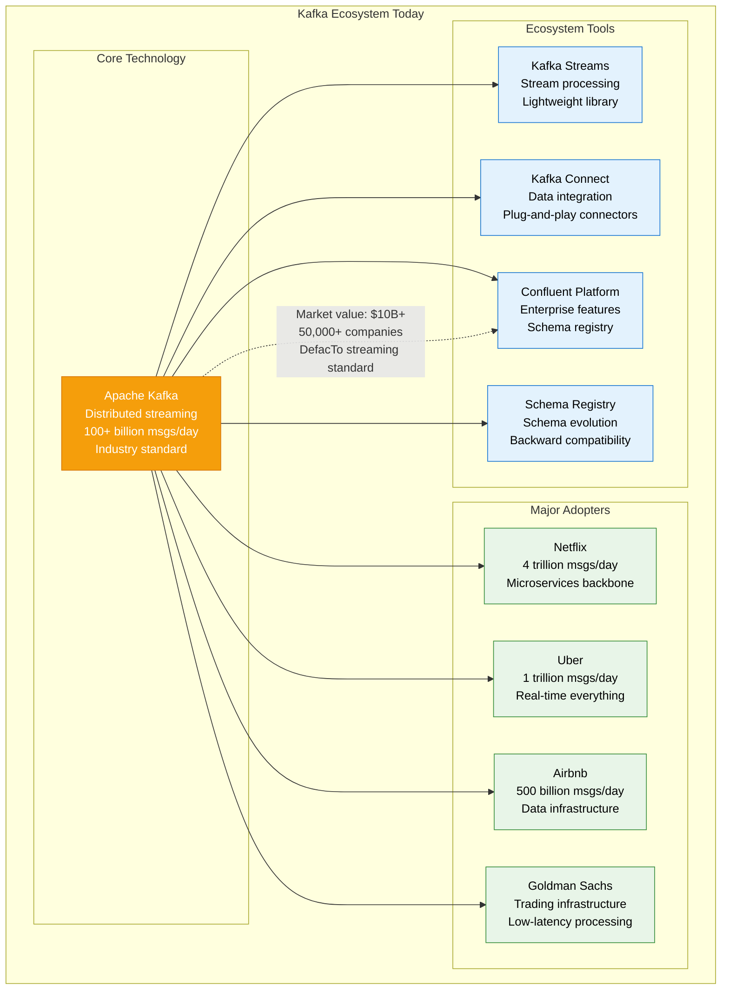
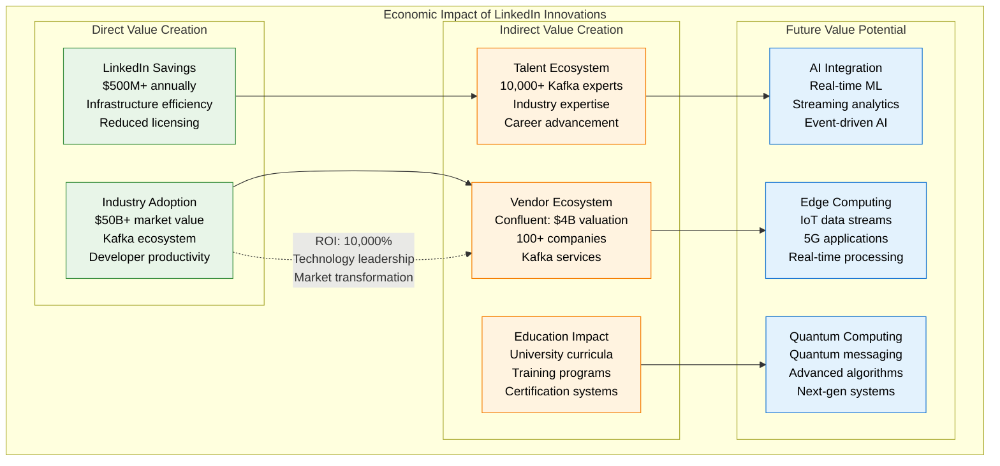

# LinkedIn Novel Solutions

## Overview
LinkedIn's innovative solutions that became industry standards: Apache Kafka, Espresso database, Venice platform, and other groundbreaking technologies that transformed distributed systems.

## Apache Kafka - The Game Changer

### The Problem That Started It All (2010)

```mermaid
graph TB
    subgraph PreKafka[Pre-Kafka Architecture - Integration Hell]
        subgraph DataSources[Data Sources (15+ systems)]
            WEB_LOGS[Web Server Logs]
            DB_CHANGES[Database Changes]
            USER_EVENTS[User Click Events]
            EMAIL_EVENTS[Email Events]
            SEARCH_LOGS[Search Query Logs]
        end

        subgraph PointToPoint[Point-to-Point Integration]
            PIPELINE1[Pipeline 1: Logs → Hadoop]
            PIPELINE2[Pipeline 2: DB → Search]
            PIPELINE3[Pipeline 3: Events → Analytics]
            PIPELINE4[Pipeline 4: Clicks → Recommendations]
            PIPELINE_N[Pipeline N: ...]
        end

        subgraph Destinations[Destination Systems]
            HADOOP[Hadoop Data Warehouse]
            SEARCH_INDEX[Search Index]
            ANALYTICS[Analytics Database]
            RECOMMENDATIONS[Recommendation Engine]
            MONITORING[Monitoring Systems]
        end
    end

    WEB_LOGS --> PIPELINE1
    DB_CHANGES --> PIPELINE2
    USER_EVENTS --> PIPELINE3
    USER_EVENTS --> PIPELINE4

    PIPELINE1 --> HADOOP
    PIPELINE2 --> SEARCH_INDEX
    PIPELINE3 --> ANALYTICS
    PIPELINE4 --> RECOMMENDATIONS

    %% Problems annotations
    PIPELINE1 -.->|"Custom integration<br/>Brittle connections<br/>Data loss potential"| PIPELINE2
    PIPELINE3 -.->|"Inconsistent formats<br/>No ordering guarantees<br/>Operational nightmare"| PIPELINE4

    classDef sourceStyle fill:#FFEBEE,stroke:#D32F2F,color:#000
    classDef pipelineStyle fill:#FFF3E0,stroke:#F57C00,color:#000
    classDef destStyle fill:#E8F5E8,stroke:#388E3C,color:#000

    class WEB_LOGS,DB_CHANGES,USER_EVENTS,EMAIL_EVENTS,SEARCH_LOGS sourceStyle
    class PIPELINE1,PIPELINE2,PIPELINE3,PIPELINE4,PIPELINE_N pipelineStyle
    class HADOOP,SEARCH_INDEX,ANALYTICS,RECOMMENDATIONS,MONITORING destStyle
```

**Critical Issues:**
- **O(N²) Complexity**: 15 systems × 8 destinations = 120 integration points
- **Data Inconsistency**: No ordering guarantees across systems
- **Operational Overhead**: 20+ separate ETL pipelines to maintain
- **Data Loss**: Network failures caused permanent data loss
- **Development Velocity**: New integrations took weeks to implement

### Kafka Solution Architecture



### Kafka's Revolutionary Design Principles

```mermaid
graph TB
    subgraph KafkaInnovations[Kafka Design Innovations]
        subgraph CoreConcepts[Core Concepts]
            LOG[Distributed Log<br/>Immutable append-only<br/>Total ordering within partition]
            PARTITION[Partitioning Strategy<br/>Horizontal scaling<br/>Parallel processing]
            REPLICATION[Fault Tolerance<br/>Leader-follower replication<br/>ISR (In-Sync Replicas)]
        end

        subgraph PerformanceInnovations[Performance Innovations]
            ZERO_COPY[Zero-Copy Transfer<br/>sendfile() system call<br/>Kernel-space transfer]
            BATCH_COMPRESSION[Batch Compression<br/>Producer batching<br/>Network efficiency]
            PAGE_CACHE[OS Page Cache<br/>Sequential disk access<br/>Memory-mapped files]
        end

        subgraph ScalabilityInnovations[Scalability Innovations]
            CONSUMER_GROUPS[Consumer Groups<br/>Horizontal scaling<br/>Automatic rebalancing]
            OFFSET_MANAGEMENT[Offset Management<br/>Consumer positioning<br/>Replay capability]
            BROKER_FEDERATION[Broker Federation<br/>Cluster scaling<br/>Topic distribution]
        end
    end

    LOG --> ZERO_COPY
    PARTITION --> BATCH_COMPRESSION
    REPLICATION --> PAGE_CACHE

    ZERO_COPY --> CONSUMER_GROUPS
    BATCH_COMPRESSION --> OFFSET_MANAGEMENT
    PAGE_CACHE --> BROKER_FEDERATION

    %% Performance metrics
    ZERO_COPY -.->|"Throughput: 100K+ msgs/sec<br/>Latency: <10ms p99"| BATCH_COMPRESSION
    CONSUMER_GROUPS -.->|"Scaling: Linear with partitions<br/>Fault tolerance: Automatic"| OFFSET_MANAGEMENT

    classDef coreStyle fill:#E8F5E8,stroke:#388E3C,color:#000
    classDef perfStyle fill:#FFF3E0,stroke:#F57C00,color:#000
    classDef scaleStyle fill:#E3F2FD,stroke:#1976D2,color:#000

    class LOG,PARTITION,REPLICATION coreStyle
    class ZERO_COPY,BATCH_COMPRESSION,PAGE_CACHE perfStyle
    class CONSUMER_GROUPS,OFFSET_MANAGEMENT,BROKER_FEDERATION scaleStyle
```

## Espresso Database - Timeline Consistency

### The Oracle Problem (2010-2014)



### Espresso Solution - Custom NoSQL



**Timeline Consistency Innovation:**
- **Global Ordering**: All changes have global timestamp
- **Read-after-Write**: Consistent view across all replicas
- **Causal Consistency**: Related events maintain order
- **Async Replication**: Performance with consistency guarantees

## Venice Platform - Derived Data Serving

### The Problem: Read Scaling

```mermaid
graph TB
    subgraph ReadScalingProblem[Read Scaling Problem (2014)]
        subgraph OriginalArchitecture[Original Architecture]
            ESPRESSO_ORIGIN[Espresso Database<br/>Source of truth<br/>1000+ TB<br/>Write optimized]
            READ_LOAD[Read Load<br/>10M+ QPS<br/>Complex queries<br/>Analytics joins]
        end

        subgraph PerformanceIssues[Performance Issues]
            HIGH_LATENCY[High Latency<br/>Complex aggregations<br/>Cross-partition joins<br/>p99: 500ms+]
            RESOURCE_CONTENTION[Resource Contention<br/>Reads impact writes<br/>CPU/IO bottlenecks<br/>Degraded performance]
            SCALING_COST[Scaling Cost<br/>Expensive read replicas<br/>Storage duplication<br/>Operational overhead]
        end
    end

    ESPRESSO_ORIGIN --> READ_LOAD
    READ_LOAD --> HIGH_LATENCY
    READ_LOAD --> RESOURCE_CONTENTION
    READ_LOAD --> SCALING_COST

    %% Problem metrics
    READ_LOAD -.->|"Read:Write ratio 100:1<br/>Growing query complexity<br/>Performance degradation"| HIGH_LATENCY

    classDef problemStyle fill:#FFEBEE,stroke:#D32F2F,color:#000

    class ESPRESSO_ORIGIN,READ_LOAD,HIGH_LATENCY,RESOURCE_CONTENTION,SCALING_COST problemStyle
```

### Venice Solution - Hybrid Architecture



## Samza Stream Processing Framework

### Event-Driven Processing Innovation



## Rest.li Framework - Service Communication

### Standardized API Framework



## Industry Impact and Adoption

### Technology Adoption Timeline

| Technology | LinkedIn Launch | Industry Adoption | Current Usage |
|------------|-----------------|-------------------|---------------|
| **Apache Kafka** | 2010 | 2012-2015 | 80% of Fortune 500 |
| **Espresso DB** | 2014 | Internal only | LinkedIn exclusive |
| **Venice Platform** | 2016 | Open sourced 2022 | Growing adoption |
| **Samza** | 2013 | 2014-2017 | Moderate adoption |
| **Rest.li** | 2012 | 2013-2016 | LinkedIn + select companies |

### Kafka Industry Impact



## Open Source Contributions

### LinkedIn's Open Source Portfolio

| Project | Year | Status | GitHub Stars | Industry Impact |
|---------|------|--------|--------------|-----------------|
| **Apache Kafka** | 2011 | Graduated | 28k+ | Critical infrastructure |
| **Apache Samza** | 2013 | Top-level | 800+ | Stream processing |
| **Rest.li** | 2012 | Stable | 4k+ | API framework |
| **Databus** | 2013 | Stable | 3k+ | Change data capture |
| **Venice** | 2022 | Growing | 2k+ | Derived data platform |
| **Pinot** | 2018 | Graduated | 5k+ | Real-time analytics |

### Economic Impact Analysis



*Last updated: September 2024*
*Source: LinkedIn Engineering Blog, Apache Software Foundation, GitHub metrics*