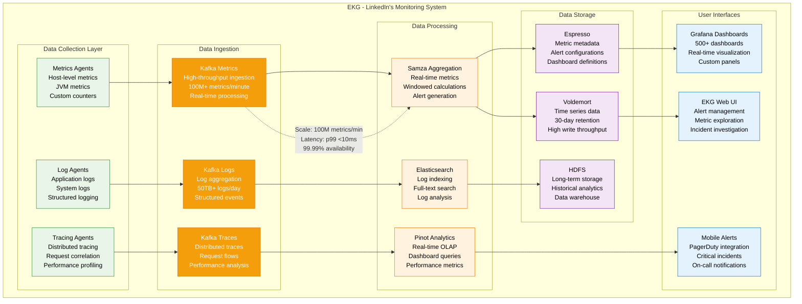
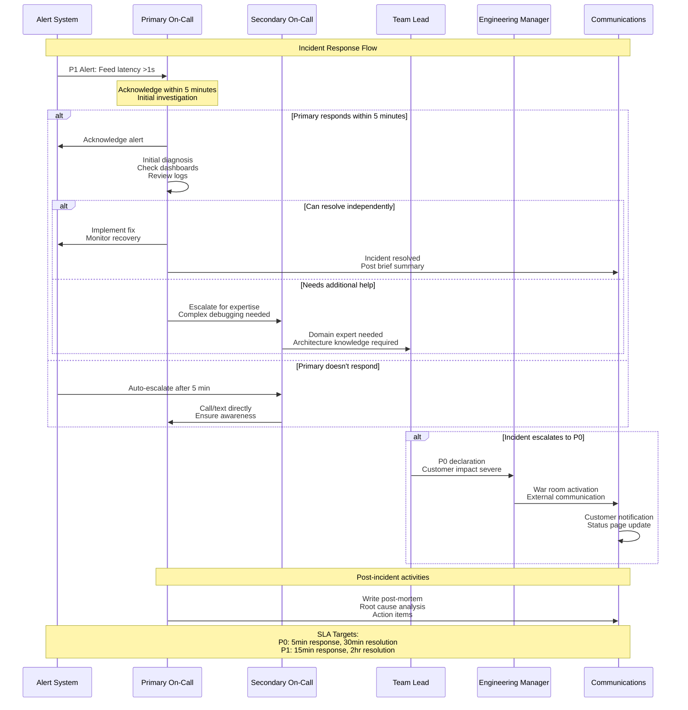
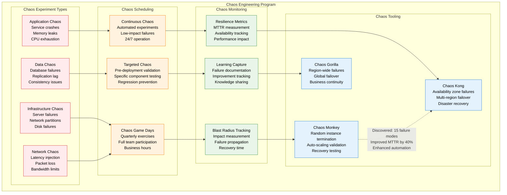
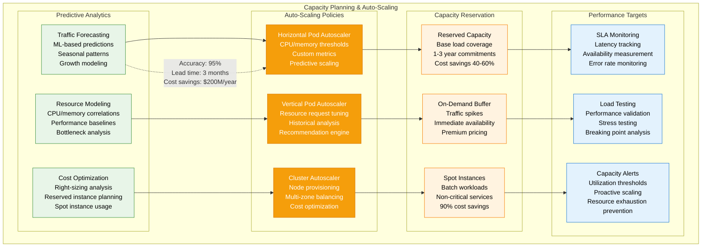
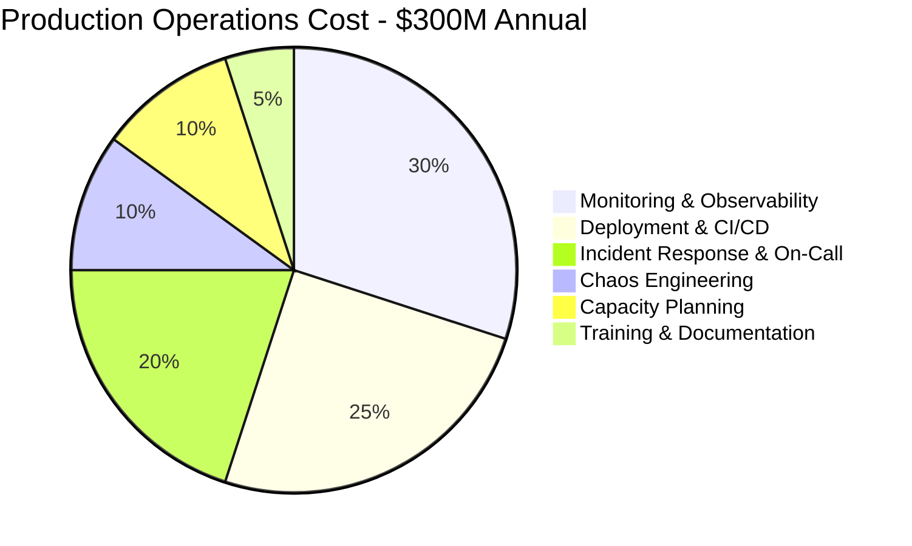

# LinkedIn Production Operations

## Overview
LinkedIn's production operations at scale: serving 1B+ members with advanced deployment, monitoring, and operational practices. Focus on reliability, observability, and incident response.

## Multi-Product Deployment Architecture

```mermaid
graph TB
    subgraph DeploymentPlatform[Multi-Product Deployment Platform]
        subgraph SourceControl[Source Control & CI]
            GITHUB[GitHub Enterprise<br/>10,000+ repositories<br/>Monorepo + multi-repo<br/>Branch protection rules]
            CI_PIPELINE[CI Pipeline<br/>Jenkins + GitHub Actions<br/>10,000+ builds/day<br/>Parallel execution]
        end

        subgraph ArtifactManagement[Artifact Management]
            NEXUS[Nexus Repository<br/>Maven artifacts<br/>Docker images<br/>Versioning strategy]
            DOCKER_REGISTRY[Docker Registry<br/>Container images<br/>Vulnerability scanning<br/>Image signing]
        end

        subgraph DeploymentTiers[Deployment Tiers]
            DEV_ENV[Development<br/>Feature branches<br/>Individual testing<br/>Rapid iteration]
            STAGING_ENV[Staging (EI)<br/>Integration testing<br/>Performance validation<br/>Production mirror]
            CANARY_ENV[Canary<br/>1% production traffic<br/>Real user validation<br/>Metric monitoring]
            PROD_ENV[Production<br/>Full traffic<br/>Blue-green deployment<br/>Rollback ready]
        end

        subgraph DeploymentTools[Deployment Tools]
            MULTIPRODUCT[Multi-Product System<br/>LinkedIn's deployment platform<br/>Automated rollouts<br/>Dependency management]
            KUBERNETES[Kubernetes<br/>Container orchestration<br/>1000+ nodes<br/>Auto-scaling]
            HELM[Helm Charts<br/>Application packaging<br/>Configuration management<br/>Environment promotion]
        end
    end

    GITHUB --> CI_PIPELINE
    CI_PIPELINE --> NEXUS
    CI_PIPELINE --> DOCKER_REGISTRY

    NEXUS --> DEV_ENV
    DOCKER_REGISTRY --> STAGING_ENV

    DEV_ENV --> STAGING_ENV
    STAGING_ENV --> CANARY_ENV
    CANARY_ENV --> PROD_ENV

    MULTIPRODUCT --> KUBERNETES
    KUBERNETES --> HELM

    %% Deployment flow annotations
    STAGING_ENV -.->|"Gate: All tests pass<br/>Performance baseline<br/>Security scan"| CANARY_ENV
    CANARY_ENV -.->|"Gate: Error rate <0.1%<br/>Latency p99 <baseline<br/>Business metrics stable"| PROD_ENV

    classDef sourceStyle fill:#E8F5E8,stroke:#388E3C,color:#000
    classDef artifactStyle fill:#FFF3E0,stroke:#F57C00,color:#000
    classDef envStyle fill:#E3F2FD,stroke:#1976D2,color:#000
    classDef toolStyle fill:#F59E0B,stroke:#D97706,color:#fff

    class GITHUB,CI_PIPELINE sourceStyle
    class NEXUS,DOCKER_REGISTRY artifactStyle
    class DEV_ENV,STAGING_ENV,CANARY_ENV,PROD_ENV envStyle
    class MULTIPRODUCT,KUBERNETES,HELM toolStyle
```

## EKG Monitoring System



## A/B Testing Infrastructure (Decider)

```mermaid
graph TB
    subgraph ABTestingPlatform[A/B Testing Platform - Decider]
        subgraph ExperimentManagement[Experiment Management]
            EXP_PORTAL[Experiment Portal<br/>Self-service platform<br/>Experiment configuration<br/>Hypothesis tracking]
            EXP_CONFIG[Configuration Service<br/>Real-time config updates<br/>Feature flag management<br/>Rollout controls]
        end

        subgraph TrafficSplitting[Traffic Splitting]
            HASH_RING[Consistent Hashing<br/>User ID based<br/>Deterministic assignment<br/>Minimal reassignment]
            TREATMENT_ROUTER[Treatment Router<br/>Experiment assignment<br/>Bucket allocation<br/>Override support]
        end

        subgraph DataCollection[Data Collection]
            EVENT_TRACKING[Event Tracking<br/>User interactions<br/>Conversion metrics<br/>Performance data]
            EXPERIMENT_LOGS[Experiment Logs<br/>Treatment assignments<br/>Metric calculations<br/>Statistical analysis]
        end

        subgraph AnalysisEngine[Analysis Engine]
            STATS_ENGINE[Statistics Engine<br/>Hypothesis testing<br/>Confidence intervals<br/>Power analysis]
            METRIC_COMPUTATION[Metric Computation<br/>Real-time calculations<br/>Segmented analysis<br/>Cohort tracking]
            REPORTING[Reporting Dashboard<br/>Experiment results<br/>Statistical significance<br/>Business impact]
        end

        subgraph SafetyControls[Safety Controls]
            GUARDRAILS[Guardrails<br/>Metric boundaries<br/>Automatic shutoffs<br/>Alert thresholds]
            ROLLBACK[Rollback System<br/>Emergency stops<br/>Treatment disabling<br/>Traffic redistribution]
        end
    end

    EXP_PORTAL --> EXP_CONFIG
    EXP_CONFIG --> HASH_RING
    HASH_RING --> TREATMENT_ROUTER

    TREATMENT_ROUTER --> EVENT_TRACKING
    EVENT_TRACKING --> EXPERIMENT_LOGS

    EXPERIMENT_LOGS --> STATS_ENGINE
    STATS_ENGINE --> METRIC_COMPUTATION
    METRIC_COMPUTATION --> REPORTING

    STATS_ENGINE --> GUARDRAILS
    GUARDRAILS --> ROLLBACK

    %% A/B testing scale
    TREATMENT_ROUTER -.->|"Experiments: 1000+ active<br/>Users: 1B+ enrolled<br/>Decisions: 10B+/day"| EVENT_TRACKING

    classDef managementStyle fill:#E8F5E8,stroke:#388E3C,color:#000
    classDef splittingStyle fill:#F59E0B,stroke:#D97706,color:#fff
    classDef collectionStyle fill:#FFF3E0,stroke:#F57C00,color:#000
    classDef analysisStyle fill:#E3F2FD,stroke:#1976D2,color:#000
    classDef safetyStyle fill:#FFEBEE,stroke:#D32F2F,color:#000

    class EXP_PORTAL,EXP_CONFIG managementStyle
    class HASH_RING,TREATMENT_ROUTER splittingStyle
    class EVENT_TRACKING,EXPERIMENT_LOGS collectionStyle
    class STATS_ENGINE,METRIC_COMPUTATION,REPORTING analysisStyle
    class GUARDRAILS,ROLLBACK safetyStyle
```



## Incident Response and On-Call



## Chaos Engineering Program



## Capacity Planning and Auto-Scaling



## Production Operational Metrics

| Metric Category | Target | Current Performance | Trend |
|-----------------|--------|-------------------|-------|
| **Deployment Success Rate** | 99.5% | 99.8% | ↑ |
| **Deployment Frequency** | 50/day | 75/day | ↑ |
| **Lead Time** | <4 hours | 2.5 hours | ↓ |
| **MTTR (Mean Time to Recovery)** | <15 minutes | 12 minutes | ↓ |
| **MTBF (Mean Time Between Failures)** | >30 days | 45 days | ↑ |
| **Change Failure Rate** | <5% | 3.2% | ↓ |

## Operational Cost Breakdown



## Key Operational Innovations

### 1. EKG Real-Time Monitoring
- **Custom built** for LinkedIn scale
- **100M+ metrics per minute** processing
- **Sub-10ms latency** for critical alerts
- **99.99% availability** for monitoring infrastructure

### 2. Multi-Product Deployment Platform
- **Zero-downtime deployments** for all services
- **Automated rollback** within 30 seconds
- **Dependency management** across 2000+ services
- **Feature flag integration** for gradual rollouts

### 3. Chaos Engineering at Scale
- **Continuous chaos** testing in production
- **15+ failure modes** discovered and fixed
- **40% improvement** in MTTR
- **Proactive resilience** building

### 4. A/B Testing Infrastructure
- **1000+ experiments** running simultaneously
- **1B+ users** enrolled in experiments
- **10B+ decisions** made daily
- **Real-time analysis** and automatic safeguards

*Last updated: September 2024*
*Source: LinkedIn Engineering Blog, SRE reports, Production metrics*