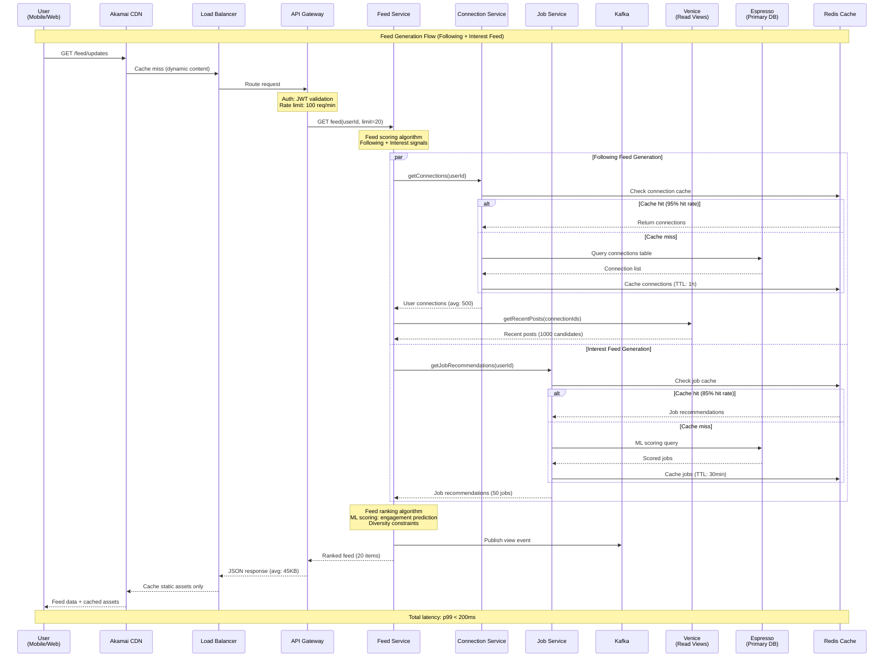
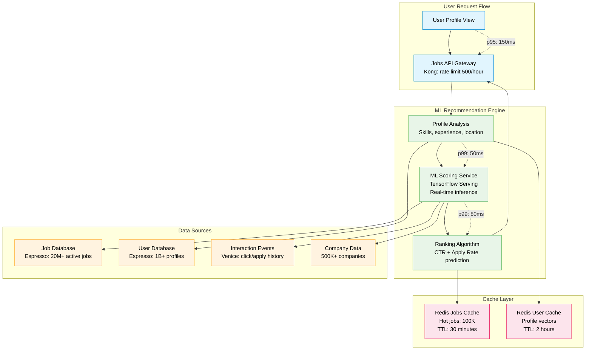
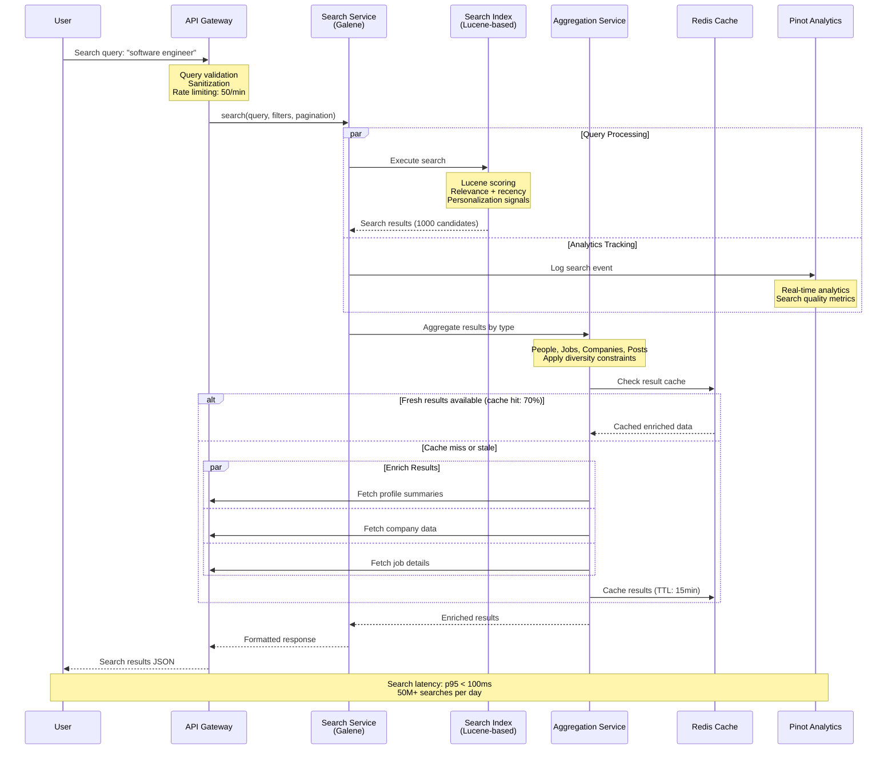
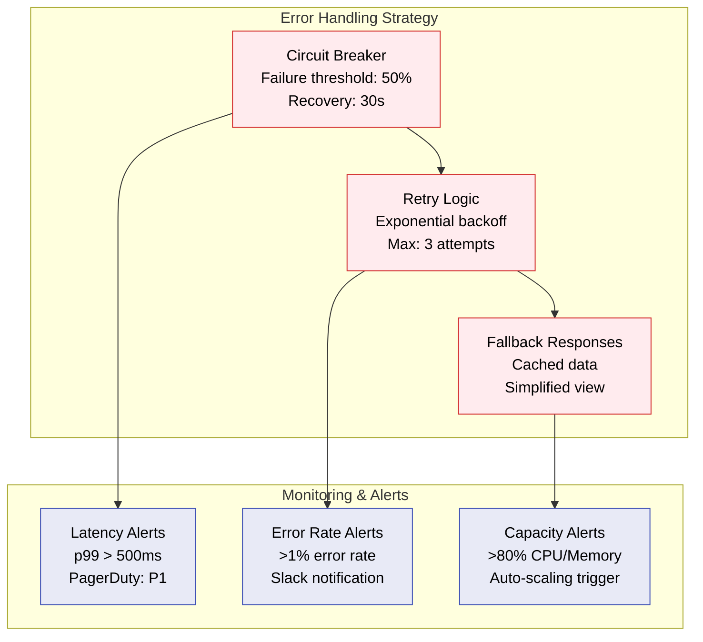

# LinkedIn Request Flow

## Overview
LinkedIn's request flow handles massive scale with feed generation, job recommendations, search, and messaging. The system serves 2M+ requests per second with <200ms feed refresh times.

## Feed Generation Request Flow



## Job Recommendation Pipeline



## Search Request Flow (Galene Search Engine)



## InMail Delivery System

```mermaid
graph TB
    subgraph MessageFlow[InMail Message Flow]
        SENDER[Sender<br/>Premium user]
        MSG_API[Messaging API<br/>Rate limit: 50/day premium]
        MSG_SVC[Message Service<br/>Akka actors<br/>Async processing]
    end

    subgraph DeliveryPipeline[Delivery Pipeline]
        VALIDATE[Message Validation<br/>Spam detection<br/>Content filtering]
        QUEUE[Kafka Message Queue<br/>Topic: inmail-delivery<br/>Partitioned by recipientId]
        DELIVERY[Delivery Service<br/>Guaranteed delivery<br/>Retry logic: 3 attempts]
    end

    subgraph NotificationSystem[Notification System]
        PUSH[Push Service<br/>Mobile notifications<br/>APNs/FCM]
        EMAIL[Email Service<br/>SendGrid integration<br/>Fallback delivery]
        WS[WebSocket Service<br/>Real-time web notifications]
    end

    subgraph Storage[Message Storage]
        COUCHBASE[Couchbase<br/>Message storage<br/>TTL: 2 years]
        SEARCH_IDX[Search Index<br/>Message search<br/>Elasticsearch]
    end

    SENDER --> MSG_API
    MSG_API --> MSG_SVC
    MSG_SVC --> VALIDATE

    VALIDATE --> QUEUE
    QUEUE --> DELIVERY

    DELIVERY --> COUCHBASE
    DELIVERY --> SEARCH_IDX

    par Notification Delivery
        DELIVERY --> PUSH
        DELIVERY --> EMAIL
        DELIVERY --> WS
    end

    %% Success metrics
    DELIVERY -.->|"Delivery rate: 99.5%"| COUCHBASE
    PUSH -.->|"Open rate: 35%"| DELIVERY
    EMAIL -.->|"Fallback rate: 5%"| DELIVERY

    %% Apply styles
    classDef senderStyle fill:#E3F2FD,stroke:#1976D2,color:#000
    classDef pipelineStyle fill:#E8F5E8,stroke:#388E3C,color:#000
    classDef notifyStyle fill:#FFF8E1,stroke:#F57C00,color:#000
    classDef storageStyle fill:#FCE4EC,stroke:#C2185B,color:#000

    class SENDER,MSG_API,MSG_SVC senderStyle
    class VALIDATE,QUEUE,DELIVERY pipelineStyle
    class PUSH,EMAIL,WS notifyStyle
    class COUCHBASE,SEARCH_IDX storageStyle
```

## Performance Characteristics

| Request Type | p50 Latency | p99 Latency | Throughput | Cache Hit Rate |
|--------------|-------------|-------------|------------|----------------|
| **Feed Generation** | 85ms | 200ms | 500K RPS | 95% (connections) |
| **Job Recommendations** | 120ms | 250ms | 200K RPS | 85% (jobs) |
| **Search Queries** | 45ms | 100ms | 150K RPS | 70% (results) |
| **Profile Views** | 25ms | 75ms | 800K RPS | 98% (profiles) |
| **InMail Delivery** | 200ms | 500ms | 50K RPS | N/A (async) |
| **Connection Requests** | 50ms | 150ms | 100K RPS | 90% (mutual) |

## Error Handling & Fallbacks



## Key Optimizations

1. **Connection Graph Caching**: 95% hit rate, 1-hour TTL
2. **Feed Pre-computation**: Background jobs for active users
3. **ML Model Caching**: Feature vectors cached for 2 hours
4. **Search Index Warming**: Popular queries pre-loaded
5. **Content Compression**: GZIP + Brotli for 60% size reduction
6. **Database Sharding**: User-based sharding for horizontal scale

*Last updated: September 2024*
*Source: LinkedIn Engineering Blog, Production metrics*