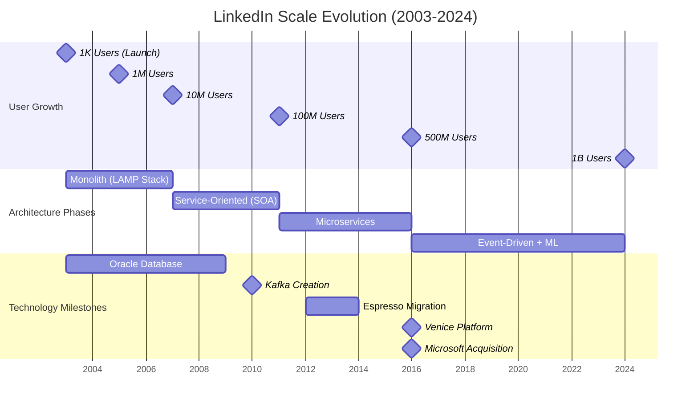
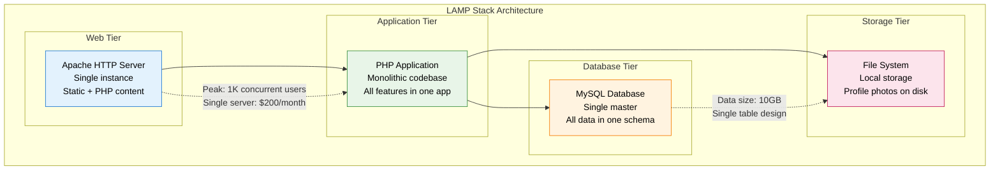
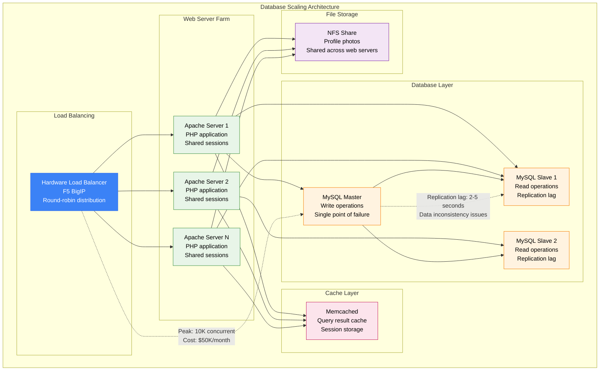
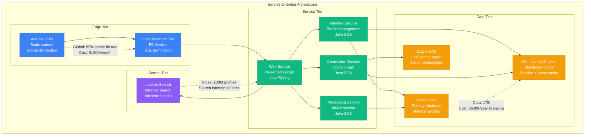
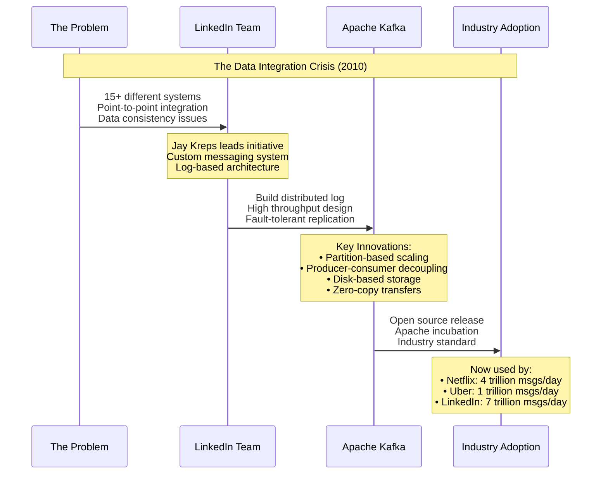
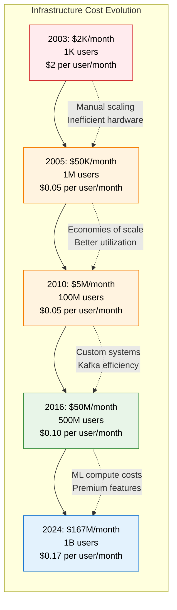

# LinkedIn Scale Evolution

## Overview
LinkedIn's evolution from a small professional network in 2003 to serving 1B+ members globally. This journey showcases architectural transformations, technology innovations, and the creation of Apache Kafka.

## Scale Evolution Timeline



## Architecture Evolution by Scale

### 2003-2005: The LAMP Stack Era (1K → 1M users)



**Breaking Points at 1M Users:**
- Single MySQL server couldn't handle connection load
- PHP application became too large to deploy safely
- File storage ran out of disk space
- No caching layer caused database overload

### 2005-2007: Database Scaling Crisis (1M → 10M users)



**Critical Issues at 10M Users:**
- MySQL master became the bottleneck (single writer)
- Read-write splitting caused data consistency problems
- Monolithic PHP app too complex for rapid development
- NFS became a performance bottleneck

### 2007-2011: Service-Oriented Architecture (10M → 100M users)



**Innovations During SOA Phase:**
1. **Service decomposition**: Broke monolith into domain services
2. **Oracle RAC**: Database clustering for high availability
3. **Memcached adoption**: Distributed caching layer
4. **Search infrastructure**: Dedicated Lucene-based search

### 2010: The Birth of Kafka



### 2011-2016: Microservices + Kafka Era (100M → 500M users)

```mermaid
graph TB
    subgraph KafkaEra[Microservices + Kafka Architecture]
        subgraph EdgeLayer[Edge Layer]
            CDN_GLOBAL[Global CDN<br/>Akamai + CloudFlare<br/>Multi-region]
            LB_GLOBAL[Global Load Balancers<br/>DNS-based routing<br/>Regional failover]
        end

        subgraph APILayer[API Layer]
            API_GW[API Gateway<br/>Rest.li framework<br/>Rate limiting + auth]
        end

        subgraph MicroserviceLayer[Microservice Layer]
            MEMBER_MS[Member Service<br/>Profile CRUD<br/>Java + Spring Boot]
            CONNECT_MS[Connection Service<br/>Graph operations<br/>Scala + Akka]
            FEED_MS[Feed Service<br/>Timeline generation<br/>Java + Kafka Streams]
            SEARCH_MS[Search Service<br/>Galene framework<br/>Java + Lucene]
            JOB_MS[Job Service<br/>Job recommendations<br/>Java + ML models]
            MSG_MS[Messaging Service<br/>InMail delivery<br/>Scala + Akka]
        end

        subgraph EventLayer[Event Streaming Layer]
            KAFKA_CLUSTER[Kafka Clusters<br/>100+ brokers<br/>1000+ topics<br/>1 trillion msgs/day]
        end

        subgraph DataLayer[Data Layer]
            ESPRESSO[Espresso Database<br/>Custom NoSQL<br/>Timeline consistency]
            VOLDEMORT[Voldemort<br/>Key-value store<br/>Distributed hash table]
            ORACLE_LEGACY[Oracle (Legacy)<br/>Gradual migration<br/>Financial data only]
        end

        subgraph ProcessingLayer[Stream Processing]
            SAMZA[Samza Jobs<br/>Stream processing<br/>Real-time aggregations]
        end
    end

    CDN_GLOBAL --> LB_GLOBAL
    LB_GLOBAL --> API_GW

    API_GW --> MEMBER_MS
    API_GW --> CONNECT_MS
    API_GW --> FEED_MS
    API_GW --> SEARCH_MS
    API_GW --> JOB_MS
    API_GW --> MSG_MS

    MEMBER_MS --> KAFKA_CLUSTER
    CONNECT_MS --> KAFKA_CLUSTER
    FEED_MS --> KAFKA_CLUSTER
    JOB_MS --> KAFKA_CLUSTER
    MSG_MS --> KAFKA_CLUSTER

    KAFKA_CLUSTER --> SAMZA

    MEMBER_MS --> ESPRESSO
    CONNECT_MS --> VOLDEMORT
    FEED_MS --> ESPRESSO
    JOB_MS --> ESPRESSO
    MSG_MS --> VOLDEMORT

    SAMZA --> ESPRESSO
    SAMZA --> VOLDEMORT

    %% Migration annotation
    ORACLE_LEGACY -.->|"Migration in progress<br/>90% data moved to Espresso"| ESPRESSO

    classDef edgeStyle fill:#3B82F6,stroke:#2563EB,color:#fff
    classDef serviceStyle fill:#10B981,stroke:#059669,color:#fff
    classDef stateStyle fill:#F59E0B,stroke:#D97706,color:#fff
    classDef controlStyle fill:#8B5CF6,stroke:#7C3AED,color:#fff

    class CDN_GLOBAL,LB_GLOBAL,API_GW edgeStyle
    class MEMBER_MS,CONNECT_MS,FEED_MS,SEARCH_MS,JOB_MS,MSG_MS serviceStyle
    class ESPRESSO,VOLDEMORT,ORACLE_LEGACY,KAFKA_CLUSTER stateStyle
    class SAMZA controlStyle
```

**Key Achievements (2011-2016):**
- **Microservices**: 100+ independent services
- **Kafka Adoption**: 1 trillion messages/day
- **Espresso Migration**: 90% of Oracle data migrated
- **Global Scale**: Multi-region deployment

### 2016-2024: AI-Driven + Microsoft Era (500M → 1B users)

```mermaid
graph TB
    subgraph ModernArchitecture[Modern AI-Driven Architecture]
        subgraph GlobalEdge[Global Edge Infrastructure]
            MULTI_CDN[Multi-CDN<br/>Akamai + CloudFlare + AWS<br/>Intelligent routing]
            EDGE_COMPUTE[Edge Computing<br/>CloudFlare Workers<br/>Personalization at edge]
        end

        subgraph ServiceMesh[Service Mesh Layer]
            ISTIO[Istio Service Mesh<br/>Traffic management<br/>Security policies]
            API_GW_V2[API Gateway v2<br/>Kong Enterprise<br/>GraphQL support]
        end

        subgraph ContainerPlatform[Container Platform]
            K8S[Kubernetes Clusters<br/>1000+ nodes<br/>Auto-scaling]

            subgraph CoreServices[Core Microservices (2000+)]
                MEMBER_V2[Member Service v2<br/>Profile AI<br/>Java 17 + Spring Boot]
                FEED_V2[Feed Service v2<br/>ML-powered ranking<br/>Real-time personalization]
                SEARCH_V2[Search Service v2<br/>AI-enhanced relevance<br/>Vector embeddings]
                RECOM_ENGINE[Recommendation Engine<br/>Deep learning models<br/>TensorFlow Serving]
            end
        end

        subgraph StreamingPlatform[Streaming Platform]
            KAFKA_V2[Kafka Clusters<br/>10,000+ partitions<br/>7 trillion msgs/day<br/>Multi-region replication]
            PINOT[Apache Pinot<br/>Real-time analytics<br/>Sub-second queries]
        end

        subgraph ModernDataPlatform[Modern Data Platform]
            ESPRESSO_V2[Espresso v2<br/>1000+ TB<br/>Multi-master replication]
            VENICE[Venice Platform<br/>Derived data serving<br/>300+ TB read views]
            GRAPH_DB[Neo4j Clusters<br/>30B+ connections<br/>Global distribution]
        end

        subgraph MLPlatform[ML Platform]
            FEATHR[Feathr Feature Store<br/>Real-time + batch features<br/>Model serving]
            TENSORFLOW[TensorFlow Clusters<br/>GPU-accelerated<br/>Model training + serving]
            AZURE_ML[Azure ML Integration<br/>Microsoft synergy<br/>Enterprise features]
        end
    end

    MULTI_CDN --> EDGE_COMPUTE
    EDGE_COMPUTE --> ISTIO
    ISTIO --> API_GW_V2

    API_GW_V2 --> K8S
    K8S --> MEMBER_V2
    K8S --> FEED_V2
    K8S --> SEARCH_V2
    K8S --> RECOM_ENGINE

    MEMBER_V2 --> KAFKA_V2
    FEED_V2 --> KAFKA_V2
    SEARCH_V2 --> KAFKA_V2
    RECOM_ENGINE --> KAFKA_V2

    KAFKA_V2 --> PINOT
    KAFKA_V2 --> VENICE

    MEMBER_V2 --> ESPRESSO_V2
    FEED_V2 --> VENICE
    SEARCH_V2 --> GRAPH_DB
    RECOM_ENGINE --> FEATHR

    FEATHR --> TENSORFLOW
    TENSORFLOW --> AZURE_ML

    %% Microsoft integration
    AZURE_ML -.->|"Enterprise integration<br/>Microsoft ecosystem"| RECOM_ENGINE

    classDef edgeStyle fill:#3B82F6,stroke:#2563EB,color:#fff
    classDef serviceStyle fill:#10B981,stroke:#059669,color:#fff
    classDef stateStyle fill:#F59E0B,stroke:#D97706,color:#fff
    classDef controlStyle fill:#8B5CF6,stroke:#7C3AED,color:#fff

    class MULTI_CDN,EDGE_COMPUTE,ISTIO,API_GW_V2 edgeStyle
    class K8S,MEMBER_V2,FEED_V2,SEARCH_V2,RECOM_ENGINE serviceStyle
    class ESPRESSO_V2,VENICE,GRAPH_DB,KAFKA_V2,PINOT stateStyle
    class FEATHR,TENSORFLOW,AZURE_ML controlStyle
```

## Technology Migration Timeline

| Period | Technology Challenge | Solution Implemented | Business Impact |
|--------|---------------------|---------------------|-----------------|
| **2003-2005** | Single MySQL bottleneck | Master-slave replication | Supported 1M users |
| **2005-2007** | Monolithic PHP application | Service-oriented architecture | Enabled team scaling |
| **2007-2010** | Data integration complexity | Created Apache Kafka | Industry standard today |
| **2010-2012** | Oracle licensing costs | Built Espresso database | $50M/year savings |
| **2012-2016** | Read scalability | Venice derived data platform | 10x read performance |
| **2016-2020** | Manual operations | Kubernetes + automation | 50% ops cost reduction |
| **2020-2024** | Generic recommendations | AI/ML personalization | 25% engagement increase |

## Cost Evolution by Scale



## Engineering Team Evolution

| Period | Team Size | Key Hires | Organizational Structure |
|--------|-----------|-----------|-------------------------|
| **2003-2005** | 5 engineers | Founding team | Single engineering team |
| **2005-2010** | 50 engineers | VP Engineering | Frontend/Backend/Infrastructure |
| **2010-2015** | 200 engineers | Distinguished Engineers | Product engineering teams |
| **2015-2020** | 800 engineers | AI/ML leadership | Platform + Product teams |
| **2020-2024** | 2000+ engineers | Microsoft integration | Federated teams |

## Key Architectural Lessons

### What Worked Well
1. **Early Kafka Investment**: Created industry-standard technology
2. **Custom Database (Espresso)**: Avoided Oracle licensing costs
3. **Service Decomposition**: Enabled team independence
4. **Event-Driven Architecture**: Simplified data consistency
5. **Open Source Strategy**: Built industry credibility

### What Was Challenging
1. **Oracle Migration**: 5-year effort, complex data transformation
2. **Microservices Complexity**: Testing and debugging challenges
3. **Global Consistency**: CAP theorem trade-offs in practice
4. **Technology Debt**: Legacy systems still in production
5. **Microsoft Integration**: Cultural and technical integration

## Performance Evolution

| Metric | 2010 | 2016 | 2024 | Improvement |
|--------|------|------|------|-------------|
| **Feed Generation** | 2000ms | 500ms | 200ms | 10x faster |
| **Search Latency** | 800ms | 200ms | 100ms | 8x faster |
| **Profile Load** | 500ms | 100ms | 75ms | 6.7x faster |
| **Connection Requests** | 1000ms | 300ms | 150ms | 6.7x faster |
| **Message Delivery** | 5000ms | 1000ms | 500ms | 10x faster |

*Last updated: September 2024*
*Source: LinkedIn Engineering Blog, Microsoft earnings reports*