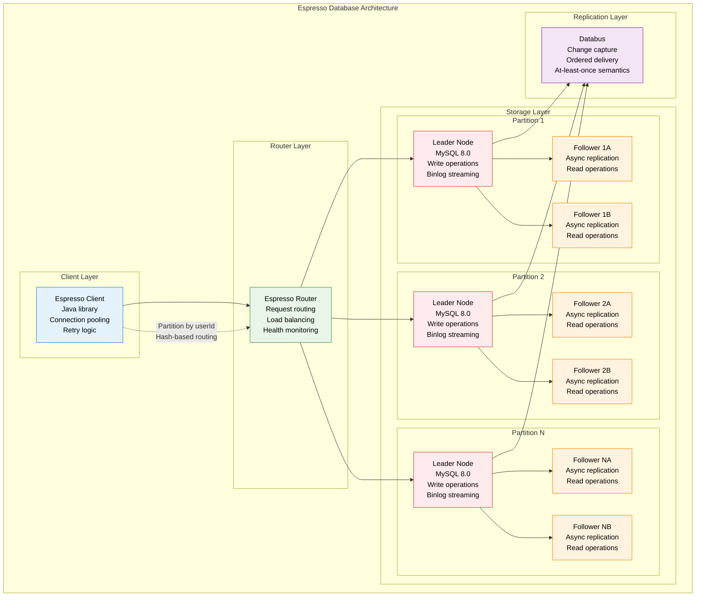
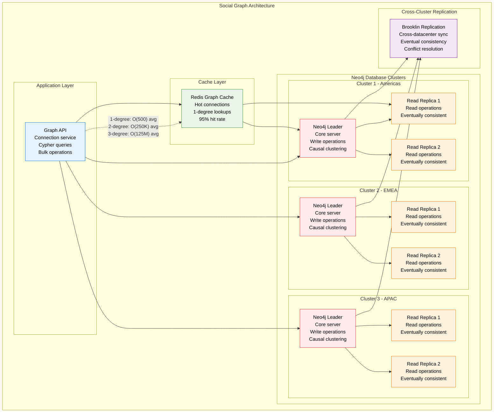
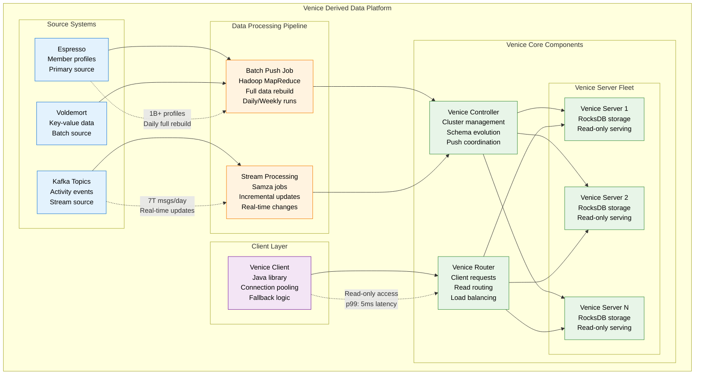
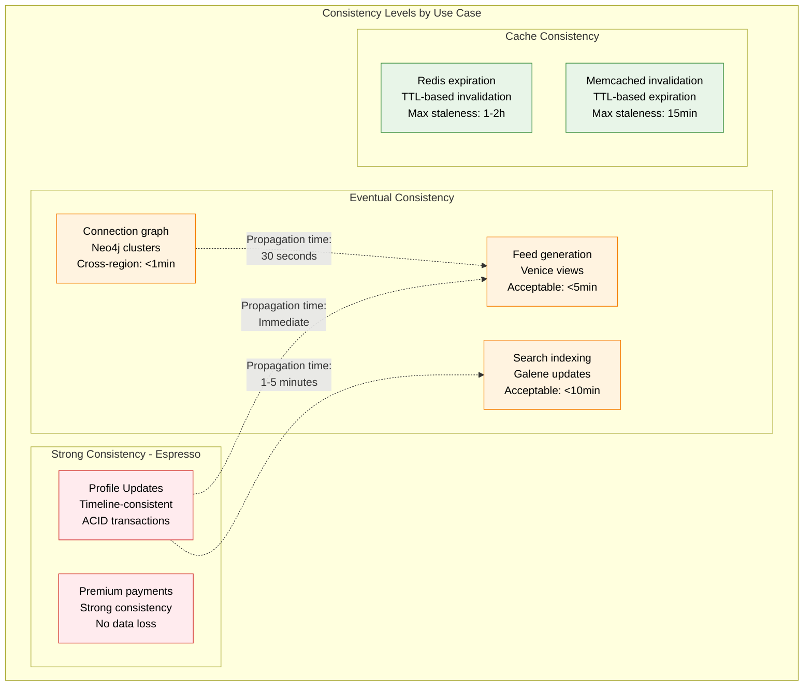

# LinkedIn Storage Architecture

## Overview
LinkedIn's storage architecture handles 1B+ member profiles, 30B+ connections, and 7 trillion Kafka messages daily. The system uses specialized databases for different data patterns with strong consistency guarantees.

## Complete Storage Architecture

```mermaid
graph TB
    subgraph EdgePlane[Edge Plane - Data Access]
        API[API Gateway<br/>Kong Enterprise<br/>Request routing]
        LB[Load Balancers<br/>F5 + AWS ALB<br/>Health checking]
    end

    subgraph ServicePlane[Service Plane - Data Services]
        subgraph ReadServices[Read Services]
            FEED_R[Feed Read Service<br/>Venice client<br/>Read-optimized views]
            PROFILE_R[Profile Read Service<br/>Espresso client<br/>Consistent reads]
            SEARCH_R[Search Read Service<br/>Galene client<br/>Full-text search]
        end

        subgraph WriteServices[Write Services]
            PROFILE_W[Profile Write Service<br/>Espresso client<br/>ACID transactions]
            CONNECT_W[Connection Write Service<br/>Graph mutations<br/>Bi-directional updates]
            ACTIVITY_W[Activity Write Service<br/>Kafka producer<br/>Event streaming]
        end
    end

    subgraph StatePlane[State Plane - Storage Systems]
        subgraph PrimaryStorage[Primary Storage - Source of Truth]
            ESPRESSO[Espresso Database<br/>Timeline-consistent NoSQL<br/>1000+ TB<br/>Multi-master replication]
            GRAPH_DB[Neo4j Clusters<br/>Social graph storage<br/>30B+ connections<br/>100+ TB]
            VOLDEMORT[Voldemort<br/>Distributed key-value<br/>DHT-based sharding<br/>500+ TB]
        end

        subgraph DerivedStorage[Derived Storage - Read Optimizations]
            VENICE[Venice Platform<br/>Derived data serving<br/>Read-only views<br/>300+ TB]
            PINOT[Apache Pinot<br/>Real-time analytics<br/>OLAP queries<br/>200+ TB]
            GALENE[Galene Search<br/>Lucene-based<br/>Full-text indexing<br/>150+ TB]
        end

        subgraph SpecializedStorage[Specialized Storage]
            AMBRY[Ambry<br/>Media/blob storage<br/>Photos, videos, docs<br/>2+ PB]
            COUCHBASE[Couchbase<br/>Session + messaging<br/>Hot data store<br/>50+ TB]
            KAFKA_STORE[Kafka Storage<br/>Event streaming<br/>7 trillion msgs/day<br/>Log compaction: 3 days]
        end

        subgraph CacheLayers[Cache Layers]
            REDIS[Redis Clusters<br/>Hot data cache<br/>Session, connections<br/>200+ GB]
            MEMCACHED[Memcached<br/>Query result cache<br/>15-min TTL<br/>500+ GB]
        end
    end

    subgraph ControlPlane[Control Plane - Data Management]
        subgraph DataPipeline[Data Pipeline]
            DATABUS[Databus<br/>Change data capture<br/>Real-time replication]
            BROOKLIN[Brooklin<br/>Data streaming<br/>Cross-datacenter sync]
            SAMZA[Samza Jobs<br/>Stream processing<br/>Data transformations]
        end

        subgraph BatchProcessing[Batch Processing]
            HDFS[HDFS Data Lake<br/>Historical data<br/>100+ PB storage]
            SPARK[Spark Clusters<br/>ETL processing<br/>ML feature generation]
            PRESTO[Presto SQL<br/>Interactive queries<br/>Federation layer]
        end
    end

    %% Edge to Service connections
    API --> FEED_R
    API --> PROFILE_R
    API --> SEARCH_R
    API --> PROFILE_W
    API --> CONNECT_W
    API --> ACTIVITY_W

    %% Read service connections
    FEED_R --> VENICE
    FEED_R --> REDIS
    PROFILE_R --> ESPRESSO
    PROFILE_R --> MEMCACHED
    SEARCH_R --> GALENE

    %% Write service connections
    PROFILE_W --> ESPRESSO
    CONNECT_W --> GRAPH_DB
    ACTIVITY_W --> KAFKA_STORE

    %% Data replication flows
    ESPRESSO --> DATABUS
    GRAPH_DB --> DATABUS
    VOLDEMORT --> DATABUS
    KAFKA_STORE --> SAMZA

    DATABUS --> VENICE
    DATABUS --> PINOT
    SAMZA --> VENICE
    SAMZA --> GALENE

    %% Cross-datacenter replication
    BROOKLIN --> ESPRESSO
    BROOKLIN --> KAFKA_STORE

    %% Batch processing
    ESPRESSO --> HDFS
    KAFKA_STORE --> HDFS
    HDFS --> SPARK
    SPARK --> PRESTO

    %% Media storage
    ACTIVITY_W --> AMBRY
    PROFILE_W --> AMBRY

    %% Apply four-plane colors
    classDef edgeStyle fill:#0066CC,stroke:#004499,color:#fff,stroke-width:2px
    classDef serviceStyle fill:#00AA00,stroke:#007700,color:#fff,stroke-width:2px
    classDef stateStyle fill:#FF8800,stroke:#CC6600,color:#fff,stroke-width:2px
    classDef controlStyle fill:#CC0000,stroke:#990000,color:#fff,stroke-width:2px

    class API,LB edgeStyle
    class FEED_R,PROFILE_R,SEARCH_R,PROFILE_W,CONNECT_W,ACTIVITY_W serviceStyle
    class ESPRESSO,GRAPH_DB,VOLDEMORT,VENICE,PINOT,GALENE,AMBRY,COUCHBASE,KAFKA_STORE,REDIS,MEMCACHED stateStyle
    class DATABUS,BROOKLIN,SAMZA,HDFS,SPARK,PRESTO controlStyle
```

## Espresso Database - LinkedIn's Crown Jewel

## Social Graph Storage (Neo4j)

## Venice Derived Data Platform

## Storage Performance Metrics

| Storage System | Read Latency (p99) | Write Latency (p99) | Throughput | Consistency Model |
|----------------|---------------------|---------------------|------------|-------------------|
| **Espresso** | 15ms | 25ms | 2M QPS | Timeline-consistent |
| **Neo4j Graph** | 10ms | 50ms | 500K QPS | Eventually consistent |
| **Voldemort** | 5ms | 8ms | 5M QPS | Eventually consistent |
| **Venice** | 5ms | N/A (read-only) | 10M QPS | Eventually consistent |
| **Redis Cache** | 1ms | 1ms | 50M QPS | No persistence |
| **Pinot OLAP** | 100ms | N/A (read-only) | 100K QPS | Eventually consistent |

## Data Consistency Guarantees

## Disaster Recovery & Backup Strategy

| System | Backup Frequency | RTO | RPO | Backup Size |
|--------|------------------|-----|-----|-------------|
| **Espresso** | Continuous binlog + Daily snapshot | 15 minutes | 5 minutes | 50TB/day |
| **Neo4j Graph** | Daily full backup | 30 minutes | 1 hour | 5TB/day |
| **Voldemort** | Continuous replication | 5 minutes | 1 minute | 25TB/day |
| **Venice** | Rebuild from source | 2 hours | 0 (derived data) | N/A |
| **Kafka** | Log segments to S3 | 10 minutes | 30 seconds | 100TB/day |

## Key Storage Innovations

1. **Timeline Consistency**: Espresso's unique consistency model
2. **Venice Platform**: Batch + stream processing for derived data
3. **Databus**: Change data capture with ordering guarantees
4. **Voldemort**: Dynamo-inspired distributed hash table
5. **Brooklin**: Cross-datacenter streaming replication

*Last updated: September 2024*
*Source: LinkedIn Engineering Blog, QCon presentations*