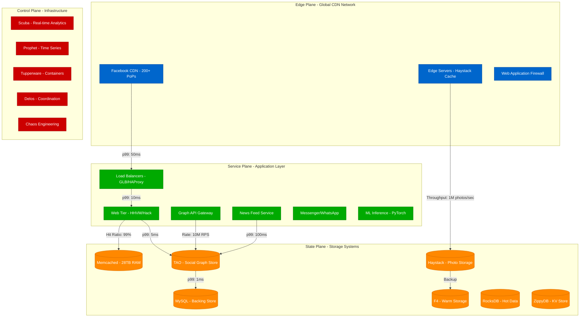
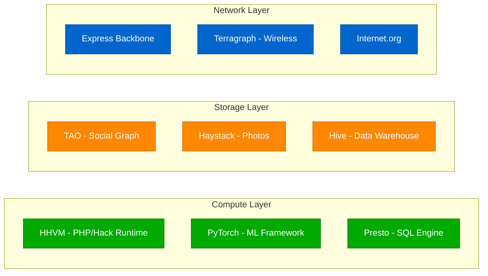
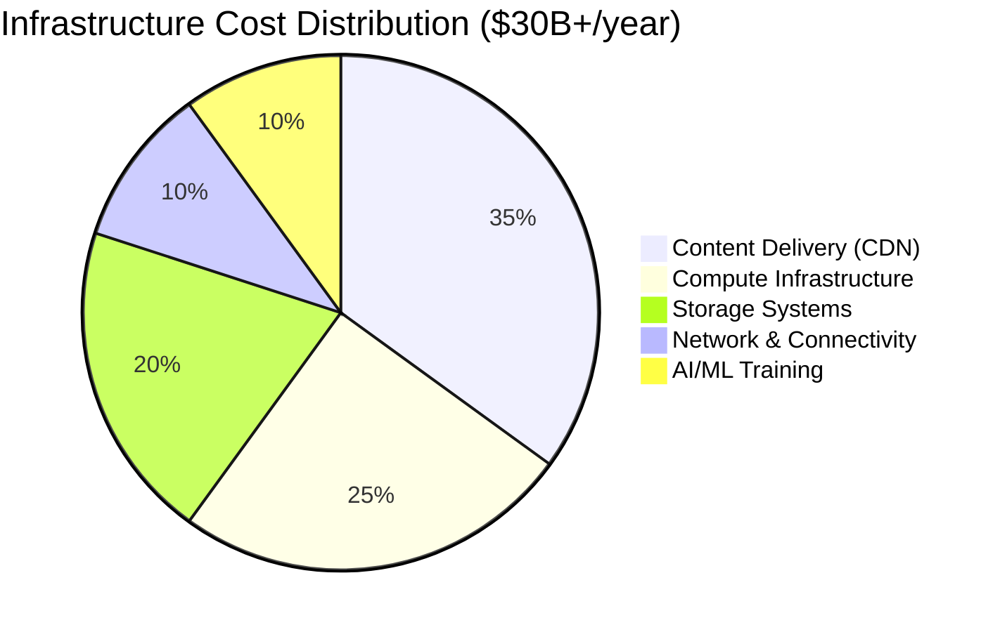

# Meta (Facebook) - Complete Architecture

## The Social Graph Empire at 3B+ Users

Meta operates one of the world's largest distributed systems, serving 3+ billion monthly active users across Facebook, Instagram, WhatsApp, and Messenger. This architecture powers everything from News Feed generation to real-time messaging, photo storage, and content delivery.

## Complete System Overview

## Global Infrastructure Scale

### Datacenter Footprint
- **Primary Regions**: 15+ global datacenters
- **Edge Locations**: 200+ Points of Presence (PoPs)
- **Subsea Cables**: 15+ owned submarine cables
- **Total Servers**: 2.5M+ servers globally
- **Power Consumption**: 5+ TWh annually

### Traffic Metrics (2024)
- **Daily Active Users**: 2.1B across all platforms
- **Photos Uploaded**: 350M+ per day
- **Messages Sent**: 100B+ per day (WhatsApp)
- **Video Hours**: 1B+ hours watched daily
- **API Requests**: 5B+ per day

## Core Technology Stack

### Computing Infrastructure

### Programming Languages & Frameworks
- **Hack**: Type-safe PHP variant (80% of codebase)
- **C++**: Performance-critical systems
- **Python**: ML/AI infrastructure
- **JavaScript/React**: Frontend (created by Meta)
- **Rust**: Security-critical components
- **Go**: Infrastructure tooling

## Revenue & Cost Metrics (2024)

### Financial Scale
- **Annual Revenue**: $134.9B (2023)
- **Infrastructure Spend**: $30B+ annually
- **R&D Investment**: $38B+ annually
- **Revenue per User**: ~$40 globally

### Cost Breakdown by Component

## Security & Compliance

### Data Protection
- **Encryption**: AES-256 at rest, TLS 1.3 in transit
- **Key Management**: Hardware Security Modules (HSMs)
- **Access Controls**: Zero-trust architecture
- **Audit Logging**: Immutable audit trails

### Privacy Engineering
- **Data Minimization**: Automated PII detection
- **Consent Management**: Global privacy controls
- **Right to Deletion**: Automated data purging
- **Cross-border Transfers**: Regional data residency

## Innovation Highlights

### Open Source Contributions
- **React**: Frontend framework (50M+ weekly downloads)
- **PyTorch**: ML framework (adopted by OpenAI, Tesla)
- **Presto**: Distributed SQL engine
- **RocksDB**: Embedded database
- **GraphQL**: API query language

### Research Breakthroughs
- **TAO**: Distributed social graph store
- **Haystack**: Efficient photo storage
- **Prophet**: Time series forecasting
- **DeepFace**: Facial recognition AI
- **FAIR**: Fundamental AI Research

## Production Wisdom

### Key Learnings
1. **Social Graph Complexity**: Friendships create 6 degrees of separation globally
2. **Photo Storage Economics**: Optimization saves millions in storage costs
3. **Real-time Messaging**: WhatsApp handles 100B messages/day with <100ms latency
4. **ML at Scale**: Recommendation systems process 1PB+ data daily
5. **Global Regulations**: GDPR compliance requires architectural changes

### The October 2021 Outage Lesson
- **Duration**: 6 hours global outage
- **Root Cause**: BGP configuration error
- **Impact**: $60M revenue loss, $7B market cap drop
- **Fix**: Manual datacenter access to restore BGP
- **Prevention**: Enhanced change management, gradual rollouts

*"Building for 3 billion users means every architectural decision impacts global communication."*

**Sources**: Meta Engineering Blog, Meta Transparency Reports, SEC Filings 2024