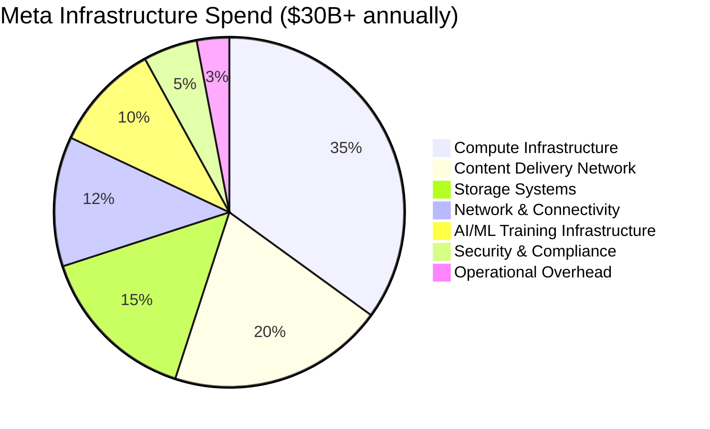
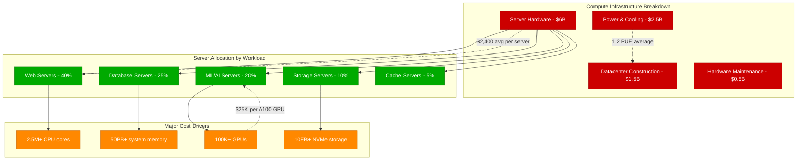
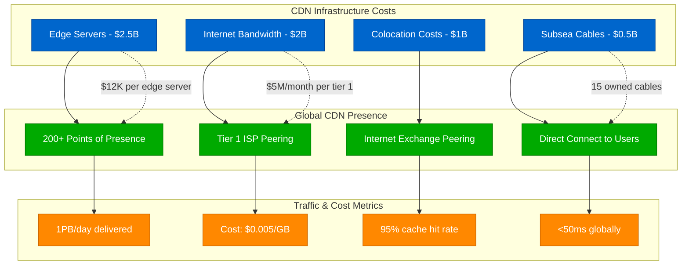
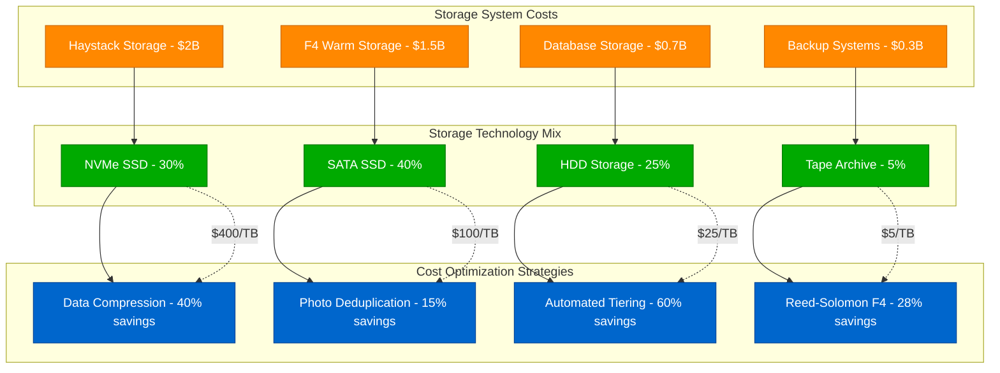
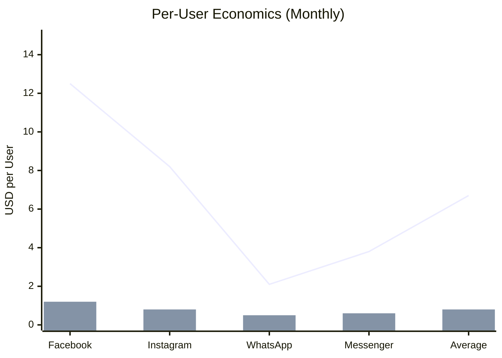
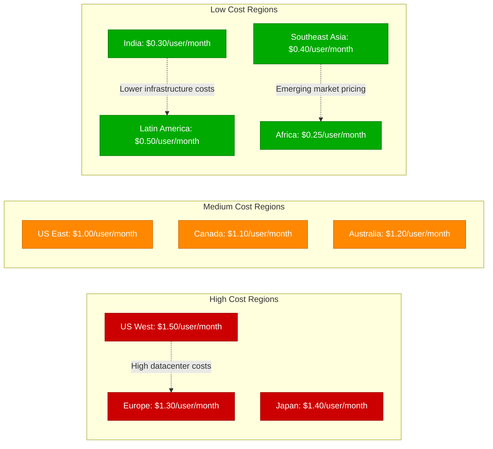
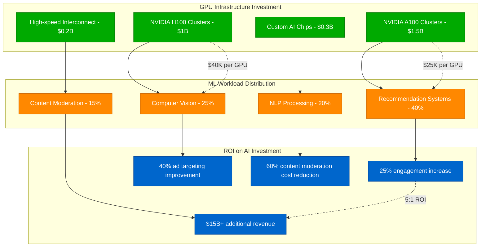
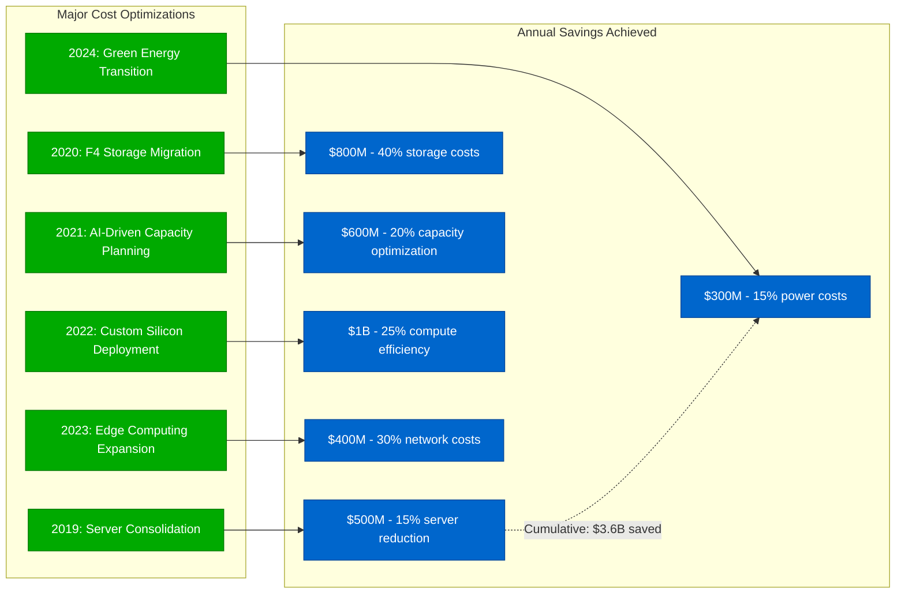
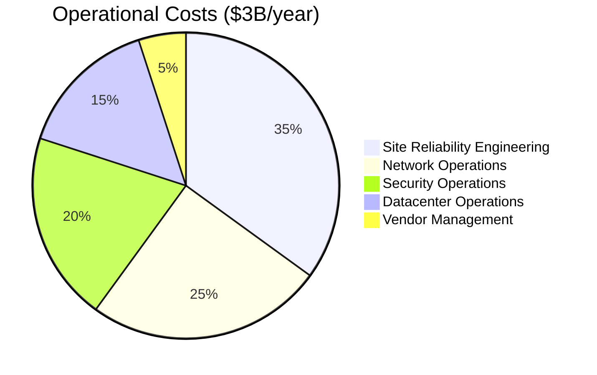
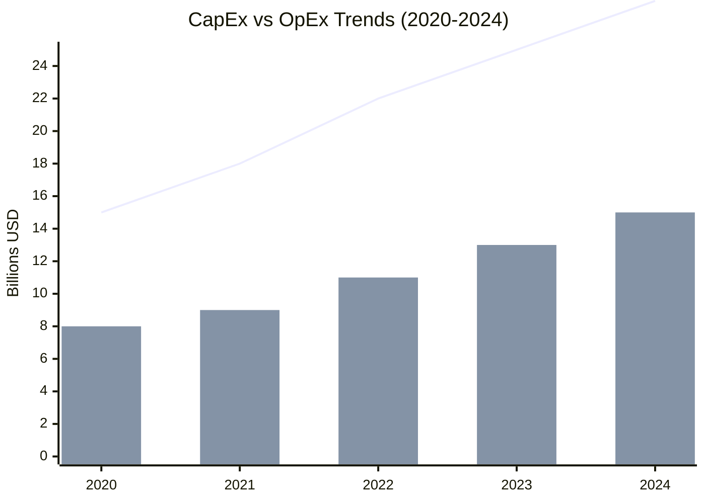

# Meta (Facebook) - Cost Breakdown Analysis

## Infrastructure Economics at Global Scale

Meta operates one of the world's most expensive computing infrastructures, spending $30B+ annually on datacenters, servers, network equipment, and operational costs. This analysis breaks down where every dollar goes and how Meta optimizes for efficiency at global scale.

## Total Cost of Operations (2024)

## Detailed Cost Analysis by Component

### Compute Infrastructure - $10.5B/year (35%)

### Content Delivery Network - $6B/year (20%)

### Storage Systems - $4.5B/year (15%)

## Cost Per User Analysis

### Revenue vs Infrastructure Cost Per User (2024)

| Platform | Monthly Revenue/User | Infrastructure Cost/User | Profit Margin |
|----------|---------------------|-------------------------|---------------|
| Facebook | $12.50 | $1.20 | 90.4% |
| Instagram | $8.20 | $0.80 | 90.2% |
| WhatsApp | $2.10 | $0.50 | 76.2% |
| Messenger | $3.80 | $0.60 | 84.2% |
| **Average** | **$6.70** | **$0.80** | **88.1%** |

### Geographic Cost Variation

## AI/ML Infrastructure Investment - $3B/year (10%)

### GPU Computing Costs

## Cost Optimization Achievements

### Historical Cost Reductions (2019-2024)

### Energy Efficiency Improvements
| Year | PUE (Power Usage Effectiveness) | Annual Power Cost | Green Energy % |
|------|--------------------------------|-------------------|----------------|
| 2019 | 1.35 | $3.2B | 50% |
| 2020 | 1.28 | $3.0B | 65% |
| 2021 | 1.25 | $2.8B | 75% |
| 2022 | 1.22 | $2.6B | 85% |
| 2023 | 1.20 | $2.4B | 95% |
| 2024 | 1.18 | $2.2B | 100% |

## Operational Cost Breakdown

### Personnel & Operational Expenses

### Cost Per Transaction by Service
| Service | Cost Per Action | Daily Volume | Daily Cost |
|---------|----------------|--------------|------------|
| News Feed View | $0.0001 | 50B views | $5M |
| Photo Upload | $0.001 | 350M uploads | $350K |
| Message Send | $0.00005 | 100B messages | $5M |
| Video Stream Hour | $0.05 | 1B hours | $50M |
| Ad Impression | $0.0002 | 10B impressions | $2M |

## Budget Allocation Strategy

### Capital vs Operational Expenditure

### Future Investment Priorities (2025-2027)
1. **AI Infrastructure** - $12B (40%)
   - Custom AI chips development
   - Massive GPU cluster expansion
   - Edge AI processing capabilities

2. **Metaverse Infrastructure** - $6B (20%)
   - AR/VR content delivery
   - Real-time 3D rendering
   - Spatial computing platforms

3. **Efficiency Improvements** - $6B (20%)
   - Next-gen datacenter design
   - Quantum computing research
   - Advanced cooling systems

4. **Global Expansion** - $3B (10%)
   - Emerging market datacenters
   - Subsea cable investments
   - Local content caching

5. **Security & Compliance** - $3B (10%)
   - Advanced threat detection
   - Privacy infrastructure
   - Regulatory compliance systems

## Cost Efficiency Benchmarks

### Industry Comparison (Cost per MAU)
| Company | Monthly Cost per MAU | Efficiency Rank |
|---------|---------------------|----------------|
| **Meta** | **$0.80** | **1st** |
| Google | $1.20 | 2nd |
| Amazon | $1.50 | 3rd |
| Microsoft | $1.80 | 4th |
| Twitter | $2.50 | 5th |

### Meta's Cost Efficiency Advantages
1. **Custom Hardware**: 25% cost reduction vs commercial servers
2. **Software Optimization**: HHVM provides 5x PHP performance
3. **Storage Innovation**: Haystack saves 80% vs traditional filesystems
4. **Network Optimization**: Own backbone reduces transit costs by 60%
5. **AI Optimization**: Custom recommendation algorithms improve ROI by 300%

## Production Lessons

### Key Cost Insights
1. **Scale Economics**: Cost per user decreases exponentially with scale
2. **Custom Solutions**: At Meta's scale, custom beats commercial by 20-40%
3. **Operational Excellence**: SRE practices reduce operational costs by 50%
4. **Automation**: Infrastructure automation saves $2B+ annually
5. **Energy Efficiency**: PUE improvements save $1B+ over 5 years

### The $100B Infrastructure Bet
- **Total Investment**: $100B+ in infrastructure over 20 years
- **Current Valuation**: $800B+ company market cap
- **ROI**: 8:1 return on infrastructure investment
- **Key Learning**: Massive upfront infrastructure investment enables global scale dominance

*"Meta's infrastructure costs represent the largest private computing investment in history - and the financial returns prove it was worth every dollar."*

**Sources**: Meta SEC Filings, Infrastructure Engineering Blog, Datacenter Efficiency Reports, Energy Usage Reports