# Meta (Facebook) - Failure Domains Architecture

## The October 4, 2021 Global Outage: A Case Study

On October 4, 2021, Meta experienced its worst outage in company history - a 6-hour global blackout affecting Facebook, Instagram, WhatsApp, and Messenger. This incident revealed critical failure domains and reshaped Meta's approach to infrastructure resilience.

## Failure Domain Hierarchy

## The October 2021 Outage Timeline

## BGP Configuration Failure Analysis

## Service-Level Failure Domains

### News Feed Service Failure Isolation

## WhatsApp Encryption Failure Domain

## Datacenter Infrastructure Failures

### Power and Cooling Cascade

```mermaid
graph TB
    subgraph PowerGrid[Power Grid Infrastructure]
        UTILITY[Utility Power Grid]
        SUBSTATION[Datacenter Substation]
        UPS_PRIMARY[UPS Primary]
        UPS_SECONDARY[UPS Secondary]
        GENERATOR[Backup Generators]
    end

    subgraph CoolingSystem[Cooling Infrastructure]
        CHILLER[Chiller Plant]
        COOLING_TOWER[Cooling Towers]
        AIR_HANDLER[Air Handlers]
        PRECISION_AC[Precision AC Units]
    end

    subgraph ComputeInfra[Compute Infrastructure]
        SERVER_RACKS[Server Racks]
        NETWORK_SWITCHES[Network Switches]
        STORAGE_ARRAYS[Storage Arrays]
        THERMAL_MONITORING[Thermal Monitoring]
    end

    subgraph FailureCascade[Failure Cascade Scenarios]
        POWER_OUTAGE[Utility Power Outage]
        UPS_FAILURE[UPS Failure]
        GENERATOR_FAIL[Generator Failure]
        COOLING_LOSS[Cooling System Loss]
        THERMAL_SHUTDOWN[Thermal Shutdown]
    end

    %% Normal power flow
    UTILITY --> SUBSTATION
    SUBSTATION --> UPS_PRIMARY
    UPS_PRIMARY --> SERVER_RACKS
    UPS_SECONDARY --> NETWORK_SWITCHES

    %% Normal cooling flow
    CHILLER --> COOLING_TOWER
    COOLING_TOWER --> AIR_HANDLER
    AIR_HANDLER --> PRECISION_AC
    PRECISION_AC --> SERVER_RACKS

    %% Failure cascades
    POWER_OUTAGE --> UPS_FAILURE
    UPS_FAILURE --> GENERATOR_FAIL
    GENERATOR_FAIL --> COOLING_LOSS
    COOLING_LOSS --> THERMAL_SHUTDOWN

    %% Monitoring and shutdown
    THERMAL_MONITORING --> THERMAL_SHUTDOWN
    THERMAL_SHUTDOWN --> SERVER_RACKS

    %% Annotations
    UPS_PRIMARY -.->|"15 minute runtime"| GENERATOR
    GENERATOR -.->|"72 hour fuel supply"| UPS_SECONDARY
    THERMAL_MONITORING -.->|"85°F shutdown"| PRECISION_AC

    classDef powerStyle fill:#FFCC00,stroke:#CC9900,color:#fff
    classDef coolingStyle fill:#3B82F6,stroke:#2563EB,color:#fff
    classDef computeStyle fill:#10B981,stroke:#059669,color:#fff
    classDef failureStyle fill:#8B5CF6,stroke:#7C3AED,color:#fff

    class UTILITY,SUBSTATION,UPS_PRIMARY,UPS_SECONDARY,GENERATOR powerStyle
    class CHILLER,COOLING_TOWER,AIR_HANDLER,PRECISION_AC coolingStyle
    class SERVER_RACKS,NETWORK_SWITCHES,STORAGE_ARRAYS,THERMAL_MONITORING computeStyle
    class POWER_OUTAGE,UPS_FAILURE,GENERATOR_FAIL,COOLING_LOSS,THERMAL_SHUTDOWN failureStyle
```

## Circuit Breaker Implementation

## Recovery Time Objectives (RTO)

### Service Recovery Targets
| Failure Type | Detection Time | Recovery Time | Business Impact |
|--------------|----------------|---------------|-----------------|
| Single Server | 30 seconds | 2 minutes | None (auto-failover) |
| Service Cluster | 1 minute | 5 minutes | Partial degradation |
| Datacenter Power | 2 minutes | 15 minutes | Regional outage |
| BGP Misconfiguration | 5 minutes | 4-6 hours | Global outage |
| Database Corruption | 10 minutes | 2-4 hours | Service-specific |

### Blast Radius by Failure Domain

## Production Lessons from Major Incidents

### Key Insights from October 2021 Outage
1. **BGP as Single Point of Failure**: Network routing became critical dependency
2. **Remote Management Dependency**: Lost ability to manage infrastructure remotely
3. **Physical Access Bottleneck**: Manual intervention required onsite presence
4. **DNS Propagation Delays**: Recovery took hours due to DNS caching
5. **Monitoring Blindness**: Lost observability when network isolated

### Implemented Improvements Post-Outage
1. **BGP Configuration Safeguards**: Multi-step verification for routing changes
2. **Out-of-band Management**: Separate network for emergency access
3. **Physical Access Procedures**: Faster datacenter access protocols
4. **DNS Architecture**: Reduced dependency on single DNS infrastructure
5. **Chaos Engineering**: Regular testing of failure scenarios

### Instagram Outage - March 2019
- **Duration**: 14 hours partial outage
- **Root Cause**: Database shard rebalancing gone wrong
- **Impact**: 50% of users couldn't upload photos
- **Fix**: Manual database restoration from backups
- **Lesson**: Database operations need more gradual rollout procedures

### WhatsApp New Year's Eve 2020
- **Duration**: 2 hours messaging delays
- **Root Cause**: Message queue overload during peak usage
- **Impact**: Messages delayed by 30+ minutes
- **Fix**: Emergency capacity scaling and queue optimization
- **Lesson**: Holiday traffic patterns require 10x normal capacity planning

## Failure Prevention Strategies

### Chaos Engineering at Meta

*"The October 2021 outage taught us that even the most robust systems can fail catastrophically when fundamental infrastructure assumptions break."*

**Sources**: Meta Engineering Blog, October 2021 Outage Report, WhatsApp Engineering Blog, Instagram Engineering Blog