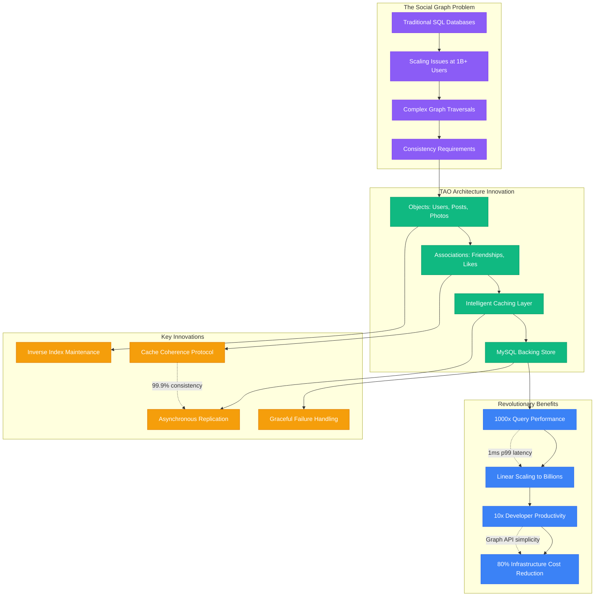
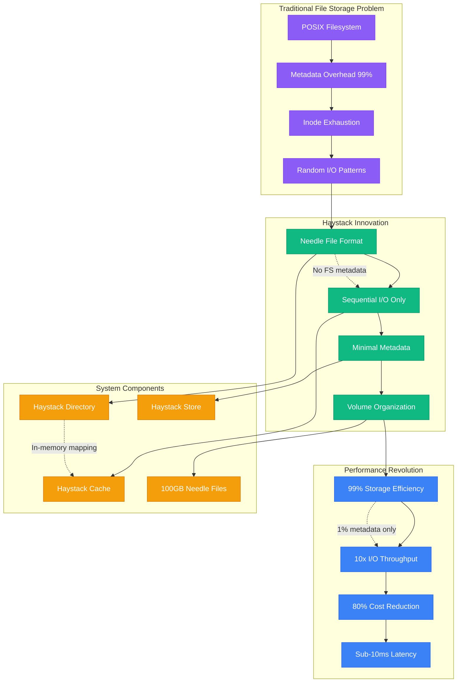
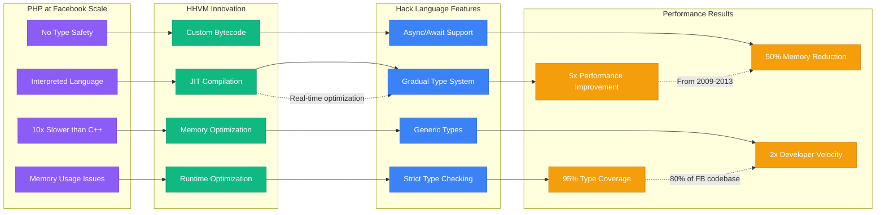
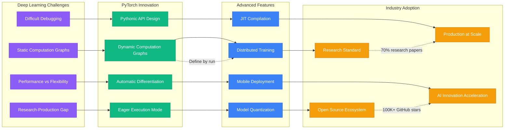
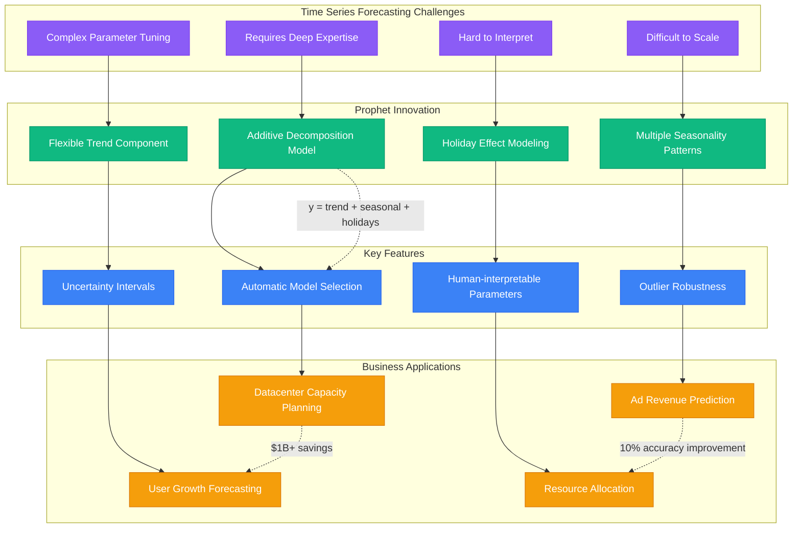
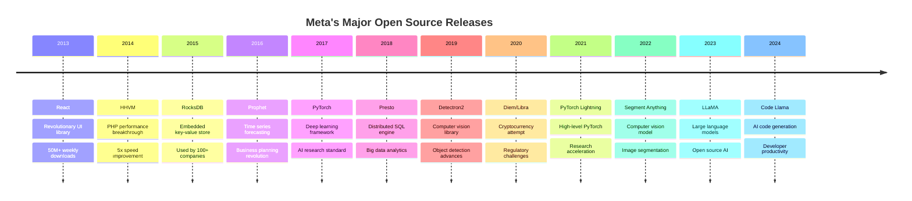
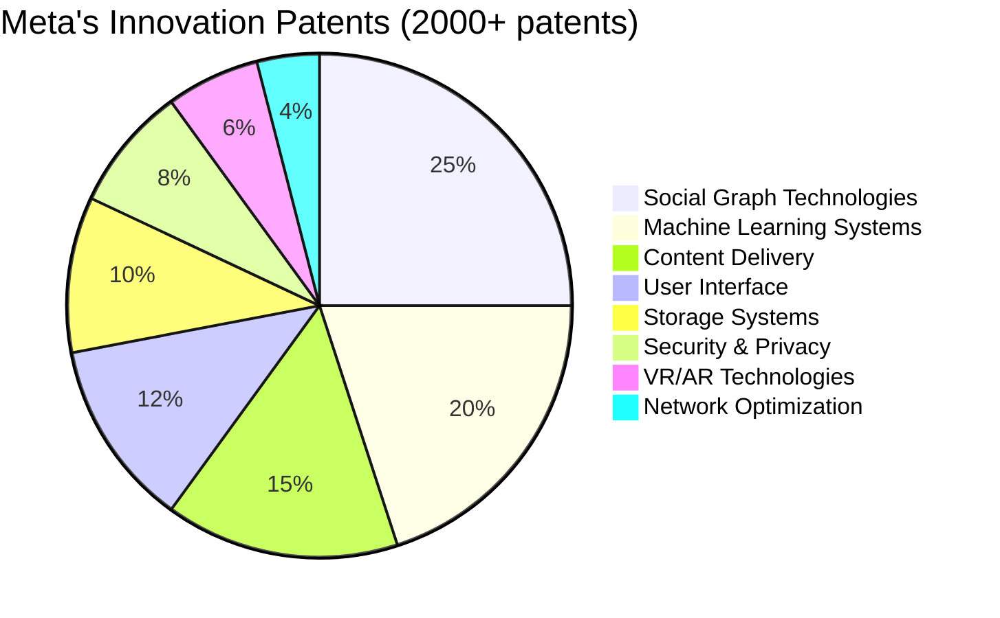

# Meta (Facebook) - Novel Solutions & Innovations

## Breakthrough Technologies Born from Scale

Meta's unique scale challenges have driven innovations that became industry standards. From TAO's graph database architecture to React's declarative UI paradigm, Meta's novel solutions often address problems that don't exist until you reach billion-user scale.

## TAO: The Social Graph Database Revolution

TAO (The Associations and Objects) represents Meta's most significant database innovation - a custom graph database designed specifically for social network workloads.



## Haystack: Photo Storage Optimization

Haystack solved the "needle in a haystack" problem of storing and serving 500B+ photos efficiently.



## HHVM + Hack: Language Innovation

Meta created HHVM (HipHop Virtual Machine) and Hack language to solve PHP's performance limitations at scale.



## React: Declarative UI Revolution

React emerged from Meta's need to manage complex UI state in Facebook's web application.

```mermaid
graph TB
    subgraph UIProblems[Traditional UI Problems]
        IMPERATIVE[Imperative DOM Manipulation]
        STATE_COMPLEXITY[Complex State Management]
        PERFORMANCE[Inefficient Re-rendering]
        DEBUGGING[Difficult Debugging]
    end

    subgraph ReactInnovations[React Innovations]
        VIRTUAL_DOM[Virtual DOM Abstraction]
        COMPONENT_MODEL[Component-based Architecture]
        UNIDIRECTIONAL[Unidirectional Data Flow]
        DECLARATIVE[Declarative Paradigm]
    end

    subgraph ReactFeatures[Key Features]
        JSX[JSX Syntax]
        DIFFING[Efficient Diffing Algorithm]
        RECONCILIATION[Smart Reconciliation]
        LIFECYCLE[Component Lifecycle]
    end

    subgraph EcosystemImpact[Ecosystem Impact]
        REACT_NATIVE[React Native (Mobile)]
        ECOSYSTEM[50M+ Weekly Downloads]
        INDUSTRY_ADOPTION[Industry Standard]
        FRAMEWORK_INFLUENCE[Framework Influence]
    end

    IMPERATIVE --> VIRTUAL_DOM
    STATE_COMPLEXITY --> COMPONENT_MODEL
    PERFORMANCE --> UNIDIRECTIONAL
    DEBUGGING --> DECLARATIVE

    VIRTUAL_DOM --> JSX
    COMPONENT_MODEL --> DIFFING
    UNIDIRECTIONAL --> RECONCILIATION
    DECLARATIVE --> LIFECYCLE

    JSX --> REACT_NATIVE
    DIFFING --> ECOSYSTEM
    RECONCILIATION --> INDUSTRY_ADOPTION
    LIFECYCLE --> FRAMEWORK_INFLUENCE

    %% Impact metrics
    VIRTUAL_DOM -.->|"O(n) diff algorithm"| JSX
    ECOSYSTEM -.->|"Most popular UI library"| INDUSTRY_ADOPTION
    REACT_NATIVE -.->|"Learn once, write anywhere"| FRAMEWORK_INFLUENCE

    classDef problemStyle fill:#8B5CF6,stroke:#7C3AED,color:#fff
    classDef innovationStyle fill:#10B981,stroke:#059669,color:#fff
    classDef featureStyle fill:#3B82F6,stroke:#2563EB,color:#fff
    classDef impactStyle fill:#F59E0B,stroke:#D97706,color:#fff

    class IMPERATIVE,STATE_COMPLEXITY,PERFORMANCE,DEBUGGING problemStyle
    class VIRTUAL_DOM,COMPONENT_MODEL,UNIDIRECTIONAL,DECLARATIVE innovationStyle
    class JSX,DIFFING,RECONCILIATION,LIFECYCLE featureStyle
    class REACT_NATIVE,ECOSYSTEM,INDUSTRY_ADOPTION,FRAMEWORK_INFLUENCE impactStyle
```

## F4: Warm Storage Innovation

F4 addresses the economics of storing rarely-accessed data at exabyte scale using Reed-Solomon erasure coding.

```mermaid
graph TB
    subgraph StorageProblem[Storage Economics Problem]
        HAYSTACK_COST[Haystack Hot Storage Cost]
        REPLICATION_3X[3x Replication Overhead]
        ACCESS_PATTERNS[90% Rarely Accessed]
        COST_LINEAR[Linear Cost Growth]
    end

    subgraph F4Innovation[F4 Reed-Solomon Innovation]
        ERASURE_CODING[Reed-Solomon (10+4) Coding]
        GEOGRAPHICAL_DIST[Geographical Distribution]
        BLOCK_STORAGE[Block-based Architecture]
        FAILURE_TOLERANCE[Multi-failure Tolerance]
    end

    subgraph F4Benefits[Storage Benefits]
        COST_SAVINGS_28[28% Storage Savings]
        DURABILITY_INCREASE[Higher Durability]
        OPERATIONAL_SIMPLICITY[Simplified Operations]
        GLOBAL_DISTRIBUTION[Global Data Distribution]
    end

    subgraph F4Architecture[F4 System Architecture]
        NAME_NODE[Name Node - Metadata]
        BACKOFF_NODE[Backoff Node - Reconstruction]
        STORAGE_NODE[Storage Nodes - Data Blocks]
        REBUILD_SERVICE[Rebuild Service - Recovery]
    end

    HAYSTACK_COST --> ERASURE_CODING
    REPLICATION_3X --> GEOGRAPHICAL_DIST
    ACCESS_PATTERNS --> BLOCK_STORAGE
    COST_LINEAR --> FAILURE_TOLERANCE

    ERASURE_CODING --> COST_SAVINGS_28
    GEOGRAPHICAL_DIST --> DURABILITY_INCREASE
    BLOCK_STORAGE --> OPERATIONAL_SIMPLICITY
    FAILURE_TOLERANCE --> GLOBAL_DISTRIBUTION

    ERASURE_CODING --> NAME_NODE
    GEOGRAPHICAL_DIST --> BACKOFF_NODE
    BLOCK_STORAGE --> STORAGE_NODE
    FAILURE_TOLERANCE --> REBUILD_SERVICE

    %% Technical annotations
    ERASURE_CODING -.->|"14 blocks vs 3 replicas"| GEOGRAPHICAL_DIST
    COST_SAVINGS_28 -.->|"$2B saved annually"| DURABILITY_INCREASE
    NAME_NODE -.->|"Metadata management"| BACKOFF_NODE

    classDef problemStyle fill:#8B5CF6,stroke:#7C3AED,color:#fff
    classDef innovationStyle fill:#10B981,stroke:#059669,color:#fff
    classDef benefitStyle fill:#3B82F6,stroke:#2563EB,color:#fff
    classDef archStyle fill:#F59E0B,stroke:#D97706,color:#fff

    class HAYSTACK_COST,REPLICATION_3X,ACCESS_PATTERNS,COST_LINEAR problemStyle
    class ERASURE_CODING,GEOGRAPHICAL_DIST,BLOCK_STORAGE,FAILURE_TOLERANCE innovationStyle
    class COST_SAVINGS_28,DURABILITY_INCREASE,OPERATIONAL_SIMPLICITY,GLOBAL_DISTRIBUTION benefitStyle
    class NAME_NODE,BACKOFF_NODE,STORAGE_NODE,REBUILD_SERVICE archStyle
```

## PyTorch: Deep Learning Framework Innovation

PyTorch originated from Meta's need for a more flexible deep learning framework for research and production.



## Prophet: Time Series Forecasting Innovation

Prophet was developed to make high-quality time series forecasting accessible to non-experts at Meta's scale.



## Innovation Impact Timeline

### Open Source Contributions by Year


## Patents and Intellectual Property

### Key Patent Categories


### High-Value Patent Examples
1. **Social Graph Patent (US 8,234,245)**: Method for ranking search results using social graph data
2. **News Feed Patent (US 8,276,207)**: Systems and methods for generating a user interface displaying social network data
3. **Photo Tagging Patent (US 8,682,973)**: Automatic photo tagging using facial recognition
4. **Real-time Messaging (US 9,083,661)**: Systems and methods for message delivery optimization
5. **Edge Computing (US 10,136,013)**: Content distribution network optimization

## Research Publications Impact

### Top-Cited Meta Research Papers
| Paper | Citations | Innovation |
|-------|-----------|------------|
| TAO: Facebook's Distributed Data Store | 850+ | Graph database architecture |
| Finding a needle in Haystack | 920+ | Photo storage optimization |
| Scaling Memcache at Facebook | 750+ | Distributed caching |
| The Anatomy of the Facebook Social Graph | 1200+ | Social network analysis |
| React: A Library for Complex UIs | 650+ | UI component architecture |

### Research Areas by Impact
1. **Distributed Systems**: 45% of publications, highest industry adoption
2. **Machine Learning**: 25% of publications, AI advancement leadership
3. **Human-Computer Interaction**: 15% of publications, user experience innovation
4. **Security & Privacy**: 10% of publications, privacy engineering advances
5. **Computer Vision**: 5% of publications, breakthrough models

## Innovation Philosophy

### Meta's Innovation Principles
1. **Build for Billion-User Scale**: Every innovation must handle global scale from day one
2. **Open Source by Default**: Share innovations to advance the entire industry
3. **Research-to-Production Pipeline**: Direct path from research to production systems
4. **Developer Experience First**: Tools must improve developer productivity
5. **Real-World Problem Solving**: Address actual pain points, not theoretical problems

### The "Move Fast and Break Things" Legacy
- **Original Motto**: Emphasized speed over stability
- **Evolution**: "Move Fast with Stable Infrastructure" (2014)
- **Current Approach**: "Move Fast Together" - collaborative innovation
- **Impact**: Enabled rapid innovation while maintaining reliability at scale

*"Meta's novel solutions prove that the biggest technical challenges create the most valuable innovations - every problem at billion-user scale drives industry-changing breakthroughs."*

**Sources**: Meta Research Papers, Patent Database, Open Source Project Statistics, Engineering Blog Archives