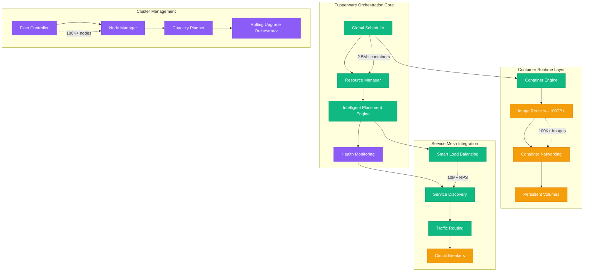
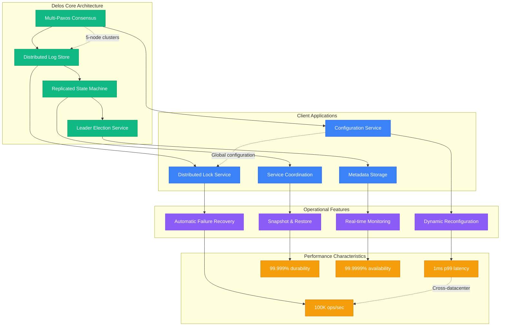
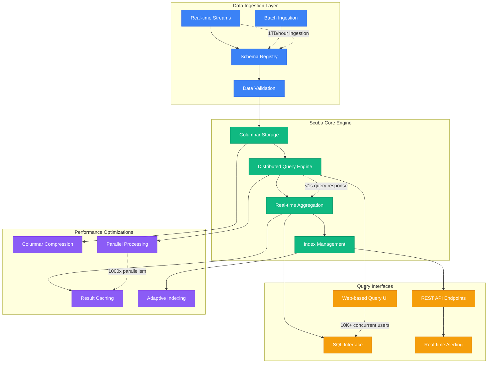
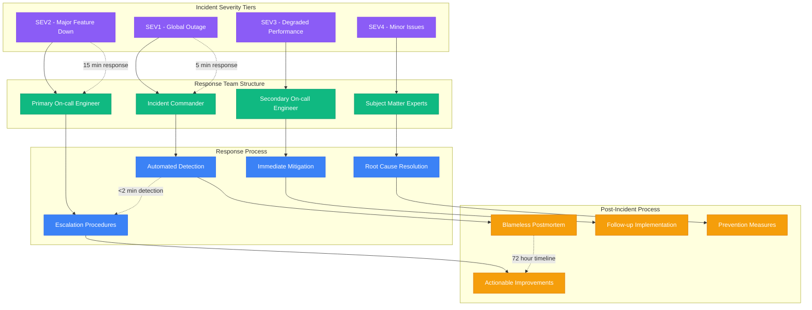
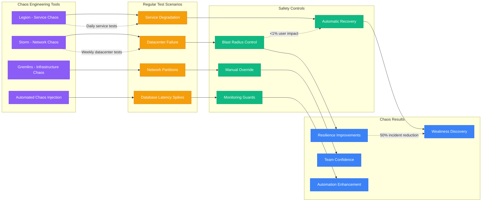
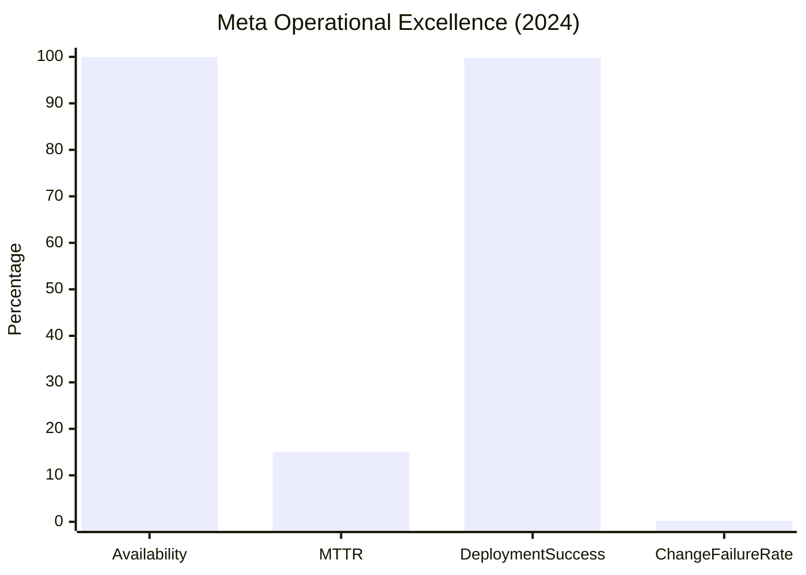
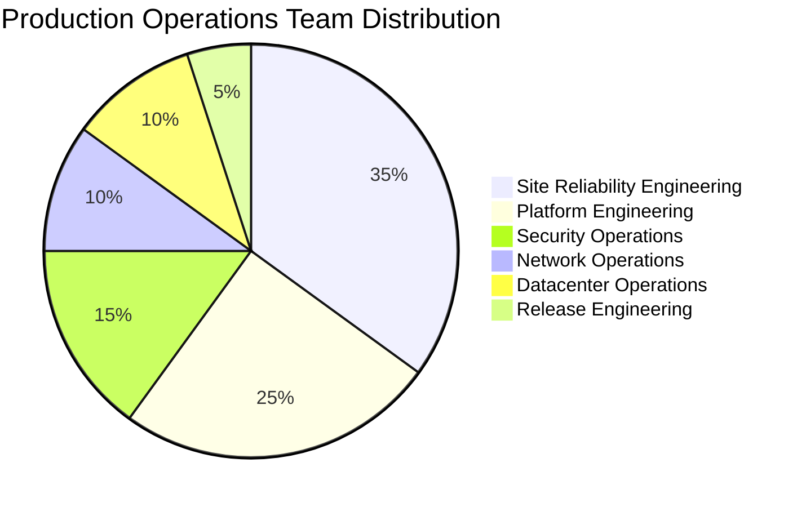

# Meta (Facebook) - Production Operations

## Operating the World's Largest Social Platform

Meta's production operations manage 3B+ users across multiple platforms with 99.95%+ uptime requirements. This involves orchestrating millions of servers, deploying 50K+ times per day, and maintaining service quality through sophisticated automation and monitoring systems.

## Tupperware: Container Orchestration at Scale

Tupperware is Meta's custom container orchestration platform, predating Kubernetes and designed specifically for Meta's scale and requirements.

## Delos: Distributed Coordination Service

Delos provides strongly consistent coordination for Meta's distributed systems, serving as the foundation for configuration management, leader election, and distributed locks.

## Deployment Pipeline: 50K Deployments Daily

Meta's deployment system handles massive scale with safety mechanisms to prevent global outages.

```mermaid
graph LR
    subgraph Development[Development Pipeline]
        CODE_COMMIT[Code Commit]
        PEER_REVIEW[Peer Review]
        AUTOMATED_TESTS[Automated Testing]
        BUILD_SYSTEM[Build & Package]
    end

    subgraph Staging[Staging Environment]
        CANARY_INTERNAL[Internal Canary - 1%]
        SHADOW_TRAFFIC[Shadow Traffic Testing]
        INTEGRATION_TEST[Integration Testing]
        PERFORMANCE_TEST[Performance Testing]
    end

    subgraph Production[Production Rollout]
        CANARY_PROD[Production Canary - 0.1%]
        GRADUAL_ROLLOUT[Gradual Rollout - 1%, 5%, 25%]
        FULL_DEPLOYMENT[Full Deployment - 100%]
        MONITORING[Real-time Monitoring]
    end

    subgraph SafetyMechanisms[Safety Mechanisms]
        AUTO_ROLLBACK[Automatic Rollback]
        CIRCUIT_BREAKER[Circuit Breakers]
        FEATURE_FLAGS[Feature Flags]
        KILL_SWITCH[Emergency Kill Switch]
    end

    %% Development flow
    CODE_COMMIT --> PEER_REVIEW
    PEER_REVIEW --> AUTOMATED_TESTS
    AUTOMATED_TESTS --> BUILD_SYSTEM

    %% Staging flow
    BUILD_SYSTEM --> CANARY_INTERNAL
    CANARY_INTERNAL --> SHADOW_TRAFFIC
    SHADOW_TRAFFIC --> INTEGRATION_TEST
    INTEGRATION_TEST --> PERFORMANCE_TEST

    %% Production flow
    PERFORMANCE_TEST --> CANARY_PROD
    CANARY_PROD --> GRADUAL_ROLLOUT
    GRADUAL_ROLLOUT --> FULL_DEPLOYMENT
    FULL_DEPLOYMENT --> MONITORING

    %% Safety integration
    CANARY_PROD --> AUTO_ROLLBACK
    GRADUAL_ROLLOUT --> CIRCUIT_BREAKER
    FULL_DEPLOYMENT --> FEATURE_FLAGS
    MONITORING --> KILL_SWITCH

    %% Safety feedback loops
    AUTO_ROLLBACK -->|"Metrics degradation"| CANARY_PROD
    CIRCUIT_BREAKER -->|"Error rate spike"| GRADUAL_ROLLOUT
    KILL_SWITCH -->|"Emergency stop"| FULL_DEPLOYMENT

    %% Deployment metrics
    CODE_COMMIT -.->|"50K+ daily commits"| PEER_REVIEW
    CANARY_INTERNAL -.->|"0.1% traffic"| SHADOW_TRAFFIC
    GRADUAL_ROLLOUT -.->|"4-hour rollout"| FULL_DEPLOYMENT

    classDef devStyle fill:#10B981,stroke:#059669,color:#fff
    classDef stageStyle fill:#3B82F6,stroke:#2563EB,color:#fff
    classDef prodStyle fill:#F59E0B,stroke:#D97706,color:#fff
    classDef safetyStyle fill:#8B5CF6,stroke:#7C3AED,color:#fff

    class CODE_COMMIT,PEER_REVIEW,AUTOMATED_TESTS,BUILD_SYSTEM devStyle
    class CANARY_INTERNAL,SHADOW_TRAFFIC,INTEGRATION_TEST,PERFORMANCE_TEST stageStyle
    class CANARY_PROD,GRADUAL_ROLLOUT,FULL_DEPLOYMENT,MONITORING prodStyle
    class AUTO_ROLLBACK,CIRCUIT_BREAKER,FEATURE_FLAGS,KILL_SWITCH safetyStyle
```

## Scuba: Real-time Analytics Engine

Scuba powers Meta's real-time operational analytics, processing billions of events for monitoring, debugging, and business insights.

## On-Call and Incident Response

### Incident Response Organization

## Chaos Engineering and Resilience Testing

### Chaos Engineering Program

## Operational Metrics and SLOs

### Service Level Objectives (SLOs)
| Service | Availability SLO | Latency SLO (p99) | Error Rate SLO |
|---------|------------------|-------------------|----------------|
| News Feed | 99.95% | 200ms | <0.1% |
| Photo Upload | 99.9% | 500ms | <0.5% |
| Messaging | 99.99% | 100ms | <0.01% |
| Video Streaming | 99.9% | 3s start time | <1% |
| Graph API | 99.95% | 100ms | <0.1% |

### Operational Excellence Metrics

### Capacity Planning Automation
- **Predictive Scaling**: AI-driven capacity predictions 6 months ahead
- **Auto-scaling**: Real-time resource allocation based on traffic
- **Cost Optimization**: Automatic right-sizing saves 30% on compute costs
- **Global Load Balancing**: Traffic routing optimization reduces latency by 20%

## Production Operations Team Structure

### Team Organization (2000+ Engineers)

### Key Operational Practices
1. **Blameless Postmortems**: Focus on system improvements, not individual blame
2. **Chaos Engineering**: Proactive failure testing builds resilience
3. **Automated Remediation**: 80% of incidents auto-resolve without human intervention
4. **Continuous Deployment**: 50K+ deployments daily with <0.2% failure rate
5. **Observability First**: Every system instrumented with metrics, logs, and traces

## Production Lessons Learned

### Key Operational Insights
1. **Automation is Essential**: Manual operations don't scale to Meta's size
2. **Observability Prevents Outages**: Good monitoring catches issues before users notice
3. **Gradual Rollouts Save the Day**: Canary deployments catch 95% of issues
4. **Chaos Engineering Works**: Proactive failure testing reduces real incidents by 60%
5. **Blameless Culture Improves Reliability**: Psychological safety leads to better incident reporting

### The October 2021 Outage Lessons
- **External Dependencies**: BGP configuration became single point of failure
- **Physical Access**: Need out-of-band management for emergency access
- **Communication**: Internal systems couldn't communicate during outage
- **Recovery Process**: Manual intervention required clear escalation paths
- **Prevention**: Enhanced change management prevents configuration errors

### Scale-Specific Challenges
- **Testing at Scale**: Staging environments can't replicate production scale
- **Global Coordination**: Time zone differences complicate incident response
- **Vendor Dependencies**: Third-party services become reliability bottlenecks
- **Cultural Scaling**: Maintaining engineering culture across 100K+ employees
- **Knowledge Transfer**: Preserving operational knowledge across team changes

*"Operating at Meta's scale means every operational practice must be automated, monitored, and tested - there's no room for manual processes when serving 3 billion users."*

**Sources**: Meta Engineering Blog, SRE Practices Documentation, Chaos Engineering Reports, Production Operations Handbook