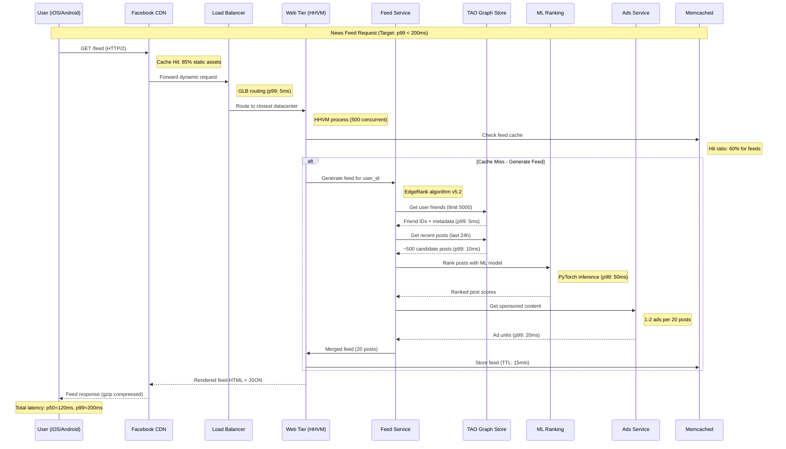
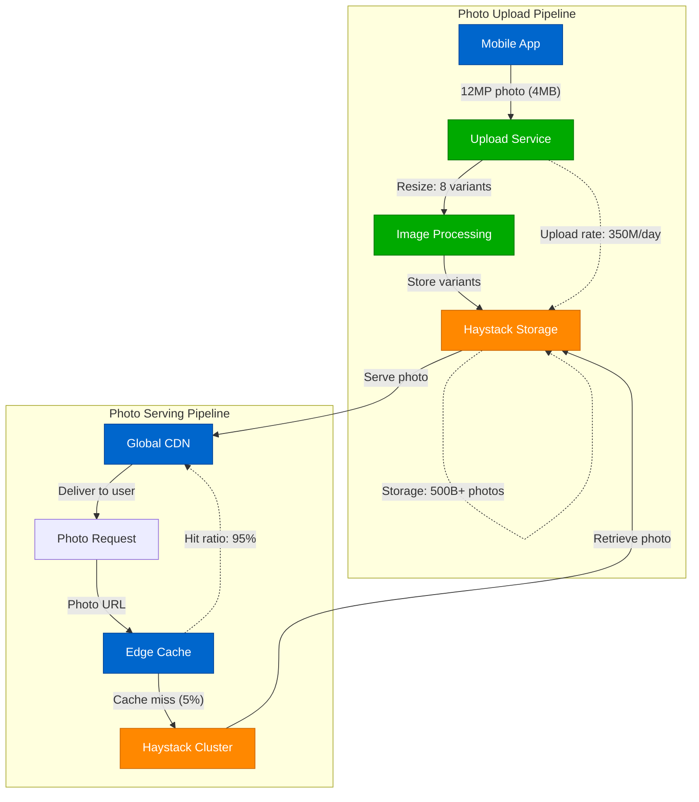
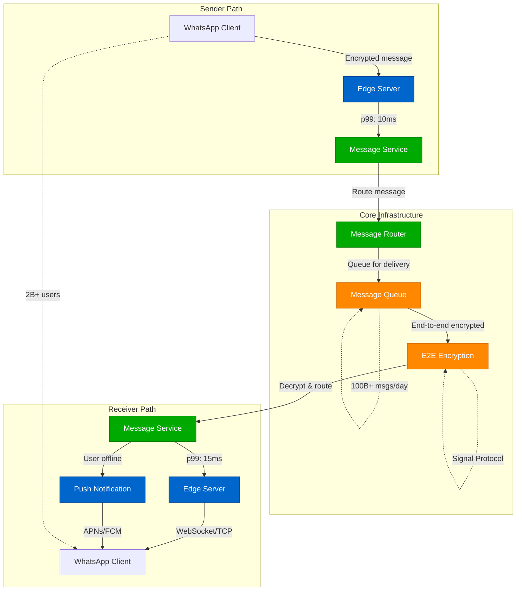
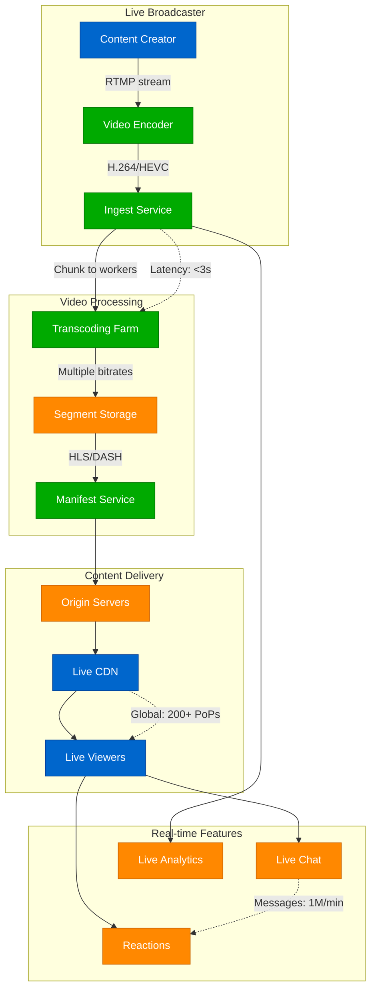
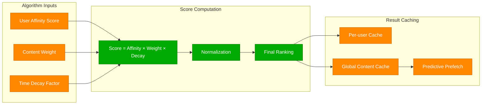

# Meta (Facebook) - Request Flow Architecture

## News Feed Generation: The Golden Path

The News Feed is Meta's most critical service, generating personalized content for 2.1B daily active users. Every page load triggers a complex cascade of machine learning, graph traversal, and content ranking that must complete in <200ms.

## Complete Request Flow

## Photo Upload & Serving Path

## WhatsApp Real-time Messaging Flow

## Graph API Request Processing

```mermaid
graph LR
    subgraph Client[Client Applications]
        MOBILE[Mobile Apps]
        WEB[Web Apps]
        THIRD[3rd Party Apps]
    end

    subgraph Gateway[API Gateway Layer]
        GRAPHQL[GraphQL Endpoint]
        REST[REST API v18.0]
        RATE[Rate Limiting]
        AUTH[OAuth 2.0]
    end

    subgraph Processing[Request Processing]
        RESOLVER[Field Resolvers]
        BATCH[Request Batching]
        CACHE_L[L1 Cache]
        TAO_Q[TAO Queries]
    end

    subgraph Data[Data Layer]
        TAO_G[TAO Graph Store]
        MYSQL_B[MySQL Backing]
        MEMCACHE_G[Memcached]
    end

    %% Request flow
    MOBILE --> GRAPHQL
    WEB --> REST
    THIRD --> REST

    GRAPHQL --> AUTH
    REST --> AUTH
    AUTH --> RATE
    RATE --> RESOLVER

    RESOLVER --> BATCH
    BATCH --> CACHE_L
    CACHE_L --> TAO_Q
    TAO_Q --> TAO_G

    TAO_G --> MYSQL_B
    TAO_G --> MEMCACHE_G

    %% Performance annotations
    AUTH -.->|"p99: 5ms"| RATE
    RATE -.->|"10M RPS limit"| RESOLVER
    CACHE_L -.->|"Hit ratio: 80%"| TAO_Q
    TAO_G -.->|"p99: 1ms"| MYSQL_B

    classDef edgeStyle fill:#0066CC,stroke:#004499,color:#fff
    classDef serviceStyle fill:#00AA00,stroke:#007700,color:#fff
    classDef stateStyle fill:#FF8800,stroke:#CC6600,color:#fff

    class MOBILE,WEB,THIRD edgeStyle
    class GRAPHQL,REST,RATE,AUTH,RESOLVER,BATCH serviceStyle
    class CACHE_L,TAO_Q,TAO_G,MYSQL_B,MEMCACHE_G stateStyle
```

## Live Video Streaming Flow

## Request Performance Targets

### Latency SLOs by Service
| Service | p50 Target | p99 Target | p99.9 Target |
|---------|------------|------------|--------------|
| News Feed | 80ms | 200ms | 500ms |
| Photo Load | 50ms | 150ms | 300ms |
| Graph API | 20ms | 100ms | 250ms |
| WhatsApp Message | 30ms | 100ms | 200ms |
| Video Stream Start | 1s | 3s | 5s |

### Throughput Metrics
- **Graph API**: 10M requests/second peak
- **Photo Requests**: 1M photos/second served
- **Messages**: 100B+ messages/day (WhatsApp)
- **Feed Refreshes**: 500M+ per minute peak
- **Live Video**: 1M+ concurrent streams

## Critical Optimizations

### EdgeRank Algorithm Efficiency

## Production Lessons

### Key Insights
1. **Feed Generation**: Machine learning inference is the bottleneck (50ms of 200ms total)
2. **Photo Serving**: 95% cache hit rate is critical for cost efficiency
3. **Real-time Messaging**: Connection management scales linearly with active users
4. **API Rate Limiting**: Prevents cascade failures during traffic spikes
5. **Global Distribution**: Edge computing reduces latency by 60%+

### The WhatsApp Scale Challenge
- **Problem**: 100B+ messages/day with <100ms end-to-end latency
- **Solution**: Erlang/OTP for massive concurrency, custom protocol optimization
- **Result**: Single server handles 2M+ concurrent connections

*"Every millisecond of latency costs user engagement - News Feed generation must be faster than human perception."*

**Sources**: Meta Engineering Blog, WhatsApp Engineering Blog, F8 Conference Talks 2024