# Meta (Facebook) - Scale Evolution

## From TheFacebook to Meta: 20 Years of Scaling

Meta's journey from a Harvard dorm room project to a 3B+ user platform represents one of the most dramatic scaling stories in tech history. Every order of magnitude brought architectural breaking points and innovative solutions.

## Scale Evolution Timeline

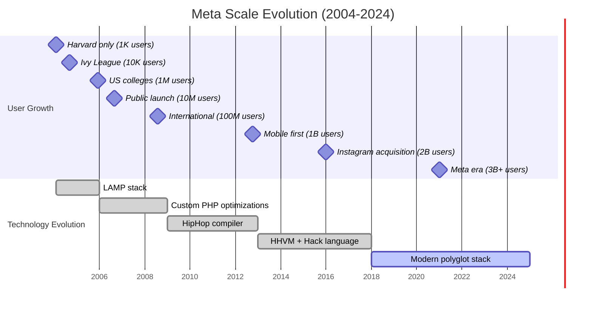

## Architecture Evolution by User Scale

### 1K Users - Harvard Era (2004)
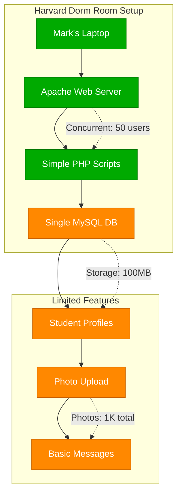

### 1M Users - College Expansion (2005)
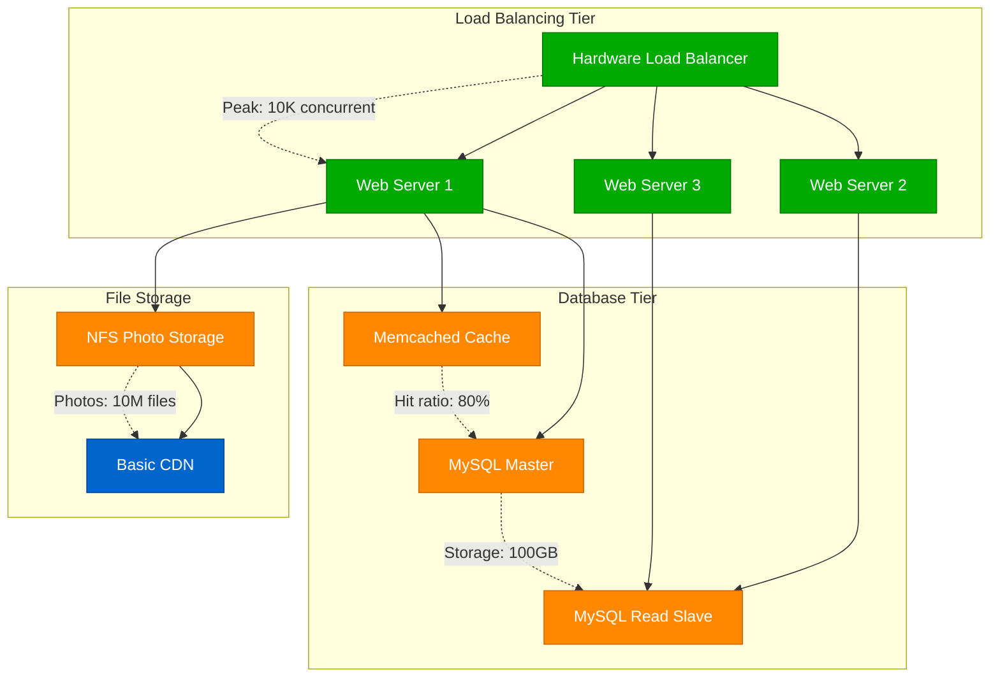

### 100M Users - Global Scale (2008)
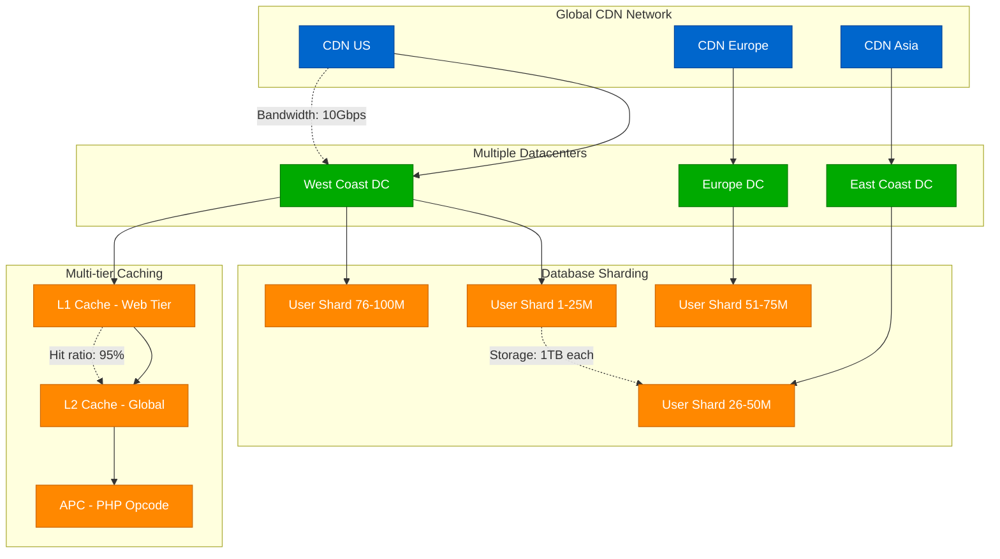

### 1B Users - Mobile First Era (2012)
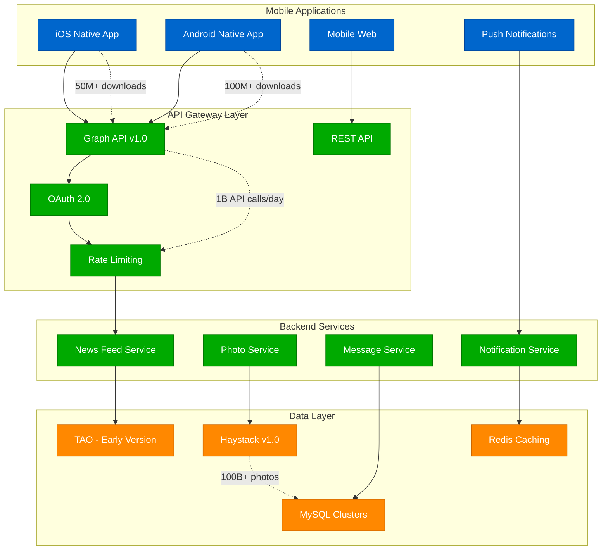

### 3B Users - Meta Era (2024)
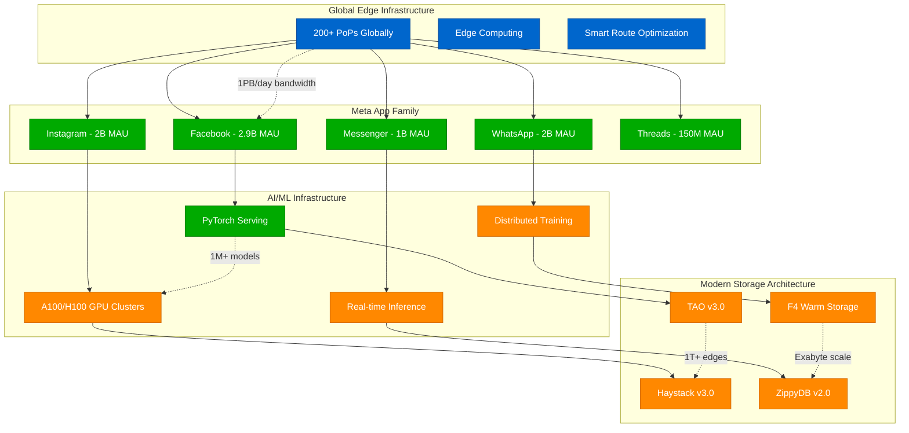

## Technology Evolution Milestones

### Programming Language Evolution
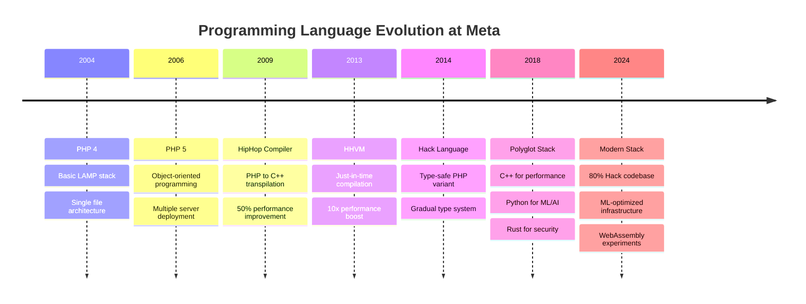

### Database Architecture Evolution
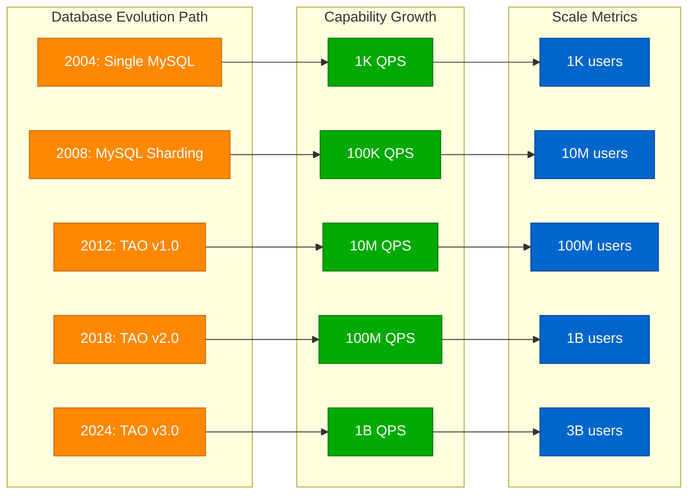

## Cost Per User Evolution

### Infrastructure Cost Optimization (2004-2024)
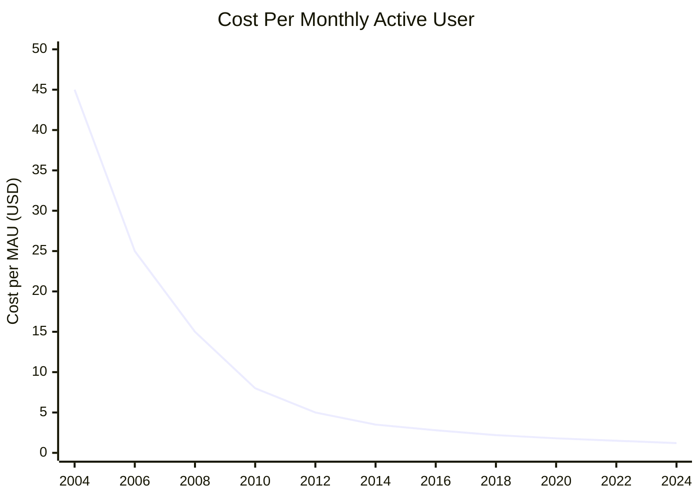

### Cost Breakdown by Evolution Phase
| Phase | Users | Cost/User/Month | Total Monthly Cost | Key Innovation |
|-------|-------|-----------------|-------------------|----------------|
| 2004: Harvard | 1K | $45 | $45K | Single server |
| 2006: Colleges | 10M | $8 | $80M | Load balancing |
| 2008: Global | 100M | $5 | $500M | CDN + Sharding |
| 2012: Mobile | 1B | $3 | $3B | TAO + Haystack |
| 2016: Platform | 2B | $2.2 | $4.4B | F4 + Efficiency |
| 2024: Meta | 3B+ | $1.2 | $3.6B | AI + Edge |

## Breaking Points and Solutions

### The 2008 Scaling Crisis
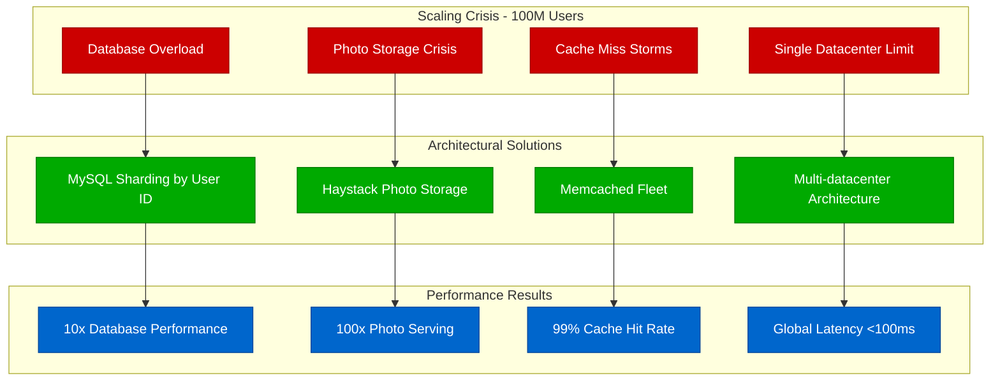

### The 2012 Mobile Transition
- **Challenge**: 100M+ mobile users with different access patterns
- **Breaking Point**: Web-optimized architecture couldn't handle mobile
- **Solution**: Graph API, native mobile apps, push notifications
- **Result**: 10x improvement in mobile engagement

### The 2018 AI Revolution
- **Challenge**: News Feed relevance at 2B+ user scale
- **Breaking Point**: Manual ranking algorithms hit accuracy limits
- **Solution**: Deep learning recommendation systems, PyTorch infrastructure
- **Result**: 25% improvement in user engagement

## Performance Evolution Metrics

### Latency Improvements Over Time
| Metric | 2004 | 2008 | 2012 | 2016 | 2020 | 2024 |
|--------|------|------|------|------|------|------|
| Page Load | 5s | 2s | 800ms | 400ms | 200ms | 150ms |
| Photo Load | 10s | 3s | 1s | 500ms | 200ms | 100ms |
| Message Send | N/A | 2s | 500ms | 200ms | 100ms | 50ms |
| Feed Refresh | 10s | 5s | 2s | 1s | 500ms | 300ms |

### Throughput Evolution
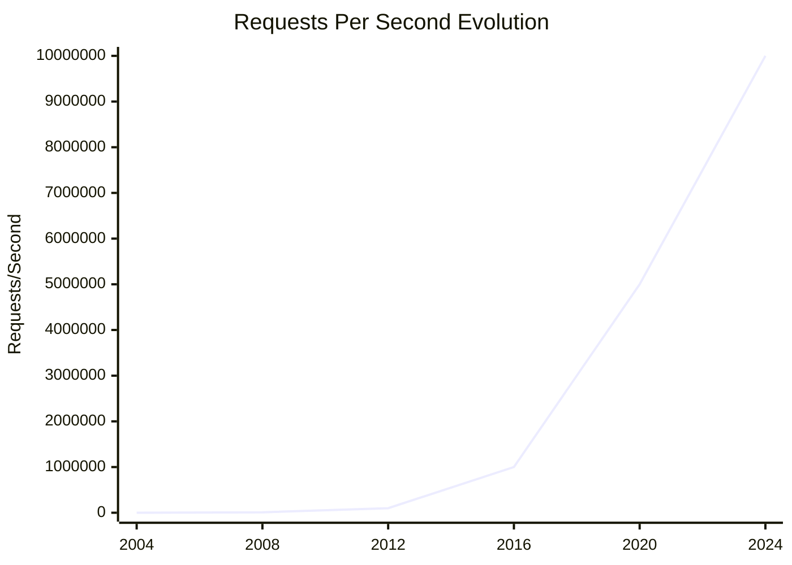

## Architectural Lessons Learned

### Key Scaling Insights
1. **Database Sharding**: Inevitable at scale, plan early for consistent hashing
2. **Cache Hierarchies**: Multi-level caching essential, 99%+ hit rates required
3. **Photo Storage**: Custom solutions outperform general storage at scale
4. **Global Distribution**: Edge computing reduces latency by 60%+
5. **Mobile Optimization**: Different architecture needed for mobile vs web

### Technology Bet Outcomes
✅ **Successful Bets**:
- TAO graph database (solved social graph scaling)
- Haystack photo storage (10x cost reduction)
- HHVM/Hack (5x performance improvement)
- PyTorch ML framework (industry standard)

❌ **Failed Experiments**:
- Parse mobile backend (shut down 2017)
- Internet.org free basics (regulatory issues)
- Libra/Diem cryptocurrency (regulatory shutdown)
- Portal video chat devices (discontinued 2022)

### The Zuckerberg Laws of Scaling
1. **Every order of magnitude breaks something**: 10x user growth = architectural rewrite
2. **Optimize for developer velocity**: Facebook's motto "Move Fast and Break Things"
3. **Build vs Buy at scale**: Custom solutions often outperform vendors at Meta's scale
4. **Global consistency is expensive**: Eventual consistency acceptable for social features
5. **Mobile changes everything**: Mobile-first architecture differs fundamentally from web

*"Meta's scaling journey shows that every 10x growth in users requires fundamental architectural changes - there are no shortcuts to handling global scale."*

**Sources**: Meta Engineering Blog, High Scalability Archive, Various F8 Conference Talks 2004-2024