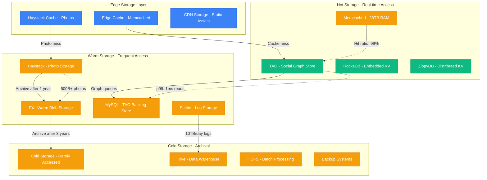
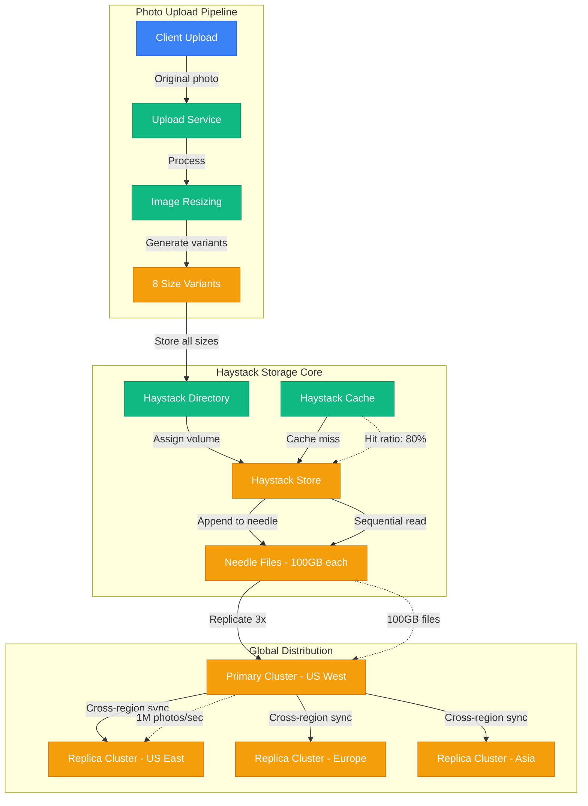
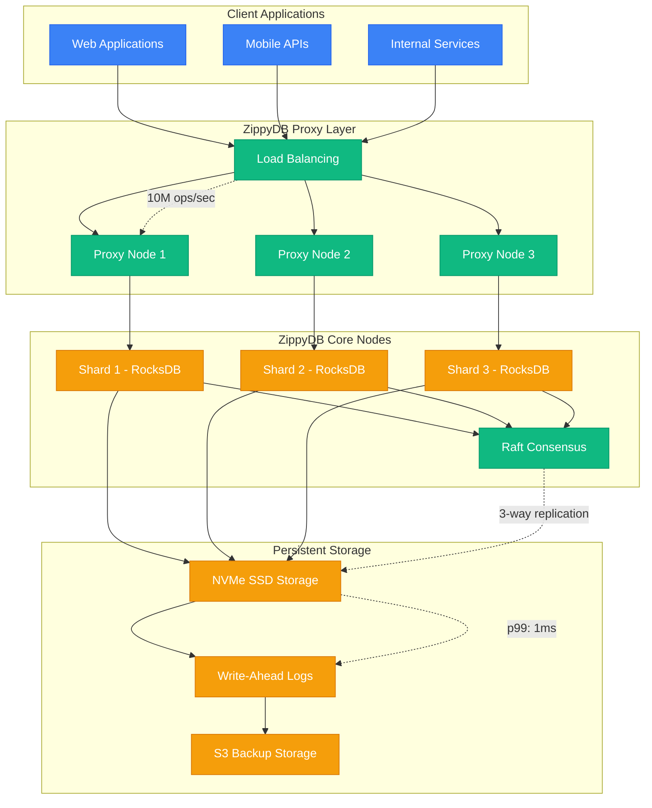
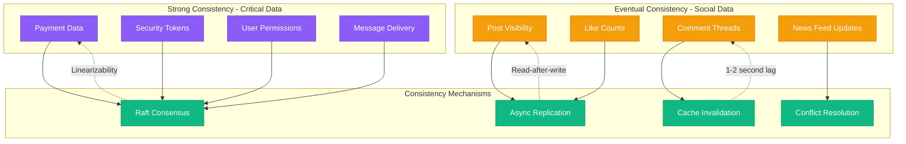
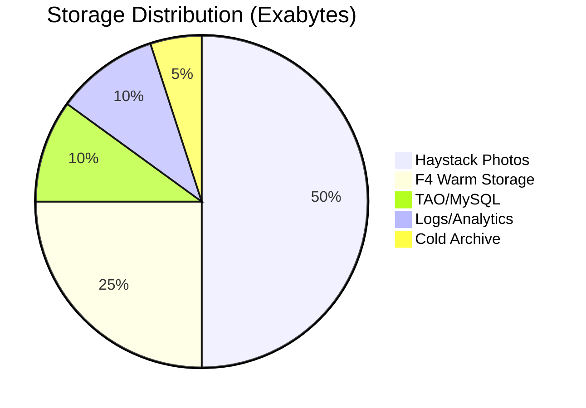

# Meta (Facebook) - Storage Architecture

## The Social Graph Storage Challenge

Meta's storage architecture must handle the world's largest social graph with 3B+ users, 500B+ photos, and petabytes of data generated daily. The challenge: maintain sub-millisecond access to highly connected graph data while ensuring global consistency.

## Complete Storage Ecosystem



## TAO: The Social Graph Store

TAO (The Associations and Objects) is Meta's distributed social graph database, handling friend relationships, posts, comments, and likes for 3B+ users.

```mermaid
graph TB
    subgraph TAOLeader[TAO Leader Region - Menlo Park]
        LEADER_TAO[TAO Leader Cache]
        LEADER_MYSQL[MySQL Leader (Sharded)]
        LEADER_WRITE[Write Coordination]
    end

    subgraph TAOFollower[TAO Follower Regions - Global]
        FOLLOWER_TAO1[TAO Follower - Europe]
        FOLLOWER_TAO2[TAO Follower - Asia]
        FOLLOWER_TAO3[TAO Follower - LATAM]
        FOLLOWER_MYSQL[MySQL Read Replicas]
    end

    subgraph GraphData[Social Graph Data Types]
        OBJECTS[Objects: Users, Posts, Photos]
        ASSOCIATIONS[Associations: Friendships, Likes]
        TIMELINE[Timeline: Ordered Posts]
        METADATA[Metadata: Timestamps, Privacy]
    end

    %% Write path
    LEADER_WRITE -->|"Master writes"| LEADER_MYSQL
    LEADER_MYSQL -->|"Async replication"| FOLLOWER_MYSQL
    LEADER_TAO -->|"Cache invalidation"| LEADER_MYSQL

    %% Read path
    FOLLOWER_TAO1 -->|"Cache miss"| FOLLOWER_MYSQL
    FOLLOWER_TAO2 -->|"Cache miss"| FOLLOWER_MYSQL
    FOLLOWER_TAO3 -->|"Cache miss"| FOLLOWER_MYSQL

    %% Data organization
    LEADER_TAO --> OBJECTS
    LEADER_TAO --> ASSOCIATIONS
    LEADER_TAO --> TIMELINE
    LEADER_TAO --> METADATA

    %% Performance metrics
    LEADER_TAO -.->|"Write: 10M ops/sec"| LEADER_MYSQL
    FOLLOWER_TAO1 -.->|"Read: 1B ops/sec"| FOLLOWER_MYSQL
    ASSOCIATIONS -.->|"500B+ edges"| TIMELINE

    classDef serviceStyle fill:#10B981,stroke:#059669,color:#fff
    classDef stateStyle fill:#F59E0B,stroke:#D97706,color:#fff
    classDef controlStyle fill:#8B5CF6,stroke:#7C3AED,color:#fff

    class LEADER_TAO,FOLLOWER_TAO1,FOLLOWER_TAO2,FOLLOWER_TAO3 serviceStyle
    class LEADER_MYSQL,FOLLOWER_MYSQL,OBJECTS,ASSOCIATIONS,TIMELINE,METADATA stateStyle
    class LEADER_WRITE controlStyle
```

## Haystack: Photo Storage at Scale

Haystack efficiently stores 500B+ photos by eliminating filesystem metadata overhead and optimizing for sequential access patterns.



## F4: Warm Blob Storage System

F4 provides cost-effective storage for photos accessed less frequently, using Reed-Solomon encoding for efficiency and durability.

```mermaid
graph LR
    subgraph HaystackTier[Haystack - Hot Storage]
        HOT_PHOTOS[Recently Uploaded Photos]
        HOT_ACCESS[High Access Rate]
    end

    subgraph F4Tier[F4 - Warm Storage]
        F4_ENCODE[Reed-Solomon Encoding]
        F4_BLOCKS[Data Blocks (10+4)]
        F4_STORAGE[Distributed Storage]
    end

    subgraph ColdTier[Cold Storage]
        COLD_ARCHIVE[Tape Archive]
        COLD_RETRIEVAL[Batch Retrieval]
    end

    subgraph Transition[Data Lifecycle]
        AGE1[0-30 days: Haystack]
        AGE2[30-365 days: F4]
        AGE3[1+ years: Cold Storage]
    end

    %% Data flow
    HOT_PHOTOS -->|"After 30 days"| F4_ENCODE
    F4_ENCODE -->|"10 data + 4 parity"| F4_BLOCKS
    F4_BLOCKS -->|"Distribute across racks"| F4_STORAGE
    F4_STORAGE -->|"After 1 year"| COLD_ARCHIVE

    %% Lifecycle
    AGE1 --> AGE2
    AGE2 --> AGE3
    AGE3 --> COLD_RETRIEVAL

    %% Performance
    HOT_ACCESS -.->|"Access: 1000x/day"| F4_ENCODE
    F4_STORAGE -.->|"Access: 10x/day"| COLD_ARCHIVE
    F4_BLOCKS -.->|"Storage savings: 28%"| F4_STORAGE

    classDef serviceStyle fill:#10B981,stroke:#059669,color:#fff
    classDef stateStyle fill:#F59E0B,stroke:#D97706,color:#fff

    class F4_ENCODE serviceStyle
    class HOT_PHOTOS,HOT_ACCESS,F4_BLOCKS,F4_STORAGE,COLD_ARCHIVE,COLD_RETRIEVAL stateStyle
```

## ZippyDB: Distributed Key-Value Store

ZippyDB serves as Meta's general-purpose distributed key-value store, built on RocksDB with global consistency.



## Data Consistency Model



## Storage Performance Metrics

### Latency Targets by Storage Type
| Storage System | Read p99 | Write p99 | Throughput |
|----------------|----------|-----------|------------|
| TAO Graph Store | 1ms | 5ms | 1B ops/sec |
| Haystack Photos | 10ms | 50ms | 1M photos/sec |
| ZippyDB KV Store | 1ms | 2ms | 10M ops/sec |
| F4 Warm Storage | 100ms | 200ms | 100K ops/sec |
| Memcached | 0.2ms | 0.5ms | 1M ops/sec |

### Storage Capacity by System


## Cost Optimization Strategies

### Storage Economics
- **Hot Storage (Haystack)**: $0.10/GB/month (SSD)
- **Warm Storage (F4)**: $0.03/GB/month (HDD with encoding)
- **Cold Storage**: $0.004/GB/month (Tape archive)
- **Data Lifecycle**: 90% of photos move to F4 after 30 days
- **Total Savings**: $2B+ annually through tiered storage

### Photo Storage Optimization
1. **Needle Aggregation**: Reduces metadata overhead by 99%
2. **Format Optimization**: WebP saves 30% bandwidth vs JPEG
3. **Smart Cropping**: AI-driven cropping reduces storage by 20%
4. **Duplicate Detection**: Perceptual hashing saves 15% storage

## Production Lessons

### Key Insights
1. **Graph Hotspots**: Friend graphs create natural hotspots requiring careful sharding
2. **Photo Lifecycle**: 80% of photo views occur in first week after upload
3. **Consistency Trade-offs**: Social features can tolerate eventual consistency
4. **Storage Hierarchy**: Tiered storage saves billions while maintaining performance
5. **Cache Efficiency**: 99% cache hit rates are essential at Meta's scale

### The 2021 Storage Crisis
- **Problem**: Haystack hitting capacity limits during COVID-19 photo surge
- **Solution**: Accelerated F4 migration, improved compression algorithms
- **Result**: 50% capacity increase without additional hardware

*"Storage at Meta's scale isn't just about capacity - it's about building the right consistency guarantees for each data type."*

**Sources**: Meta Engineering Blog, TAO Research Paper, Haystack OSDI Paper, F4 Research Publication