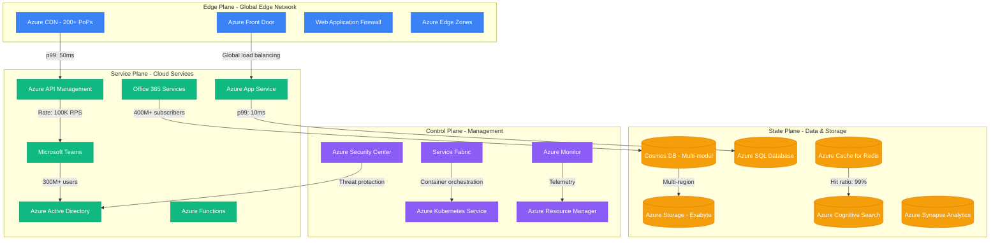
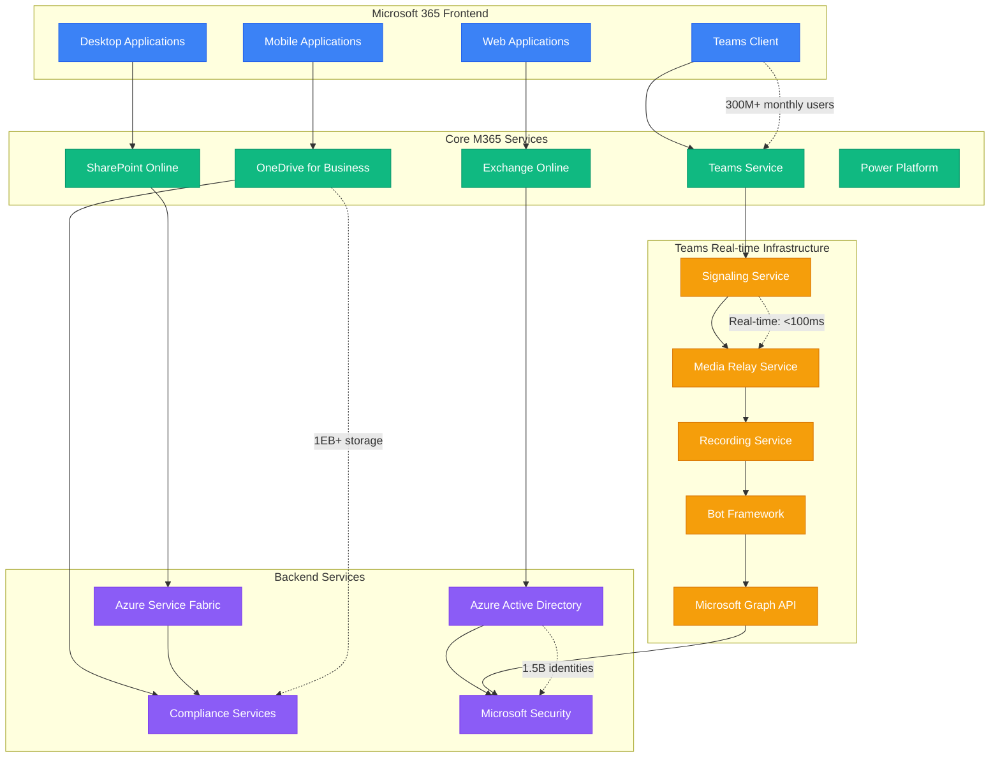
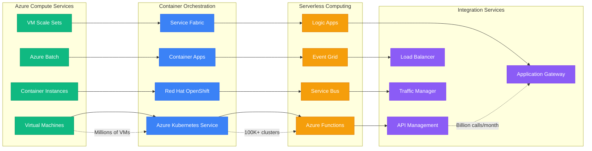
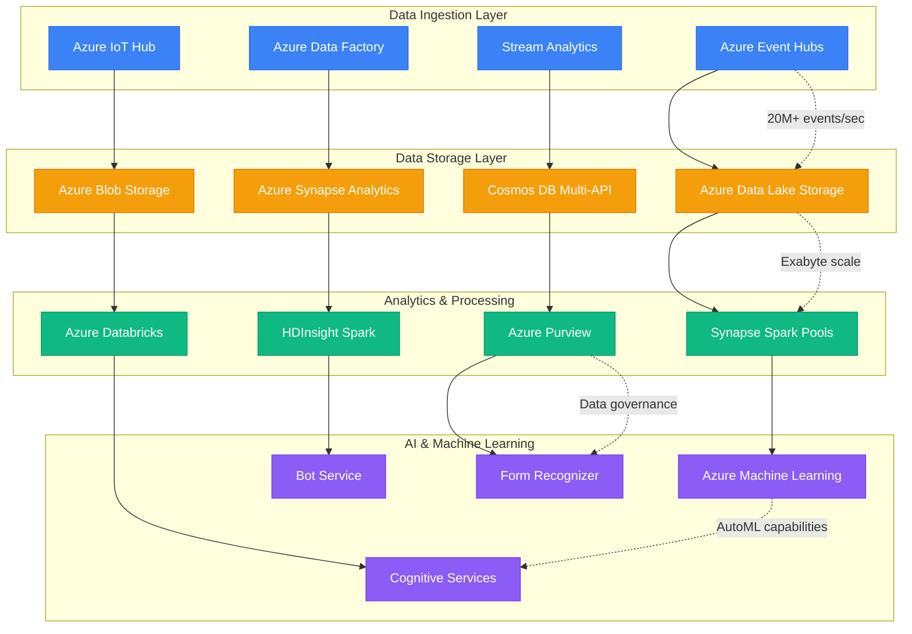
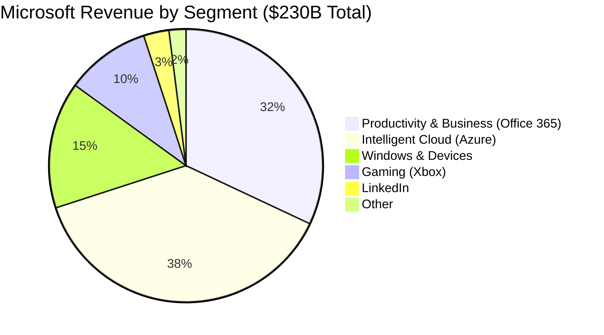

# Microsoft - Complete Architecture

## The Cloud & Enterprise Computing Empire

Microsoft operates one of the world's largest and most comprehensive cloud infrastructures, serving 400M+ Office 365 subscribers, 300M+ Teams users, and running Azure across 300+ datacenters in 60+ regions. This architecture represents the transformation from on-premises software to cloud-first services.

## Complete System Overview

## Global Infrastructure Scale

### Datacenter & Edge Footprint
- **Azure Regions**: 60+ regions globally
- **Availability Zones**: 3+ zones per region
- **Edge Locations**: 200+ CDN points of presence
- **Datacenters**: 300+ facilities worldwide
- **Total Servers**: 4M+ servers globally
- **Network Capacity**: 165+ Tbps global backbone

### Core Service Metrics (2024)
- **Office 365 Subscribers**: 400M+ users
- **Teams Monthly Users**: 300M+ active users
- **Azure Active Directory**: 1.5B+ identities
- **OneDrive Users**: 1B+ users storing 1EB+ data
- **Xbox Live**: 120M+ monthly active users
- **LinkedIn Members**: 950M+ professionals

## Microsoft 365 & Teams Architecture

## Azure Infrastructure Services

### Compute & Container Services

## Data & AI Platform Architecture

## Revenue & Financial Metrics (2024)

### Business Unit Revenue Distribution

### Cloud Growth Trajectory
- **Azure Revenue Growth**: 35%+ year-over-year
- **Office 365 Commercial**: $50B+ annual revenue
- **Teams Revenue**: $15B+ annual revenue run rate
- **Azure AI Services**: $1B+ quarterly revenue
- **Cloud Gross Margin**: 70%+ across services

## Security & Compliance Architecture

### Zero Trust Security Model

```mermaid
graph TB
    subgraph Identity[Identity & Access]
        AZURE_AD_SEC[Azure AD Security]
        CONDITIONAL_ACCESS[Conditional Access]
        PRIVILEGED_ACCESS[Privileged Access Management]
        IDENTITY_PROTECTION[Identity Protection]
    end

    subgraph Devices[Device Security]
        INTUNE[Microsoft Intune]
        ENDPOINT_MANAGER[Endpoint Manager]
        AUTOPILOT[Windows Autopilot]
        COMPLIANCE_MANAGER[Compliance Manager]
    end

    subgraph Applications[Application Security]
        DEFENDER_APPS[Defender for Office 365]
        CLOUD_APP_SECURITY[Cloud App Security]
        INFORMATION_PROTECTION[Information Protection]
        SENTINEL[Azure Sentinel SIEM]
    end

    subgraph Infrastructure[Infrastructure Security]
        DEFENDER_CLOUD[Defender for Cloud]
        SECURITY_CENTER_AZURE[Security Center]
        KEY_VAULT[Azure Key Vault]
        FIREWALL[Azure Firewall]
    end

    %% Identity flow
    AZURE_AD_SEC --> CONDITIONAL_ACCESS
    CONDITIONAL_ACCESS --> PRIVILEGED_ACCESS
    PRIVILEGED_ACCESS --> IDENTITY_PROTECTION

    %% Device management
    INTUNE --> ENDPOINT_MANAGER
    ENDPOINT_MANAGER --> AUTOPILOT
    AUTOPILOT --> COMPLIANCE_MANAGER

    %% Application protection
    DEFENDER_APPS --> CLOUD_APP_SECURITY
    CLOUD_APP_SECURITY --> INFORMATION_PROTECTION
    INFORMATION_PROTECTION --> SENTINEL

    %% Infrastructure security
    DEFENDER_CLOUD --> SECURITY_CENTER_AZURE
    SECURITY_CENTER_AZURE --> KEY_VAULT
    KEY_VAULT --> FIREWALL

    %% Cross-plane integration
    IDENTITY_PROTECTION --> INTUNE
    COMPLIANCE_MANAGER --> DEFENDER_APPS
    SENTINEL --> DEFENDER_CLOUD
    FIREWALL --> AZURE_AD_SEC

    %% Security metrics
    AZURE_AD_SEC -.->|"1.5B+ identities"| CONDITIONAL_ACCESS
    INTUNE -.->|"100M+ devices"| ENDPOINT_MANAGER
    SENTINEL -.->|"5TB+ data/day"| DEFENDER_CLOUD
    KEY_VAULT -.->|"Billions of secrets"| FIREWALL

    classDef identityStyle fill:#3B82F6,stroke:#2563EB,color:#fff
    classDef deviceStyle fill:#10B981,stroke:#059669,color:#fff
    classDef appStyle fill:#F59E0B,stroke:#D97706,color:#fff
    classDef infraStyle fill:#8B5CF6,stroke:#7C3AED,color:#fff

    class AZURE_AD_SEC,CONDITIONAL_ACCESS,PRIVILEGED_ACCESS,IDENTITY_PROTECTION identityStyle
    class INTUNE,ENDPOINT_MANAGER,AUTOPILOT,COMPLIANCE_MANAGER deviceStyle
    class DEFENDER_APPS,CLOUD_APP_SECURITY,INFORMATION_PROTECTION,SENTINEL appStyle
    class DEFENDER_CLOUD,SECURITY_CENTER_AZURE,KEY_VAULT,FIREWALL infraStyle
```

## Innovation Highlights

### Open Source & Research Contributions
- **.NET Framework**: Cross-platform development ecosystem
- **TypeScript**: Typed JavaScript for large applications
- **Visual Studio Code**: Most popular code editor globally
- **PowerShell**: Cross-platform task automation
- **Quantum Development Kit**: Quantum computing tools
- **DeepSpeed**: Large-scale deep learning optimization

### AI & Research Breakthroughs
- **Copilot Integration**: AI assistant across all products
- **OpenAI Partnership**: GPT integration in Azure and Office
- **Cognitive Services**: 25+ AI APIs for developers
- **Turing NLG**: 17B parameter language model
- **Project Silica**: Glass-based data storage
- **Quantum Computing**: Topological qubit research

## Sustainability & Environmental Impact

### Carbon Negative Commitment
- **Target**: Carbon negative by 2030
- **Renewable Energy**: 100% renewable by 2025
- **Data Center Efficiency**: PUE < 1.125 for new centers
- **Underwater Data Centers**: Project Natick innovations
- **AI for Earth**: $50M environmental AI initiatives

### Environmental Metrics (2024)
- **Carbon Reduction**: 17% reduction since 2020
- **Renewable Energy**: 85% of energy consumption
- **Water Positive**: Water conservation programs
- **Circular Economy**: 90% datacenter hardware reuse

## Production Wisdom

### Key Architectural Insights
1. **Hybrid Cloud Strategy**: Seamless on-premises to cloud migration path
2. **Multi-tenant Architecture**: Massive scale efficiency through shared infrastructure
3. **Global Distribution**: Data residency and latency optimization across regions
4. **Security by Design**: Zero trust architecture from ground up
5. **Developer Productivity**: Tools and platforms that accelerate development

### The COVID-19 Scale Test
- **Teams Growth**: 10x growth to 300M users in 2020
- **Infrastructure Response**: Real-time capacity scaling
- **Performance Maintained**: <100ms latency during peak usage
- **Feature Velocity**: Accelerated feature delivery during crisis
- **Reliability Achievement**: 99.99% uptime during highest demand

### Enterprise Architecture Philosophy
- **Evergreen Services**: Continuous updates without version dependencies
- **API-First Design**: All services exposed through consistent APIs
- **Data Democratization**: Self-service analytics and insights
- **Low-Code Innovation**: Power Platform democratizes app development
- **Intelligent Edge**: AI capabilities at the edge for real-time decisions

*"Microsoft's architecture represents the successful transformation from client-server to cloud-native, proving that even established enterprises can reinvent their technical foundation."*

**Sources**: Microsoft Annual Reports, Azure Architecture Center, Microsoft 365 Engineering Blog, Build Conference 2024