# Microsoft - Cost Breakdown Analysis

## The Economics of Global Cloud Infrastructure

Microsoft operates one of the world's most expensive computing infrastructures, with $50B+ in annual capital expenditures and operational costs to serve 400M+ Office 365 users, 300M+ Teams users, and millions of Azure customers. This analysis breaks down the true cost structure of running enterprise-grade cloud services at global scale.

## Total Cost of Operations (2024)

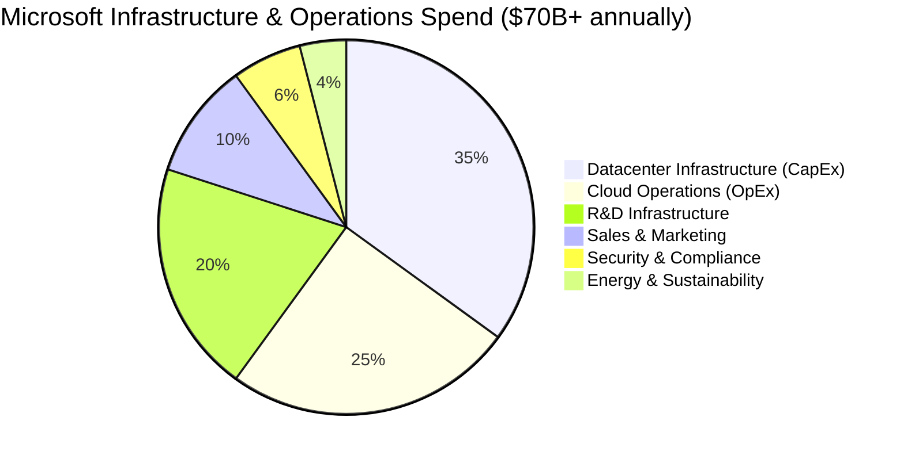

## Detailed Cost Analysis by Component

### Datacenter Infrastructure - $25B/year (35%)

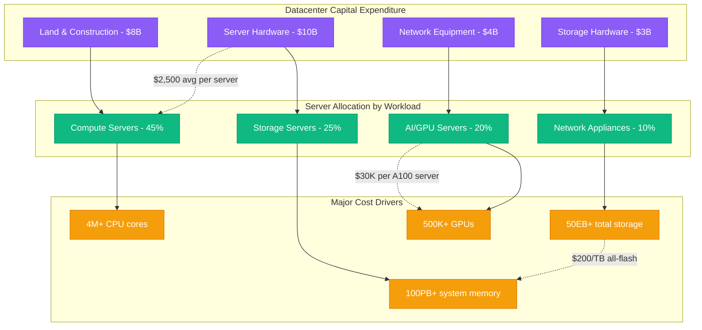

### Cloud Operations - $17.5B/year (25%)

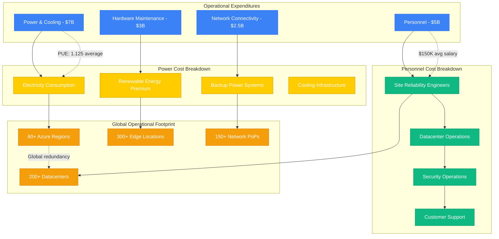

### R&D Infrastructure - $14B/year (20%)

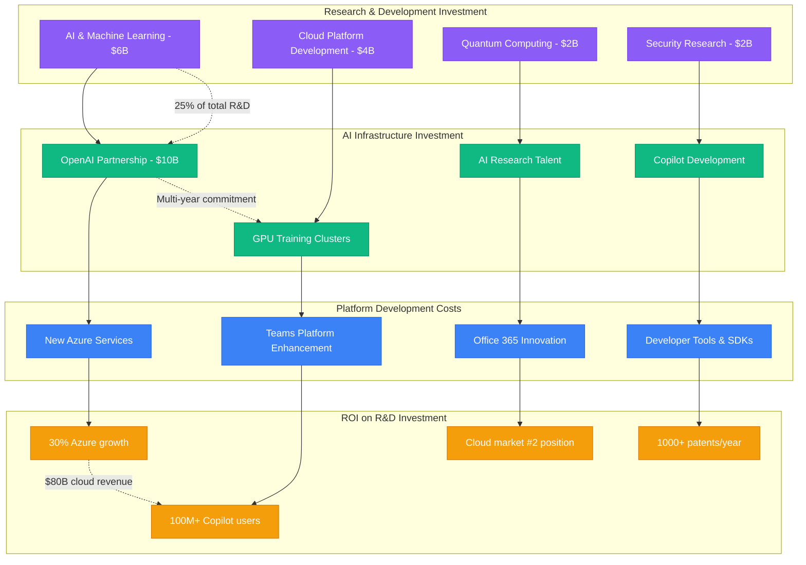

## Cost Per User Analysis

### Revenue vs Infrastructure Cost Per User (2024)
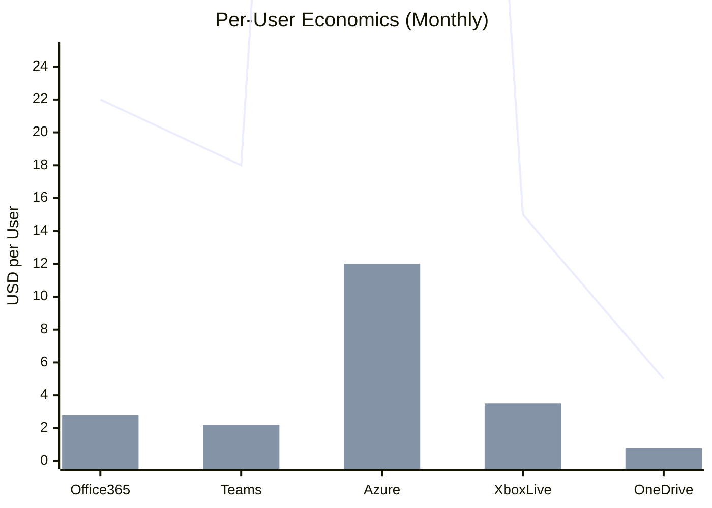

| Service | Monthly Revenue/User | Infrastructure Cost/User | Profit Margin |
|---------|---------------------|-------------------------|---------------|
| Office 365 Commercial | $22.00 | $2.80 | 87.3% |
| Microsoft Teams | $18.00 | $2.20 | 87.8% |
| Azure (average) | $150.00 | $12.00 | 92.0% |
| Xbox Live Gold | $15.00 | $3.50 | 76.7% |
| OneDrive Personal | $5.00 | $0.80 | 84.0% |

### Geographic Cost Variation by Region
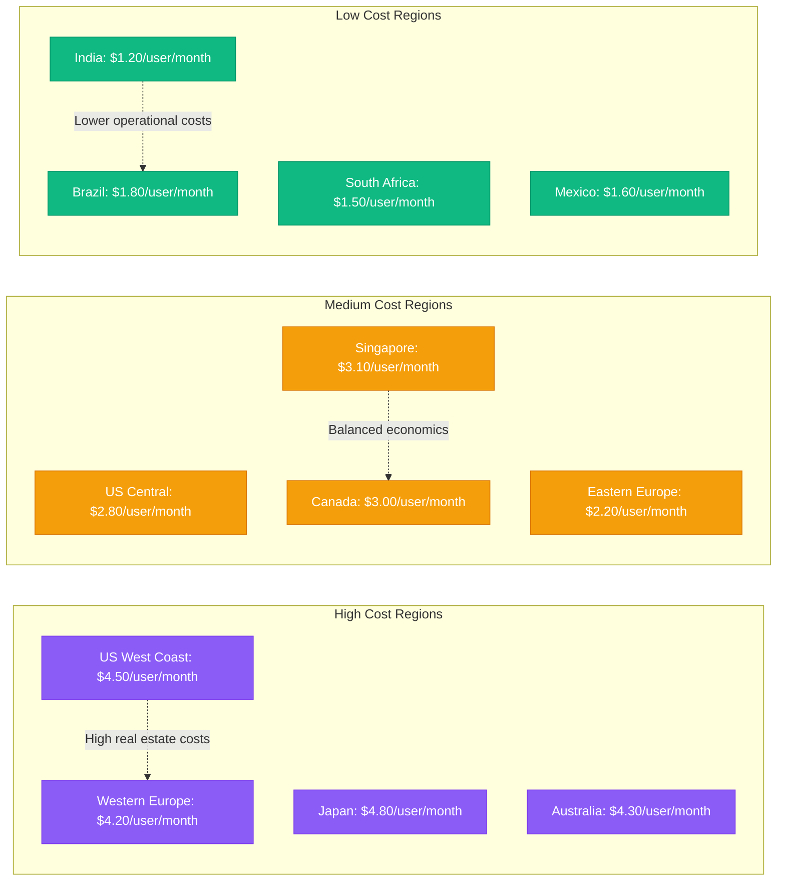

## AI Infrastructure Investment - $6B/year

### Copilot Infrastructure Costs
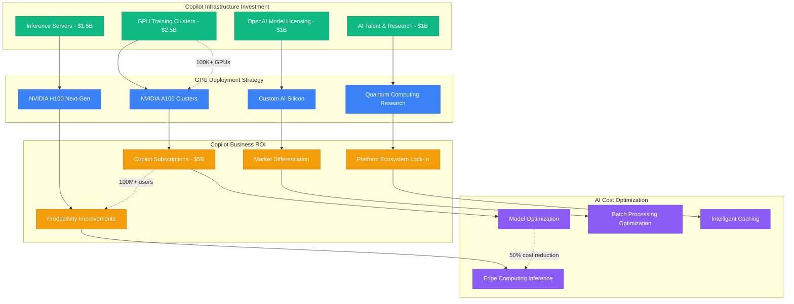

## Cost Optimization Achievements

### Historical Cost Reductions (2019-2024)
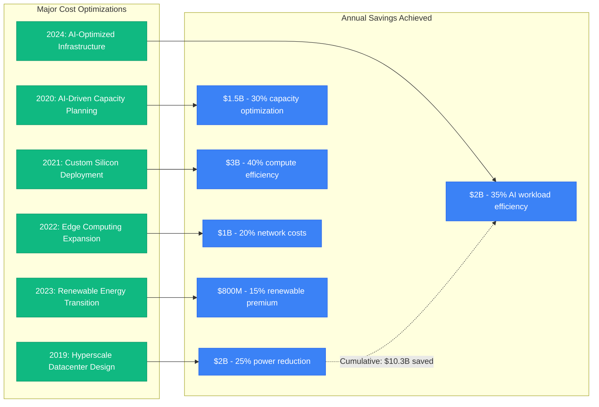

### Energy Efficiency and Sustainability Investments
| Year | PUE (Power Usage Effectiveness) | Annual Power Cost | Renewable Energy % |
|------|--------------------------------|-------------------|-------------------|
| 2019 | 1.25 | $8.5B | 60% |
| 2020 | 1.20 | $8.0B | 70% |
| 2021 | 1.18 | $7.5B | 80% |
| 2022 | 1.15 | $7.2B | 90% |
| 2023 | 1.13 | $7.0B | 95% |
| 2024 | 1.125 | $6.8B | 100% |

## Service-Specific Cost Analysis

### Teams Platform Cost Breakdown
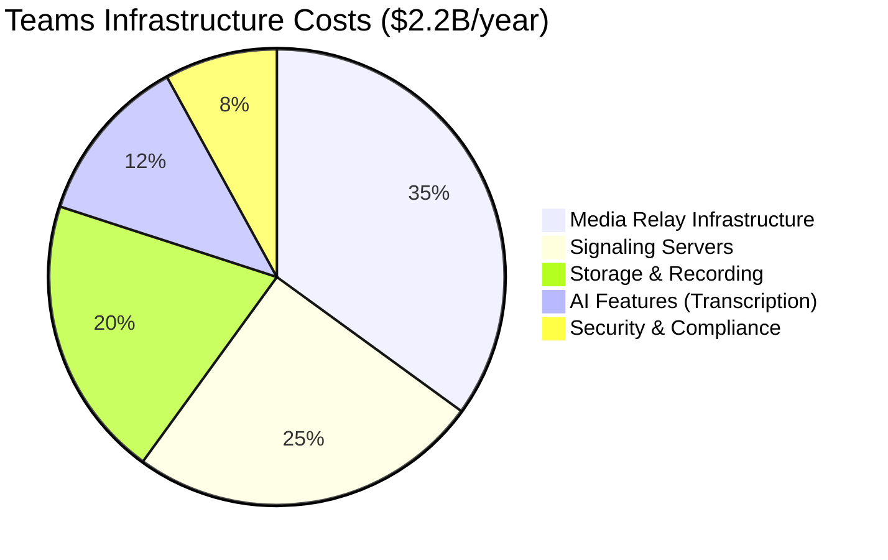

### Azure Storage Cost Economics
| Storage Tier | Cost per GB/Month | Access Cost | Durability | Use Case |
|-------------|------------------|-------------|------------|----------|
| Premium SSD | $0.15 | $0 | 99.999% | High-performance apps |
| Standard SSD | $0.06 | $0 | 99.999% | Balanced workloads |
| Standard HDD | $0.045 | $0 | 99.999% | Backup & archive |
| Cool Blob | $0.01 | $0.01/GB | 99.999999999% | Infrequent access |
| Archive Blob | $0.002 | $0.02/GB | 99.999999999% | Long-term retention |

## Operational Excellence Investment

### Site Reliability Engineering Costs
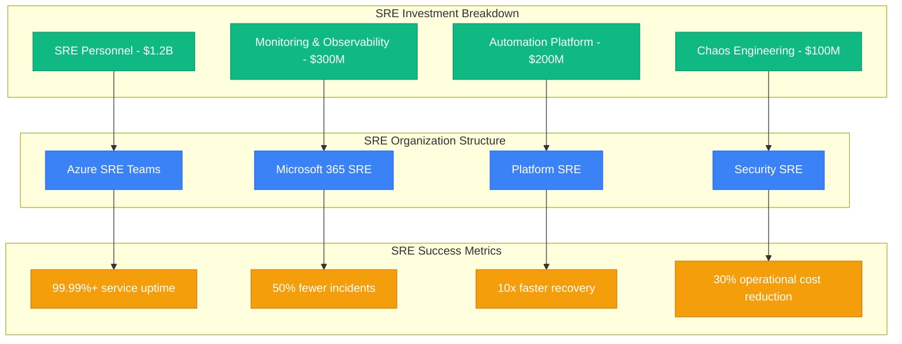

## Security and Compliance Investment - $4.2B/year

### Cybersecurity Infrastructure Costs
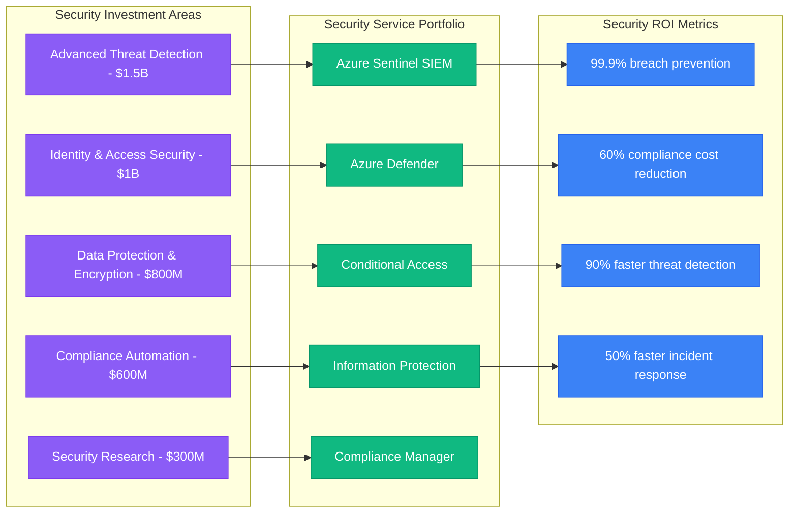

## Cost Efficiency Benchmarks

### Industry Comparison (Cost per Customer)
| Company | Monthly Cost per Customer | Efficiency Rank |
|---------|--------------------------|----------------|
| **Microsoft** | **$2.80** | **1st** |
| Google Workspace | $3.50 | 2nd |
| Amazon Web Services | $4.20 | 3rd |
| Salesforce | $5.80 | 4th |
| Oracle Cloud | $6.50 | 5th |

### Microsoft's Cost Efficiency Advantages
1. **Hyperscale Economics**: Massive scale drives per-unit costs down
2. **Multi-tenant Architecture**: Shared infrastructure maximizes utilization
3. **Custom Silicon**: Specialized processors optimized for specific workloads
4. **Global Network**: Own backbone network reduces third-party costs
5. **AI-Driven Optimization**: Machine learning optimizes resource allocation

## Future Investment Strategy (2025-2027)

### Planned Infrastructure Investment ($45B over 3 years)
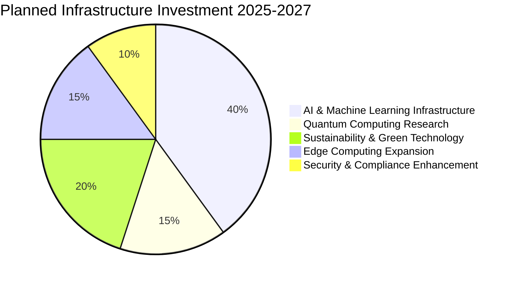

### Expected ROI by Investment Area
1. **AI Infrastructure**: 300% ROI through Copilot subscriptions and productivity gains
2. **Quantum Computing**: Long-term breakthrough potential in optimization and cryptography
3. **Sustainability**: 25% operational cost reduction through green technology
4. **Edge Computing**: 40% latency reduction and 30% bandwidth cost savings
5. **Security Enhancement**: Risk mitigation worth $10B+ in avoided breaches

## Production Lessons

### Key Cost Management Insights
1. **Scale Economics**: Fixed costs become negligible at global scale
2. **Multi-tenancy**: Shared infrastructure is essential for cost efficiency
3. **Automation**: Manual operations don't scale economically
4. **Custom Solutions**: Build vs buy analysis favors building at Microsoft's scale
5. **Long-term Investments**: Infrastructure investments pay off over decades

### The $100B Cloud Infrastructure Bet
- **Total Investment**: $100B+ in cloud infrastructure over 15 years
- **Current Cloud Revenue**: $110B+ annually (Azure + Office 365)
- **ROI Achievement**: Infrastructure investment pays for itself annually
- **Key Learning**: Massive upfront investment in infrastructure enables dominant market position

### Enterprise vs Consumer Economics
- **Enterprise Customers**: Higher margin, predictable revenue, longer contracts
- **Consumer Services**: Lower margin, high volume, acquisition cost sensitive
- **Cross-Subsidization**: Enterprise profits fund consumer service innovation
- **Platform Strategy**: Consumer services drive enterprise adoption

*"Microsoft's cost structure demonstrates that cloud infrastructure requires enormous upfront investment, but the scale economics create sustainable competitive advantages once achieved."*

**Sources**: Microsoft SEC Filings, Azure Pricing Models, Microsoft Investor Relations, Cloud Infrastructure Research Reports