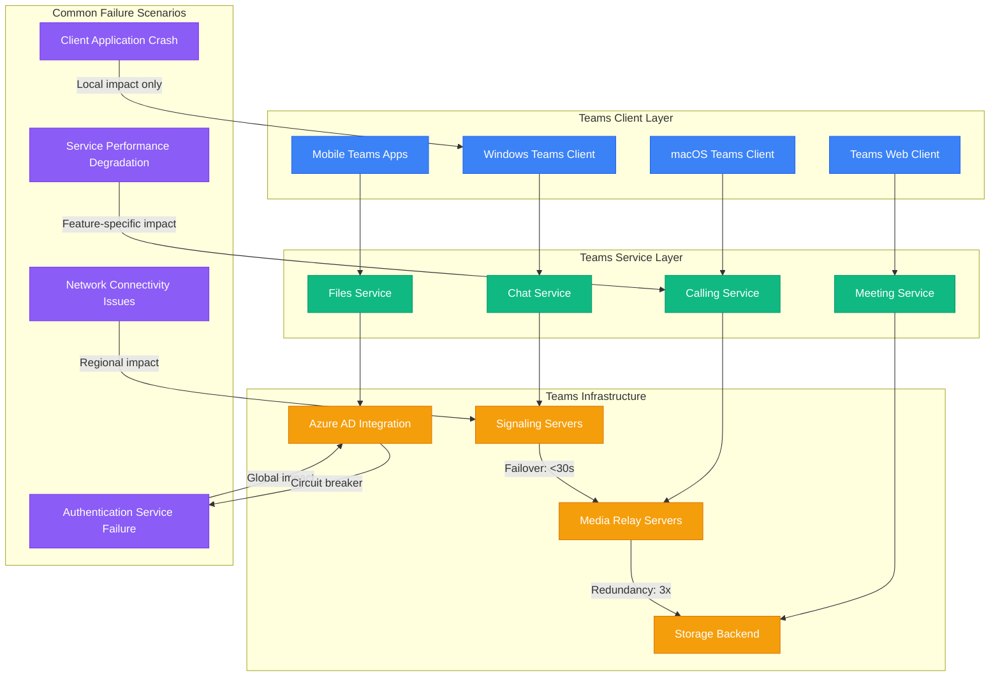
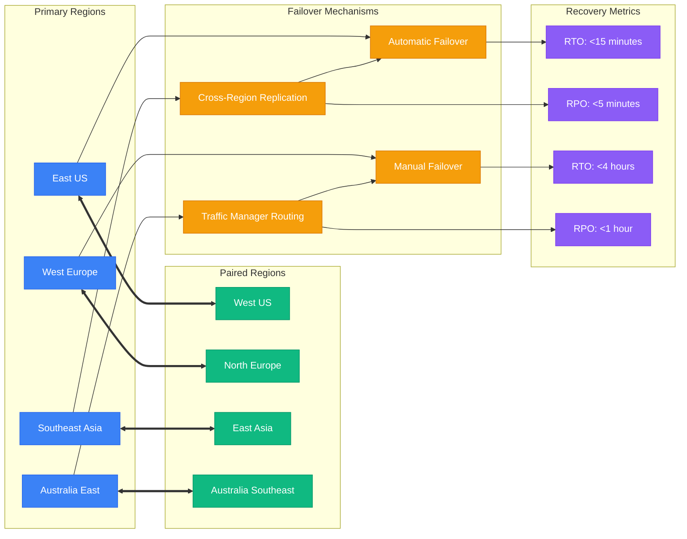
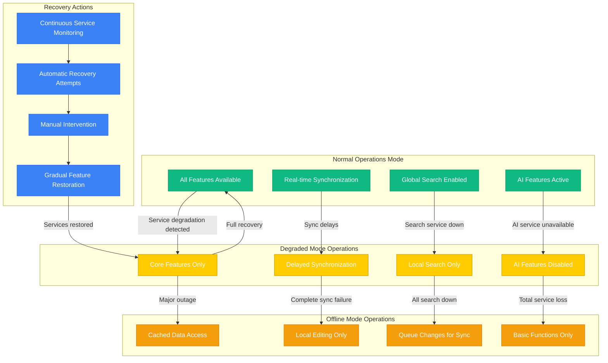
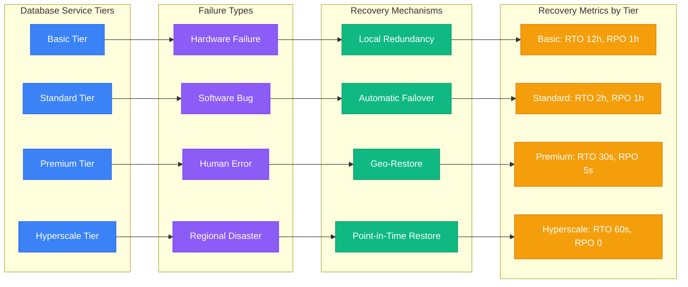
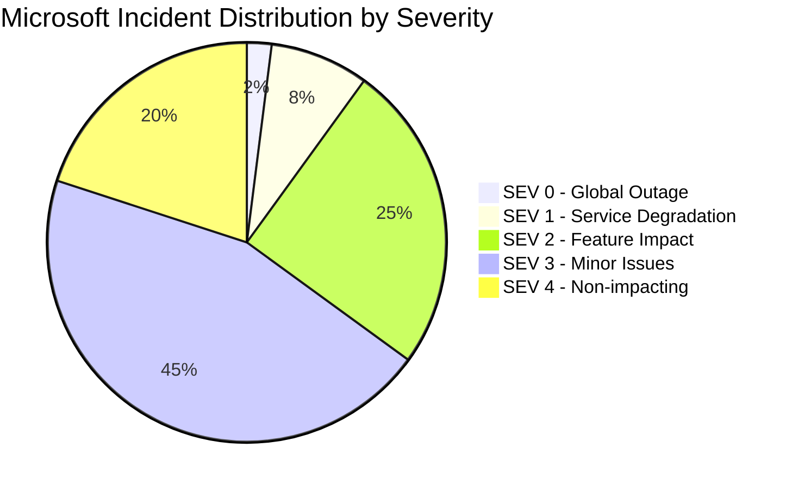
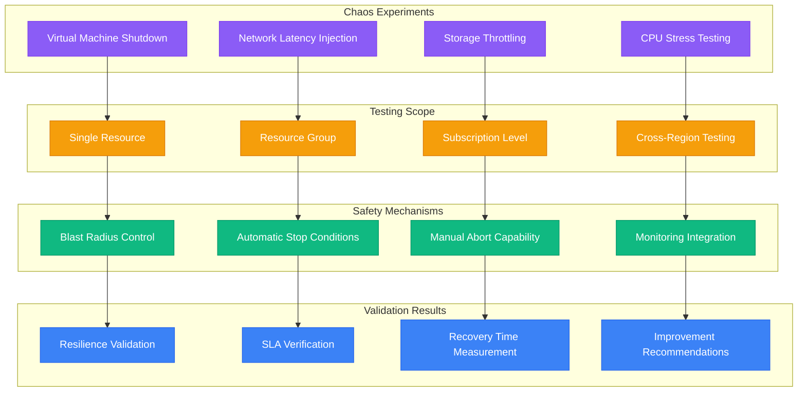

# Microsoft - Failure Domains Architecture

## Enterprise-Grade Resilience at Global Scale

Microsoft's failure domain architecture is designed around the principle that failures are inevitable at global scale. With 60+ Azure regions, 300M+ Teams users, and 400M+ Office 365 subscribers, the system must gracefully handle everything from single server failures to entire datacenter outages while maintaining enterprise SLAs.

## Failure Domain Hierarchy

```mermaid
graph TB
    subgraph GlobalLevel[Global Failure Domain]
        GLOBAL_DNS[Global DNS Infrastructure]
        INTERNET_ROUTING[Internet Routing (BGP)]
        SUBSEA_CABLES[Subsea Cable Network]
        TRAFFIC_MANAGER[Azure Traffic Manager]
    end

    subgraph RegionalLevel[Regional Failure Domains]
        AZURE_REGION_1[Azure Region 1 (East US)]
        AZURE_REGION_2[Azure Region 2 (West Europe)]
        AZURE_REGION_3[Azure Region 3 (Southeast Asia)]
        PAIRED_REGIONS[Paired Regions Strategy]
    end

    subgraph ZonalLevel[Availability Zone Failure Domains]
        AZ_1[Availability Zone 1]
        AZ_2[Availability Zone 2]
        AZ_3[Availability Zone 3]
        CROSS_ZONE_REPLICATION[Cross-Zone Replication]
    end

    subgraph DatacenterLevel[Datacenter Failure Domains]
        DC_POWER[Power Grid Failure]
        DC_COOLING[Cooling System Failure]
        DC_NETWORK[Network Infrastructure]
        DC_COMPUTE[Compute Resources]
    end

    %% Failure cascade paths
    GLOBAL_DNS -->|"DNS failure"| AZURE_REGION_1
    INTERNET_ROUTING -->|"BGP issues"| AZURE_REGION_2
    SUBSEA_CABLES -->|"Cable cut"| AZURE_REGION_3
    TRAFFIC_MANAGER -->|"Health check failure"| PAIRED_REGIONS

    %% Regional to zonal failures
    AZURE_REGION_1 -->|"Region outage"| AZ_1
    AZURE_REGION_2 -->|"Regional disaster"| AZ_2
    AZURE_REGION_3 -->|"Compliance issues"| AZ_3
    PAIRED_REGIONS -->|"Pairing failure"| CROSS_ZONE_REPLICATION

    %% Zonal to datacenter failures
    AZ_1 -->|"Zone failure"| DC_POWER
    AZ_2 -->|"Infrastructure loss"| DC_COOLING
    AZ_3 -->|"Capacity exhaustion"| DC_NETWORK
    CROSS_ZONE_REPLICATION -->|"Replication lag"| DC_COMPUTE

    %% Blast radius annotations
    GLOBAL_DNS -.->|"Blast radius: Global"| INTERNET_ROUTING
    AZURE_REGION_1 -.->|"Blast radius: Regional"| PAIRED_REGIONS
    AZ_1 -.->|"Blast radius: Zonal"| CROSS_ZONE_REPLICATION
    DC_POWER -.->|"Blast radius: Datacenter"| DC_COOLING

    %% Apply severity colors
    classDef criticalStyle fill:#8B5CF6,stroke:#7C3AED,color:#fff
    classDef highStyle fill:#F59E0B,stroke:#D97706,color:#fff
    classDef mediumStyle fill:#FFCC00,stroke:#CC9900,color:#fff
    classDef lowStyle fill:#10B981,stroke:#059669,color:#fff

    class GLOBAL_DNS,INTERNET_ROUTING,SUBSEA_CABLES,TRAFFIC_MANAGER criticalStyle
    class AZURE_REGION_1,AZURE_REGION_2,AZURE_REGION_3,PAIRED_REGIONS highStyle
    class AZ_1,AZ_2,AZ_3,CROSS_ZONE_REPLICATION mediumStyle
    class DC_POWER,DC_COOLING,DC_NETWORK,DC_COMPUTE lowStyle
```

## Microsoft 365 Service Failure Analysis

### March 2021 Azure AD Global Outage

```mermaid
gantt
    title Microsoft 365 Global Outage - March 15, 2021
    dateFormat HH:mm
    axisFormat %H:%M

    section Root Cause
    Azure AD certificate expiry :crit, cert, 21:00, 21:05
    Authentication failures begin :crit, auth_fail, 21:05, 23:30

    section Service Impact
    Teams login failures :crit, teams, 21:10, 23:20
    Office 365 access blocked :crit, office, 21:15, 23:15
    SharePoint unavailable :crit, sharepoint, 21:20, 23:10

    section Recovery Actions
    Emergency certificate renewal :active, emergency, 22:00, 22:30
    Service validation :active, validation, 22:30, 23:00
    Gradual service restoration :done, restore, 23:00, 23:30

    section Post-Incident
    Full service recovery :milestone, recovery, 23:30, 23:30
```


### Teams Service Failure Domains


## Azure Infrastructure Failure Domains

### Azure Region Pair Strategy


### Availability Zone Architecture

```mermaid
graph TB
    subgraph AzureRegion[Azure Region - East US 2]
        AZ1[Availability Zone 1]
        AZ2[Availability Zone 2]
        AZ3[Availability Zone 3]
        REGION_SERVICES[Regional Services]
    end

    subgraph ZoneComponents[Zone-Level Components]
        AZ1_COMPUTE[Compute Resources]
        AZ1_STORAGE[Storage Systems]
        AZ1_NETWORK[Network Infrastructure]
        AZ1_POWER[Independent Power]
    end

    subgraph ZoneFailures[Zone Failure Scenarios]
        POWER_OUTAGE[Power Grid Failure]
        COOLING_FAILURE[Cooling System Failure]
        NETWORK_FAILURE[Network Switch Failure]
        FLOOD_DISASTER[Natural Disaster]
    end

    subgraph FailoverLogic[Cross-Zone Failover]
        HEALTH_MONITORING[Health Monitoring]
        AUTOMATIC_FAILOVER_AZ[Automatic Failover]
        LOAD_BALANCER_AZ[Load Balancer Rerouting]
        DATA_SYNC[Data Synchronization]
    end

    %% Zone structure
    AZ1 --> AZ1_COMPUTE
    AZ1 --> AZ1_STORAGE
    AZ1 --> AZ1_NETWORK
    AZ1 --> AZ1_POWER

    %% Failure scenarios
    POWER_OUTAGE --> AZ1_POWER
    COOLING_FAILURE --> AZ1_COMPUTE
    NETWORK_FAILURE --> AZ1_NETWORK
    FLOOD_DISASTER --> AZ1

    %% Failover mechanisms
    HEALTH_MONITORING --> AUTOMATIC_FAILOVER_AZ
    AUTOMATIC_FAILOVER_AZ --> LOAD_BALANCER_AZ
    LOAD_BALANCER_AZ --> DATA_SYNC

    %% Cross-zone relationships
    AZ1 -.->|"Failover to"| AZ2
    AZ2 -.->|"Failover to"| AZ3
    AZ3 -.->|"Failover to"| AZ1

    %% Regional services span zones
    REGION_SERVICES --> AZ1
    REGION_SERVICES --> AZ2
    REGION_SERVICES --> AZ3

    classDef zoneStyle fill:#3B82F6,stroke:#2563EB,color:#fff
    classDef componentStyle fill:#10B981,stroke:#059669,color:#fff
    classDef failureStyle fill:#8B5CF6,stroke:#7C3AED,color:#fff
    classDef failoverStyle fill:#F59E0B,stroke:#D97706,color:#fff

    class AZ1,AZ2,AZ3,REGION_SERVICES zoneStyle
    class AZ1_COMPUTE,AZ1_STORAGE,AZ1_NETWORK,AZ1_POWER componentStyle
    class POWER_OUTAGE,COOLING_FAILURE,NETWORK_FAILURE,FLOOD_DISASTER failureStyle
    class HEALTH_MONITORING,AUTOMATIC_FAILOVER_AZ,LOAD_BALANCER_AZ,DATA_SYNC failoverStyle
```


## Service-Specific Failure Handling

### Office 365 Degraded Mode Operations


### Azure SQL Database Failure Handling


## Circuit Breaker and Bulkhead Patterns

### Microsoft Graph API Circuit Breaker
```mermaid
stateDiagram-v2
    [*] --> Closed
    Closed --> Open : Error rate > 50% OR Latency > 5s
    Open --> HalfOpen : 30 second timeout
    HalfOpen --> Closed : 5 consecutive successes
    HalfOpen --> Open : Any failure

    state Closed {
        [*] --> MonitoringRequests
        MonitoringRequests --> ProcessingRequests : Request received
        ProcessingRequests --> CountingErrors : Error occurred
        CountingErrors --> MonitoringRequests : Continue monitoring
        ProcessingRequests --> MonitoringRequests : Success
        CountingErrors --> [*] : Threshold exceeded
    }

    state Open {
        [*] --> RejectingRequests
        RejectingRequests --> FastFailResponse : Request received
        FastFailResponse --> RejectingRequests : Return cached/degraded response
        RejectingRequests --> [*] : Timeout reached
    }

    state HalfOpen {
        [*] --> TestingService
        TestingService --> [*] : Single request test result
    }

    note right of Closed : Normal operation\nFailure threshold: 50%\nLatency threshold: 5s
    note right of Open : Fast fail mode\nTimeout: 30 seconds\nReturn cached responses
    note right of HalfOpen : Recovery test\nAllow single test request
```

## Recovery Time and Recovery Point Objectives

### Service Level Recovery Targets
| Service | RTO (Recovery Time) | RPO (Recovery Point) | Availability SLA |
|---------|-------------------|---------------------|------------------|
| Azure Active Directory | 4 hours | 1 hour | 99.9% |
| Microsoft Teams | 30 minutes | 15 minutes | 99.9% |
| Office 365 Exchange | 4 hours | 1 hour | 99.9% |
| Azure SQL Database Premium | 30 seconds | 5 seconds | 99.99% |
| Azure Storage (LRS) | 2 hours | 0 (synchronous) | 99.9% |
| Azure Storage (GRS) | 8 hours | 1 hour | 99.9% |

### Incident Response Metrics (2024)


## Chaos Engineering and Resilience Testing

### Azure Chaos Studio


## Production Lessons from Major Incidents

### Key Insights from Azure AD Outages
1. **Certificate Management**: Automated certificate renewal prevents expiry-related outages
2. **Global vs Regional**: Authentication services require global redundancy, not just regional
3. **Dependency Mapping**: All services depend on identity - it's the ultimate single point of failure
4. **Communication**: Clear status communication is critical during authentication outages
5. **Graceful Degradation**: Services should function with cached credentials when possible

### Teams Scaling Lessons from COVID-19
- **Elastic Capacity**: Auto-scaling prevented outages during 10x growth
- **Media Optimization**: Direct peer connections reduced infrastructure load
- **Regional Distribution**: Local media relays improved quality and reduced costs
- **Feature Prioritization**: Core features (chat/calls) prioritized over nice-to-have features
- **Monitoring Enhancement**: Real-time capacity monitoring enabled proactive scaling

### Office 365 Tenant Isolation Benefits
- **Blast Radius Limitation**: Problems in one tenant don't affect others
- **Performance Isolation**: Heavy users don't impact other tenants
- **Security Boundaries**: Data breaches are contained within tenant boundaries
- **Scaling Independence**: Tenants can scale independently based on usage
- **Deployment Flexibility**: Features can be rolled out to specific tenants first

*"Microsoft's failure domain architecture shows that enterprise reliability requires multiple layers of redundancy, automated failover, and graceful degradation - there's no single solution that handles all failure scenarios."*

**Sources**: Azure Architecture Center, Microsoft 365 Service Health Dashboard, Azure Status History, Post-Incident Reviews