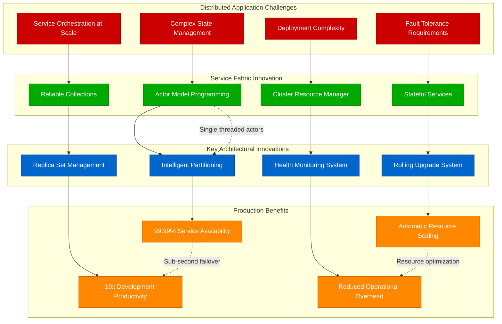
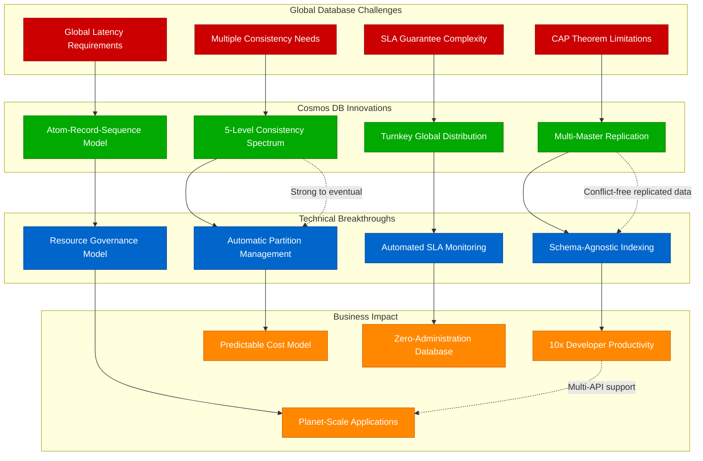
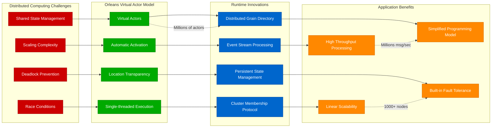
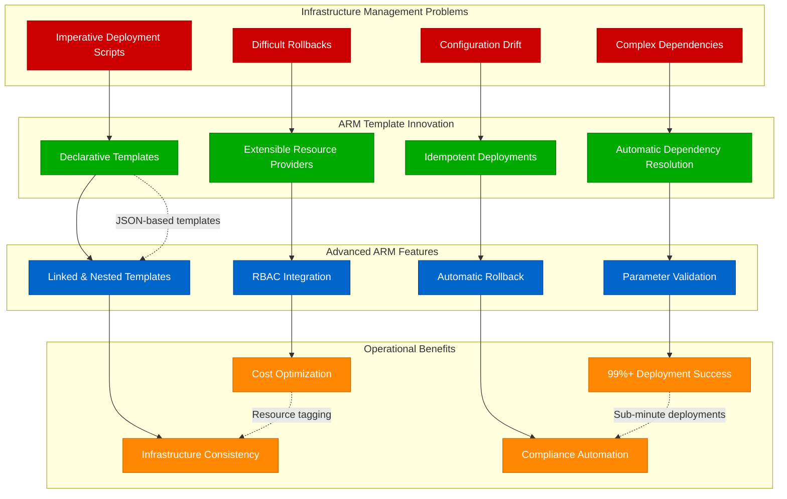
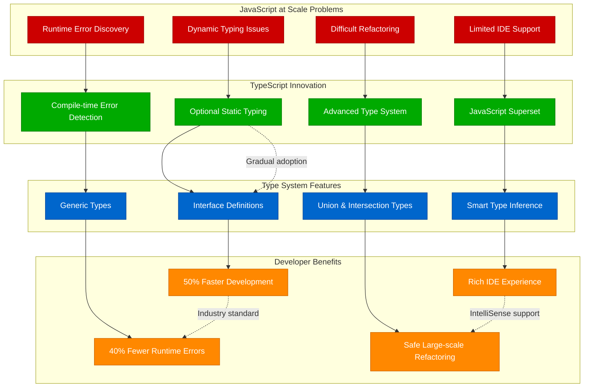
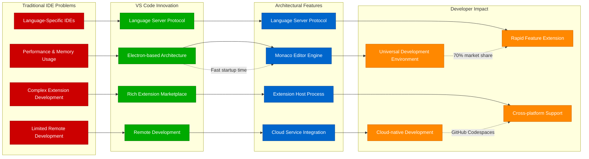
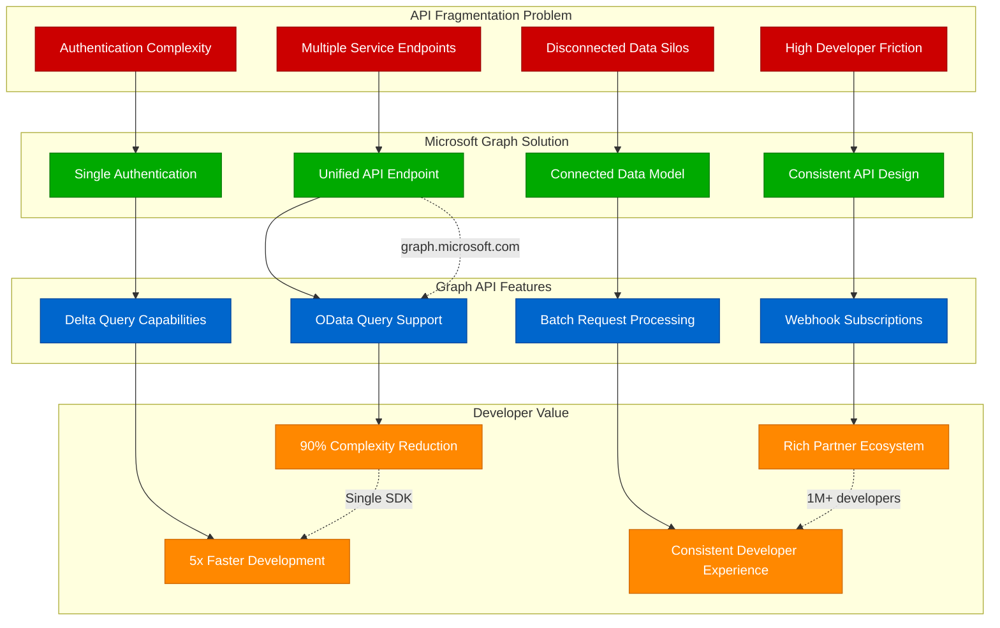
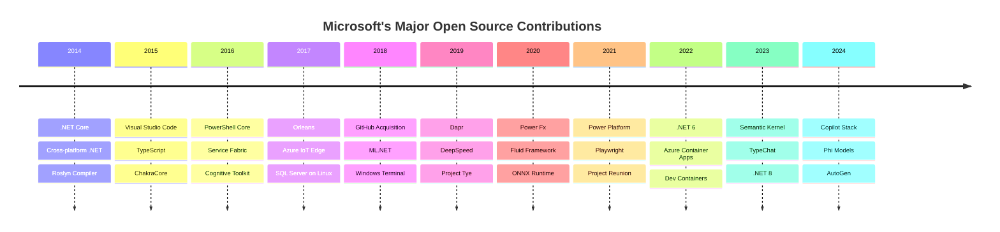
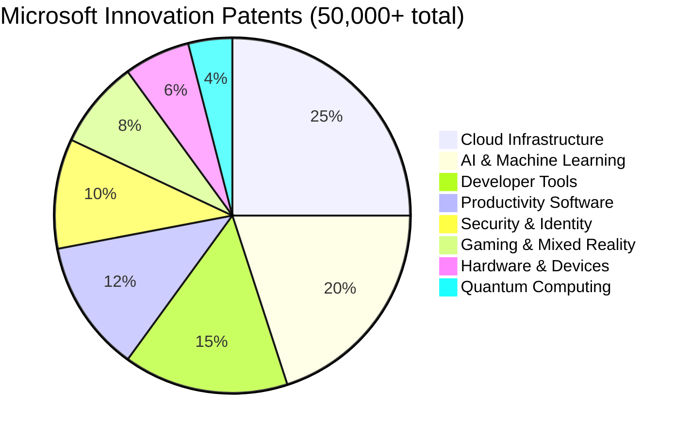

# Microsoft - Novel Solutions & Innovations

## Engineering Breakthroughs for Global Scale

Microsoft's engineering challenges at global scale have driven innovations that became industry standards. From Service Fabric's actor model to Cosmos DB's global consistency guarantees, Microsoft's novel solutions often emerge from the unique constraints of serving 400M+ enterprise customers with strict SLA requirements.

## Service Fabric: Distributed Application Platform

Service Fabric emerged from Microsoft's need to build stateful, highly available microservices that could handle the complexity of Office 365 and Azure at global scale.

## Cosmos DB: Globally Distributed Database

Cosmos DB represents Microsoft's breakthrough in providing global distribution with multiple consistency models and SLA guarantees that were previously impossible.

## Orleans: Virtual Actor Framework

Orleans pioneered the virtual actor model that simplifies distributed application development by providing location-transparent, fault-tolerant actors.

## Azure Resource Manager (ARM): Infrastructure as Code

ARM revolutionized cloud resource management by providing declarative infrastructure deployment with dependency resolution and rollback capabilities.

## TypeScript: Scalable JavaScript Development

TypeScript solved the fundamental problem of building large-scale JavaScript applications by adding static typing while maintaining JavaScript compatibility.

## Visual Studio Code: Cloud-Native IDE

VS Code revolutionized development environments by combining desktop-like performance with cloud-native extensibility and remote development capabilities.

## Microsoft Graph: Unified API Gateway

Microsoft Graph solved the API fragmentation problem by providing a single endpoint for all Microsoft 365 data and services.

## Innovation Impact Timeline

### Open Source Contributions by Year

## Research Publications and Patents

### High-Impact Research Papers
| Paper | Citations | Innovation Area |
|-------|-----------|----------------|
| Orleans: Cloud Computing for Everyone | 1200+ | Distributed Actor Model |
| Azure Data Lake Store | 800+ | Big Data Storage |
| Service Fabric: A Distributed Platform | 900+ | Microservices Platform |
| Cosmos DB: Global Distribution | 600+ | Multi-model Database |
| TypeScript: Language Design | 500+ | Programming Languages |

### Patent Portfolio by Category

## Innovation Philosophy and Process

### Microsoft's Innovation Framework
1. **Research-to-Product Pipeline**: Direct path from Microsoft Research to product teams
2. **Open Source First**: Default to open source for developer-facing innovations
3. **Customer Co-innovation**: Partner with enterprise customers on breakthrough solutions
4. **Acquisition Integration**: Acquire and integrate innovative companies (GitHub, LinkedIn)
5. **Platform Thinking**: Build technologies that enable ecosystem innovation

### The "Growth Mindset" Innovation Culture
- **Learn-it-all vs Know-it-all**: Continuous learning over static expertise
- **Fail Fast**: Rapid experimentation with quick learning cycles
- **Customer Obsession**: Innovations driven by customer pain points
- **Inclusive Innovation**: Diverse teams produce more innovative solutions
- **Long-term Thinking**: Invest in technologies that pay off over decades

## Current Innovation Frontiers (2024)

### AI-First Innovation Strategy

```mermaid
graph TB
    subgraph AIInnovation[AI Innovation Areas]
        COPILOT_PLATFORM[Copilot Platform]
        MULTIMODAL_AI[Multimodal AI Models]
        AI_INFRASTRUCTURE[AI Infrastructure]
        PROMPT_ENGINEERING[Prompt Engineering Tools]
    end

    subgraph QuantumComputing[Quantum Computing]
        AZURE_QUANTUM[Azure Quantum Platform]
        TOPOLOGICAL_QUBITS[Topological Qubits]
        QUANTUM_ALGORITHMS[Quantum Algorithms]
        QUANTUM_NETWORKING[Quantum Networking]
    end

    subgraph SustainableTech[Sustainable Technology]
        CARBON_NEGATIVE[Carbon Negative Goals]
        GREEN_SOFTWARE[Green Software Foundation]
        RENEWABLE_ENERGY[100% Renewable Energy]
        CIRCULAR_ECONOMY[Circular Economy Principles]
    end

    subgraph MetaverseComputing[Spatial Computing]
        HOLOLENS_PLATFORM[HoloLens Platform]
        MIXED_REALITY[Mixed Reality Toolkit]
        SPATIAL_ANCHORS[Azure Spatial Anchors]
        MESH_PLATFORM[Microsoft Mesh]
    end

    %% Innovation synergies
    COPILOT_PLATFORM --> AZURE_QUANTUM
    MULTIMODAL_AI --> CARBON_NEGATIVE
    AI_INFRASTRUCTURE --> HOLOLENS_PLATFORM
    PROMPT_ENGINEERING --> MIXED_REALITY

    classDef aiStyle fill:#00AA00,stroke:#007700,color:#fff
    classDef quantumStyle fill:#0066CC,stroke:#004499,color:#fff
    classDef sustainableStyle fill:#FF8800,stroke:#CC6600,color:#fff
    classDef spatialStyle fill:#CC0000,stroke:#990000,color:#fff

    class COPILOT_PLATFORM,MULTIMODAL_AI,AI_INFRASTRUCTURE,PROMPT_ENGINEERING aiStyle
    class AZURE_QUANTUM,TOPOLOGICAL_QUBITS,QUANTUM_ALGORITHMS,QUANTUM_NETWORKING quantumStyle
    class CARBON_NEGATIVE,GREEN_SOFTWARE,RENEWABLE_ENERGY,CIRCULAR_ECONOMY sustainableStyle
    class HOLOLENS_PLATFORM,MIXED_REALITY,SPATIAL_ANCHORS,MESH_PLATFORM spatialStyle
```

## Production Lessons from Innovation

### Key Innovation Insights
1. **Platform Strategy**: Build technologies that enable others to innovate
2. **Open Source Adoption**: Open source accelerates innovation and adoption
3. **Enterprise Focus**: Enterprise requirements drive different innovations than consumer needs
4. **Scale-Driven Innovation**: Unique challenges at Microsoft's scale require novel solutions
5. **Long-term Investment**: Breakthrough innovations require years of sustained investment

### The Azure Innovation Engine
- **Problem**: Building cloud platform required innovations across every layer
- **Approach**: Massive R&D investment, acquisition strategy, open source adoption
- **Timeline**: 15+ years of continuous innovation and improvement
- **Result**: #2 cloud platform with unique capabilities like Cosmos DB and Service Fabric
- **Learning**: Platform innovation requires both breakthrough technologies and ecosystem development

### Developer Tool Innovation Success
- **Pattern**: Microsoft excels at developer productivity innovations
- **Examples**: Visual Studio, TypeScript, VS Code, GitHub Copilot
- **Strategy**: Solve real developer pain points with superior experience
- **Distribution**: Leverage Windows/Office ecosystem for rapid adoption
- **Impact**: Developer tools often become industry standards

*"Microsoft's innovation approach demonstrates that enterprise-scale challenges drive breakthrough technologies that often benefit the entire industry - solving hard problems at scale creates valuable intellectual property."*

**Sources**: Microsoft Research Publications, Patent Database, Open Source Project Statistics, Engineering Blog Archives, Innovation Case Studies