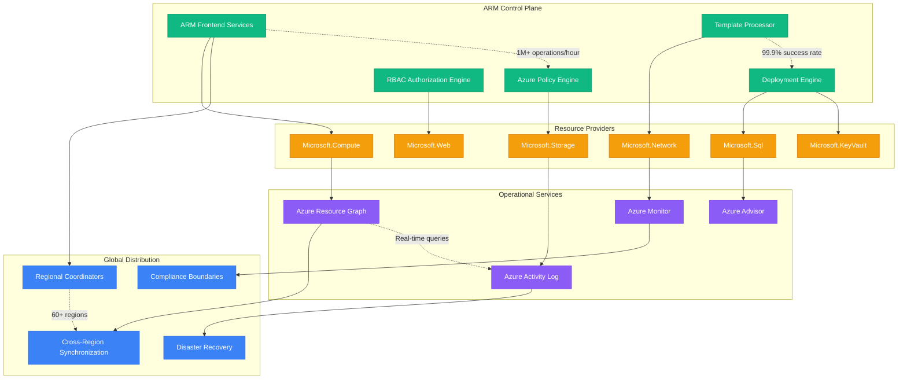
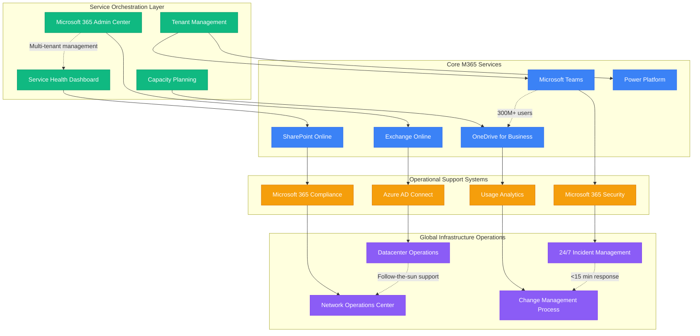

# Microsoft - Production Operations

## Operating Cloud Infrastructure at Global Scale

Microsoft's production operations manage one of the world's largest and most complex distributed systems, serving 400M+ Office 365 subscribers, 300M+ Teams users, and millions of Azure customers across 60+ regions. The scale requires sophisticated automation, monitoring, and deployment systems that ensure 99.9%+ uptime while handling thousands of deployments daily.

## Azure Resource Manager (ARM): Global Resource Orchestration

ARM serves as the unified control plane for all Azure resources, handling millions of resource operations daily with consistent deployment, management, and monitoring capabilities.



## Azure Kubernetes Service (AKS): Container Orchestration

AKS provides managed Kubernetes orchestration with Azure integration, serving millions of containerized workloads with enterprise-grade security and compliance.

```mermaid
graph TB
    subgraph AKSControlPlane[AKS Control Plane (Microsoft Managed)]
        API_SERVER[Kubernetes API Server]
        ETCD_CLUSTER[etcd Cluster]
        CONTROLLER_MANAGER[Controller Manager]
        SCHEDULER[Kubernetes Scheduler]
        AZURE_INTEGRATION[Azure Service Integration]
    end

    subgraph CustomerNodePools[Customer Node Pools]
        SYSTEM_POOL[System Node Pool]
        USER_POOL_1[User Node Pool 1]
        USER_POOL_2[User Node Pool 2]
        SPOT_INSTANCES[Spot Instance Pool]
        GPU_NODES[GPU Node Pool]
    end

    subgraph AzureIntegration[Deep Azure Integration]
        AZURE_CNI[Azure CNI Networking]
        AZURE_CSI[Azure CSI Storage]
        AZURE_MONITOR_K8S[Azure Monitor for Containers]
        AZURE_AD_INTEGRATION[Azure AD Pod Identity]
        AZURE_FIREWALL[Azure Firewall Integration]
    end

    subgraph OperationalFeatures[Operational Features]
        CLUSTER_AUTOSCALER[Cluster Autoscaler]
        VIRTUAL_NODES[Virtual Nodes (ACI)]
        NODEPOOL_UPGRADES[Automatic Node Pool Upgrades]
        SECURITY_POLICIES[Azure Policy for AKS]
    end

    %% Control plane to node pools
    API_SERVER --> SYSTEM_POOL
    ETCD_CLUSTER --> USER_POOL_1
    CONTROLLER_MANAGER --> USER_POOL_2
    SCHEDULER --> SPOT_INSTANCES
    AZURE_INTEGRATION --> GPU_NODES

    %% Azure integration
    SYSTEM_POOL --> AZURE_CNI
    USER_POOL_1 --> AZURE_CSI
    USER_POOL_2 --> AZURE_MONITOR_K8S
    SPOT_INSTANCES --> AZURE_AD_INTEGRATION
    GPU_NODES --> AZURE_FIREWALL

    %% Operational features
    AZURE_CNI --> CLUSTER_AUTOSCALER
    AZURE_CSI --> VIRTUAL_NODES
    AZURE_MONITOR_K8S --> NODEPOOL_UPGRADES
    AZURE_AD_INTEGRATION --> SECURITY_POLICIES

    %% Scale and performance metrics
    API_SERVER -.->|"99.9% uptime SLA"| ETCD_CLUSTER
    CLUSTER_AUTOSCALER -.->|"Auto-scale: 0-5000 nodes"| VIRTUAL_NODES
    AZURE_MONITOR_K8S -.->|"Real-time telemetry"| SECURITY_POLICIES
    SPOT_INSTANCES -.->|"90% cost savings"| GPU_NODES

    classDef controlStyle fill:#8B5CF6,stroke:#7C3AED,color:#fff
    classDef nodeStyle fill:#10B981,stroke:#059669,color:#fff
    classDef azureStyle fill:#3B82F6,stroke:#2563EB,color:#fff
    classDef opsStyle fill:#F59E0B,stroke:#D97706,color:#fff

    class API_SERVER,ETCD_CLUSTER,CONTROLLER_MANAGER,SCHEDULER,AZURE_INTEGRATION controlStyle
    class SYSTEM_POOL,USER_POOL_1,USER_POOL_2,SPOT_INSTANCES,GPU_NODES nodeStyle
    class AZURE_CNI,AZURE_CSI,AZURE_MONITOR_K8S,AZURE_AD_INTEGRATION,AZURE_FIREWALL azureStyle
    class CLUSTER_AUTOSCALER,VIRTUAL_NODES,NODEPOOL_UPGRADES,SECURITY_POLICIES opsStyle
```

## Azure DevOps: Enterprise CI/CD Platform

Azure DevOps provides enterprise-grade continuous integration and deployment capabilities with integrated project management and collaboration tools.

```mermaid
graph LR
    subgraph SourceControl[Source Control & Planning]
        AZURE_REPOS[Azure Repos (Git)]
        AZURE_BOARDS[Azure Boards]
        PULL_REQUESTS[Pull Request Management]
        BRANCH_POLICIES[Branch Policies]
    end

    subgraph BuildPipelines[Build & Test Pipelines]
        AZURE_PIPELINES[Azure Pipelines]
        BUILD_AGENTS[Self-hosted Agents]
        TEST_PLANS[Azure Test Plans]
        ARTIFACT_FEEDS[Azure Artifacts]
    end

    subgraph DeploymentPipelines[Deployment Pipelines]
        RELEASE_PIPELINES[Release Pipelines]
        DEPLOYMENT_GROUPS[Deployment Groups]
        APPROVAL_GATES[Approval Gates]
        ROLLBACK_AUTOMATION[Automated Rollback]
    end

    subgraph MonitoringIntegration[Monitoring & Feedback]
        APPLICATION_INSIGHTS[Application Insights]
        AZURE_MONITOR_DEVOPS[Azure Monitor Integration]
        FEEDBACK_LOOPS[Continuous Feedback]
        ANALYTICS_DASHBOARDS[Analytics Dashboards]
    end

    %% Source control flow
    AZURE_REPOS --> AZURE_PIPELINES
    AZURE_BOARDS --> BUILD_AGENTS
    PULL_REQUESTS --> TEST_PLANS
    BRANCH_POLICIES --> ARTIFACT_FEEDS

    %% Build to deployment
    AZURE_PIPELINES --> RELEASE_PIPELINES
    BUILD_AGENTS --> DEPLOYMENT_GROUPS
    TEST_PLANS --> APPROVAL_GATES
    ARTIFACT_FEEDS --> ROLLBACK_AUTOMATION

    %% Deployment to monitoring
    RELEASE_PIPELINES --> APPLICATION_INSIGHTS
    DEPLOYMENT_GROUPS --> AZURE_MONITOR_DEVOPS
    APPROVAL_GATES --> FEEDBACK_LOOPS
    ROLLBACK_AUTOMATION --> ANALYTICS_DASHBOARDS

    %% Performance metrics
    AZURE_REPOS -.->|"Unlimited repos"| AZURE_PIPELINES
    AZURE_PIPELINES -.->|"Parallel jobs: 1800 min/month"| RELEASE_PIPELINES
    APPLICATION_INSIGHTS -.->|"Real-time telemetry"| FEEDBACK_LOOPS
    ANALYTICS_DASHBOARDS -.->|"Custom dashboards"| AZURE_MONITOR_DEVOPS

    classDef sourceStyle fill:#3B82F6,stroke:#2563EB,color:#fff
    classDef buildStyle fill:#10B981,stroke:#059669,color:#fff
    classDef deployStyle fill:#F59E0B,stroke:#D97706,color:#fff
    classDef monitorStyle fill:#8B5CF6,stroke:#7C3AED,color:#fff

    class AZURE_REPOS,AZURE_BOARDS,PULL_REQUESTS,BRANCH_POLICIES sourceStyle
    class AZURE_PIPELINES,BUILD_AGENTS,TEST_PLANS,ARTIFACT_FEEDS buildStyle
    class RELEASE_PIPELINES,DEPLOYMENT_GROUPS,APPROVAL_GATES,ROLLBACK_AUTOMATION deployStyle
    class APPLICATION_INSIGHTS,AZURE_MONITOR_DEVOPS,FEEDBACK_LOOPS,ANALYTICS_DASHBOARDS monitorStyle
```

## Microsoft 365 Operations: Service Management at Scale

Microsoft 365 operations manage global services for 400M+ users with complex interdependencies and strict enterprise SLA requirements.



## Azure Monitor: Observability Platform

Azure Monitor provides comprehensive observability across all Azure services and custom applications with intelligent alerting and automated remediation.

```mermaid
graph TB
    subgraph DataCollection[Data Collection Layer]
        TELEMETRY_AGENTS[Azure Monitor Agents]
        APPLICATION_INSIGHTS_SDK[Application Insights SDKs]
        DIAGNOSTIC_SETTINGS[Diagnostic Settings]
        CUSTOM_METRICS[Custom Metrics APIs]
    end

    subgraph DataPlatform[Data Platform]
        METRICS_STORE[Azure Metrics Store]
        LOG_ANALYTICS[Log Analytics Workspace]
        APPLICATION_INSIGHTS_BACKEND[Application Insights Backend]
        AZURE_DATA_EXPLORER[Azure Data Explorer (Kusto)]
    end

    subgraph AnalyticsVisualization[Analytics & Visualization]
        AZURE_DASHBOARDS[Azure Dashboards]
        WORKBOOKS[Azure Monitor Workbooks]
        KUSTO_QUERIES[Kusto Query Language]
        GRAFANA_INTEGRATION[Grafana Integration]
    end

    subgraph AlertingAutomation[Alerting & Automation]
        METRIC_ALERTS[Metric Alerts]
        LOG_ALERTS[Log Search Alerts]
        ACTION_GROUPS[Action Groups]
        LOGIC_APPS_INTEGRATION[Logic Apps Integration]
        RUNBOOK_AUTOMATION[Azure Automation Runbooks]
    end

    %% Data collection flow
    TELEMETRY_AGENTS --> METRICS_STORE
    APPLICATION_INSIGHTS_SDK --> LOG_ANALYTICS
    DIAGNOSTIC_SETTINGS --> APPLICATION_INSIGHTS_BACKEND
    CUSTOM_METRICS --> AZURE_DATA_EXPLORER

    %% Data platform to analytics
    METRICS_STORE --> AZURE_DASHBOARDS
    LOG_ANALYTICS --> WORKBOOKS
    APPLICATION_INSIGHTS_BACKEND --> KUSTO_QUERIES
    AZURE_DATA_EXPLORER --> GRAFANA_INTEGRATION

    %% Analytics to alerting
    AZURE_DASHBOARDS --> METRIC_ALERTS
    WORKBOOKS --> LOG_ALERTS
    KUSTO_QUERIES --> ACTION_GROUPS
    GRAFANA_INTEGRATION --> LOGIC_APPS_INTEGRATION
    ACTION_GROUPS --> RUNBOOK_AUTOMATION

    %% Platform metrics
    TELEMETRY_AGENTS -.->|"1TB+ data/day"| METRICS_STORE
    LOG_ANALYTICS -.->|"Petabyte scale"| APPLICATION_INSIGHTS_BACKEND
    METRIC_ALERTS -.->|"<5 min alerting"| LOG_ALERTS
    RUNBOOK_AUTOMATION -.->|"Auto-remediation"| ACTION_GROUPS

    classDef collectionStyle fill:#3B82F6,stroke:#2563EB,color:#fff
    classDef platformStyle fill:#F59E0B,stroke:#D97706,color:#fff
    classDef analyticsStyle fill:#10B981,stroke:#059669,color:#fff
    classDef alertingStyle fill:#8B5CF6,stroke:#7C3AED,color:#fff

    class TELEMETRY_AGENTS,APPLICATION_INSIGHTS_SDK,DIAGNOSTIC_SETTINGS,CUSTOM_METRICS collectionStyle
    class METRICS_STORE,LOG_ANALYTICS,APPLICATION_INSIGHTS_BACKEND,AZURE_DATA_EXPLORER platformStyle
    class AZURE_DASHBOARDS,WORKBOOKS,KUSTO_QUERIES,GRAFANA_INTEGRATION analyticsStyle
    class METRIC_ALERTS,LOG_ALERTS,ACTION_GROUPS,LOGIC_APPS_INTEGRATION,RUNBOOK_AUTOMATION alertingStyle
```

## Deployment and Release Management

### Ring-Based Deployment Model
```mermaid
graph LR
    subgraph DeploymentRings[Deployment Ring Strategy]
        RING_0[Ring 0 - Canary (0.1%)]
        RING_1[Ring 1 - Early Adopters (1%)]
        RING_2[Ring 2 - Broad Deployment (10%)]
        RING_3[Ring 3 - Full Deployment (100%)]
    end

    subgraph QualityGates[Quality Gates]
        AUTOMATED_TESTS[Automated Test Suite]
        PERFORMANCE_TESTS[Performance Testing]
        SECURITY_SCAN[Security Scanning]
        COMPLIANCE_CHECK[Compliance Validation]
    end

    subgraph MonitoringFeedback[Monitoring & Feedback]
        HEALTH_METRICS[Health Metrics]
        ERROR_RATES[Error Rate Monitoring]
        USER_FEEDBACK[User Feedback Collection]
        BUSINESS_METRICS[Business Impact Metrics]
    end

    subgraph SafetyMechanisms[Safety Mechanisms]
        AUTO_ROLLBACK[Automatic Rollback]
        FEATURE_FLAGS[Feature Flag Control]
        CIRCUIT_BREAKERS[Circuit Breaker Protection]
        EMERGENCY_STOP[Emergency Stop Process]
    end

    %% Ring progression
    RING_0 --> RING_1
    RING_1 --> RING_2
    RING_2 --> RING_3

    %% Quality gates
    AUTOMATED_TESTS --> RING_0
    PERFORMANCE_TESTS --> RING_1
    SECURITY_SCAN --> RING_2
    COMPLIANCE_CHECK --> RING_3

    %% Monitoring feedback
    HEALTH_METRICS --> AUTO_ROLLBACK
    ERROR_RATES --> FEATURE_FLAGS
    USER_FEEDBACK --> CIRCUIT_BREAKERS
    BUSINESS_METRICS --> EMERGENCY_STOP

    %% Safety mechanisms
    AUTO_ROLLBACK --> RING_0
    FEATURE_FLAGS --> RING_1
    CIRCUIT_BREAKERS --> RING_2
    EMERGENCY_STOP --> RING_3

    %% Deployment metrics
    RING_0 -.->|"24 hour bake time"| RING_1
    RING_1 -.->|"3 day monitoring"| RING_2
    RING_2 -.->|"1 week validation"| RING_3
    AUTO_ROLLBACK -.->|"<10 min detection"| FEATURE_FLAGS

    classDef ringStyle fill:#3B82F6,stroke:#2563EB,color:#fff
    classDef qualityStyle fill:#10B981,stroke:#059669,color:#fff
    classDef monitoringStyle fill:#F59E0B,stroke:#D97706,color:#fff
    classDef safetyStyle fill:#8B5CF6,stroke:#7C3AED,color:#fff

    class RING_0,RING_1,RING_2,RING_3 ringStyle
    class AUTOMATED_TESTS,PERFORMANCE_TESTS,SECURITY_SCAN,COMPLIANCE_CHECK qualityStyle
    class HEALTH_METRICS,ERROR_RATES,USER_FEEDBACK,BUSINESS_METRICS monitoringStyle
    class AUTO_ROLLBACK,FEATURE_FLAGS,CIRCUIT_BREAKERS,EMERGENCY_STOP safetyStyle
```

## Incident Management and On-Call Operations

### 24/7 Global Operations Model
```mermaid
graph TB
    subgraph GlobalCoverage[Follow-the-Sun Coverage]
        AMERICAS_NOC[Americas NOC (Redmond)]
        EMEA_NOC[EMEA NOC (Dublin)]
        APAC_NOC[APAC NOC (Singapore)]
        HANDOFF_PROCESS[24/7 Handoff Process]
    end

    subgraph IncidentClassification[Incident Classification]
        SEV_0[Sev 0 - Global Outage]
        SEV_1[Sev 1 - Service Degradation]
        SEV_2[Sev 2 - Feature Impact]
        SEV_3[Sev 3 - Minor Issues]
    end

    subgraph ResponseTeams[Response Team Structure]
        INCIDENT_COMMANDER[Incident Commander]
        SERVICE_OWNERS[Service Owners]
        ESCALATION_ENGINEERS[Escalation Engineers]
        COMMUNICATION_MANAGER[Communication Manager]
    end

    subgraph EscalationPaths[Escalation Paths]
        L1_SUPPORT[L1 - Front-line Support]
        L2_SUPPORT[L2 - Technical Support]
        L3_SUPPORT[L3 - Engineering Support]
        EXECUTIVE_ESCALATION[Executive Escalation]
    end

    %% Global coverage
    AMERICAS_NOC --> EMEA_NOC
    EMEA_NOC --> APAC_NOC
    APAC_NOC --> AMERICAS_NOC
    HANDOFF_PROCESS --> AMERICAS_NOC

    %% Incident classification to response
    SEV_0 --> INCIDENT_COMMANDER
    SEV_1 --> SERVICE_OWNERS
    SEV_2 --> ESCALATION_ENGINEERS
    SEV_3 --> COMMUNICATION_MANAGER

    %% Escalation flow
    L1_SUPPORT --> L2_SUPPORT
    L2_SUPPORT --> L3_SUPPORT
    L3_SUPPORT --> EXECUTIVE_ESCALATION

    %% Cross-connections
    INCIDENT_COMMANDER --> L3_SUPPORT
    SERVICE_OWNERS --> ESCALATION_ENGINEERS
    AMERICAS_NOC --> SEV_0

    %% Response time targets
    SEV_0 -.->|"15 min response"| INCIDENT_COMMANDER
    SEV_1 -.->|"30 min response"| SERVICE_OWNERS
    L1_SUPPORT -.->|"<5 min initial response"| L2_SUPPORT
    HANDOFF_PROCESS -.->|"Seamless transitions"| AMERICAS_NOC

    classDef globalStyle fill:#3B82F6,stroke:#2563EB,color:#fff
    classDef severityStyle fill:#8B5CF6,stroke:#7C3AED,color:#fff
    classDef teamStyle fill:#10B981,stroke:#059669,color:#fff
    classDef escalationStyle fill:#F59E0B,stroke:#D97706,color:#fff

    class AMERICAS_NOC,EMEA_NOC,APAC_NOC,HANDOFF_PROCESS globalStyle
    class SEV_0,SEV_1,SEV_2,SEV_3 severityStyle
    class INCIDENT_COMMANDER,SERVICE_OWNERS,ESCALATION_ENGINEERS,COMMUNICATION_MANAGER teamStyle
    class L1_SUPPORT,L2_SUPPORT,L3_SUPPORT,EXECUTIVE_ESCALATION escalationStyle
```

## Operational Excellence Metrics

### Service Level Objectives (SLOs)
| Service | Availability SLO | Response Time SLO | Error Rate SLO |
|---------|------------------|-------------------|----------------|
| Azure Compute | 99.9% | VM start: <5 min | <0.1% |
| Azure Storage | 99.9% | Read: <10ms p99 | <0.01% |
| Microsoft 365 | 99.9% | Page load: <2s | <0.1% |
| Teams | 99.9% | Call setup: <5s | <0.5% |
| Azure SQL Database | 99.99% | Query: <100ms p99 | <0.01% |

### Operational Metrics Dashboard
```mermaid
xychart-beta
    title "Microsoft Operational Excellence (2024)"
    x-axis [Availability, MTTR (min), Deployment Success, Change Failure Rate]
    y-axis "Percentage/Value" 0 --> 100
    bar [99.95, 12, 99.7, 0.3]
```

### Capacity Management and Auto-scaling
- **Predictive Scaling**: AI models predict capacity needs 2 weeks ahead
- **Elastic Infrastructure**: Auto-scaling handles 10x traffic spikes
- **Cost Optimization**: Intelligent rightsizing reduces costs by 40%
- **Global Load Balancing**: Traffic optimization reduces latency by 25%

## Production Lessons

### Key Operational Insights
1. **Automation is Essential**: Manual operations don't scale to Microsoft's size
2. **Observability Prevents Outages**: Comprehensive monitoring catches issues early
3. **Ring Deployments Save Money**: Gradual rollouts prevent large-scale issues
4. **Global Operations**: Follow-the-sun model provides continuous coverage
5. **Customer Communication**: Transparent status communication builds trust

### The Azure Scale Challenge
- **Problem**: Growing from startup cloud to enterprise-grade platform
- **Solution**: Massive investment in operational tooling and processes
- **Timeline**: 15+ years of continuous operational maturity evolution
- **Result**: 99.9%+ uptime across hundreds of services
- **Learning**: Operational excellence requires equal investment to product development

### Enterprise vs Consumer Operations
- **Enterprise Expectations**: Strict SLAs, compliance requirements, transparent communication
- **Consumer Tolerance**: Higher tolerance for outages, but scale amplifies impact
- **Hybrid Approach**: Enterprise-grade operations benefit both customer segments
- **Investment Strategy**: Enterprise operations requirements drive operational excellence

*"Microsoft's production operations demonstrate that enterprise-grade reliability requires comprehensive automation, global coverage, and systematic approaches to incident management - there are no shortcuts to operational excellence at global scale."*

**Sources**: Azure Operations Documentation, Microsoft 365 Service Descriptions, Azure Architecture Center, Microsoft Engineering Blogs