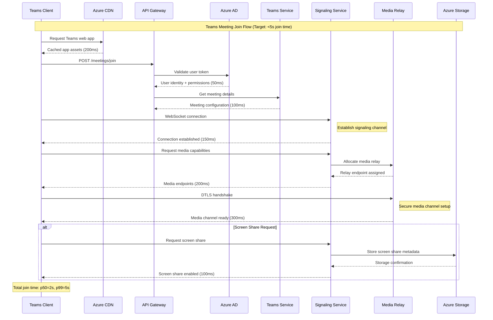
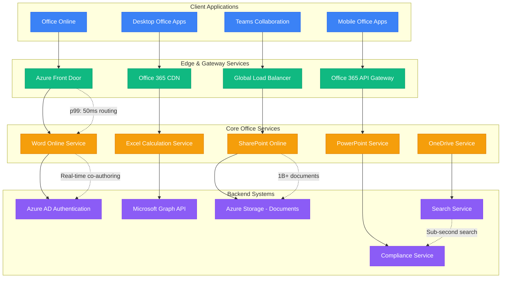
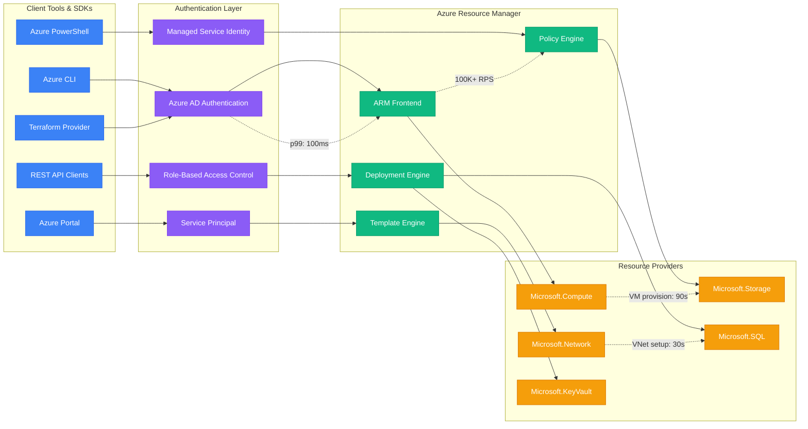
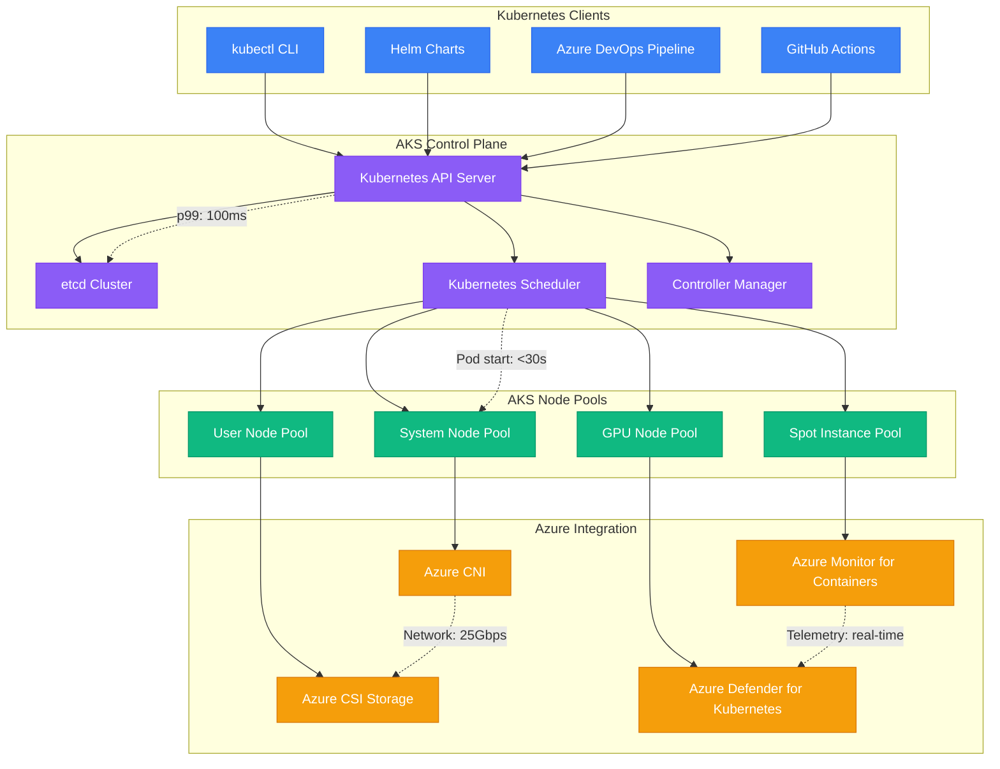
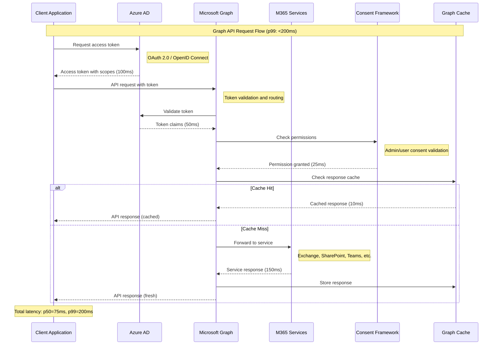
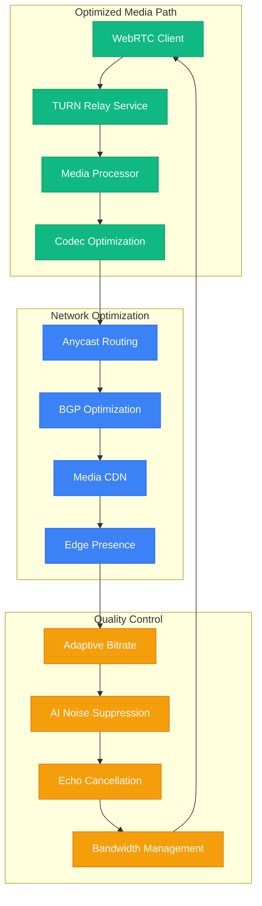

# Microsoft - Request Flow Architecture

## Teams Real-time Communication Flow

Microsoft Teams handles 300M+ monthly active users with real-time audio, video, chat, and collaboration features. The request flow architecture ensures <100ms latency for real-time communication while maintaining enterprise-grade security and compliance.

## Teams Meeting Request Flow



## Office 365 Document Collaboration Flow



## Azure Resource Manager (ARM) Request Flow



## Azure Kubernetes Service (AKS) Request Flow



## Cosmos DB Global Request Routing

```mermaid
graph TB
    subgraph ClientSDKs[Client SDKs & APIs]
        DOTNET_SDK[.NET SDK]
        JAVA_SDK[Java SDK]
        NODE_SDK[Node.js SDK]
        REST_API_COSMOS[REST API]
    end

    subgraph GlobalDistribution[Global Distribution Layer]
        GATEWAY[Cosmos DB Gateway]
        ROUTING_ENGINE[Request Routing Engine]
        CONSISTENCY_MANAGER[Consistency Level Manager]
        PARTITION_ROUTER[Partition Router]
    end

    subgraph MultiRegion[Multi-Region Architecture]
        PRIMARY_REGION[Primary Region (Write)]
        SECONDARY_REGION_1[Secondary Region 1 (Read)]
        SECONDARY_REGION_2[Secondary Region 2 (Read)]
        SECONDARY_REGION_3[Secondary Region 3 (Read)]
    end

    subgraph StorageEngine[Storage Engine]
        REPLICA_SET_1[Replica Set 1]
        REPLICA_SET_2[Replica Set 2]
        REPLICA_SET_3[Replica Set 3]
        INDEX_ENGINE[Automatic Indexing]
    end

    %% Client to gateway
    DOTNET_SDK --> GATEWAY
    JAVA_SDK --> GATEWAY
    NODE_SDK --> GATEWAY
    REST_API_COSMOS --> GATEWAY

    %% Request routing
    GATEWAY --> ROUTING_ENGINE
    ROUTING_ENGINE --> CONSISTENCY_MANAGER
    CONSISTENCY_MANAGER --> PARTITION_ROUTER

    %% Regional distribution
    PARTITION_ROUTER --> PRIMARY_REGION
    PARTITION_ROUTER --> SECONDARY_REGION_1
    PARTITION_ROUTER --> SECONDARY_REGION_2
    PARTITION_ROUTER --> SECONDARY_REGION_3

    %% Storage replication
    PRIMARY_REGION --> REPLICA_SET_1
    SECONDARY_REGION_1 --> REPLICA_SET_2
    SECONDARY_REGION_2 --> REPLICA_SET_3
    SECONDARY_REGION_3 --> INDEX_ENGINE

    %% Performance metrics
    GATEWAY -.->|"p99: 10ms"| ROUTING_ENGINE
    PARTITION_ROUTER -.->|"Auto-failover: <5s"| PRIMARY_REGION
    REPLICA_SET_1 -.->|"SLA: 99.99%"| REPLICA_SET_2
    INDEX_ENGINE -.->|"Auto-index: real-time"| REPLICA_SET_3

    classDef clientStyle fill:#3B82F6,stroke:#2563EB,color:#fff
    classDef routingStyle fill:#10B981,stroke:#059669,color:#fff
    classDef regionStyle fill:#F59E0B,stroke:#D97706,color:#fff
    classDef storageStyle fill:#8B5CF6,stroke:#7C3AED,color:#fff

    class DOTNET_SDK,JAVA_SDK,NODE_SDK,REST_API_COSMOS clientStyle
    class GATEWAY,ROUTING_ENGINE,CONSISTENCY_MANAGER,PARTITION_ROUTER routingStyle
    class PRIMARY_REGION,SECONDARY_REGION_1,SECONDARY_REGION_2,SECONDARY_REGION_3 regionStyle
    class REPLICA_SET_1,REPLICA_SET_2,REPLICA_SET_3,INDEX_ENGINE storageStyle
```

## Microsoft Graph API Request Flow



## Azure Functions Serverless Request Flow

```mermaid
graph LR
    subgraph Triggers[Function Triggers]
        HTTP_TRIGGER[HTTP Trigger]
        TIMER_TRIGGER[Timer Trigger]
        BLOB_TRIGGER[Blob Storage Trigger]
        QUEUE_TRIGGER[Service Bus Trigger]
        EVENT_TRIGGER[Event Grid Trigger]
    end

    subgraph FunctionRuntime[Function Runtime]
        SCALE_CONTROLLER[Scale Controller]
        FUNCTION_HOST[Function Host]
        RUNTIME_STACK[Runtime Stack (.NET/Node/Python)]
        BINDING_ENGINE[Binding Engine]
    end

    subgraph Execution[Function Execution]
        COLD_START[Cold Start]
        WARM_INSTANCES[Warm Instances]
        INSTANCE_POOL[Instance Pool]
        EXECUTION_CONTEXT[Execution Context]
    end

    subgraph Integration[Azure Integration]
        STORAGE_BINDING[Storage Bindings]
        COSMOS_BINDING[Cosmos DB Bindings]
        SERVICE_BUS_BINDING[Service Bus Bindings]
        MONITOR_INTEGRATION[Azure Monitor Integration]
    end

    %% Trigger to runtime
    HTTP_TRIGGER --> SCALE_CONTROLLER
    TIMER_TRIGGER --> FUNCTION_HOST
    BLOB_TRIGGER --> RUNTIME_STACK
    QUEUE_TRIGGER --> BINDING_ENGINE
    EVENT_TRIGGER --> SCALE_CONTROLLER

    %% Runtime processing
    SCALE_CONTROLLER --> COLD_START
    FUNCTION_HOST --> WARM_INSTANCES
    RUNTIME_STACK --> INSTANCE_POOL
    BINDING_ENGINE --> EXECUTION_CONTEXT

    %% Azure service integration
    COLD_START --> STORAGE_BINDING
    WARM_INSTANCES --> COSMOS_BINDING
    INSTANCE_POOL --> SERVICE_BUS_BINDING
    EXECUTION_CONTEXT --> MONITOR_INTEGRATION

    %% Performance annotations
    SCALE_CONTROLLER -.->|"Scale out: <10s"| COLD_START
    WARM_INSTANCES -.->|"Execution: <1s"| INSTANCE_POOL
    STORAGE_BINDING -.->|"I/O optimized"| COSMOS_BINDING
    MONITOR_INTEGRATION -.->|"Real-time telemetry"| SERVICE_BUS_BINDING

    classDef triggerStyle fill:#3B82F6,stroke:#2563EB,color:#fff
    classDef runtimeStyle fill:#10B981,stroke:#059669,color:#fff
    classDef executionStyle fill:#F59E0B,stroke:#D97706,color:#fff
    classDef integrationStyle fill:#8B5CF6,stroke:#7C3AED,color:#fff

    class HTTP_TRIGGER,TIMER_TRIGGER,BLOB_TRIGGER,QUEUE_TRIGGER,EVENT_TRIGGER triggerStyle
    class SCALE_CONTROLLER,FUNCTION_HOST,RUNTIME_STACK,BINDING_ENGINE runtimeStyle
    class COLD_START,WARM_INSTANCES,INSTANCE_POOL,EXECUTION_CONTEXT executionStyle
    class STORAGE_BINDING,COSMOS_BINDING,SERVICE_BUS_BINDING,MONITOR_INTEGRATION integrationStyle
```

## Request Performance Targets

### Latency SLOs by Service
| Service | p50 Target | p99 Target | p99.9 Target |
|---------|------------|------------|--------------|
| Teams Chat | 50ms | 100ms | 200ms |
| Office 365 APIs | 100ms | 300ms | 500ms |
| Azure Resource Manager | 200ms | 1000ms | 2000ms |
| Cosmos DB Reads | 5ms | 10ms | 50ms |
| Azure Functions HTTP | 100ms | 1000ms | 5000ms |

### Throughput Metrics by Service
- **Microsoft Graph**: 1M+ requests/second peak
- **Teams Signaling**: 10M+ concurrent connections
- **Azure ARM**: 100K+ resource operations/minute
- **Office 365**: 500M+ daily active users
- **Cosmos DB**: 10M+ operations/second per region

## Critical Optimizations

### Teams Media Optimization


## Production Lessons

### Key Request Flow Insights
1. **Global Distribution**: Edge presence reduces latency by 40-60%
2. **Authentication Optimization**: Token caching reduces AAD calls by 90%
3. **Real-time Media**: Direct peer connections when possible, relay when necessary
4. **API Gateway Pattern**: Centralized routing simplifies client complexity
5. **Serverless Benefits**: Auto-scaling handles traffic spikes without pre-planning

### The Teams COVID-19 Scale Challenge
- **Problem**: 10x user growth in 2020 (30M to 300M users)
- **Solution**: Real-time capacity scaling, media relay optimization
- **Result**: Maintained <100ms latency during 2000% growth
- **Learning**: Elastic infrastructure + smart routing handles massive scale

### Multi-tenant Architecture Benefits
- **Resource Sharing**: 80% cost reduction through shared infrastructure
- **Noise Isolation**: Tenant boundaries prevent cascading failures
- **Scale Efficiency**: Global scale achieves better per-user economics
- **Feature Velocity**: Shared platform accelerates all product development

*"Microsoft's request flow architecture proves that enterprise-grade features and global scale can coexist when you design for multi-tenancy from day one."*

**Sources**: Microsoft Engineering Blogs, Azure Architecture Center, Teams Engineering Blog, Build 2024 Sessions