# Microsoft - Scale Evolution

## From MS-DOS to Global Cloud Empire

Microsoft's 49-year journey from a two-person startup to a $3 trillion company represents one of the most dramatic scaling transformations in technology history. The evolution from desktop software to cloud-first services required fundamental architectural reinvention while maintaining backward compatibility for enterprise customers.

## Scale Evolution Timeline

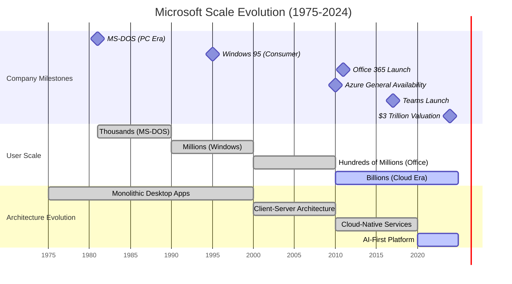

## Architecture Evolution by User Scale

### 1K Users - MS-DOS Era (1981)
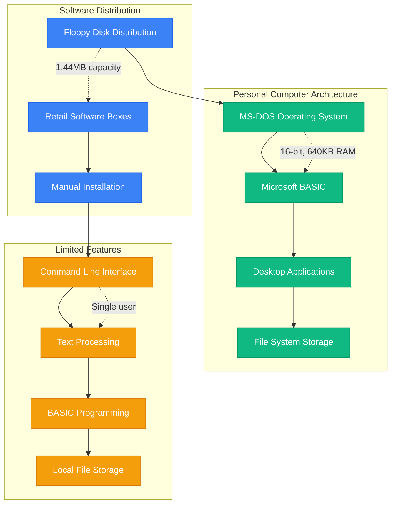

### 100M Users - Windows Era (1995)
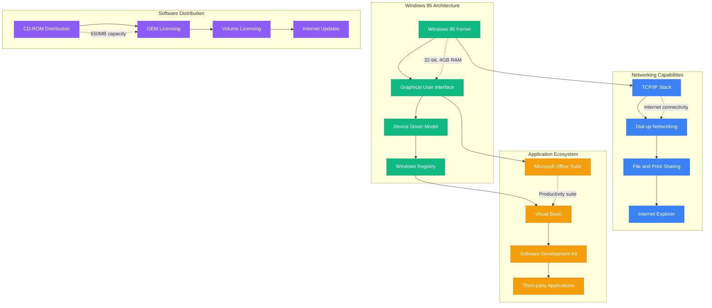

### 1B Users - Cloud Transformation (2011)
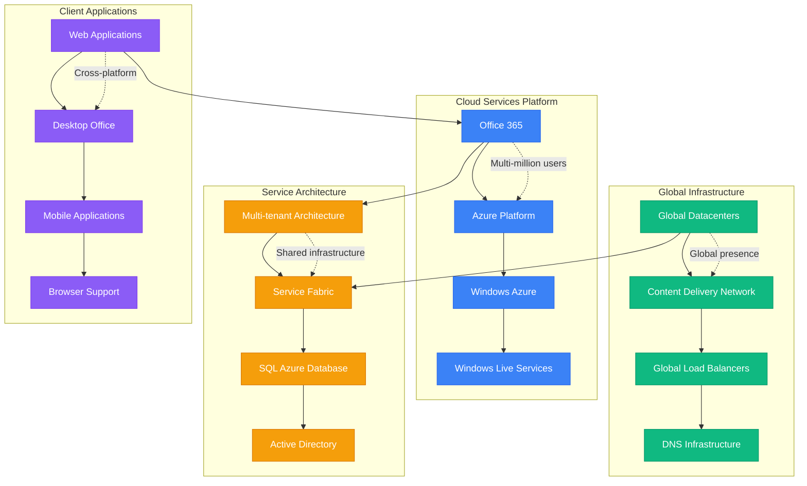

### 3B+ Users - AI-First Era (2024)
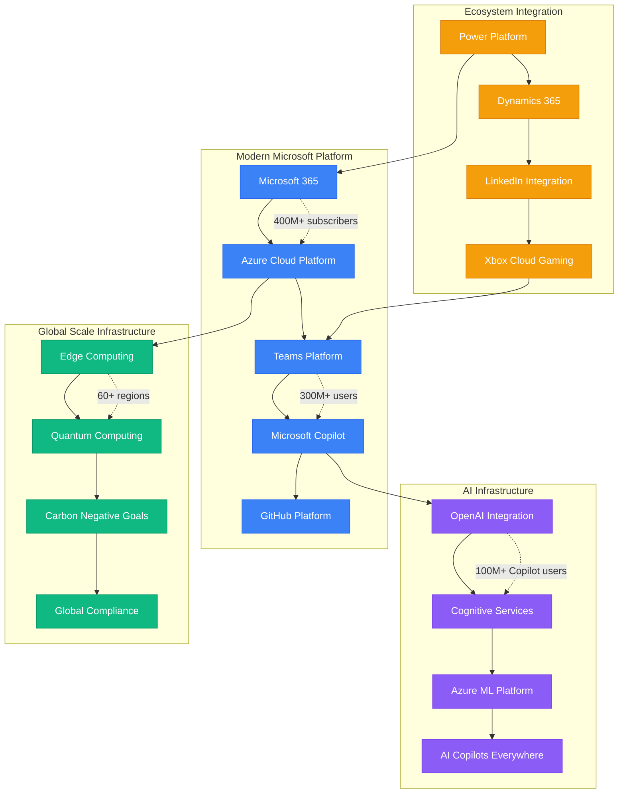

## Technology Stack Evolution

### Programming Language & Framework Evolution
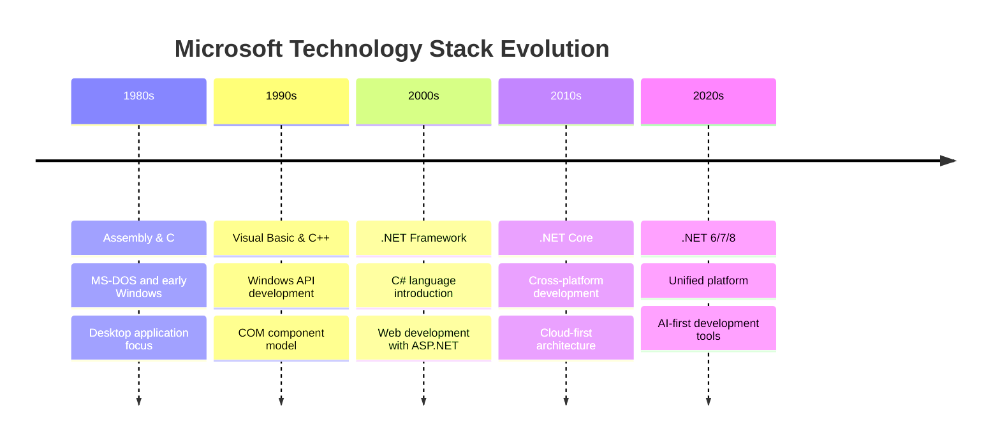

### Database Architecture Evolution
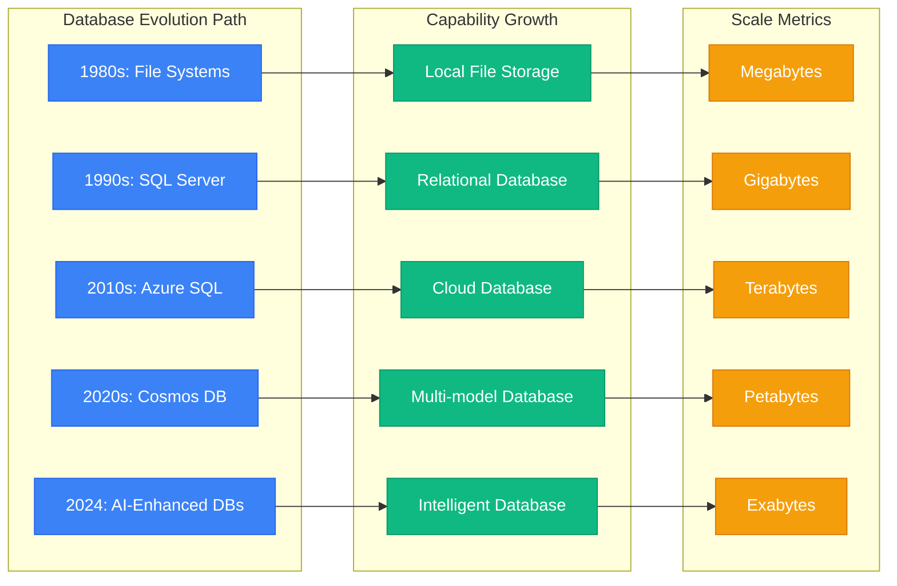

## Revenue and Business Model Evolution

### Revenue Model Transformation (1975-2024)
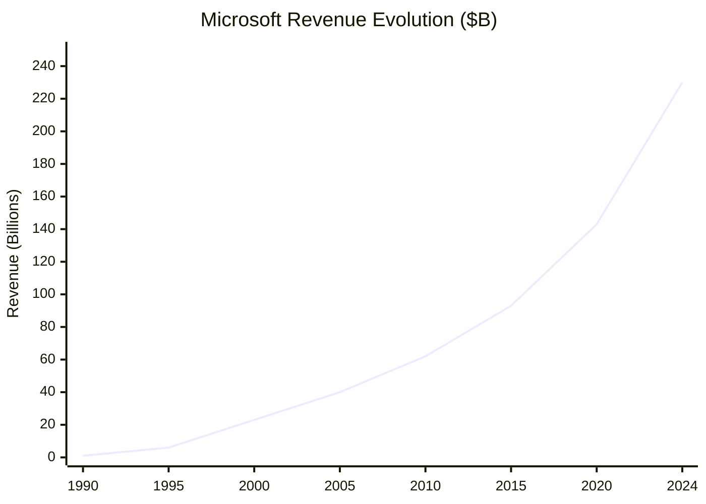

### Business Model Evolution
| Era | Revenue Model | Key Products | Annual Revenue |
|-----|---------------|--------------|----------------|
| 1975-1990 | Software Licensing | MS-DOS, Basic | $1B |
| 1990-2000 | Desktop Software | Windows, Office | $23B |
| 2000-2010 | Enterprise Licensing | Windows Server, SQL | $62B |
| 2010-2020 | Cloud Subscriptions | Office 365, Azure | $143B |
| 2020-2024 | AI-First Platform | Copilot, Azure AI | $230B |

## Customer Segment Evolution

### Market Expansion Strategy
```mermaid
graph TB
    subgraph ConsumerMarket[Consumer Market]
        INDIVIDUALS[Individual Users]
        HOME_OFFICE[Home Office]
        STUDENTS[Students & Education]
        CREATORS[Content Creators]
    end

    subgraph SMBMarket[Small-Medium Business]
        SMALL_BUSINESS[Small Business (1-50)]
        MEDIUM_BUSINESS[Medium Business (50-1000)]
        STARTUPS[Startups & Scale-ups]
        PROFESSIONAL_SERVICES[Professional Services]
    end

    subgraph EnterpriseMarket[Enterprise Market]
        LARGE_ENTERPRISE[Large Enterprise (1000+)]
        GOVERNMENT[Government Agencies]
        HEALTHCARE[Healthcare Organizations]
        FINANCIAL_SERVICES[Financial Services]
    end

    subgraph DeveloperMarket[Developer Market]
        INDIVIDUAL_DEVS[Individual Developers]
        DEV_TEAMS[Development Teams]
        OPEN_SOURCE[Open Source Community]
        ISV_PARTNERS[ISV Partners]
    end

    %% Market progression
    INDIVIDUALS --> SMALL_BUSINESS
    SMALL_BUSINESS --> LARGE_ENTERPRISE
    LARGE_ENTERPRISE --> INDIVIDUAL_DEVS

    %% Cross-segment relationships
    STUDENTS --> PROFESSIONAL_SERVICES
    STARTUPS --> DEV_TEAMS
    GOVERNMENT --> OPEN_SOURCE
    HEALTHCARE --> ISV_PARTNERS

    %% Revenue contribution (2024)
    INDIVIDUALS -.->|"10% revenue"| HOME_OFFICE
    SMALL_BUSINESS -.->|"25% revenue"| MEDIUM_BUSINESS
    LARGE_ENTERPRISE -.->|"55% revenue"| GOVERNMENT
    INDIVIDUAL_DEVS -.->|"10% revenue"| DEV_TEAMS

    classDef consumerStyle fill:#3B82F6,stroke:#2563EB,color:#fff
    classDef smbStyle fill:#10B981,stroke:#059669,color:#fff
    classDef enterpriseStyle fill:#F59E0B,stroke:#D97706,color:#fff
    classDef devStyle fill:#8B5CF6,stroke:#7C3AED,color:#fff

    class INDIVIDUALS,HOME_OFFICE,STUDENTS,CREATORS consumerStyle
    class SMALL_BUSINESS,MEDIUM_BUSINESS,STARTUPS,PROFESSIONAL_SERVICES smbStyle
    class LARGE_ENTERPRISE,GOVERNMENT,HEALTHCARE,FINANCIAL_SERVICES enterpriseStyle
    class INDIVIDUAL_DEVS,DEV_TEAMS,OPEN_SOURCE,ISV_PARTNERS devStyle
```

## Breaking Points and Architectural Transformations

### The 2008 Cloud Transformation Crisis
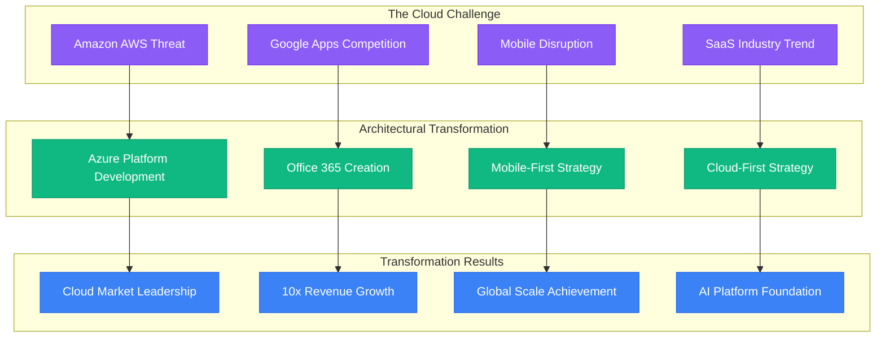

### The 2020 Remote Work Acceleration
- **Challenge**: COVID-19 drove 10x growth in Teams usage overnight
- **Breaking Point**: Existing architecture couldn't handle the scale
- **Solution**: Real-time infrastructure scaling, media optimization
- **Result**: Teams became the collaboration platform standard
- **Learning**: Elastic cloud architecture enables responding to black swan events

### The 2023 AI Revolution
- **Challenge**: OpenAI partnership required integrating GPT models everywhere
- **Breaking Point**: Existing services weren't designed for AI workloads
- **Solution**: Copilot integration across all products, Azure AI infrastructure
- **Result**: Microsoft leads in AI productivity tools
- **Learning**: Platform thinking enables rapid innovation adoption

## Performance Evolution Metrics

### Latency Improvements Over Time
| Metric | 1995 | 2005 | 2015 | 2024 |
|--------|------|------|------|------|
| Application Start | 30s | 10s | 3s | 1s |
| File Save (Office) | 5s | 2s | 500ms | 200ms |
| Web Page Load | 60s | 10s | 2s | 500ms |
| Email Sync | 5min | 30s | 5s | Real-time |
| Video Call Setup | N/A | 30s | 10s | 3s |

### Throughput Evolution
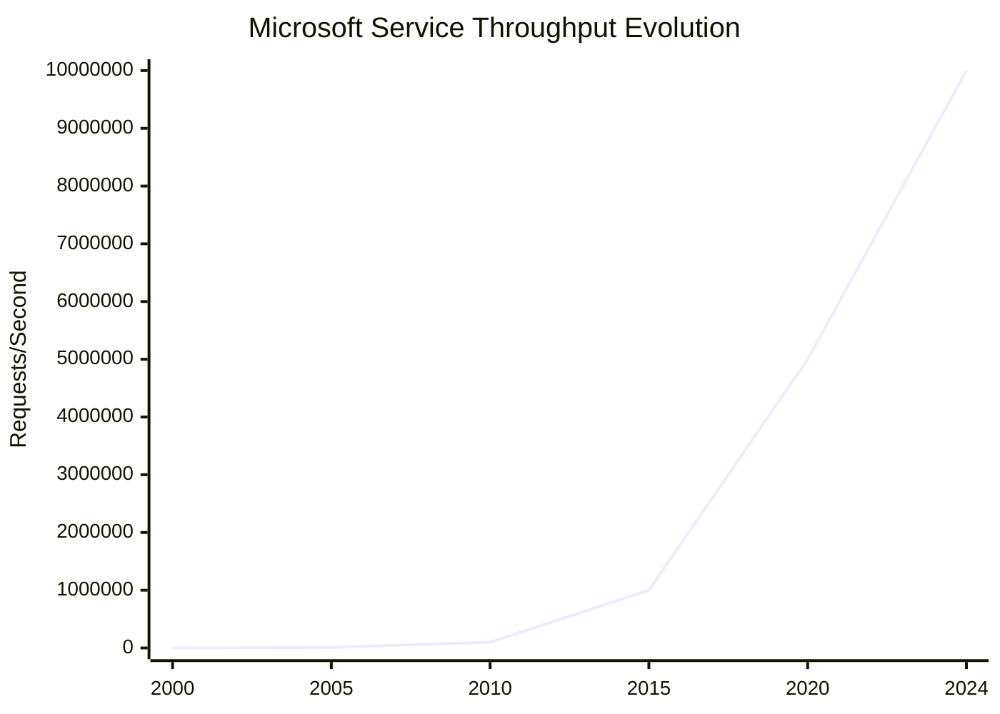

## Architectural Lessons Learned

### Key Scaling Insights
1. **Platform Strategy**: Building platforms creates ecosystems that scale beyond core products
2. **Cloud-First Transformation**: Complete architectural rewrites are sometimes necessary
3. **Backward Compatibility**: Enterprise customers require gradual migration paths
4. **Developer Ecosystem**: Empowering developers multiplies platform value
5. **AI Integration**: Every product benefits from intelligent features

### Technology Bet Outcomes

✅ **Successful Bets**:
- **.NET Framework**: Created cross-platform development ecosystem
- **Azure Cloud Platform**: Achieved #2 cloud market position
- **Office 365 Subscriptions**: Transformed software licensing model
- **Teams Platform**: Became collaboration standard during COVID-19
- **GitHub Acquisition**: Strengthened developer ecosystem

❌ **Failed Experiments**:
- **Windows Phone**: Mobile OS failed to gain market share
- **Kinect Consumer**: Motion sensing didn't sustain consumer interest
- **Internet Explorer**: Lost browser market to Chrome
- **Zune**: Music player couldn't compete with iPod
- **Windows RT**: ARM-based Windows confused market

### The Satya Nadella Transformation (2014-2024)
1. **Culture Change**: From "know-it-all" to "learn-it-all" culture
2. **Cloud First**: Prioritized cloud over legacy Windows business
3. **Platform Thinking**: Built ecosystems instead of just products
4. **Partnership Strategy**: Embraced open source and competitors
5. **AI Leadership**: Partnered with OpenAI for AI transformation

## Cost Efficiency Evolution

### Infrastructure Cost Per User (Monthly)
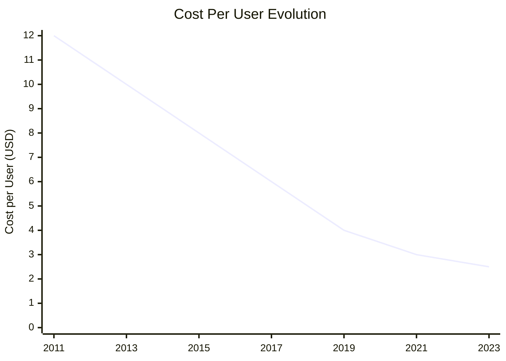

### Scale Economics Achievements
- **Multi-tenancy**: 80% cost reduction through shared infrastructure
- **Global Scale**: Economies of scale reduce per-user costs by 90%
- **Automation**: Infrastructure automation reduces operational costs by 70%
- **AI Optimization**: Machine learning optimizes resource allocation
- **Edge Computing**: Local processing reduces bandwidth costs by 60%

## Future Architecture Direction (2025-2030)

### Next-Generation Platform Strategy
1. **AI-Native Architecture**: Every service built with AI from ground up
2. **Quantum Computing**: Quantum services for cryptography and optimization
3. **Sustainable Computing**: Carbon-negative infrastructure by 2030
4. **Mixed Reality**: Spatial computing platform for metaverse applications
5. **Edge-First Design**: Compute moves closer to users and devices

*"Microsoft's scale evolution demonstrates that even the largest technology companies must continuously reinvent their architecture - the choice is transform or become irrelevant."*

**Sources**: Microsoft Annual Reports, Satya Nadella's "Hit Refresh", Microsoft Engineering Blogs, Azure Architecture Evolution Papers