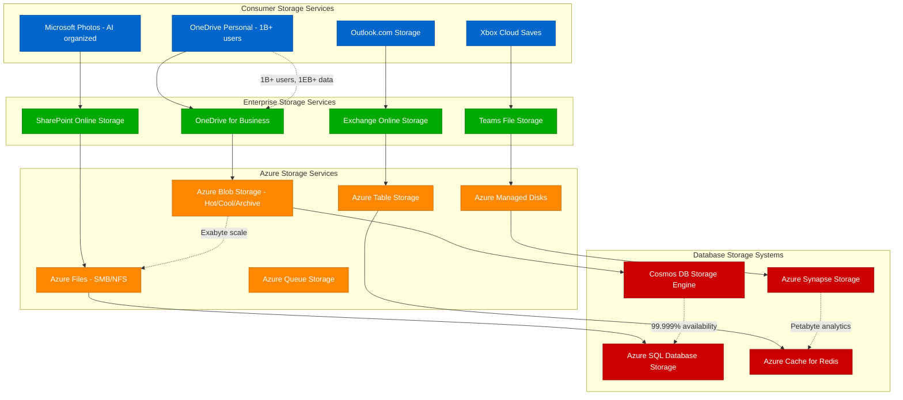
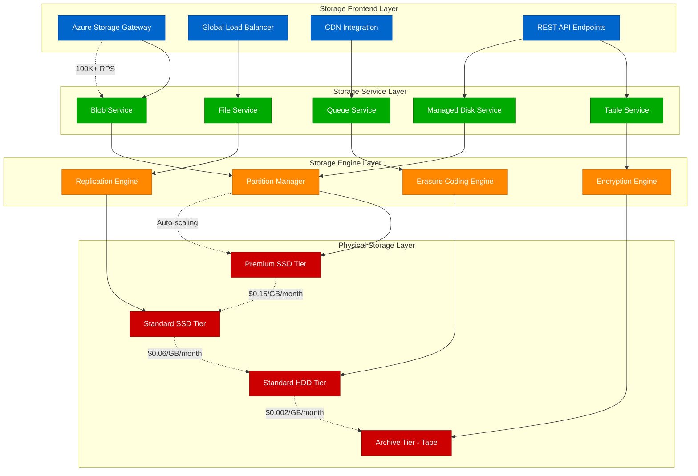
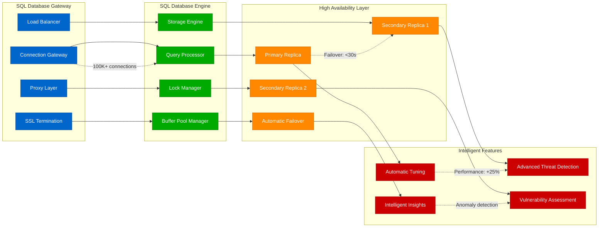
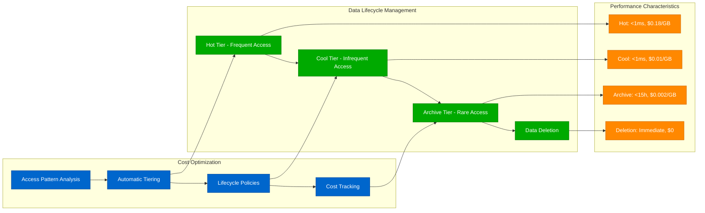
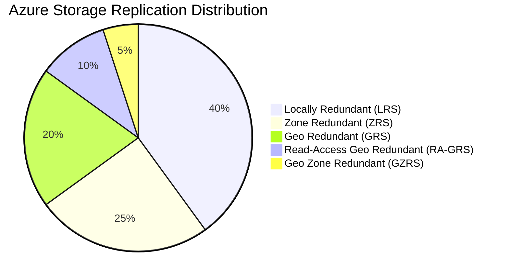
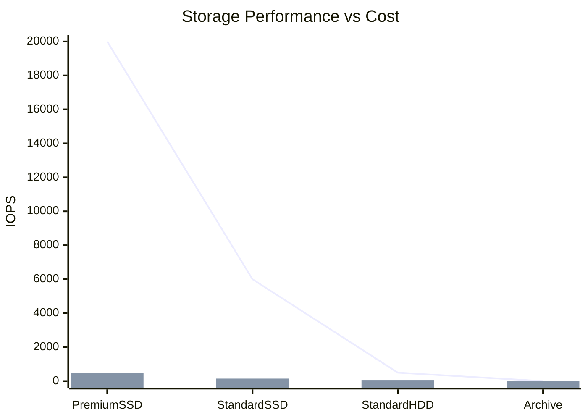
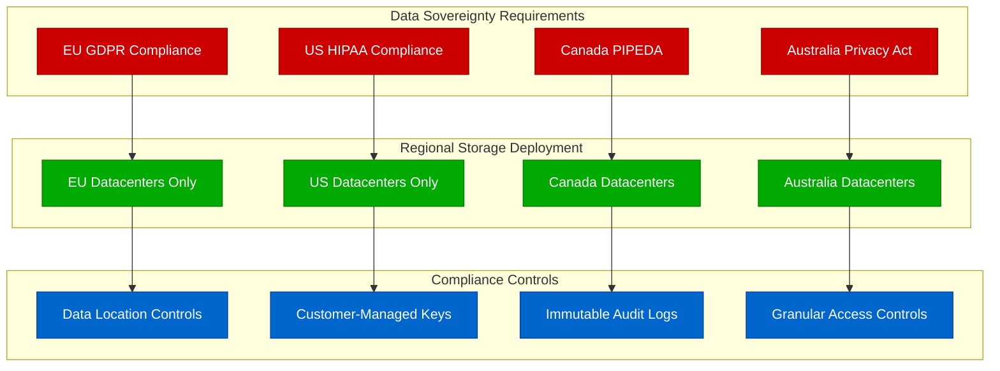

# Microsoft - Storage Architecture

## Global Storage at Exabyte Scale

Microsoft's storage architecture spans from consumer OneDrive to enterprise Azure Storage, handling exabytes of data across multiple consistency models, durability guarantees, and access patterns. The system serves 1B+ OneDrive users while providing 99.999999999% (11 9's) durability for Azure Storage.

## Complete Storage Ecosystem



## Azure Storage Architecture Deep Dive

Azure Storage provides the foundation for all Microsoft cloud storage with multiple service tiers, global distribution, and various consistency models.



## Cosmos DB: Globally Distributed Database

Cosmos DB provides turnkey global distribution with multiple APIs and consistency models for planet-scale applications.

```mermaid
graph TB
    subgraph CosmosAPIs[Cosmos DB API Layer]
        SQL_API[SQL API (Core)]
        MONGODB_API[MongoDB API]
        CASSANDRA_API[Cassandra API]
        GREMLIN_API[Gremlin (Graph) API]
        TABLE_API[Table API]
    end

    subgraph GlobalDistribution[Global Distribution Layer]
        WRITE_REGION[Write Region]
        READ_REGION_1[Read Region 1]
        READ_REGION_2[Read Region 2]
        READ_REGION_3[Read Region 3]
        MULTI_MASTER[Multi-Master Mode]
    end

    subgraph ConsistencyLevels[Consistency Models]
        STRONG[Strong Consistency]
        BOUNDED_STALENESS[Bounded Staleness]
        SESSION[Session Consistency]
        CONSISTENT_PREFIX[Consistent Prefix]
        EVENTUAL[Eventual Consistency]
    end

    subgraph StorageLayer[Cosmos Storage Layer]
        PARTITIONS[Logical Partitions]
        REPLICA_SETS[Physical Replica Sets]
        INDEX_SUBSYSTEM[Automatic Indexing]
        BACKUP_SYSTEM[Continuous Backup]
    end

    %% API to distribution
    SQL_API --> WRITE_REGION
    MONGODB_API --> READ_REGION_1
    CASSANDRA_API --> READ_REGION_2
    GREMLIN_API --> READ_REGION_3
    TABLE_API --> MULTI_MASTER

    %% Distribution to consistency
    WRITE_REGION --> STRONG
    READ_REGION_1 --> BOUNDED_STALENESS
    READ_REGION_2 --> SESSION
    READ_REGION_3 --> CONSISTENT_PREFIX
    MULTI_MASTER --> EVENTUAL

    %% Consistency to storage
    STRONG --> PARTITIONS
    BOUNDED_STALENESS --> REPLICA_SETS
    SESSION --> INDEX_SUBSYSTEM
    CONSISTENT_PREFIX --> BACKUP_SYSTEM
    EVENTUAL --> PARTITIONS

    %% Performance guarantees
    SQL_API -.->|"SLA: <10ms reads"| WRITE_REGION
    WRITE_REGION -.->|"99.999% availability"| STRONG
    PARTITIONS -.->|"Auto-scale: 10K RU/s"| REPLICA_SETS
    INDEX_SUBSYSTEM -.->|"Schema-agnostic"| BACKUP_SYSTEM

    classDef apiStyle fill:#0066CC,stroke:#004499,color:#fff
    classDef distributionStyle fill:#00AA00,stroke:#007700,color:#fff
    classDef consistencyStyle fill:#FF8800,stroke:#CC6600,color:#fff
    classDef storageStyle fill:#CC0000,stroke:#990000,color:#fff

    class SQL_API,MONGODB_API,CASSANDRA_API,GREMLIN_API,TABLE_API apiStyle
    class WRITE_REGION,READ_REGION_1,READ_REGION_2,READ_REGION_3,MULTI_MASTER distributionStyle
    class STRONG,BOUNDED_STALENESS,SESSION,CONSISTENT_PREFIX,EVENTUAL consistencyStyle
    class PARTITIONS,REPLICA_SETS,INDEX_SUBSYSTEM,BACKUP_SYSTEM storageStyle
```

## OneDrive: Consumer & Enterprise File Storage

OneDrive serves over 1 billion users with intelligent sync, AI-powered organization, and enterprise-grade security.

```mermaid
graph TB
    subgraph OneDriveClients[OneDrive Client Applications]
        WINDOWS_CLIENT[Windows OneDrive Client]
        MAC_CLIENT[macOS OneDrive Client]
        MOBILE_APPS[Mobile Apps (iOS/Android)]
        WEB_CLIENT[OneDrive Web]
        OFFICE_INTEGRATION[Office App Integration]
    end

    subgraph SyncEngine[OneDrive Sync Engine]
        BLOCK_SYNC[Block-level Sync]
        DELTA_SYNC[Delta Sync Algorithm]
        CONFLICT_RESOLUTION[Conflict Resolution]
        BANDWIDTH_THROTTLING[Bandwidth Management]
        OFFLINE_SUPPORT[Offline Support]
    end

    subgraph OneDriveServices[OneDrive Backend Services]
        METADATA_SERVICE[Metadata Service]
        SYNC_SERVICE[Sync Orchestration Service]
        SHARING_SERVICE[Sharing & Permissions]
        PREVIEW_SERVICE[File Preview Service]
        SEARCH_SERVICE[AI-powered Search]
    end

    subgraph StorageBackend[Storage Backend]
        AZURE_BLOB_OD[Azure Blob Storage]
        METADATA_DB[Metadata Database]
        CONTENT_INDEX[Content Indexing]
        BACKUP_STORAGE[Backup & Versioning]
    end

    %% Client to sync engine
    WINDOWS_CLIENT --> BLOCK_SYNC
    MAC_CLIENT --> DELTA_SYNC
    MOBILE_APPS --> CONFLICT_RESOLUTION
    WEB_CLIENT --> BANDWIDTH_THROTTLING
    OFFICE_INTEGRATION --> OFFLINE_SUPPORT

    %% Sync engine to services
    BLOCK_SYNC --> METADATA_SERVICE
    DELTA_SYNC --> SYNC_SERVICE
    CONFLICT_RESOLUTION --> SHARING_SERVICE
    BANDWIDTH_THROTTLING --> PREVIEW_SERVICE
    OFFLINE_SUPPORT --> SEARCH_SERVICE

    %% Services to storage
    METADATA_SERVICE --> METADATA_DB
    SYNC_SERVICE --> AZURE_BLOB_OD
    SHARING_SERVICE --> CONTENT_INDEX
    PREVIEW_SERVICE --> BACKUP_STORAGE
    SEARCH_SERVICE --> CONTENT_INDEX

    %% Performance metrics
    BLOCK_SYNC -.->|"Upload: 99% dedup"| METADATA_SERVICE
    SYNC_SERVICE -.->|"Sync: <30s for 1GB"| AZURE_BLOB_OD
    SEARCH_SERVICE -.->|"Search: <1s response"| CONTENT_INDEX
    BACKUP_STORAGE -.->|"Versions: 500 per file"| METADATA_DB

    classDef clientStyle fill:#0066CC,stroke:#004499,color:#fff
    classDef syncStyle fill:#00AA00,stroke:#007700,color:#fff
    classDef serviceStyle fill:#FF8800,stroke:#CC6600,color:#fff
    classDef storageStyle fill:#CC0000,stroke:#990000,color:#fff

    class WINDOWS_CLIENT,MAC_CLIENT,MOBILE_APPS,WEB_CLIENT,OFFICE_INTEGRATION clientStyle
    class BLOCK_SYNC,DELTA_SYNC,CONFLICT_RESOLUTION,BANDWIDTH_THROTTLING,OFFLINE_SUPPORT syncStyle
    class METADATA_SERVICE,SYNC_SERVICE,SHARING_SERVICE,PREVIEW_SERVICE,SEARCH_SERVICE serviceStyle
    class AZURE_BLOB_OD,METADATA_DB,CONTENT_INDEX,BACKUP_STORAGE storageStyle
```

## Azure SQL Database: Managed Database Service

Azure SQL Database provides enterprise-grade database capabilities with automatic scaling, high availability, and built-in intelligence.



## Storage Tier Economics and Lifecycle

### Azure Storage Tier Optimization


## Data Consistency and Durability Models

### Storage Consistency Guarantees by Service
| Service | Consistency Model | Durability | RPO | RTO |
|---------|------------------|------------|-----|-----|
| Azure Blob Storage | Eventual Consistency | 99.999999999% (11 9's) | 0 | <5min |
| Cosmos DB Strong | Linearizability | 99.999% | 0 | <30s |
| Azure SQL Database | ACID Transactions | 99.995% | <5min | <30s |
| OneDrive Personal | Eventual Consistency | 99.9% | <1hr | <1hr |
| Table Storage | Eventual Consistency | 99.999999999% (11 9's) | 0 | <5min |

### Replication Strategies


## Performance Optimization Strategies

### Storage Performance Tiers


### Cost Per GB by Storage Type (Monthly)
- **Premium SSD**: $0.15/GB - Ultra-high performance
- **Standard SSD**: $0.06/GB - Balanced performance
- **Standard HDD**: $0.045/GB - High capacity workloads
- **Cool Blob Storage**: $0.01/GB - Infrequent access
- **Archive Storage**: $0.002/GB - Long-term retention

## Global Distribution and Data Residency

### Data Residency Compliance


## Storage Innovation Highlights

### Key Technology Breakthroughs
1. **Project Silica**: Glass-based storage for millennial data retention
2. **DNA Storage**: Biological storage research for ultimate density
3. **Quantum Storage**: Quantum state storage for quantum computing
4. **AI-Driven Optimization**: Machine learning for automatic tiering
5. **Zero-Knowledge Architecture**: Client-side encryption for privacy

### Cost Optimization Achievements
- **Automatic Tiering**: 60% cost reduction through intelligent data movement
- **Deduplication**: 95% storage savings for OneDrive block-level sync
- **Compression**: 40% reduction through intelligent compression algorithms
- **Erasure Coding**: 50% cost reduction vs traditional replication
- **Lifecycle Management**: 80% cost savings through automated archival

## Production Lessons

### Key Storage Insights
1. **Multi-tier Strategy**: Different access patterns require different storage solutions
2. **Global Distribution**: Data locality is critical for both performance and compliance
3. **Automatic Management**: Manual storage management doesn't scale to exabyte levels
4. **Cost Optimization**: Intelligent tiering can reduce costs by 60%+ without performance impact
5. **Durability vs Cost**: 11 9's durability is achievable but expensive - match requirements to needs

### The OneDrive Exabyte Challenge
- **Problem**: Scaling OneDrive from petabytes to exabytes while maintaining sync performance
- **Solution**: Block-level deduplication, intelligent sync algorithms, global edge caching
- **Result**: 95% reduction in bandwidth usage, sub-30s sync times for large files
- **Learning**: Smart algorithms matter more than raw infrastructure at scale

### Enterprise Storage Requirements
- **Security**: Encryption at rest and in transit, customer-managed keys
- **Compliance**: Data residency, audit trails, immutable logs
- **Performance**: Predictable latency, high IOPS, global availability
- **Cost**: Transparent pricing, automatic optimization, no egress surprises
- **Integration**: Seamless integration with existing enterprise systems

*"Microsoft's storage architecture demonstrates that you can achieve exabyte scale while maintaining enterprise security, compliance, and cost efficiency - but it requires multiple specialized storage systems working together."*

**Sources**: Azure Storage Documentation, OneDrive Engineering Blog, Cosmos DB Research Papers, Azure Architecture Center