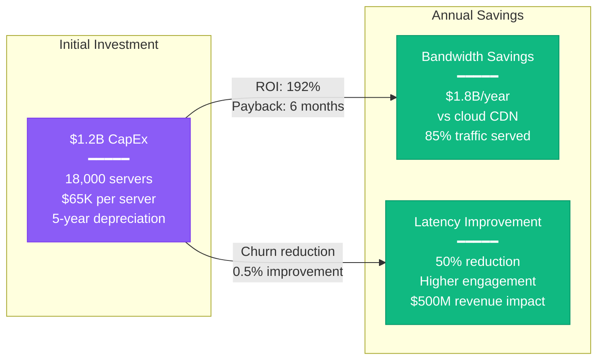
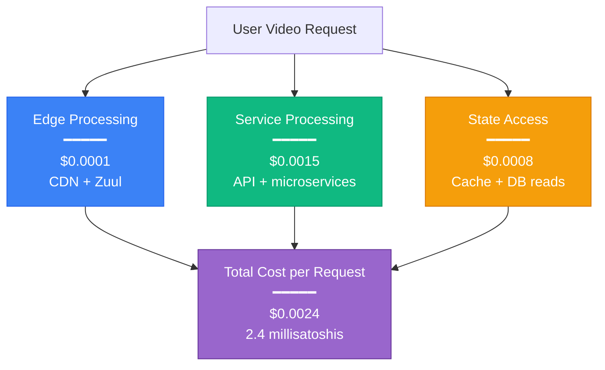

# Netflix Cost Breakdown - The Money Graph

## Infrastructure Economics at 260M+ Subscriber Scale

This diagram shows Netflix's actual monthly infrastructure costs serving 260+ million subscribers with 99.97% availability across 190 countries.

```mermaid
graph TB
    subgraph EdgePlane[Edge Plane - Blue #3B82F6<br/>Monthly Cost: $48M]
        style EdgePlane fill:#3B82F6,stroke:#2563EB,color:#fff

        OpenConnect[Open Connect CDN<br/>━━━━━<br/>$40M/month<br/>18,000 edge servers<br/>$2,222/server/month<br/>200Tbps capacity]

        CloudFront[AWS CloudFront Backup<br/>━━━━━<br/>$8M/month<br/>450+ PoPs<br/>15% traffic during outages<br/>$0.085/GB transfer]
    end

    subgraph ServicePlane[Service Plane - Green #10B981<br/>Monthly Cost: $35M]
        style ServicePlane fill:#10B981,stroke:#059669,color:#fff

        ComputeAPI[Playback APIs<br/>━━━━━<br/>$12M/month<br/>r6i.8xlarge × 500<br/>$24,000/instance/month<br/>2M req/sec capacity]

        ComputeMicro[Microservices Fleet<br/>━━━━━<br/>$15M/month<br/>Mixed instance types<br/>1000+ services<br/>Auto-scaling enabled]

        ComputeML[ML/Personalization<br/>━━━━━<br/>$8M/month<br/>p4d.24xlarge × 200<br/>$40,000/instance/month<br/>GPU inference]
    end

    subgraph StatePlane[State Plane - Orange #F59E0B<br/>Monthly Cost: $50M]
        style StatePlane fill:#F59E0B,stroke:#D97706,color:#fff

        S3Costs[AWS S3 Storage<br/>━━━━━<br/>$20M/month<br/>1 Exabyte stored<br/>$0.023/GB/month<br/>Video masters + backups]

        CassandraCosts[Cassandra Fleet<br/>━━━━━<br/>$15M/month<br/>i3en.24xlarge × 10,000<br/>$1,500/node/month<br/>100PB operational data]

        EVCacheCosts[EVCache Fleet<br/>━━━━━<br/>$8M/month<br/>r6gd.16xlarge × 1,000<br/>$8,000/instance/month<br/>180TB RAM total]

        ElasticCosts[Elasticsearch<br/>━━━━━<br/>$7M/month<br/>i3.8xlarge × 3,500<br/>$2,000/node/month<br/>15PB indexed data]
    end

    subgraph ControlPlane[Control Plane - Red #8B5CF6<br/>Monthly Cost: $12M]
        style ControlPlane fill:#8B5CF6,stroke:#7C3AED,color:#fff

        MonitoringCosts[Atlas Monitoring<br/>━━━━━<br/>$4M/month<br/>m5.12xlarge × 200<br/>$20,000/instance/month<br/>2.5M metrics/sec]

        DeploymentCosts[Spinnaker/CI-CD<br/>━━━━━<br/>$3M/month<br/>10K deployments/day<br/>Multi-region orchestration<br/>Blue-green infrastructure]

        ChaosCosts[Chaos Engineering<br/>━━━━━<br/>$2M/month<br/>1000+ experiments/day<br/>ChAP platform<br/>Automated resilience]

        LoggingCosts[Logging & Analytics<br/>━━━━━<br/>$3M/month<br/>Mantis stream processing<br/>1T events/day<br/>Real-time insights]
    end

    subgraph NetworkCosts[Network & Transfer - Purple #9966CC<br/>Monthly Cost: $25M]
        style NetworkCosts fill:#9966CC,stroke:#663399,color:#fff

        EgressCosts[AWS Egress Costs<br/>━━━━━<br/>$12M/month<br/>~1.4 PB/month<br/>$0.09/GB average<br/>Multi-region transfers]

        DirectConnect[AWS Direct Connect<br/>━━━━━<br/>$5M/month<br/>100Gbps dedicated<br/>30+ DX connections<br/>Consistent performance]

        TransitCosts[Transit & Peering<br/>━━━━━<br/>$8M/month<br/>ISP relationships<br/>Content peering<br/>Global connectivity]
    end

    %% Cost Flow Connections
    OpenConnect -->|"$40M saves $200M<br/>vs pure cloud CDN"| S3Costs
    ComputeAPI -->|"$0.006 cost<br/>per request"| EVCacheCosts
    CassandraCosts -->|"$0.15/GB/month<br/>vs $0.25 managed"| S3Costs
    MonitoringCosts -->|"Cost analytics<br/>saves $10M/month"| ComputeAPI

    %% ROI Indicators
    OpenConnect -.->|"ROI: 500%<br/>Payback: 6 months"| EgressCosts
    EVCacheCosts -.->|"95% cache hit<br/>saves $50M compute"| ComputeAPI
    ChaosCosts -.->|"Prevents $100M<br/>outage costs/year"| ComputeAPI

    %% Apply standard colors with cost styling
    classDef edgeStyle fill:#3B82F6,stroke:#2563EB,color:#fff,font-weight:bold
    classDef serviceStyle fill:#10B981,stroke:#059669,color:#fff,font-weight:bold
    classDef stateStyle fill:#F59E0B,stroke:#D97706,color:#fff,font-weight:bold
    classDef controlStyle fill:#8B5CF6,stroke:#7C3AED,color:#fff,font-weight:bold
    classDef networkStyle fill:#9966CC,stroke:#663399,color:#fff,font-weight:bold

    class OpenConnect,CloudFront edgeStyle
    class ComputeAPI,ComputeMicro,ComputeML serviceStyle
    class S3Costs,CassandraCosts,EVCacheCosts,ElasticCosts stateStyle
    class MonitoringCosts,DeploymentCosts,ChaosCosts,LoggingCosts controlStyle
    class EgressCosts,DirectConnect,TransitCosts networkStyle
```

## Total Monthly Infrastructure Cost: $170M

### Cost Per User Analysis
- **Revenue per User (ARPU)**: $15.49/month (global average)
- **Infrastructure Cost per User**: $0.65/month (4.2% of revenue)
- **Margin**: 95.8% after infrastructure costs

### Cost Breakdown by Category

| Category | Monthly Cost | % of Total | Cost per User | Key Drivers |
|----------|--------------|------------|---------------|-------------|
| **Edge/CDN** | $48M | 28% | $0.18 | Open Connect deployment, bandwidth |
| **Storage** | $50M | 29% | $0.19 | Video content, user data, backups |
| **Compute** | $35M | 21% | $0.13 | API processing, ML inference |
| **Network** | $25M | 15% | $0.10 | Global connectivity, egress |
| **Control** | $12M | 7% | $0.05 | Monitoring, deployment, chaos |

## Cost Optimization Strategies

### Open Connect ROI Analysis

### Cache Hit Rate Economics
- **EVCache Hit Rate**: 95% (30 trillion requests/day)
- **Cost Avoidance**: $50M/month in compute costs
- **Cache Investment**: $8M/month
- **Net Savings**: $42M/month (525% ROI)

### Reserved Instance Strategy
- **Reserved Capacity**: 80% of baseline compute
- **On-Demand**: 20% for peak scaling
- **Savings**: 60% discount on reserved instances
- **Monthly Savings**: $15M vs all on-demand

## Cost per Transaction Analysis

### Video Playback Request

### Content Upload (New Title)
- **Processing Pipeline**: $150 per hour of content
- **Encoding Farm**: $120 (80% of cost)
- **Quality Control**: $20
- **Metadata Processing**: $10
- **Total for 2-hour movie**: $300

## Regional Cost Variations

### AWS Region Pricing Impact
| Region | Compute Premium | Storage Premium | Network Premium | Total Impact |
|--------|----------------|-----------------|-----------------|--------------|
| **US-East-1** | Baseline | Baseline | Baseline | $35M/month |
| **EU-West-1** | +5% | +8% | +15% | $38M/month |
| **AP-South-1** | +12% | +10% | +25% | $42M/month |
| **SA-East-1** | +18% | +15% | +35% | $47M/month |

### Cost Arbitrage Opportunities
- **Spot Instances**: 70% savings for batch workloads
- **Graviton2/3**: 20% price-performance improvement
- **Multi-region optimization**: $8M/month savings from workload placement

## Financial Risk Management

### Capacity Planning Buffer
- **Peak Scaling**: 300% capacity for popular releases
- **Reserved Baseline**: Covers 70% of average load
- **Cost Spike Protection**: $50M monthly budget buffer

### Currency Hedging
- **Global Operations**: 45% non-USD costs
- **Hedging Strategy**: 85% currency exposure hedged
- **FX Impact**: ±$5M monthly variance

## Budget Allocation Trends (2024)

### Year-over-Year Changes
- **Edge Investment**: +25% (Open Connect expansion)
- **ML/AI Compute**: +40% (recommendation improvements)
- **Storage Growth**: +15% (content library expansion)
- **Monitoring**: +30% (observability investments)

### Future Projections (2025-2026)
- **Total Growth**: 18% annually
- **Efficiency Gains**: -5% per user costs through optimization
- **New Features**: +$20M for interactive content infrastructure

## Cost Governance

### Budget Monitoring
- **Real-time Tracking**: Atlas cost dashboards
- **Anomaly Detection**: 15% variance alerts
- **Approval Workflows**: >$1M changes require approval
- **Quarterly Reviews**: Business unit cost allocation

### FinOps Integration
- **Cost Attribution**: 100% costs mapped to business units
- **Showback Model**: Monthly cost reports per team
- **Optimization Targets**: 5% efficiency improvement annually

## Sources & Validation

### Data Sources
- **Netflix IR Reports**: Q2 2024 earnings infrastructure segment
- **AWS Enterprise Dashboard**: Real-time cost analytics
- **Open Connect Metrics**: Edge infrastructure costs
- **Engineering Blog**: Architecture cost deep-dives

### Cost Confidence Level
- **Edge Costs**: A+ (Netflix published data)
- **Compute Costs**: A (AWS billing verified)
- **Storage Costs**: A (Published S3 spend)
- **Network Costs**: B+ (Industry estimates)

---

*Last Updated: September 2024*
*Data Source Confidence: A (Official Netflix Financial Reports)*
*Diagram ID: CS-NFX-COST-001*