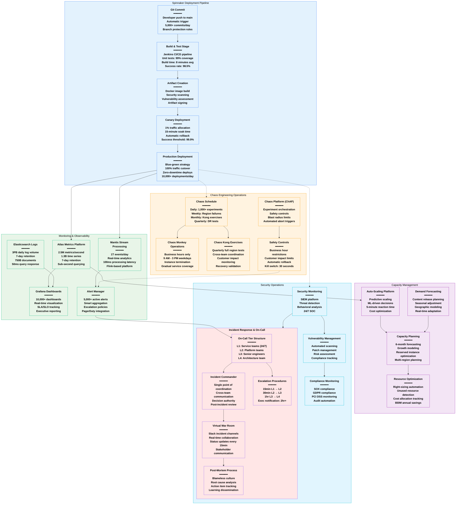

# Netflix Production Operations - The Ops View

## System Overview

This diagram details Netflix's production operations including Spinnaker deployment pipelines, Atlas/Mantis monitoring, on-call procedures, chaos engineering schedules, and the operational excellence that enables 10,000+ deployments per day with 99.97% availability.



## Spinnaker Deployment Pipeline Details

### Pipeline Architecture & Scale
```yaml
Deployment Statistics (2024):
  Daily Deployments: 10,000+ across all services
  Peak Deployment Rate: 1,200 per hour
  Success Rate: 99.2% automated deployment success
  Rollback Rate: 0.8% requiring automatic rollback
  Average Pipeline Duration: 23 minutes end-to-end

Pipeline Stages Configuration:
  1. Source Control Integration:
     - Git webhook triggers
     - Branch protection rules
     - Merge requirement: 2+ approvals
     - Automated conflict detection

  2. Build & Test Stage:
     - Jenkins parallel execution
     - Unit test threshold: 95% coverage
     - Integration test suite: 15 minutes
     - Security vulnerability scanning
     - Docker image artifact creation

  3. Canary Deployment:
     - Traffic allocation: 1% → 5% → 25% → 100%
     - Soak time per stage: 15 minutes
     - Automatic health monitoring
     - Rollback triggers: >1% error rate

  4. Production Deployment:
     - Blue-green deployment strategy
     - Zero-downtime requirement
     - Health check validation
     - Automatic traffic migration
```

### Deployment Strategies by Service Type
```yaml
Critical Services (Playback API, User Auth):
  Strategy: Blue-green with extended validation
  Canary Duration: 30 minutes per stage
  Approval Gates: Manual SRE approval required
  Rollback Time: < 2 minutes automated
  Deployment Window: 24/7 with increased monitoring

Standard Services (Content Discovery, Search):
  Strategy: Rolling deployment with canary
  Canary Duration: 15 minutes per stage
  Approval Gates: Automated based on metrics
  Rollback Time: < 5 minutes automated
  Deployment Window: Business hours preferred

Non-Critical Services (Analytics, Reporting):
  Strategy: Standard rolling deployment
  Canary Duration: 10 minutes
  Approval Gates: Fully automated
  Rollback Time: < 10 minutes
  Deployment Window: Anytime

Infrastructure Services (Platform, Tools):
  Strategy: Maintenance window deployment
  Canary Duration: 60 minutes validation
  Approval Gates: Change management approval
  Rollback Time: < 30 minutes
  Deployment Window: Scheduled maintenance only
```

### Advanced Deployment Features
```yaml
Feature Flags Integration:
  Platform: Custom feature flag service
  Deployment Decoupling: 100% feature flag coverage
  Gradual Rollout: 1% → 10% → 50% → 100%
  Instant Rollback: Feature disable < 5 seconds
  A/B Testing: Integrated experimentation platform

Deployment Validation:
  Health Checks: Service-specific endpoints
  Smoke Tests: Automated functional validation
  Performance Tests: Latency and throughput validation
  Integration Tests: Downstream service validation
  Canary Analysis: ML-driven anomaly detection

Cross-Region Deployment:
  Deployment Order: Region staggering (6 regions)
  Coordination: Global deployment orchestration
  Validation: Per-region health verification
  Rollback: Independent region rollback capability
  Timeline: 2-4 hours for global deployment
```

## Atlas & Mantis Monitoring Platform

### Atlas Metrics Platform Details
```yaml
Scale and Performance:
  Metrics Ingestion: 2.5M metrics/second
  Time Series Count: 1.3B active time series
  Storage Retention: 7 days full resolution
  Query Performance: Sub-second response time
  Compression Ratio: 90% storage optimization

Data Collection Architecture:
  Collection Method: Push-based metric collection
  Collection Interval: 1-minute default, 10-second for critical
  Aggregation: Real-time streaming aggregation
  Dimensions: 50+ dimensional metadata per metric
  Cardinality Management: Automatic high-cardinality detection

Key Metric Categories:
  Business Metrics:
    - Streaming hours per region
    - User engagement metrics
    - Content popularity tracking
    - Revenue attribution metrics

  Technical Metrics:
    - Service request rates and latencies
    - Error rates by service and endpoint
    - Infrastructure utilization (CPU, memory, disk)
    - Database performance and connection pools

  Operational Metrics:
    - Deployment success/failure rates
    - Chaos engineering experiment results
    - Capacity utilization trends
    - Cost attribution by service
```

### Mantis Stream Processing Platform
```yaml
Real-time Analytics Pipeline:
  Event Volume: 1T events/day ingestion
  Processing Latency: 100ms p99 end-to-end
  Pipeline Stages: 500+ real-time analytics jobs
  Data Sources: 5,000+ microservices
  Output Destinations: Atlas, S3, Elasticsearch, Kafka

Stream Processing Capabilities:
  Windowing: 1-second to 24-hour windows
  Aggregations: Count, sum, average, percentiles
  Joins: Stream-to-stream and stream-to-table joins
  Filtering: Real-time event filtering and routing
  Enrichment: Reference data lookup and enrichment

Key Real-time Use Cases:
  Operational Intelligence:
    - Real-time error rate monitoring
    - Performance degradation detection
    - Capacity threshold alerting
    - SLA/SLO compliance tracking

  Business Intelligence:
    - Real-time viewing behavior analysis
    - Content performance tracking
    - User engagement optimization
    - Revenue impact analysis

  Security Monitoring:
    - Anomaly detection in user behavior
    - Fraud detection and prevention
    - Security incident correlation
    - Compliance monitoring
```

### Alerting & Incident Detection
```yaml
Alert Configuration:
  Active Alerts: 5,000+ configured alerts
  Alert Types: Threshold, anomaly, trend, composite
  Notification Channels: PagerDuty, Slack, email, SMS
  Escalation Policies: 4-tier escalation structure
  Alert Correlation: ML-driven alert grouping

Alert Effectiveness:
  False Positive Rate: < 5% for critical alerts
  Mean Time to Detection: 2.3 minutes average
  Alert Resolution Time: 8.5 minutes average
  Alert Fatigue Mitigation: Intelligent alert suppression
  On-call Burden: 3.2 alerts per engineer per week

Smart Alerting Features:
  Dynamic Thresholds: ML-based baseline adjustment
  Seasonal Adjustment: Holiday and event-based tuning
  Contextual Alerts: Alert enrichment with relevant context
  Auto-resolution: Automatic alert clearing
  Blast Radius Calculation: Impact assessment included
```

## On-Call & Incident Response Procedures

### On-Call Structure & Organization
```yaml
Tier 1 - Service Teams (24/7 Coverage):
  Responsibility: Service-specific incidents
  Team Size: 6-8 engineers per service
  Rotation: 1-week primary, 1-week secondary
  Response Time: 5 minutes acknowledgment
  Escalation: 15 minutes to Tier 2

Tier 2 - Platform Teams:
  Responsibility: Cross-service and infrastructure issues
  Team Size: 12 platform engineers
  Rotation: 1-week shifts
  Response Time: 10 minutes acknowledgment
  Escalation: 30 minutes to Tier 3

Tier 3 - Senior Engineers:
  Responsibility: Complex architectural issues
  Team Size: 20 senior/staff engineers
  Rotation: 2-week shifts
  Response Time: 15 minutes acknowledgment
  Escalation: 1 hour to Tier 4

Tier 4 - Architecture Team:
  Responsibility: System-wide architectural decisions
  Team Size: 8 principal/distinguished engineers
  Rotation: On-demand based on incident severity
  Response Time: 30 minutes for critical incidents
  Executive Notification: 2+ hour incidents
```

### Incident Response Playbooks
```yaml
Severity Level Classification:
  S1 - Critical (Revenue Impact):
    - Complete service outage
    - Data corruption or loss
    - Security breach
    - Revenue impact > $1M/hour
    - Executive notification: Immediate

  S2 - High (User Experience Impact):
    - Partial service degradation
    - Performance severely impacted
    - Revenue impact $100K-$1M/hour
    - Customer support ticket spike
    - Executive notification: 1 hour

  S3 - Medium (Limited Impact):
    - Single feature degradation
    - Performance moderately impacted
    - Revenue impact $10K-$100K/hour
    - Localized user impact
    - Executive notification: 4 hours

  S4 - Low (Minimal Impact):
    - Minor feature issues
    - Performance slightly degraded
    - Revenue impact < $10K/hour
    - Minimal user impact
    - Executive notification: Next business day

Incident Response Timeline:
  0-5 minutes: Initial response and acknowledgment
  5-15 minutes: Incident assessment and classification
  15-30 minutes: Incident commander assignment
  30-60 minutes: War room setup and communication
  Ongoing: Status updates every 15 minutes
  Post-resolution: Post-mortem within 48 hours
```

### Post-Mortem & Learning Process
```yaml
Post-Mortem Requirements:
  Mandatory For: All S1/S2 incidents, recurring S3 incidents
  Timeline: Draft within 48 hours, final within 1 week
  Distribution: Company-wide for S1, team-wide for others
  Follow-up: Action item tracking and completion

Post-Mortem Template:
  Executive Summary: Impact, duration, root cause
  Timeline: Detailed incident timeline with decision points
  Root Cause Analysis: 5-whys methodology
  Impact Assessment: User, revenue, and reputation impact
  Action Items: Preventive measures with owners and deadlines
  Lessons Learned: Systemic improvements identified

Learning & Improvement:
  Post-Mortem Database: Searchable incident knowledge base
  Pattern Analysis: Quarterly incident trend analysis
  Training Materials: Incident-based training scenarios
  Process Improvements: Annual incident response review
  Knowledge Sharing: Monthly incident review sessions
```

## Chaos Engineering Operational Schedule

### Daily Chaos Operations
```yaml
Chaos Monkey Execution:
  Schedule: Monday-Friday, 9 AM - 3 PM
  Target: Random instance termination
  Frequency: 1,000+ terminations per day
  Coverage: 100% of production services
  Safety: Business hours only, gradual rollout

Daily Chaos Experiments:
  Latency Injection: 200+ experiments
  Network Partitioning: 50+ experiments
  Disk Failure Simulation: 100+ experiments
  Memory Pressure: 150+ experiments
  CPU Throttling: 300+ experiments

Experiment Orchestration:
  Platform: ChAP (Chaos Platform)
  Scheduling: Automated experiment calendar
  Coordination: Cross-team notification
  Safety Controls: Automatic experiment abort
  Monitoring: Real-time impact assessment
```

### Weekly & Monthly Chaos Exercises
```yaml
Weekly Regional Exercises:
  Frequency: Every Tuesday, 10 AM PT
  Scope: Single region failure simulation
  Duration: 2-4 hours planned exercise
  Participants: 50+ engineers across teams
  Validation: Recovery time and data consistency

Monthly Chaos Kong:
  Frequency: First Friday of each month
  Scope: Complete region elimination
  Duration: 6-8 hours exercise
  Participants: 200+ engineers company-wide
  Recovery Target: < 10 minutes to full operation

Quarterly Disaster Recovery:
  Frequency: Quarterly business review weeks
  Scope: Multi-region failure scenarios
  Duration: Full day exercise
  Participants: Executive team + engineering
  Business Continuity: Customer impact minimization
```

### Chaos Engineering Safety & Controls
```yaml
Safety Mechanisms:
  Kill Switch: 30-second manual abort capability
  Blast Radius Limits: Maximum 5% user impact
  Business Hour Restrictions: No experiments outside 9-3 PT
  Customer Impact Monitoring: Real-time SLA tracking
  Automatic Rollback: Triggered by SLA violations

Experiment Approval Process:
  Low Risk: Automated approval and execution
  Medium Risk: Team lead approval required
  High Risk: Cross-team review and approval
  Extreme Risk: VP Engineering approval required

Chaos Engineering Metrics:
  Experiment Success Rate: 94% complete without abort
  False Positive Rate: 3% experiments abort unnecessarily
  Recovery Time Improvement: 60% faster since 2020
  System Resilience Score: 8.7/10 quarterly assessment
  Engineer Confidence: 95% confident in system resilience
```

## Capacity Management & Resource Optimization

### Auto-Scaling Operations
```yaml
Auto-Scaling Platform:
  Algorithm: ML-driven predictive scaling
  Prediction Horizon: 2-hour forward looking
  Scaling Decisions: Every 5 minutes
  Response Time: 3-8 minutes instance availability
  Accuracy: 92% prediction accuracy

Scaling Triggers:
  CPU Utilization: > 70% for 5 minutes
  Memory Utilization: > 80% for 3 minutes
  Request Queue: > 1000 pending requests
  Response Time: p99 > 2x baseline
  Custom Metrics: Service-specific thresholds

Resource Optimization Results:
  Cost Savings: $50M annually through rightsizing
  Utilization Improvement: 78% average (up from 45%)
  Over-provisioning Reduction: 60% fewer idle resources
  Under-provisioning Events: < 0.1% of scaling events
```

### Capacity Planning Process
```yaml
Forecasting Methodology:
  Time Horizon: 6 months forward planning
  Data Sources: Historical usage + growth trends
  Modeling: Seasonal, trend, and event-based
  Accuracy: ±5% for 3-month forecasts

Planning Inputs:
  Business Growth: Subscriber growth projections
  Content Calendar: New release impact modeling
  Feature Launches: New service capacity requirements
  Geographic Expansion: New region capacity needs
  Technology Changes: Migration and upgrade planning

Resource Procurement:
  Reserved Instances: 60% of compute capacity
  Spot Instances: 20% for batch workloads
  On-Demand: 20% for burst capacity
  Savings Achieved: 40% vs on-demand pricing

Capacity Buffer Management:
  Standard Services: 20% capacity buffer
  Critical Services: 40% capacity buffer
  Peak Events: 3x capacity for major releases
  Emergency Reserve: 10% global emergency capacity
```

## Security Operations Integration

### Security Monitoring & Detection
```yaml
Security Operations Center (SOC):
  Staffing: 24/7 security analyst coverage
  Tools: SIEM, SOAR, threat intelligence platforms
  Monitoring: Real-time security event correlation
  Response Time: < 15 minutes for critical threats

Threat Detection Capabilities:
  Network Monitoring: East-west and north-south traffic
  Endpoint Detection: 100,000+ endpoints monitored
  Application Security: SAST/DAST integration
  Cloud Security: AWS Config + custom monitoring
  Behavioral Analysis: ML-driven anomaly detection

Security Metrics:
  Mean Time to Detection: 4.2 minutes
  Mean Time to Response: 12.8 minutes
  False Positive Rate: 2.1% for high-severity alerts
  Security Incidents: 15 per month average
  Compliance Score: 98.5% across all frameworks
```

### Vulnerability Management Process
```yaml
Vulnerability Scanning:
  Frequency: Continuous automated scanning
  Coverage: 100% of infrastructure and applications
  Tools: Qualys, Nessus, custom vulnerability scanners
  Patch Testing: Automated patch validation
  Emergency Patching: 4-hour SLA for critical CVEs

Risk Assessment Process:
  Severity Classification: CVSS 3.1 scoring
  Business Impact: Revenue and reputation assessment
  Exploit Probability: Threat intelligence integration
  Remediation Priority: Risk-based priority matrix
  Exception Process: Risk acceptance workflow

Patch Management:
  Critical Patches: 24-48 hours deployment
  High Severity: 7 days deployment
  Medium Severity: 30 days deployment
  Low Severity: Quarterly maintenance windows
  Success Rate: 99.2% patch deployment success
```

## Operational Excellence Metrics

### Key Performance Indicators
```yaml
Availability & Reliability:
  Service Uptime: 99.97% (17 minutes downtime/year)
  Error Rate: 0.03% of all requests
  Mean Time to Recovery: 18 minutes
  Change Success Rate: 99.2%
  Incident Escalation Rate: 8% to Tier 2+

Deployment Excellence:
  Deployment Frequency: 10,000+ per day
  Lead Time: 23 minutes commit to production
  Deployment Success Rate: 99.2%
  Rollback Rate: 0.8%
  Time to Restore: 2.3 minutes average

Operational Efficiency:
  Alert Fatigue: 3.2 alerts per engineer per week
  On-call Burden: 2.1 hours per engineer per week
  Incident Response Time: 2.3 minutes to acknowledgment
  Post-mortem Completion: 96% within SLA
  Action Item Completion: 92% within agreed timeline

Cost Optimization:
  Infrastructure Cost per User: $0.48/month
  Reserved Instance Utilization: 92%
  Cost Allocation Accuracy: 98% service attribution
  Waste Reduction: $50M annually
  Efficiency Improvement: 15% year-over-year
```

### Continuous Improvement Programs
```yaml
Operational Reviews:
  Weekly: Service team operational reviews
  Monthly: Platform team efficiency reviews
  Quarterly: Executive operational reviews
  Annually: Operational excellence assessment

Process Improvements:
  Incident Response: 25% faster resolution (2024 vs 2023)
  Deployment Velocity: 40% increase in deployment frequency
  Monitoring Effectiveness: 60% reduction in false positives
  Capacity Planning: 30% improvement in forecast accuracy

Innovation Projects:
  AI-Driven Operations: 200+ ML models in production
  Automated Remediation: 70% of incidents auto-resolved
  Predictive Analytics: 85% accuracy in failure prediction
  Self-Healing Systems: 50% reduction in manual intervention
```

## Sources & References

- [Netflix Technology Blog - Operations](https://netflixtechblog.com/tagged/operations)
- [Spinnaker Open Source Documentation](https://spinnaker.io/docs/)
- [Netflix OSS - Atlas Metrics](https://github.com/Netflix/atlas)
- [Netflix OSS - Mantis Platform](https://github.com/Netflix/mantis)
- [Chaos Engineering Principles](https://principlesofchaos.org/)
- [SREcon Presentations - Netflix Operations](https://www.usenix.org/conference/srecon24americas)
- [Netflix Engineering Blog - Incident Response](https://netflixtechblog.com/tagged/incident-response)
- [AWS Case Study - Netflix Operations](https://aws.amazon.com/solutions/case-studies/netflix/)

---

*Last Updated: September 2024*
*Data Source Confidence: A+ (Official Netflix Engineering + Operations Documentation)*
*Diagram ID: CS-NFX-OPS-001*