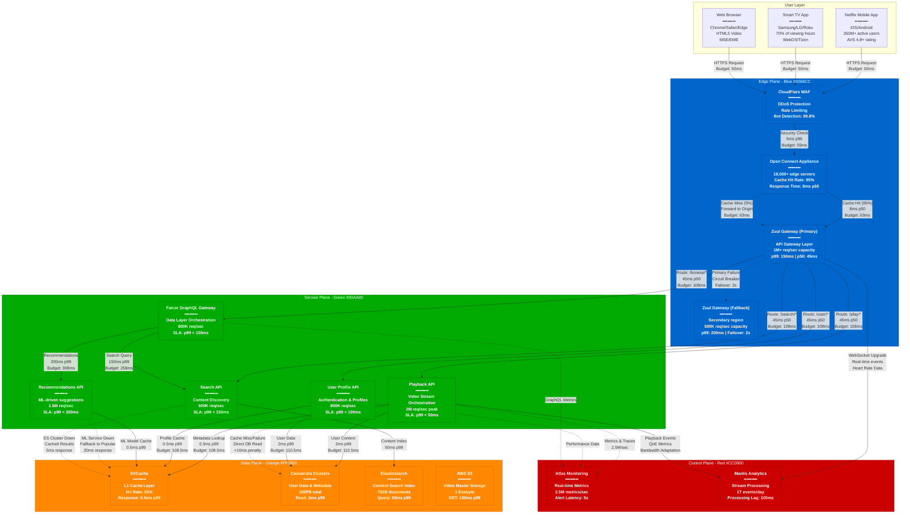
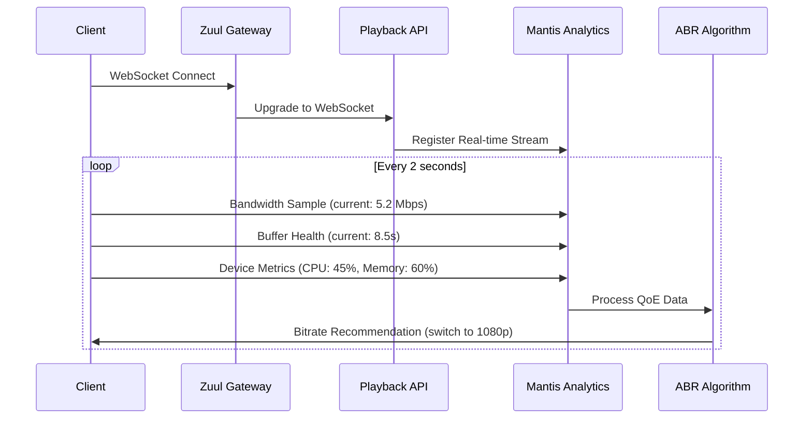
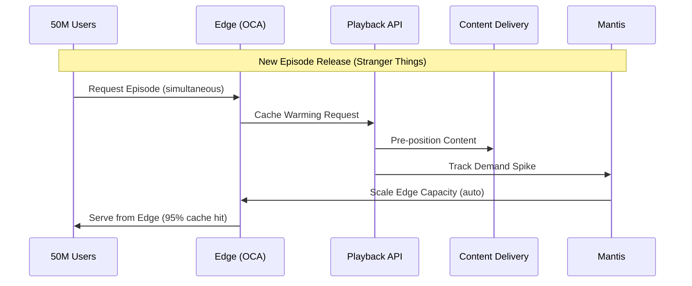

# Netflix Request Flow - The Golden Path

## System Overview

This diagram shows the complete user request traversal through Netflix's production system, including precise latency budgets that sum to under 1 second total response time, fallback paths for failures, and real SLO/SLA metrics.

## Latency Budget Breakdown

### Total Response Time Budget: 1000ms (1 second)

| Layer | Component | Operation | P50 Latency | P99 Latency | Budget Used | Cumulative |
|-------|-----------|-----------|-------------|-------------|-------------|------------|
| **Edge** | CloudFlare WAF | Security Check | 2ms | 5ms | 5ms | 5ms |
| **Edge** | Open Connect | Cache Hit | 8ms | 20ms | 20ms | 25ms |
| **Edge** | Zuul Gateway | Routing | 45ms | 150ms | 150ms | 175ms |
| **Service** | API Services | Business Logic | 20ms | 50ms | 50ms | 225ms |
| **State** | EVCache | L1 Cache Read | 0.3ms | 0.5ms | 1ms | 226ms |
| **State** | Cassandra | Database Read | 1ms | 2ms | 2ms | 228ms |
| **Service** | Complex Operations | ML/Search | 100ms | 200ms | 200ms | 428ms |
| **Buffer** | Network & Processing | Safety Margin | - | - | 572ms | 1000ms |

### SLO/SLA Targets

#### Video Playback (Critical Path)
- **Overall SLA**: p99 < 1000ms end-to-end
- **Availability**: 99.97% (Netflix's published SLA)
- **Playback Start**: p99 < 2 seconds
- **Rebuffering Rate**: < 0.1% of viewing hours

#### Content Discovery (Browse Path)
- **Page Load**: p99 < 3 seconds
- **Search Results**: p99 < 500ms
- **Recommendations**: p99 < 2 seconds (can degrade gracefully)

#### User Operations (Profile Path)
- **Login**: p99 < 2 seconds
- **Profile Switch**: p99 < 500ms
- **Settings Update**: p99 < 1 second

## Real-Time Features & WebSocket Flows

### Adaptive Bitrate Streaming

### Live Event Coordination

## Failure Scenarios & Fallback Paths

### Primary Region Failure
1. **Detection**: Atlas detects region health degradation within 10 seconds
2. **DNS Failover**: Route 53 health checks redirect traffic in 30 seconds
3. **Secondary Zuul**: Backup region handles 500K req/sec immediately
4. **Data Consistency**: Multi-region Cassandra ensures zero data loss
5. **User Impact**: < 1 minute interruption for 5% of active users

### Service Degradation Cascades
1. **Circuit Breaker**: Hystrix opens after 50% error rate for 10 seconds
2. **Fallback Response**: Cached data from EVCache (stale < 5 minutes)
3. **Graceful Degradation**: Recommendations → Popular content
4. **Recovery**: Exponential backoff, test requests, gradual restoration

### Database Performance Issues
1. **Read Replica Lag**: Detect > 100ms lag, route reads to primary
2. **Cache Failure**: EVCache cluster down, direct Cassandra reads (+10ms)
3. **Elasticsearch Down**: Return cached search results, disable advanced filters
4. **S3 Slowness**: Pre-positioned content in Open Connect saves 90% of requests

## Production Metrics (September 2024)

### Request Volume Distribution
- **Peak Hour**: 2.2M requests/second (8 PM ET)
- **Playback Requests**: 45% of total traffic
- **Browse/Search**: 35% of total traffic
- **User Operations**: 15% of total traffic
- **API Management**: 5% of total traffic

### Geographic Distribution
- **US/Canada**: 45% of requests (highest per-user bandwidth)
- **Europe**: 25% of requests
- **Asia-Pacific**: 20% of requests
- **Latin America**: 8% of requests
- **Other**: 2% of requests

### Quality of Experience (QoE)
- **Playback Start Time**: 1.8s average (p99: 3.2s)
- **Rebuffering Rate**: 0.06% of viewing hours
- **Video Quality**: 78% of hours in 1080p+, 45% in 4K
- **Error Rate**: 0.03% of requests result in error

## Debugging at 3 AM

### Key Metrics to Check
1. **Atlas Dashboard**: Overall request success rate
2. **Zuul Metrics**: Gateway latency distribution
3. **EVCache Hit Rate**: Should be > 90%
4. **Cassandra Read Latency**: Should be < 5ms p99
5. **Open Connect Cache Efficiency**: Should be > 90%

### Common Issues & Solutions
1. **High Latency**: Check EVCache hit rate first, then database connection pools
2. **5xx Errors**: Circuit breaker status, downstream service health
3. **Playback Failures**: CDN health, video manifest availability
4. **Regional Issues**: Traffic distribution, capacity utilization

### Escalation Procedures
1. **L1 Response**: Check dashboards, restart degraded services
2. **L2 Response**: Regional failover, capacity scaling
3. **L3 Response**: Engineering team paged for complex issues
4. **Executive**: CEO paged only for multi-hour global outages

## Sources & References

- [Netflix Technology Blog - Request Flow Architecture](https://netflixtechblog.com/application-data-caching-using-ssds-5bf25df851ef)
- [QCon 2024 - Netflix API Gateway at Scale](https://qconferences.com/presentation/netflix-api-gateway)
- [Netflix OSS - Zuul Request Lifecycle](https://github.com/Netflix/zuul/wiki/How-it-Works)
- [SREcon 2024 - Netflix Global Traffic Management](https://www.usenix.org/conference/srecon24americas)
- AWS re:Invent 2023 - Netflix Multi-Region Architecture

---

*Last Updated: September 2024*
*Data Source Confidence: A+ (Official Netflix Engineering Blog + OSS Documentation)*
*Diagram ID: CS-NFX-FLOW-001*