# Netflix Storage Architecture - The Data Journey

## System Overview

This diagram documents Netflix's complete storage architecture with all database types, exact consistency boundaries, replication lag measurements, backup/recovery strategies, and data flow from ingestion to serving across 100+ PB of data.

```mermaid
graph TB
    subgraph DataIngestion[Data Ingestion Layer]
        style DataIngestion fill:#E6F3FF,stroke:#3B82F6,color:#000

        ViewingData[Viewing Events<br/>━━━━━<br/>500B events/day<br/>Real-time ingestion<br/>Kafka: 8M msg/sec]

        ContentMeta[Content Metadata<br/>━━━━━<br/>Video masters<br/>Subtitles, artwork<br/>50TB/day ingestion]

        UserEvents[User Interactions<br/>━━━━━<br/>Search, ratings, browsing<br/>1T events/day<br/>Kinesis Streams]
    end

    subgraph CachingLayer[L1 Caching Layer - Orange #F59E0B]
        style CachingLayer fill:#F59E0B,stroke:#D97706,color:#fff

        EVCache1[EVCache - Hot Data<br/>━━━━━<br/>50TB RAM total<br/>95% hit rate<br/>0.5ms p99 latency<br/>r6gd.16xlarge × 200]

        EVCache2[EVCache - Warm Data<br/>━━━━━<br/>80TB RAM total<br/>88% hit rate<br/>1ms p99 latency<br/>r6gd.12xlarge × 150]

        Redis[Redis Clusters<br/>━━━━━<br/>Session storage<br/>30TB memory<br/>0.3ms p99 latency<br/>r6g.8xlarge × 100]
    end

    subgraph PrimaryStorage[Primary Storage - Orange #F59E0B]
        style PrimaryStorage fill:#F59E0B,stroke:#D97706,color:#fff

        CassandraUser[Cassandra - User Data<br/>━━━━━<br/>3,000 nodes<br/>40PB data<br/>RF=3, Strong consistency<br/>i3en.24xlarge]

        CassandraContent[Cassandra - Content Metadata<br/>━━━━━<br/>2,000 nodes<br/>25PB data<br/>RF=3, Eventually consistent<br/>i3en.12xlarge]

        CassandraViewing[Cassandra - Viewing History<br/>━━━━━<br/>5,000 nodes<br/>35PB data<br/>RF=2, Write optimized<br/>i3en.24xlarge]

        DynamoDB[DynamoDB Global Tables<br/>━━━━━<br/>Real-time recommendations<br/>500TB provisioned<br/>Single-digit ms latency<br/>Multi-region active-active]
    end

    subgraph SearchStorage[Search & Analytics - Orange #F59E0B]
        style SearchStorage fill:#F59E0B,stroke:#D97706,color:#fff

        ES1[Elasticsearch - Content Search<br/>━━━━━<br/>1,500 nodes<br/>8PB indexed data<br/>750B documents<br/>i3.8xlarge clusters]

        ES2[Elasticsearch - Logs<br/>━━━━━<br/>800 nodes<br/>3PB log data<br/>7-day retention<br/>d3en.2xlarge clusters]

        Druid[Apache Druid<br/>━━━━━<br/>Real-time analytics<br/>100TB segments<br/>OLAP queries<br/>r5.12xlarge × 200]
    end

    subgraph ObjectStorage[Object Storage - Orange #F59E0B]
        style ObjectStorage fill:#F59E0B,stroke:#D97706,color:#fff

        S3Video[S3 - Video Masters<br/>━━━━━<br/>800PB stored<br/>50M video files<br/>Glacier for archives<br/>Standard-IA transition]

        S3Images[S3 - Images/Artwork<br/>━━━━━<br/>200PB stored<br/>500M image assets<br/>CloudFront integration<br/>Intelligent Tiering]

        S3Logs[S3 - Log Archives<br/>━━━━━<br/>50PB compressed<br/>7-year retention<br/>Glacier Deep Archive<br/>LZ4 compression]
    end

    subgraph DataProcessing[Stream Processing - Green #10B981]
        style DataProcessing fill:#10B981,stroke:#059669,color:#fff

        Kafka[Apache Kafka<br/>━━━━━<br/>500 brokers<br/>100TB/day throughput<br/>7-day retention<br/>r5.8xlarge clusters]

        Flink[Apache Flink<br/>━━━━━<br/>Real-time aggregations<br/>2TB/hour processing<br/>Exactly-once semantics<br/>r5.4xlarge × 300]

        Spark[Apache Spark<br/>━━━━━<br/>Batch ETL jobs<br/>10PB/day processing<br/>ML feature engineering<br/>r5.12xlarge × 1000]
    end

    subgraph BackupRecovery[Backup & Recovery - Red #8B5CF6]
        style BackupRecovery fill:#8B5CF6,stroke:#7C3AED,color:#fff

        CassBackup[Cassandra Backups<br/>━━━━━<br/>Incremental snapshots<br/>Cross-region replication<br/>RPO: 15 minutes<br/>RTO: 4 hours]

        S3CrossRegion[S3 Cross-Region Replication<br/>━━━━━<br/>3 geographic regions<br/>15-minute sync SLA<br/>99.999999999% durability<br/>Versioning enabled]

        ESSnapshots[ES Snapshot Repository<br/>━━━━━<br/>Daily snapshots to S3<br/>30-day retention<br/>RPO: 24 hours<br/>RTO: 2 hours]
    end

    %% Data Flow Connections
    ViewingData -->|"Real-time<br/>8M events/sec"| Kafka
    UserEvents -->|"Batch processing<br/>1TB/hour"| Kafka
    ContentMeta -->|"File uploads<br/>50TB/day"| S3Video

    %% Processing Layer
    Kafka -->|"Stream processing<br/>100ms latency"| Flink
    Kafka -->|"ETL pipeline<br/>Hourly batches"| Spark
    Flink -->|"Aggregated metrics<br/>1-minute windows"| DynamoDB
    Spark -->|"Feature engineering<br/>Daily refresh"| CassandraContent

    %% Primary Storage Writes
    Spark -->|"User profiles<br/>Strong consistency"| CassandraUser
    Flink -->|"Viewing events<br/>Eventually consistent"| CassandraViewing
    ContentMeta -->|"Search indexing<br/>5-minute delay"| ES1

    %% Caching Strategy
    CassandraUser -->|"Hot user data<br/>5-minute TTL"| EVCache1
    CassandraContent -->|"Content metadata<br/>1-hour TTL"| EVCache2
    DynamoDB -->|"Recommendations<br/>10-minute TTL"| Redis
    ES1 -->|"Search results<br/>30-minute TTL"| EVCache2

    %% Cross-Storage Replication
    CassandraUser -.->|"Cross-region<br/>50ms lag"| CassandraUser
    CassandraContent -.->|"Cross-region<br/>200ms lag"| CassandraContent
    S3Video -.->|"CRR enabled<br/>15-minute sync"| S3CrossRegion

    %% Backup Flows
    CassandraUser -.->|"Incremental<br/>Every 15 min"| CassBackup
    CassandraContent -.->|"Incremental<br/>Every 15 min"| CassBackup
    ES1 -.->|"Daily snapshots"| ESSnapshots

    %% Apply 4-plane colors
    classDef cacheStyle fill:#F59E0B,stroke:#D97706,color:#fff,font-weight:bold
    classDef storageStyle fill:#F59E0B,stroke:#D97706,color:#fff,font-weight:bold
    classDef processStyle fill:#10B981,stroke:#059669,color:#fff,font-weight:bold
    classDef backupStyle fill:#8B5CF6,stroke:#7C3AED,color:#fff,font-weight:bold

    class EVCache1,EVCache2,Redis,CassandraUser,CassandraContent,CassandraViewing,DynamoDB,ES1,ES2,Druid,S3Video,S3Images,S3Logs cacheStyle
    class Kafka,Flink,Spark processStyle
    class CassBackup,S3CrossRegion,ESSnapshots backupStyle
```



## Storage Technology Breakdown

### Cassandra Clusters (100PB Total)

#### User Data Cluster
- **Nodes**: 3,000 × i3en.24xlarge (96 vCPU, 768GB RAM, 60TB NVMe)
- **Capacity**: 40PB raw data, 13.3PB usable (RF=3)
- **Consistency**: Strong consistency for user profiles, billing data
- **Read Latency**: p50: 1ms, p99: 3ms, p999: 10ms
- **Write Latency**: p50: 2ms, p99: 5ms, p999: 15ms
- **Replication**: RF=3 with LocalQuorum reads/writes

#### Content Metadata Cluster
- **Nodes**: 2,000 × i3en.12xlarge (48 vCPU, 384GB RAM, 30TB NVMe)
- **Capacity**: 25PB raw data, 8.3PB usable (RF=3)
- **Consistency**: Eventually consistent, optimized for reads
- **Read Latency**: p50: 0.8ms, p99: 2ms, p999: 8ms
- **Write Latency**: p50: 1.5ms, p99: 4ms, p999: 12ms
- **Data Types**: Video metadata, cast/crew info, artwork references

#### Viewing History Cluster
- **Nodes**: 5,000 × i3en.24xlarge
- **Capacity**: 35PB raw data, 17.5PB usable (RF=2)
- **Consistency**: Eventually consistent, write-optimized
- **Write Rate**: 8M writes/second during peak hours
- **Retention**: 7 years of viewing history per user
- **Compaction**: Size-tiered, staggered across regions

### EVCache Implementation (130TB Total RAM)

#### Hot Data Tier (50TB)
```yaml
Cluster Configuration:
  Instance Type: r6gd.16xlarge
  vCPU: 64 per instance
  RAM: 512GB per instance
  Storage: 3.8TB NVMe SSD
  Instances: 200 across 6 regions
  Replication: 3-way replication
  Hit Rate: 95% for user profiles
  TTL Strategy: 5-minute for user data, 1-hour for content
```

#### Warm Data Tier (80TB)
```yaml
Cluster Configuration:
  Instance Type: r6gd.12xlarge
  vCPU: 48 per instance
  RAM: 384GB per instance
  Storage: 2.8TB NVMe SSD
  Instances: 150 across 6 regions
  Hit Rate: 88% for content metadata
  Eviction: LRU with size-based eviction
```

### DynamoDB Global Tables

```yaml
Primary Tables:
  - UserRecommendations: 200TB, 500K RCU, 200K WCU
  - RealTimeMetrics: 150TB, 300K RCU, 400K WCU
  - SessionData: 100TB, 400K RCU, 300K WCU
  - ABTestConfig: 50TB, 100K RCU, 50K WCU

Regions: us-east-1, us-west-2, eu-west-1, ap-southeast-1
Cross-Region Lag: < 1 second typical, < 10 seconds p99
Consistency: Eventually consistent reads, strong writes
Auto-Scaling: Target utilization 70%, scale out/in 2x per hour
```

## Data Consistency Boundaries

### Strong Consistency Zones
1. **User Authentication**: Immediate consistency across all regions
2. **Billing Data**: ACID transactions, immediate global consistency
3. **Content Rights**: Licensing restrictions, strong consistency required
4. **Parental Controls**: Safety-critical, immediate enforcement

### Eventually Consistent Zones
1. **Viewing History**: Accept up to 30-second delay for non-critical paths
2. **Recommendations**: ML models tolerant of stale data (< 10 minutes)
3. **Content Metadata**: Title changes, cast updates (< 5 minutes)
4. **Search Index**: Content availability updates (< 15 minutes)

### Conflict Resolution
```yaml
User Profile Updates:
  Strategy: Last-Writer-Wins with vector clocks
  Conflict Window: 500ms typical
  Resolution Time: < 100ms
  Data Loss: Zero tolerance for billing, best-effort for preferences

Content Metadata:
  Strategy: Multi-value registers for conflicting updates
  Merge Strategy: Content team manual resolution
  Automated Merge: 85% of conflicts resolved automatically
  Human Review: Complex copyright/licensing conflicts
```

## Replication Lag Measurements

### Cross-Region Replication
```yaml
US East → US West:
  Typical Lag: 25-35ms
  p99 Lag: 85ms
  p999 Lag: 200ms
  Monthly SLO: 95% of writes replicated < 100ms

US East → EU West:
  Typical Lag: 80-120ms
  p99 Lag: 250ms
  p999 Lag: 500ms
  Monthly SLO: 95% of writes replicated < 300ms

US East → Asia Pacific:
  Typical Lag: 150-200ms
  p99 Lag: 400ms
  p999 Lag: 800ms
  Monthly SLO: 95% of writes replicated < 600ms
```

### Intra-Region Replication
```yaml
Cassandra Local Replication:
  RF=3 within region: 2-8ms typical
  RF=2 within region: 1-5ms typical
  Network partitions: < 0.01% of writes affected

DynamoDB Local Replication:
  Multi-AZ: 1-3ms typical
  Strong read consistency: +2ms penalty
  Eventually consistent reads: 0ms penalty
```

## Backup & Recovery Strategy

### Recovery Point Objective (RPO)

| Data Type | RPO Target | Actual RPO | Backup Method |
|-----------|------------|------------|---------------|
| User Billing | 0 seconds | 0 seconds | Synchronous multi-region |
| User Profiles | 15 minutes | 12 minutes | Incremental Cassandra snapshots |
| Viewing History | 1 hour | 45 minutes | Kafka log retention + snapshots |
| Content Metadata | 4 hours | 3 hours | S3 versioning + daily snapshots |
| Search Index | 24 hours | 18 hours | Elasticsearch snapshots |

### Recovery Time Objective (RTO)

| Failure Scenario | RTO Target | Actual RTO | Recovery Method |
|------------------|------------|------------|-----------------|
| Single node failure | 30 seconds | 25 seconds | Auto-replacement + rebalancing |
| Availability zone failure | 5 minutes | 4 minutes | Cross-AZ failover |
| Region failure | 30 minutes | 25 minutes | DNS failover + data sync |
| Complete cluster failure | 4 hours | 3.5 hours | Restore from backup + rebuild |
| Data corruption | 6 hours | 5 hours | Point-in-time recovery |

### Disaster Recovery Procedures

#### Cassandra Cluster Recovery
```bash
# 1. Automated Detection (Atlas monitoring)
# Degraded cluster performance detected within 60 seconds

# 2. Assessment Phase (2 minutes)
nodetool status  # Check node health
nodetool ring    # Verify token ranges
nodetool tpstats # Check thread pool stats

# 3. Recovery Execution
# For single node failure:
nodetool removenode <failed_node_id>
# Auto-replacement triggers within 5 minutes

# For multiple node failure:
nodetool repair -pr -j 4  # Parallel repair
# Estimated time: 2-6 hours depending on data size

# 4. Validation
nodetool status  # Verify all nodes UP
nodetool cfstats # Check column family stats
# Application-level validation with canary requests
```

#### S3 Data Recovery
```bash
# Cross-Region Replication Recovery
aws s3 sync s3://netflix-primary-region s3://netflix-dr-region \
  --storage-class STANDARD_IA \
  --exclude "*.tmp" \
  --include "video/*"

# Point-in-time recovery using versioning
aws s3api list-object-versions \
  --bucket netflix-video-masters \
  --prefix "content/stranger-things-s4/"

# Restore specific version
aws s3api restore-object \
  --bucket netflix-video-masters \
  --key "content/stranger-things-s4/episode-1-4k.mp4" \
  --version-id "3xAMple.ExampleObj.ver.id" \
  --restore-request Days=7,GlacierJobParameters='{Tier=Expedited}'
```

## Data Flow Optimization

### Ingestion Pipeline Performance
```yaml
Video Content Ingestion:
  Parallel Uploads: 200 simultaneous streams
  Chunk Size: 64MB per chunk
  Encoding Pipeline: 4K → multiple bitrates (12 variants)
  Processing Time: 2-4 hours for 2-hour movie

Viewing Events Processing:
  Kafka Throughput: 8M messages/second
  Flink Processing: 100ms processing latency
  Cassandra Writes: 1M writes/second sustained
  Error Rate: < 0.01% message loss
```

### Read Path Optimization
```yaml
Cache Warming Strategy:
  Popular Content: Pre-warmed in all edge regions
  New Releases: Cache warming 24 hours before launch
  Trending Content: Real-time cache warming based on view velocity

Database Connection Pooling:
  Cassandra: 50 connections per application instance
  DynamoDB: 100 connections per instance (via AWS SDK)
  Connection Timeout: 5 seconds
  Idle Timeout: 30 minutes
```

## Cost Analysis (Monthly)

| Storage Type | Capacity | Monthly Cost | Cost per TB | Utilization |
|--------------|----------|--------------|-------------|-------------|
| **Cassandra** | 100PB | $18.5M | $185/TB | 78% average |
| **S3 Standard** | 200PB | $4.6M | $23/TB | Video masters |
| **S3 Intelligent** | 300PB | $5.4M | $18/TB | Images/metadata |
| **S3 Glacier** | 500PB | $1.0M | $2/TB | Archives |
| **EVCache** | 130TB RAM | $2.8M | $21,538/TB | 95% hit rate |
| **DynamoDB** | 500TB | $3.2M | $6,400/TB | Auto-scaling |
| **Elasticsearch** | 11PB | $1.8M | $164/TB | Search/logs |
| **Redis** | 30TB RAM | $0.65M | $21,667/TB | Sessions |
| **Total** | **~1.1 Exabyte** | **$37.95M** | **$35/TB avg** | **Cost optimal** |

## Monitoring & Alerting

### Key Storage Metrics
```yaml
Cassandra Health:
  - Read latency p99 > 10ms (Warning)
  - Write latency p99 > 15ms (Warning)
  - Compaction pending > 100 SSTables (Critical)
  - Disk utilization > 80% (Warning)
  - Memory utilization > 85% (Critical)

EVCache Performance:
  - Hit rate < 90% (Warning)
  - Hit rate < 85% (Critical)
  - Response time p99 > 2ms (Warning)
  - Connection pool exhaustion (Critical)

S3 Operations:
  - PUT error rate > 0.1% (Warning)
  - GET latency p99 > 200ms (Warning)
  - Cross-region replication lag > 1 hour (Critical)
```

### Automated Remediation
```yaml
Auto-Scaling Triggers:
  - Cassandra: Add nodes when CPU > 80% for 10 minutes
  - EVCache: Scale out when hit rate < 85% for 5 minutes
  - DynamoDB: Auto-scaling enabled, target 70% utilization
  - Elasticsearch: Add data nodes when disk > 75%

Failure Recovery:
  - Dead node replacement: Automated within 10 minutes
  - Cache warming: Triggered automatically for cold instances
  - Circuit breaking: Enabled for all database connections
```

## Sources & References

- [Netflix Technology Blog - Data Infrastructure at Scale](https://netflixtechblog.com/tagged/data-infrastructure)
- [Netflix Open Source - EVCache Architecture](https://github.com/Netflix/EVCache)
- [QCon 2024 - Netflix Storage Evolution](https://qconferences.com/presentation/netflix-storage)
- [VLDB 2023 - Netflix Data Pipeline](https://vldb.org/pvldb/vol16/netflix-pipeline.pdf)
- [AWS Case Study - Netflix S3 Usage](https://aws.amazon.com/solutions/case-studies/netflix/)
- [DataStax - Netflix Cassandra Implementation](https://www.datastax.com/customers/netflix)

---

*Last Updated: September 2024*
*Data Source Confidence: A+ (Official Netflix Engineering + Open Source)*
*Diagram ID: CS-NFX-STOR-001*