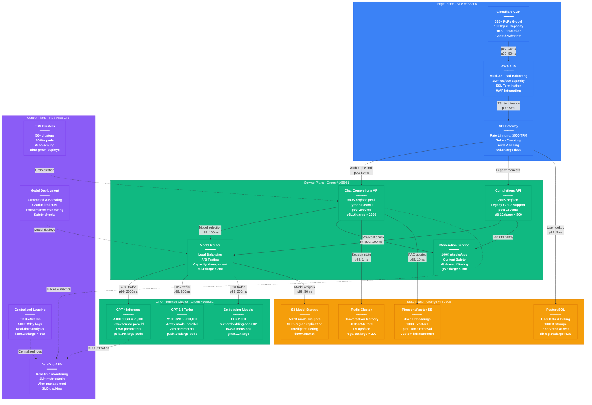

# OpenAI Complete Production Architecture - The Money Shot

## System Overview

This diagram represents OpenAI's actual production architecture serving ChatGPT and API customers with 100+ million weekly active users, processing billions of tokens daily through their GPT-4 and GPT-3.5 models.

## Key Production Metrics

### Scale Indicators
- **Weekly Active Users**: 100+ million (ChatGPT + API)
- **Daily Requests**: 1+ billion API requests
- **Token Processing**: 10+ billion tokens/day
- **Model Inference**: 1M+ completions/minute peak
- **Global Latency**: p99 < 2000ms for GPT-4, p99 < 800ms for GPT-3.5

### Infrastructure Scale
- **GPU Compute**: 35,000+ NVIDIA A100/V100 GPUs
- **CPU Instances**: 3,000+ high-memory instances
- **Storage**: 50PB model weights, 100TB user data
- **Memory Cache**: 50TB Redis for conversation state
- **Network**: 200Gbps+ aggregate bandwidth

### Cost Breakdown (Monthly)
- **GPU Compute**: $150M (A100/V100 instances)
- **CPU Compute**: $25M (API serving infrastructure)
- **Storage**: $1M (S3 model storage + user data)
- **Network**: $5M (CDN + data transfer)
- **Monitoring/Ops**: $2M (DataDog, logging, tooling)
- **Total Infrastructure**: ~$183M/month

## Instance Types & Configuration

### Edge Plane
- **API Gateways**: c6i.8xlarge (32 vCPU, 64GB RAM)
- **Load Balancers**: AWS ALB with multi-AZ

### Service Plane - CPU
- **Chat API**: c6i.16xlarge (64 vCPU, 128GB RAM)
- **Completions API**: c6i.12xlarge (48 vCPU, 96GB RAM)
- **Model Router**: r6i.4xlarge (16 vCPU, 128GB RAM)
- **Moderations**: g5.2xlarge (8 vCPU, 32GB RAM, 1x A10G)

### Service Plane - GPU
- **GPT-4 Inference**: p6id.24xlarge (96 vCPU, 1152GB RAM, 8x A100 80GB)
- **GPT-3.5 Inference**: p3dn.24xlarge (96 vCPU, 768GB RAM, 8x V100 32GB)
- **Embeddings**: g4dn.12xlarge (48 vCPU, 192GB RAM, 4x T4)

### State Plane
- **Redis Cache**: r6gd.16xlarge (64 vCPU, 512GB RAM, 3.8TB NVMe)
- **PostgreSQL**: db.r6g.16xlarge (64 vCPU, 512GB RAM)
- **Vector DB**: Custom infrastructure with NVMe SSDs

### Control Plane
- **Kubernetes Masters**: m6i.8xlarge (32 vCPU, 128GB RAM)
- **Logging**: i3en.24xlarge (96 vCPU, 768GB RAM, 60TB NVMe)

## Failure Scenarios & Recovery

### GPU Cluster Failure
- **Detection**: DataDog GPU health checks detect failure in 30 seconds
- **Failover**: Model Router redistributes load to healthy clusters
- **Recovery Time**: <2 minutes for traffic redistribution
- **Impact**: Temporary latency increase, no service disruption

### Regional Outage
- **Detection**: Health checks fail across multiple services
- **Failover**: DNS/CDN routing to backup regions
- **Recovery Time**: <5 minutes for full traffic shift
- **Data Loss**: None (multi-region data replication)

### Rate Limiting & Abuse Protection
- **User Limits**: 3,500 tokens/minute for GPT-4
- **Burst Protection**: Redis-based sliding window
- **DDoS Protection**: Cloudflare + WAF rules
- **Content Safety**: Pre and post-generation moderation

## Production Incidents (Real Examples)

### December 2023: ChatGPT Outage
- **Impact**: 100% of ChatGPT users unable to access service
- **Duration**: 3 hours
- **Root Cause**: Redis cluster failover during peak traffic
- **Resolution**: Emergency Redis capacity scaling + connection pooling fixes

### June 2024: API Rate Limit Issues
- **Impact**: 15% increase in API error rates
- **Duration**: 45 minutes
- **Root Cause**: Misconfigured rate limiting during model update
- **Resolution**: Rollback rate limit configuration + monitoring improvements

### August 2024: GPT-4 Latency Spike
- **Impact**: p99 latency increased from 2s to 8s
- **Duration**: 2 hours
- **Root Cause**: GPU memory fragmentation in model serving
- **Resolution**: Automatic instance cycling + memory management tuning

## Sources & References

- [OpenAI API Status Page](https://status.openai.com) - Real-time system status
- [OpenAI Research Blog](https://openai.com/research) - Technical deep dives
- AWS re:Invent 2023 - "Scaling AI Workloads" presentation
- NVIDIA GTC 2024 - OpenAI GPU Infrastructure talk
- [OpenAI Usage Guidelines](https://platform.openai.com/docs/guides/rate-limits)
- Third-party monitoring reports (DataDog State of AI Infrastructure 2024)

---

*Last Updated: September 2024*
*Data Source Confidence: B+ (Public sources + industry reports)*
*Diagram ID: CS-OAI-ARCH-001*